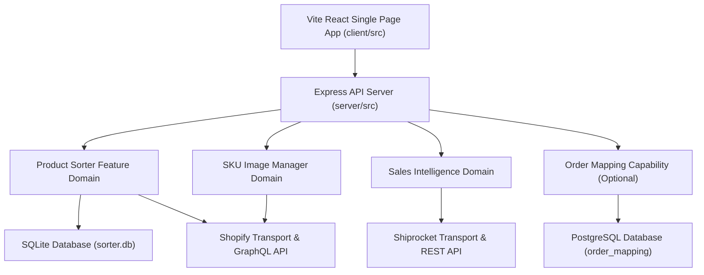

# Application Architecture and Domain Boundaries

> **Canonical Document**: `DOC-001`  
> **Status**: APPROVED / ACTIVE  
> **Last Updated**: 2026-08-07  

## 1. System Overview

The Entitled Collection Placement Manager (Product Sorter) is a modular Node.js/Express and React application designed to manage, reorder, preview, and apply product placements for Shopify collections while integrating order data, SKU media management, sales intelligence, and optional Order Mapping capabilities.

---

## 2. Capability Domains & Ownership

### 2.1 Product Sorter (Core Domain)
- **Ownership**: Collection sorting, sales-driven position scoring, placement generation, preview calculation, movement tracking, Shopify collection reorder job submission, async polling, and placement rollback.
- **Data Persistence**: SQLite (`server/src/db/sorter.db` via `better-sqlite3`).
- **Primary Routes**: `/api/sorter/*` (mounted in `server/src/routes/sorter.js`).

### 2.2 SKU Image Manager Domain
- **Ownership**: SKU media operations, image uploads/reordering, SKU asset management, Shopify media GraphQL integration.
- **Data Persistence**: Delegates to Shopify GraphQL API + local staging temp files.
- **Primary Routes**: `/api/sku-media/*` (mounted in `server/src/routes/skuMedia.js`).

### 2.3 Sales Intelligence Domain
- **Ownership**: Actual sales performance tracking, CSV imports, manual revenue overrides, order quantity calculation, performance analytics.
- **Data Persistence**: SQLite (`sales_intelligence_cache` table in `sorter.db`).
- **Primary Routes**: `/api/sales-intelligence/*` (mounted in `server/src/routes/salesIntelligence.js`).

### 2.4 Order Mapping Capability (Optional Domain)
- **Ownership**: External order tracking, Shiprocket integration, order sync, delivery status mapping, PostgreSQL persistence.
- **Data Persistence**: PostgreSQL database (`order_mapping` schema) when configured; degrades gracefully when disabled (`ORDER_MAPPING_UNAVAILABLE`).
- **Primary Routes**: `/api/order-mapping/*` (mounted in `server/src/routes/orderMapping.js`).

---

## 3. Frontend / Backend Architecture Boundary

1. **Frontend (`client/src/`)**:
   - Single-Page Application built with React and Vite.
   - Communicates exclusively via standard REST endpoints (`/api/*`).
   - Uses feature modularization (`SorterDashboard.js`, `SkuImageManager.js`, `OrderMappingDashboard.js`).
   - State is isolated to individual feature components.

2. **Backend (`server/src/`)**:
   - Node.js Express server (`server/src/index.js` & `server/src/app.js`).
   - Standardized middleware: `errorBoundary.js`, `requestValidation.js`, `shopifyCapability.js`, `cors`, `helmet`.
   - Clear router-to-service isolation (`routes/` -> `services/`).

---

## 4. Provider Boundaries

- **Shopify Transport (`shopifyService.js`, `shopifyAuth.js`, `shopifyMediaService.js`)**:
  - Encapsulates authentication, OAuth token acquisition, GraphQL request transport, throttling, and generic error normalization (`SHOPIFY_UNAVAILABLE`).
  - Contains zero Product Sorter business logic.
- **Shiprocket Transport (`shiprocketService.js`)**:
  - Encapsulates REST API authentication, token caching, status polling, and error normalization.
  - Zero business logic leakage to caller domains.

---

## 5. Architectural Integrity Principles

- **Zero Circular Dependencies**: Services strictly depend on lower-level utilities/transports; generic transports never import domain modules.
- **Graceful Capability Degradation**: Optional features (e.g. Order Mapping without PostgreSQL) return structured 503 errors (`ORDER_MAPPING_UNAVAILABLE`) while Product Sorter continues operating uninterrupted.
