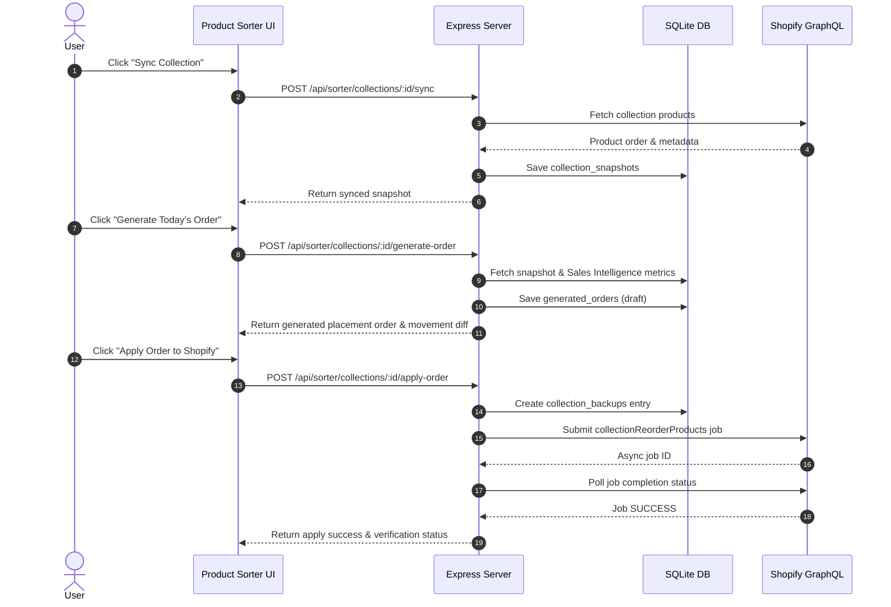

# Canonical Operational Runbooks and Failure Recovery

> **Canonical Document**: `DOC-005`  
> **Status**: APPROVED / ACTIVE  
> **Last Updated**: 2026-08-07  

## 1. Primary Workflows

### 1.1 Product Sorter Workflow Execution

---

## 2. Failure Recovery Runbooks

### 2.1 Shopify Unavailable (`SHOPIFY_UNAVAILABLE`)
- **Symptom**: API calls return HTTP 503 with error code `SHOPIFY_UNAVAILABLE`.
- **Cause**: Invalid/expired `SHOPIFY_ADMIN_ACCESS_TOKEN`, network disruption, or Shopify rate limiting.
- **Recovery**:
  1. Verify backend logs (secrets are automatically redacted).
  2. Test Shopify connectivity via `npm run health` or `GET /api/health/shopify`.
  3. Re-authenticate Shopify app or update credentials in server environment.

### 2.2 Order Mapping Unavailable (`ORDER_MAPPING_UNAVAILABLE`)
- **Symptom**: Order mapping UI displays disconnected state; API calls return HTTP 503 `ORDER_MAPPING_UNAVAILABLE`.
- **Cause**: Unconfigured or unreachable PostgreSQL database (`ORDER_MAPPING_DATABASE_URL`).
- **Recovery**:
  1. Product Sorter and SKU Image Manager remain fully operational.
  2. If Order Mapping is required, verify PostgreSQL connection and run database migrations (`npm run delivery-migrator`).

### 2.3 Stale Generated Order (`GENERATED_ORDER_STALE`)
- **Symptom**: Applying an order returns HTTP 409 `GENERATED_ORDER_STALE`.
- **Cause**: Underlying Shopify collection ordering changed after the recommendation was generated.
- **Recovery**:
  1. Re-sync the collection via `POST /api/sorter/collections/:id/sync`.
  2. Generate a fresh placement order recommendations payload (`POST /api/sorter/collections/:id/generate-order`).
  3. Re-apply the new recommendation.

### 2.4 Placement Rollback Procedure
- **Symptom**: Newly applied product placements need to be reverted.
- **Recovery**:
  1. Trigger rollback endpoint `POST /api/sorter/collections/:id/rollback`.
  2. The server restores the product order saved in `collection_backups` prior to apply.
