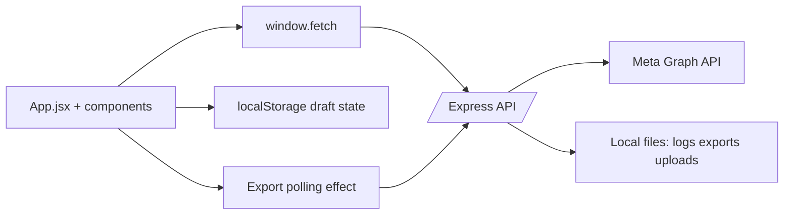
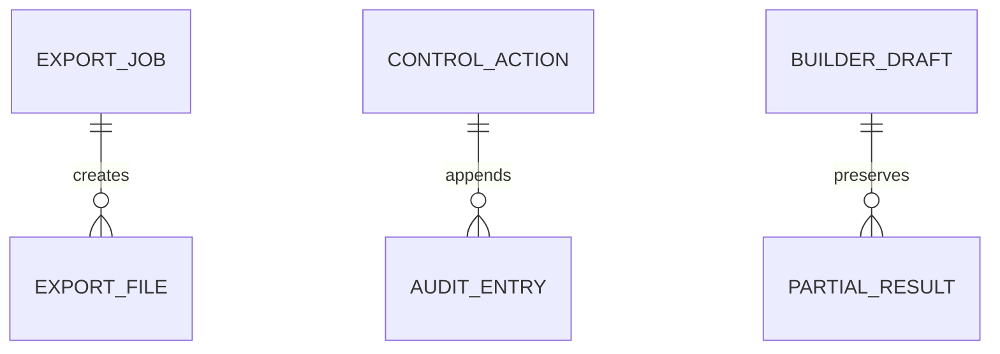
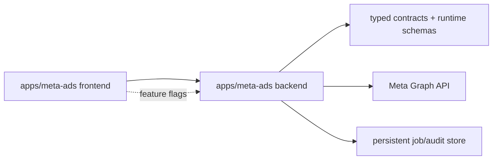

# META Ads App Migration

## 1. Document Metadata
- Original application path: `/home/shivam/Desktop/Shivam/arkn/Meta/Meta Dashboard`
- Destination repository path: `/home/shivam/Desktop/Shivam/arkn/Resources/Entitled/shopify-product-sorter`
- Recommended future application path: `/home/shivam/Desktop/Shivam/arkn/Resources/Entitled/shopify-product-sorter/apps/meta-ads`
- Generation date: 2026-07-28
- Original Git branch and commit: `main` @ `8b07e3e1aa5411f53bc871f247678d4e6ea47967`
- Destination Git branch and commit: `main` @ `2b2c05c9d00a04f5229c57ac8fb50d180e92f7fa`
- Old app package manager: npm (single root package-lock present)
- Destination package manager: npm workspaces (server, client)
- Runtime versions: old app requires Node `>=20`; destination uses Node with Vite/Express and no explicit root engines field.
- Framework versions: old app React ^18.3.1, Express ^4.21.2, Vite ^6.0.5; destination client React ^18.3.1, server Express ^4.21.2, Vite ^6.0.7.
- Confirmation that secret values were redacted: yes; `.env` values are replaced with `[REDACTED_SECRET]` and no live token or app secret is reproduced below.

## 2. Executive Summary
The old application is a local Meta Ads reporting and partial campaign-management dashboard built as a single Node/Express + React/Vite codebase. Reporting, decision support, health diagnostics, export jobs, and paused builder flows for campaigns/ad sets/ads are implemented. Campaign pause/resume and daily-budget update actions are also implemented.

Partially completed or unstable areas are concentrated in the builder stack: local media preparation exists, but live media upload and activation remain incomplete, large route/service files combine validation and orchestration, and partial-creation retry behavior depends on in-memory and append-only local state. The strongest rebuild strategy is not a source copy; it is a feature-by-feature rebuild inside an isolated destination app path, starting with read-only reporting, typed contracts, runtime validation, and explicit feature flags before any write path is reintroduced.

## 3. Complete Old Application File Tree
Excluded directories: `.git`, `node_modules`, `.next`, `dist`, `build`, `coverage`.
```text
.
├── .agents
├── .codex
├── .env
├── .gitignore
├── AGENTS.md
├── backend
│   ├── app.js
│   ├── data
│   │   ├── campaign-actions.jsonl
│   │   ├── exports
│   │   │   └── c0dac837-1e7b-4b72-aea4-42cbcb3a1aa2.zip
│   │   └── uploads
│   │       └── 84dce641-f0da-4c1e-b4bd-d6e8300a8ab7.mp4
│   ├── routes
│   │   ├── metaBuilderRoutes.js
│   │   ├── metaControlRoutes.js
│   │   └── metaRoutes.js
│   ├── server.js
│   ├── services
│   │   ├── auditLog.js
│   │   ├── insightsFieldRegistry.js
│   │   ├── mediaUpload.js
│   │   ├── metaApi.js
│   │   ├── metaBuilderApi.js
│   │   ├── metaControlApi.js
│   │   ├── metaExportJobs.js
│   │   ├── metaExportService.js
│   │   └── metaHealth.js
│   ├── uploads
│   │   └── tmp
│   └── utils
│       ├── budgetUtils.js
│       ├── campaignBuilderValidator.js
│       ├── csvWriter.js
│       ├── errorResponse.js
│       ├── metaParser.js
│       ├── recommendationEngine.js
│       └── zipWriter.js
├── CODE_OVERVIEW.md
├── frontend
│   ├── index.html
│   └── src
│       ├── App.jsx
│       ├── components
│       │   ├── AuditLogPanel.jsx
│       │   ├── BuilderProgress.jsx
│       │   ├── BuilderReview.jsx
│       │   ├── CampaignBuilder.jsx
│       │   ├── CampaignControlPanel.jsx
│       │   ├── DashboardCharts.jsx
│       │   ├── DecisionBoard.jsx
│       │   ├── DeliveryStatusBadge.jsx
│       │   ├── ErrorBoundary.jsx
│       │   ├── ErrorPanel.jsx
│       │   ├── KpiCards.jsx
│       │   ├── MetaHealthPanel.jsx
│       │   ├── PromptPanel.jsx
│       │   ├── RecommendationBadge.jsx
│       │   └── ReportTable.jsx
│       ├── index.css
│       ├── lib
│       │   ├── builderState.js
│       │   ├── formatters.js
│       │   └── metaHealth.js
│       └── main.jsx
├── package-lock.json
├── package.json
├── placement_report.json
├── postcss.config.js
├── public
├── README.md
├── scripts
│   ├── verify-phase-0-to-4c-core.mjs
│   ├── verify-phase-0-to-4c.mjs
│   └── verify-phase-4d.mjs
├── shared
│   └── builderValidation.js
├── src
│   ├── components
│   ├── lib
│   └── meta
├── tailwind.config.js
├── test
│   ├── metaExport.test.js
│   ├── metaParser.test.js
│   ├── runtimeRoutes.test.js
│   └── verifier.test.js
└── vite.config.js
```

## 4. Product and Business Requirements
### Implemented
- Read-only dashboard views for overview, campaigns, ad sets, ads, placements, and decisions.
- Date presets plus custom ranges for dashboard, decision, and export queries.
- Meta access health diagnostics and scope summaries.
- Campaign pause, resume, status read, and daily-budget update actions with audit logging.
- Paused-only builder flows for campaign, ad set, creative, and ad creation, including preflight validation and review state.
- ZIP export jobs for the current dashboard period with polling, warnings, and auto-download.
### Partially implemented
- Manual Page verification, Instagram account linkage, and local media preparation are present but depend on Meta permission quality and do not complete the full media-upload lifecycle.
- Retry flows preserve partial IDs but do not provide robust transactional rollback.
### Planned or implied
- Safer, incremental progression from reporting into build flows; the README phases and verification scripts imply staged delivery.
- Broader Meta builder capabilities beyond website-link paused structures.
### Broken or unreliable
- Export and builder job durability across server restart is unreliable because state is stored in memory or append-only local files.
- No user authentication or authorization protects control or builder routes; local-network access is trusted by default.

## 5. User Interface
### Screens and routes
- Single-page React app mounted from `frontend/src/App.jsx`; no client-side router. Top navigation sections are `overview`, `campaigns`, `adsets`, `ads`, `placements`, `decisions`, and `builder`.
- Global controls: date preset selector, custom date range, refresh, export progress panel, audit log drawer, and health drawer.
### Major components
- `frontend/src/App.jsx`: orchestrates dashboard fetches, decisions fetches, health checks, export polling, active section state, toast state, and panel visibility.
- `frontend/src/components/CampaignBuilder.jsx`: large form workflow for campaign, ad set, ad, and review sections; persists draft state in browser storage via `frontend/src/lib/builderState.js`; calls builder endpoints directly with `fetch`.
- `frontend/src/components/MetaHealthPanel.jsx`: permission and health drawer with remediation copy.
- `frontend/src/components/CampaignControlPanel.jsx`: pause/resume/budget update UI.
- `frontend/src/components/DecisionBoard.jsx`, `ReportTable.jsx`, `KpiCards.jsx`, `DashboardCharts.jsx`: reporting presentation.
### Visual design
- Tailwind-based dark luxury theme called out in README, with custom `ec-*` tokens in JSX classes. Layout relies on cards, right-side drawers, tables, and dense forms; responsive behavior is mostly stacked grids and side panels.
### Known UI issues
- Business logic and API calls live inside large UI components (`App.jsx`, `CampaignBuilder.jsx`) rather than thin hooks/services, increasing regression risk.
- Builder UI state surface is oversized and tightly coupled to backend payload rules.

## 6. Frontend Architecture
- Framework and version: React ^18.3.1 with Vite ^6.0.5.
- Routing: none; conditional rendering inside `App.jsx`.
- State management: React `useState`/`useEffect` with local-storage draft persistence in `frontend/src/lib/builderState.js`.
- Data fetching: browser `fetch` from components; no centralized query client or cache library.
- Caching: local draft persistence only; export progress is polled every ~1.5s.
- Forms and validation: local builder validation helpers plus backend validation.
- Error handling: component-local error state plus `ErrorBoundary.jsx`.
- Important dependencies: `lucide-react`, `recharts`, Tailwind/PostCSS toolchain.


## 7. Backend Architecture
- Runtime and framework: Node >=20, Express ^4.21.2, dotenv.
- Entry points: `backend/server.js` -> `backend/app.js`.
- Routes: `/api/meta`, `/api/meta/control`, `/api/meta/builder`, plus `/api/health`.
- Services: `metaApi.js`, `metaControlApi.js`, `metaBuilderApi.js`, `metaExportService.js`, `metaExportJobs.js`, `metaHealth.js`, `auditLog.js`, `mediaUpload.js`.
- Middleware: CORS limited to local Vite origins, JSON body parser, static-file serving, terminal error mapper.
- Authentication/authorization: no end-user auth; Meta env credentials are the only trust boundary.
- Validation: route-local checks plus `campaignBuilderValidator.js` and shared builder validation.
- Logging: append-only audit log plus direct `console.log` debug output.
- Background processing: in-memory export job lifecycle with persisted ZIP outputs.
- Caching: none beyond temporary in-memory job state.
- Rate limiting / retries: export service retries Graph requests; no general Express rate limiter.
```mermaid
flowchart TD
  Server[backend/server.js] --> App[backend/app.js]
  App --> MetaRoutes[/api/meta]
  App --> ControlRoutes[/api/meta/control]
  App --> BuilderRoutes[/api/meta/builder]
  MetaRoutes --> MetaApi[metaApi + metaExportService + metaHealth]
  ControlRoutes --> ControlApi[metaControlApi + auditLog]
  BuilderRoutes --> BuilderApi[metaBuilderApi + validators + mediaUpload]
  MetaApi --> Graph[Meta Graph API]
  ControlApi --> Graph
  BuilderApi --> Graph
  MetaApi --> DataFiles[backend/data/exports]
  ControlRoutes --> AuditFile[backend/data/campaign-actions.jsonl]
  BuilderApi --> UploadFiles[backend/data/uploads]
```

## 8. Complete API Reference
| Method | Route | Purpose | Authentication | Source path | Status | Known defects |
|---|---|---|---|---|---|---|
| GET | `/api/meta/campaigns` | List campaigns. | Backend-only Meta env token; no user auth layer. | `backend/routes/metaRoutes.js:76` | Implemented | No user auth; reporting relies on backend env credentials. |
| GET | `/api/meta/export/full-report` | Generate ZIP export synchronously. | Backend-only Meta env token; no user auth layer. | `backend/routes/metaRoutes.js:101` | Implemented | Job durability is limited by in-memory status state. |
| POST | `/api/meta/export/full-report/start` | Start async ZIP export job. | Backend-only Meta env token; no user auth layer. | `backend/routes/metaRoutes.js:125` | Implemented | Job durability is limited by in-memory status state. |
| GET | `/api/meta/export/status/:exportJobId` | Read async export job status. | Backend-only Meta env token; no user auth layer. | `backend/routes/metaRoutes.js:144` | Implemented | Job durability is limited by in-memory status state. |
| GET | `/api/meta/export/download/:exportJobId` | Download completed export ZIP. | Backend-only Meta env token; no user auth layer. | `backend/routes/metaRoutes.js:151` | Implemented | Job durability is limited by in-memory status state. |
| GET | `/api/meta/health` | Run Meta access health diagnostics. | Backend-only Meta env token; no user auth layer. | `backend/routes/metaRoutes.js:189` | Implemented | No user auth; reporting relies on backend env credentials. |
| GET | `/api/meta/health/scopes` | Return Meta token scope summary. | Backend-only Meta env token; no user auth layer. | `backend/routes/metaRoutes.js:212` | Implemented | No user auth; reporting relies on backend env credentials. |
| GET | `/api/meta/control/logs` | Read append-only campaign control audit log. | Backend-only Meta env token; no user auth layer. | `backend/routes/metaControlRoutes.js:184` | Implemented | No user auth; local trust only. |
| GET | `/api/meta/builder/presets` | Return builder preset options. | Backend-only Meta env token; no user auth layer. | `backend/routes/metaBuilderRoutes.js:594` | Implemented | Large builder surface with no user auth and tightly coupled orchestration. |
| POST | `/api/meta/builder/preflight` | Validate builder payload before write operations. | Backend-only Meta env token; no user auth layer. | `backend/routes/metaBuilderRoutes.js:598` | Implemented | Large builder surface with no user auth and tightly coupled orchestration. |
| GET | `/api/meta/builder/pixels` | List available ad-account pixels. | Backend-only Meta env token; no user auth layer. | `backend/routes/metaBuilderRoutes.js:645` | Implemented | Large builder surface with no user auth and tightly coupled orchestration. |
| GET | `/api/meta/builder/destination-links` | List destination-link choices. | Backend-only Meta env token; no user auth layer. | `backend/routes/metaBuilderRoutes.js:676` | Implemented | Large builder surface with no user auth and tightly coupled orchestration. |
| GET | `/api/meta/builder/pages` | Discover Facebook Pages available for ads. | Backend-only Meta env token; no user auth layer. | `backend/routes/metaBuilderRoutes.js:687` | Implemented | Large builder surface with no user auth and tightly coupled orchestration. |
| GET | `/api/meta/builder/auth-check` | Run safe builder environment/auth diagnostic. | Backend-only Meta env token; no user auth layer. | `backend/routes/metaBuilderRoutes.js:708` | Implemented | Large builder surface with no user auth and tightly coupled orchestration. |
| GET | `/api/meta/builder/page/:pageId/instagram-accounts` | List Instagram accounts connected to a Page. | Backend-only Meta env token; no user auth layer. | `backend/routes/metaBuilderRoutes.js:722` | Implemented | Large builder surface with no user auth and tightly coupled orchestration. |
| GET | `/api/meta/builder/page/:pageId/verify` | Verify manual Page selection. | Backend-only Meta env token; no user auth layer. | `backend/routes/metaBuilderRoutes.js:747` | Implemented | Large builder surface with no user auth and tightly coupled orchestration. |
| GET | `/api/meta/builder/media/video/:videoId/status` | Read campaign delivery/status details. | Backend-only Meta env token; no user auth layer. | `backend/routes/metaBuilderRoutes.js:877` | Implemented | Large builder surface with no user auth and tightly coupled orchestration. |
| POST | `/api/meta/builder/campaign` | Create a paused campaign. | Backend-only Meta env token; no user auth layer. | `backend/routes/metaBuilderRoutes.js:899` | Implemented | Large builder surface with no user auth and tightly coupled orchestration. |
| POST | `/api/meta/builder/adset` | Create a paused ad set. | Backend-only Meta env token; no user auth layer. | `backend/routes/metaBuilderRoutes.js:988` | Implemented | Large builder surface with no user auth and tightly coupled orchestration. |
| POST | `/api/meta/builder/adcreative` | Create a link creative. | Backend-only Meta env token; no user auth layer. | `backend/routes/metaBuilderRoutes.js:1057` | Implemented | Large builder surface with no user auth and tightly coupled orchestration. |
| POST | `/api/meta/builder/full-media-structure` | Create a paused structure with local media handling. | Backend-only Meta env token; no user auth layer. | `backend/routes/metaBuilderRoutes.js:1173` | Implemented | Large builder surface with no user auth and tightly coupled orchestration. |
| POST | `/api/meta/builder/retry-creative-ad` | Retry downstream creative/ad stages after partial success. | Backend-only Meta env token; no user auth layer. | `backend/routes/metaBuilderRoutes.js:1583` | Implemented | Large builder surface with no user auth and tightly coupled orchestration. |
| POST | `/api/meta/builder/ad` | Create a paused ad. | Backend-only Meta env token; no user auth layer. | `backend/routes/metaBuilderRoutes.js:1837` | Implemented | Large builder surface with no user auth and tightly coupled orchestration. |
| POST | `/api/meta/builder/campaign-with-adset` | Create campaign plus ad set in a single flow. | Backend-only Meta env token; no user auth layer. | `backend/routes/metaBuilderRoutes.js:1901` | Implemented | Large builder surface with no user auth and tightly coupled orchestration. |
| POST | `/api/meta/builder/full-structure` | Create full paused campaign/ad set/creative/ad structure. | Backend-only Meta env token; no user auth layer. | `backend/routes/metaBuilderRoutes.js:2127` | Implemented | Large builder surface with no user auth and tightly coupled orchestration. |

Common request/response conventions: date filters come from `datePreset` or `since`/`until`; builder/control failures return sanitized `error` and optional `meta_error`; export download routes return binary ZIP responses rather than JSON.

## 9. Meta Marketing API Integration
- Graph API version comes from `META_API_VERSION`. Tests and scripts reference versions up to `v23.0`; the README documents a placeholder `vXX.X`.
- Base URLs target `https://graph.facebook.com/<version>` through backend service helpers.
- HTTP clients: `axios` in service code, occasional `fetch` in some builder helpers.
- Authentication: server-side access token only; token never intentionally sent to the browser.
- Required permissions: `ads_read`, `ads_management`, `business_management`, `pages_show_list`, `pages_read_engagement`; recommended `pages_manage_metadata`, `instagram_basic`.
- Covered domains: campaigns, ad sets, ads, insights, pixels, Pages, Instagram account discovery, creatives, export reporting, token diagnostics.
- Pagination: handled in reporting/export services while aggregating pages.
- Rate limiting and retries: export service retries requests; no global rate-limit middleware for inbound app traffic.
- Batch requests: none detected.
- Token expiry and diagnostics: health and auth-check flows inspect token/scopes; app-secret-based debug token path is optional.
- Time zone/currency handling: reporting relies on Meta response data; budget helpers convert rupees to minor units.
- Known limitations: no durable job queue, no user auth boundary, and builder/media flows remain partial.

## 10. Database and Data Model
- Database provider: none. The app uses local files and in-memory state, not a relational database or ORM.
- Persisted data artifacts: append-only audit log `backend/data/campaign-actions.jsonl`, generated ZIP exports under `backend/data/exports`, local uploaded media under `backend/data/uploads`.
- In-memory models: export job state in `metaExportJobs.js`; builder state lives in browser local storage via `builderState.js`.
- Migrations/seeds: none.
- Meta object mapping: IDs for campaigns, ad sets, ads, Pages, Instagram accounts, creatives, and Pixels pass through JSON payloads rather than a DB schema.


## 11. Environment Variables
| Variable | Purpose | Required | Side | Referencing files | Safe placeholder example |
|---|---|---|---|---|---|
| `META_ACCESS_TOKEN` | Server-side Meta access token. | Required | Backend | `.env`, `backend/services/metaApi.js`, `backend/services/metaApi.js`, `backend/services/metaBuilderApi.js`, `backend/services/metaBuilderApi.js`, `backend/services/metaBuilderApi.js`, `backend/services/metaBuilderApi.js`, `backend/services/metaBuilderApi.js`, `backend/services/metaControlApi.js`, `backend/services/metaControlApi.js`, `backend/services/metaHealth.js`, `backend/services/metaHealth.js`, `backend/services/metaHealth.js`, `backend/services/metaHealth.js`, `backend/services/metaHealth.js`, `backend/services/metaHealth.js`, `backend/services/metaHealth.js`, `backend/services/metaHealth.js`, `README.md`, `scripts/verify-phase-0-to-4c.mjs`, `scripts/verify-phase-0-to-4c.mjs`, `scripts/verify-phase-0-to-4c.mjs`, `scripts/verify-phase-0-to-4c.mjs`, `scripts/verify-phase-0-to-4c.mjs`, `scripts/verify-phase-0-to-4c.mjs`, `test/metaExport.test.js`, `test/metaExport.test.js`, `test/metaExport.test.js`, `test/metaParser.test.js`, `test/metaParser.test.js`, `test/metaParser.test.js`, `test/metaParser.test.js`, `test/metaParser.test.js`, `test/metaParser.test.js` | `[REDACTED_SECRET]` |
| `META_ACCESS_TOKEN_LENGTH` | Environment variable referenced by the app. | Optional | Backend | `scripts/verify-phase-0-to-4c.mjs` | `[REDACTED_SECRET]` |
| `META_AD_ACCOUNT_ID` | Target Meta ad account identifier. | Required | Backend | `.env`, `backend/services/metaApi.js`, `backend/services/metaApi.js`, `backend/services/metaBuilderApi.js`, `backend/services/metaBuilderApi.js`, `backend/services/metaBuilderApi.js`, `backend/services/metaBuilderApi.js`, `backend/services/metaHealth.js`, `backend/services/metaHealth.js`, `backend/services/metaHealth.js`, `README.md`, `README.md`, `scripts/verify-phase-0-to-4c.mjs`, `scripts/verify-phase-0-to-4c.mjs`, `scripts/verify-phase-0-to-4c.mjs`, `scripts/verify-phase-0-to-4c.mjs`, `scripts/verify-phase-0-to-4c.mjs`, `scripts/verify-phase-0-to-4c.mjs`, `scripts/verify-phase-0-to-4c.mjs`, `scripts/verify-phase-0-to-4c.mjs`, `test/metaExport.test.js`, `test/metaExport.test.js`, `test/metaExport.test.js`, `test/metaParser.test.js`, `test/metaParser.test.js`, `test/metaParser.test.js`, `test/metaParser.test.js`, `test/metaParser.test.js` | `[REDACTED_SECRET]` |
| `META_AD_ACCOUNT_ID_MASKED` | Environment variable referenced by the app. | Optional | Backend | `scripts/verify-phase-0-to-4c.mjs` | `[REDACTED_SECRET]` |
| `META_API_VERSION` | Graph API version prefix. | Required | Backend | `.env`, `backend/services/metaApi.js`, `backend/services/metaApi.js`, `backend/services/metaBuilderApi.js`, `backend/services/metaBuilderApi.js`, `backend/services/metaBuilderApi.js`, `backend/services/metaBuilderApi.js`, `backend/services/metaBuilderApi.js`, `backend/services/metaControlApi.js`, `backend/services/metaControlApi.js`, `backend/services/metaHealth.js`, `backend/services/metaHealth.js`, `backend/services/metaHealth.js`, `backend/services/metaHealth.js`, `backend/services/metaHealth.js`, `README.md`, `scripts/verify-phase-0-to-4c.mjs`, `scripts/verify-phase-0-to-4c.mjs`, `scripts/verify-phase-0-to-4c.mjs`, `scripts/verify-phase-0-to-4c.mjs`, `scripts/verify-phase-0-to-4c.mjs`, `scripts/verify-phase-0-to-4c.mjs`, `scripts/verify-phase-0-to-4c.mjs`, `scripts/verify-phase-0-to-4c.mjs`, `scripts/verify-phase-0-to-4c.mjs`, `scripts/verify-phase-0-to-4c.mjs`, `test/metaExport.test.js`, `test/metaExport.test.js`, `test/metaExport.test.js`, `test/metaParser.test.js`, `test/metaParser.test.js`, `test/metaParser.test.js`, `test/metaParser.test.js`, `test/metaParser.test.js` | `[REDACTED_SECRET]` |
| `META_APP_ID` | Optional app ID for token diagnostics. | Optional | Backend | `.env`, `backend/services/metaBuilderApi.js`, `backend/services/metaBuilderApi.js`, `backend/services/metaHealth.js`, `backend/services/metaHealth.js`, `backend/services/metaHealth.js`, `frontend/src/components/MetaHealthPanel.jsx`, `README.md`, `README.md`, `scripts/verify-phase-0-to-4c.mjs`, `scripts/verify-phase-0-to-4c.mjs`, `scripts/verify-phase-0-to-4c.mjs`, `test/metaParser.test.js` | `[REDACTED_SECRET]` |
| `META_APP_ID_MASKED` | Environment variable referenced by the app. | Optional | Backend | `scripts/verify-phase-0-to-4c.mjs` | `[REDACTED_SECRET]` |
| `META_APP_SECRET` | Optional app secret for token diagnostics. | Optional | Backend | `.env`, `backend/services/metaBuilderApi.js`, `backend/services/metaHealth.js`, `backend/services/metaHealth.js`, `backend/services/metaHealth.js`, `frontend/src/components/MetaHealthPanel.jsx`, `README.md`, `README.md`, `scripts/verify-phase-0-to-4c.mjs`, `scripts/verify-phase-0-to-4c.mjs`, `scripts/verify-phase-0-to-4c.mjs`, `scripts/verify-phase-0-to-4c.mjs`, `test/metaParser.test.js`, `test/metaParser.test.js`, `test/metaParser.test.js`, `test/metaParser.test.js` | `[REDACTED_SECRET]` |
| `META_APP_SECRET_LENGTH` | Environment variable referenced by the app. | Optional | Backend | `scripts/verify-phase-0-to-4c.mjs` | `[REDACTED_SECRET]` |
| `META_BUSINESS_ID` | Optional Business Manager lookup for Page discovery. | Optional | Backend | `.env`, `backend/services/metaBuilderApi.js`, `backend/services/metaBuilderApi.js`, `backend/services/metaHealth.js`, `README.md`, `README.md`, `README.md`, `scripts/verify-phase-0-to-4c.mjs`, `scripts/verify-phase-0-to-4c.mjs`, `scripts/verify-phase-0-to-4c.mjs`, `scripts/verify-phase-0-to-4c.mjs`, `test/metaParser.test.js`, `test/metaParser.test.js` | `[REDACTED_SECRET]` |
| `META_BUSINESS_ID_MASKED` | Environment variable referenced by the app. | Optional | Backend | `scripts/verify-phase-0-to-4c.mjs` | `[REDACTED_SECRET]` |
| `META_FIX_STEPS` | Environment variable referenced by the app. | Optional | Backend | `frontend/src/components/MetaHealthPanel.jsx`, `frontend/src/components/MetaHealthPanel.jsx` | `[REDACTED_SECRET]` |
| `PORT` | Backend listen port. | Optional | Backend | `backend/server.js` | `[REDACTED_SECRET]` |

## 12. Dependencies
- Production dependencies: `axios` ^1.7.9, `cors` ^2.8.5, `dotenv` ^16.4.7, `express` ^4.21.2, `lucide-react` ^0.468.0, `multer` ^2.1.1, `react` ^18.3.1, `react-dom` ^18.3.1, `recharts` ^3.8.1.
- Development dependencies: `@vitejs/plugin-react` ^4.3.4, `autoprefixer` ^10.4.20, `concurrently` ^9.1.2, `postcss` ^8.4.49, `tailwindcss` ^3.4.17, `vite` ^6.0.5.
- App-specific dependencies worth reusing: `axios`, `lucide-react`, `recharts`, Tailwind toolchain.
- Shared dependencies with destination repo: React, Vite, Express, dotenv.
- Apparently unused dependency risk: `multer` is active; most other dependencies map directly to source imports. No external state/query/form library exists.
- Recommended for rebuild: keep to React/Vite/Express first; add runtime validation and typed contracts before adding more libraries.
- Dependencies that should not be copied blindly: the old root `package-lock.json`, any binary data artifacts, and debug-only local workflow files.

## 13. Commands and Scripts
| Command | Working directory | Purpose |
|---|---|---|
| `npm run dev` | `/home/shivam/Desktop/Shivam/arkn/Meta/Meta Dashboard` | concurrently -n backend,frontend -c cyan,magenta "npm run dev:backend" "npm run dev:frontend" |
| `npm run dev:backend` | `/home/shivam/Desktop/Shivam/arkn/Meta/Meta Dashboard` | node --watch backend/server.js |
| `npm run dev:frontend` | `/home/shivam/Desktop/Shivam/arkn/Meta/Meta Dashboard` | vite |
| `npm run start` | `/home/shivam/Desktop/Shivam/arkn/Meta/Meta Dashboard` | npm run build && node backend/server.js |
| `npm run restart` | `/home/shivam/Desktop/Shivam/arkn/Meta/Meta Dashboard` | npm run build && node backend/server.js |
| `npm run build` | `/home/shivam/Desktop/Shivam/arkn/Meta/Meta Dashboard` | vite build |
| `npm run preview` | `/home/shivam/Desktop/Shivam/arkn/Meta/Meta Dashboard` | vite preview |
| `npm run test` | `/home/shivam/Desktop/Shivam/arkn/Meta/Meta Dashboard` | node --test |
| `npm run verify:phase4c` | `/home/shivam/Desktop/Shivam/arkn/Meta/Meta Dashboard` | node scripts/verify-phase-0-to-4c.mjs |
| `npm run verify:phase4c:backend` | `/home/shivam/Desktop/Shivam/arkn/Meta/Meta Dashboard` | node scripts/verify-phase-0-to-4c.mjs --backend-only |
| `npm run verify:phase4c:direct` | `/home/shivam/Desktop/Shivam/arkn/Meta/Meta Dashboard` | node scripts/verify-phase-0-to-4c.mjs --direct-graph |
| `npm run verify:phase4c:build` | `/home/shivam/Desktop/Shivam/arkn/Meta/Meta Dashboard` | node scripts/verify-phase-0-to-4c.mjs --with-build |
| `npm run verify:phase4d` | `/home/shivam/Desktop/Shivam/arkn/Meta/Meta Dashboard` | node scripts/verify-phase-4d.mjs |
| `npm run verify:phase4d:build` | `/home/shivam/Desktop/Shivam/arkn/Meta/Meta Dashboard` | node scripts/verify-phase-4d.mjs --with-build |
| `npm install` | `/home/shivam/Desktop/Shivam/arkn/Meta/Meta Dashboard` | Install dependencies and regenerate lockfile if needed. |

## 14. Background Jobs, Webhooks and Automation
- Background jobs: async Meta export jobs stored in memory and surfaced through start/status/download routes.
- Polling: frontend polls export status roughly every 1.5 seconds while jobs are queued/running.
- Queues/workers: none detected beyond in-memory export job handling.
- Cron jobs / scheduled refreshes / webhooks / WebSockets: none detected.
- Idempotency and failure handling: partial IDs are preserved for builder retries, but no durable transactional boundary exists.

## 15. Authentication and Security
- User authentication: none. Any local caller that can reach the backend can hit reporting, control, and builder routes.
- Sessions: none.
- Meta token storage: `.env` on disk and `process.env` in backend process.
- Authorization: none beyond route-level input checks.
- Input validation: builder validators and campaign ID/date validation exist; route surface is still broad.
- CORS: limited to localhost Vite origins in `backend/app.js`.
- CSRF: none detected.
- Sensitive logging: health output is sanitized, but `metaBuilderApi.js` still contains `console.log` debug lines.
- Known weaknesses: no auth boundary, no CSRF protection, debug logging, local file persistence, and large coupled route/service files.

## 16. Tests and Quality Controls
- Test runner: Node built-in `node --test`.
- Existing tests: `test/metaExport.test.js`, `test/metaParser.test.js`, `test/runtimeRoutes.test.js`, `test/verifier.test.js`.
- Fixtures/mocks: Meta request mocking is embedded in tests rather than external fixtures.
- Coverage tooling: none configured.
- Lint/typecheck: no scripts detected for lint or type-check.
- Regression risks: oversized builder files, direct API calls in UI components, and stateful export/builder flows.

## 17. Known Bugs and Technical Debt
- The old app is nested inside the larger git repo rooted at `/home/shivam/Desktop/Shivam/arkn`; deleting the app removes tracked files from that parent repo but does not touch sibling projects.
- `frontend/src/components/CampaignBuilder.jsx` (2,919 lines), `backend/routes/metaBuilderRoutes.js` (2,368 lines), and `backend/services/metaBuilderApi.js` (1,090 lines) are the main concentration points for coupling and regression risk.
- Builder and reporting both rely on backend-only `META_ACCESS_TOKEN`; there is no user auth layer in `backend/app.js`.
- Export jobs are in-memory via `backend/services/metaExportJobs.js`; job state is lost on restart, while completed ZIPs are written under `backend/data/exports`.
- Debug logging remains in `backend/services/metaBuilderApi.js` via `console.log`, which is a production leakage risk.
- `frontend/src/App.jsx` and `frontend/src/components/CampaignBuilder.jsx` both make direct `fetch` calls, which duplicates transport concerns inside UI and weakens test seams.
- `backend/routes/metaBuilderRoutes.js` is oversized and mixes validation, orchestration, response shaping, and error mapping.
- There is no durable database or queue backing control/export/builder operations; restart behavior can strand state.
- No global typing or schema validation library is present, so payload drift is controlled manually.

## 18. Regression Analysis
The likely regression pattern is additive coupling: reporting, control, health, builder, media preparation, and export status all accreted inside a single React shell and a few large backend modules. Each new feature reuses or mutates shared request helpers, shared local state, or shared route files instead of adding isolated boundaries. That makes unrelated behavior easy to break when date handling, payload validation, or Meta response parsing changes. This conclusion is supported by the file-size concentration and the README phase history.

## 19. Recommended Destination Architecture
- Exact future app directory: `/home/shivam/Desktop/Shivam/arkn/Resources/Entitled/shopify-product-sorter/apps/meta-ads`. This is intentionally isolated from the existing destination `client` and `server` workspaces to avoid disturbing Shopify sorter and order-mapping code.
- Frontend/backend boundaries: dedicated Meta Ads frontend and backend packages inside that app root, or a future workspace split under the new app only.
- Shared package usage: reuse destination repo logging/env conventions conceptually, but keep Meta contracts isolated and typed.
- Meta API abstraction: one backend adapter layer only; never call Meta APIs from frontend code.
- Typed contracts and runtime validation: add schema validation at every HTTP boundary.
- Database ownership: prefer a dedicated persistence layer for audit logs, export jobs, and builder partials rather than local JSONL/files only.
- Caching/background jobs/logging/feature flags/testing: use durable jobs, structured logs, feature flags for write flows, and tests before write operations.


## 20. Rebuild Roadmap
### 1. Repository integration
- Scope: Create isolated app/workspace structure only after destination repo inspection; do not touch existing apps until the new path is fully planned.
- Acceptance criteria: Approved app path and package boundaries documented.
- Required tests: Static contract tests and path-isolation checks.
- Regression safeguards: Feature flags remain off by default.

### 2. Foundations and authentication
- Scope: Set up env loading, request validation, logging, and a real auth boundary.
- Acceptance criteria: Health endpoint, schema layer, auth middleware.
- Required tests: Unit tests for env parsing and auth middleware.
- Regression safeguards: No Meta write routes exposed yet.

### 3. Meta connection
- Scope: Implement backend-only Meta config, ad-account selection, and health/scope diagnostics.
- Acceptance criteria: Successful read-only token diagnostics.
- Required tests: Integration tests against mocked Graph responses.
- Regression safeguards: No browser token leakage.

### 4. Read-only campaigns, ad sets and ads
- Scope: Port listing and dashboard read flows only.
- Acceptance criteria: Read-only views stable for campaigns/ad sets/ads.
- Required tests: Route and UI tests for date filters and error states.
- Regression safeguards: No builder or control actions enabled.

### 5. Insights and reporting
- Scope: Port dashboard metrics, decisions, and export jobs.
- Acceptance criteria: Async export lifecycle works with durable state.
- Required tests: Integration tests for export jobs and report parsing.
- Regression safeguards: Durable job store before release.

### 6. Audiences and creatives
- Scope: Rebuild Page/Instagram/pixel discovery and creative payload drafting without writes first.
- Acceptance criteria: Preflight validation complete.
- Required tests: Validation and adapter tests.
- Regression safeguards: All write switches remain disabled.

### 7. Write operations
- Scope: Add paused-only create/pause/resume/budget flows behind feature flags.
- Acceptance criteria: Explicit confirmations and audit trails.
- Required tests: Unit, integration, and regression tests before enabling.
- Regression safeguards: Granular flags per write capability.

### 8. Automation and AI analysis
- Scope: Reintroduce recommendations, exports, and any AI-generated guidance after core flows stabilize.
- Acceptance criteria: No hidden side effects from analysis features.
- Required tests: Regression tests against reporting parity.
- Regression safeguards: Analysis stays read-only by design.

### 9. Testing, observability and hardening
- Scope: Add CI, coverage, structured logs, retries, metrics, and failure drills.
- Acceptance criteria: Operational readiness with rollback plan.
- Required tests: End-to-end and failure-mode tests.
- Regression safeguards: Release only after isolation checks pass.

## 21. Complete Source Snapshot
App-owned human-readable files discovered: 62. Included below: 60. Intentionally excluded: 2.

### `.env`
- Purpose: Source/config/documentation file captured for rebuild parity.
- Size: 393 bytes
- SHA-256 of redacted snapshot: `9875aeef51be9b0ebda9a06e96e6ed9ab2fa32da19199840673316f768464df4`

```
META_AD_ACCOUNT_ID=[REDACTED_SECRET]
META_API_VERSION=[REDACTED_SECRET]
META_ACCESS_TOKEN=[REDACTED_SECRET]
META_BUSINESS_ID=[REDACTED_SECRET]
META_APP_ID=[REDACTED_SECRET]
META_APP_SECRET=[REDACTED_SECRET]
```

### `.gitignore`
- Purpose: Source/config/documentation file captured for rebuild parity.
- Size: 107 bytes
- SHA-256 of redacted snapshot: `9be69ad66c9bb6d82f8e619ec8daafccfd5f2fb4e3ff70ec9537f0800c45b2b0`

```
.env
node_modules/
dist/
backend/data/
backend/data/uploads/
backend/uploads/tmp/
.DS_Store
npm-debug.log*

```

### `AGENTS.md`
- Purpose: Source/config/documentation file captured for rebuild parity.
- Size: 1815 bytes
- SHA-256 of redacted snapshot: `c500a5146ee9f14f6e8ec3bea854f3dd4e1cc8946fe84127852e5db1dfc3e368`

```md
# AGENTS.md — Low Token Codex Rules

## Primary Rule

Before doing any task, read this file and follow it strictly.

Goal: reduce token usage, avoid unnecessary repo scans, and make only precise changes.

## Token Usage Rules

- Use minimum context.
- Use minimum output.
- Do not scan the full repository unless explicitly required.
- Inspect only files directly related to the task.
- Do not read large/generated folders:
  - node_modules
  - dist
  - build
  - .git
  - .next
  - coverage
  - logs
  - cache folders
- Do not open lock files unless dependency changes are required.
- Do not paste full files in the response unless requested.
- Do not repeat existing code back to me.
- Do not summarize unrelated files.

## Workflow

For every task:

1. Identify the smallest relevant file set.
2. Inspect only those files.
3. Explain the change plan briefly.
4. Apply the smallest possible patch.
5. Return only changed files, short explanation, and test command.

## Editing Rules

- Make minimal diffs only.
- Do not rewrite whole files.
- Do not refactor unless I ask.
- Do not change unrelated files.
- Do not rename variables, routes, APIs, or components unless required.
- Preserve existing architecture.
- Preserve existing styling and layout.
- Preserve working logic.
- Do not add dependencies unless necessary.

## MCP Rules

Use MCP only when it reduces tokens.

- Use filesystem MCP only for targeted file reads.
- Use git MCP for changed files, status, and diffs.
- Use Context7 MCP only for external library documentation.
- Do not use MCP to scan the entire repo.
- Prefer targeted search over full file loading.

## Output Format

Always respond in this format:

## Files Changed
- `path/to/file`: reason

## What Changed
- short bullet
- short bullet

## Test Command
```bash
command here
```

```

### `backend/app.js`
- Purpose: Source/config/documentation file captured for rebuild parity.
- Size: 1525 bytes
- SHA-256 of redacted snapshot: `246e1bd53710b8cd7860a179d0e5a8ca78c06b92101385b24b6cb149d34dc25b`

```js
import path from "node:path";
import { fileURLToPath } from "node:url";
import cors from "cors";
import dotenv from "dotenv";
import express from "express";
import metaBuilderRoutes from "./routes/metaBuilderRoutes.js";
import metaControlRoutes from "./routes/metaControlRoutes.js";
import metaRoutes from "./routes/metaRoutes.js";
import { publicErrorResponse } from "./utils/errorResponse.js";

dotenv.config();

export function createApp() {
  const app = express();
  const directory = path.dirname(fileURLToPath(import.meta.url));
  const distDirectory = path.resolve(directory, "../dist");

  app.disable("x-powered-by");
  app.use(cors({ origin: ["http://localhost:5173", "http://127.0.0.1:5173"] }));
  app.use(express.json());

  app.get("/api/health", (_request, response) => {
    response.json({ status: "ok" });
  });

  app.use("/api/meta/builder", metaBuilderRoutes);
  app.use("/api/meta/control", metaControlRoutes);
  app.use("/api/meta", metaRoutes);

  app.use("/api", (request, response) => {
    response.status(404).json({
      success: false,
      error: `API route not found: ${request.method} ${request.originalUrl}`
    });
  });

  app.use(express.static(distDirectory));
  app.get("*", (_request, response) => {
    response.sendFile(path.join(distDirectory, "index.html"));
  });

  app.use((error, _request, response, _next) => {
    const payload = publicErrorResponse(error);
    response.status(payload.error.status).json(payload);
  });

  return app;
}

export const app = createApp();


```

### `backend/routes/metaBuilderRoutes.js`
- Purpose: Source/config/documentation file captured for rebuild parity.
- Size: 73085 bytes
- SHA-256 of redacted snapshot: `770dc3a468c87b200eaa26babf5e6c3cacebd8b81c8f185d0c7056b09e32372f`

```js
import { Router } from "express";
import {
  appendAuditEntry,
  createAuditId,
  sanitizeAuditData
} from "../services/auditLog.js";
import { unlink } from "node:fs/promises";
import {
  healthHasBuilderBlockers,
  runMetaHealthCheck
} from "../services/metaHealth.js";
import {
  imageUpload,
  readableMediaUploadError,
  safeMediaAsset,
  videoUpload
} from "../services/mediaUpload.js";
import {
  buildAdCreativePayload,
  createAdCreative,
  createAdCreativeWithPermissionFallback,
  createPausedAd,
  createPausedAdset,
  createPausedCampaign,
  buildPausedAdsetPayload,
  buildCampaignPayload,
  getAdAccountDestinationLinks,
  getAdAccountPixels,
  getBuilderAuthCheck,
  getVideoStatus,
  getFacebookPages,
  getPageInstagramAccounts,
  isDeprecatedInstagramActorFieldError,
  summarizeCampaignPayload,
  uploadAdImage,
  uploadAdVideo,
  verifyFacebookPage
} from "../services/metaBuilderApi.js";
import {
  PLACEMENT_GROUPS,
  sanitizeBuilderPayloadForAudit,
  validateAdCreativeInput,
  validateAdInput,
  validateAdsetInput,
  validateCampaignInput,
  validateFullStructureInput,
  validateStructureInput
} from "../utils/campaignBuilderValidator.js";
import { sanitizeErrorText } from "../utils/errorResponse.js";
import {
  payloadToBuilderState,
  validateAdSetStep,
  validateAdStep,
  validateCampaignStep,
  validateCompleteStructure,
  validateMediaStep
} from "../../shared/builderValidation.js";

const router = Router();

const presets = {
  objectives: [{ label: "Sales", value: "OUTCOME_SALES" }],
  buying_types: [{ label: "Auction", value: "AUCTION" }],
  campaign_statuses: [{ label: "Paused", value: "PAUSED" }],
  adset_statuses: [{ label: "Paused", value: "PAUSED" }],
  optimization_goals: [
    { label: "Purchase", value: "OFFSITE_CONVERSIONS" },
    { label: "Add to Cart", value: "OFFSITE_CONVERSIONS" },
    { label: "Initiate Checkout", value: "OFFSITE_CONVERSIONS" }
  ],
  billing_events: [{ label: "Impressions", value: "IMPRESSIONS" }],
  bid_strategies: [
    {
      label: "Lowest cost without cap",
      value: "LOWEST_COST_WITHOUT_CAP"
    }
  ],
  budget_modes: [
    { label: "Campaign budget", value: "CAMPAIGN_BUDGET" },
    { label: "Ad set budget", value: "ADSET_BUDGET" }
  ],
  placement_modes: [
    { label: "Advantage+ Placements", value: "ADVANTAGE_PLUS" },
    { label: "Manual Placements", value: "MANUAL" }
  ],
  placement_groups: PLACEMENT_GROUPS,
  placements: PLACEMENT_GROUPS.flatMap((group) =>
    group.placements.map((placement) => placement.key)
  )
};

function safeMetaError(meta = {}) {
  return {
    ...(meta.message ? { message: sanitizeErrorText(meta.message, "") } : {}),
    ...(Number.isInteger(meta.code) ? { code: meta.code } : {}),
    ...(Number.isInteger(meta.subcode)
      ? { subcode: meta.subcode, error_subcode: meta.subcode }
      : {}),
    ...(meta.type ? { type: sanitizeErrorText(meta.type, "") } : {}),
    ...(meta.userTitle
      ? { error_user_title: sanitizeErrorText(meta.userTitle, "") }
      : {}),
    ...(meta.userMessage
      ? { error_user_msg: sanitizeErrorText(meta.userMessage, "") }
      : {}),
    ...(meta.traceId
      ? {
          trace_id: sanitizeErrorText(meta.traceId, ""),
          fbtrace_id: sanitizeErrorText(meta.traceId, "")
        }
      : {}),
    ...(meta.errorData ? { error_data: meta.errorData } : {}),
    ...(meta.blameFieldSpecs
      ? { blame_field_specs: meta.blameFieldSpecs }
      : {}),
    ...(meta.rawField
      ? { suspected_field: sanitizeErrorText(meta.rawField, "") }
      : {})
  };
}

function errorPayload(error, auditId) {
  const deprecatedInstagramField =
    isDeprecatedInstagramActorFieldError(error);
  return {
    success: false,
    error: sanitizeErrorText(error.message, "Builder request failed."),
    meta_error: safeMetaError(error.meta),
    ...(deprecatedInstagramField
      ? { error_code: "DEPRECATED_INSTAGRAM_FIELD" }
      : {}),
    audit_id: auditId
  };
}

function campaignRetryDetails(error) {
  const metaError = safeMetaError(error.meta);
  const isBudgetSharingError =
    Number(metaError?.code) === 100 &&
    Number(metaError?.error_subcode ?? metaError?.subcode) === 4834011;
  if (!isBudgetSharingError) return null;
  return {
    retry_available: true,
    retry_action: "RETRY_CAMPAIGN_AND_CONTINUE",
    fixable: true
  };
}

function stringifyErrorDetails(metaError = {}, failedStep = "") {
  return JSON.stringify(
    {
      failed_step: failedStep || undefined,
      message: metaError?.message || "",
      type: metaError?.type || "",
      code: metaError?.code,
      error_subcode: metaError?.error_subcode ?? metaError?.subcode,
      error_user_title: metaError?.error_user_title || "",
      error_user_msg: metaError?.error_user_msg || "",
      invalid_field:
        metaError?.suspected_field ||
        JSON.stringify(metaError?.blame_field_specs || ""),
      error_data: metaError?.error_data || undefined,
      blame_field_specs: metaError?.blame_field_specs || undefined,
      fbtrace_id: metaError?.fbtrace_id || metaError?.trace_id || ""
    },
    null,
    2
  );
}

function missingFieldsFromValidation(message = "") {
  const mappings = [
    ["Image hash", "media.image_hash"],
    ["Video ID", "media.video_id"],
    ["Primary text", "ad.primary_text"],
    ["Headline", "ad.headline"],
    ["Destination URL", "ad.destination_url"],
    ["Facebook Page ID", "ad.page_id"],
    ["Call to action", "ad.cta_type"]
  ];
  return mappings
    .filter(([label]) => String(message).includes(label))
    .map(([, field]) => field);
}

function structuredValidationResponse(result, auditId) {
  return {
    success: false,
    phase: "PHASE_4D",
    failed_step: "VALIDATION",
    completed_step: null,
    campaign_id: null,
    adset_id: null,
    creative_id: null,
    ad_id: null,
    status: "FAILED",
    validation_section: result.validationSection || "UNKNOWN",
    missing_fields: result.missingFields || [],
    invalid_fields: result.invalidFields || [],
    message:
      Object.values(result.fieldErrors || {})[0] ||
      `${result.validationSection || "Builder"} validation failed.`,
    error:
      Object.values(result.fieldErrors || {})[0] ||
      `${result.validationSection || "Builder"} validation failed.`,
    audit_id: auditId
  };
}

function createLocalValidationError(result) {
  const error = new Error(
    Object.values(result.fieldErrors || {})[0] ||
      `${result.validationSection || "Builder"} validation failed.`
  );
  error.status = 400;
  error.isBuilderValidation = true;
  error.validation = result;
  return error;
}

function normalizeValidationSection(section = "VALIDATION") {
  const normalized = String(section || "VALIDATION").toUpperCase();
  if (normalized === "MEDIA" || normalized === "AD") return normalized;
  if (normalized === "ADSET") return "ADSET";
  if (normalized === "CAMPAIGN") return "CAMPAIGN";
  return "VALIDATION";
}

function fieldFromValidationMessage(message = "", section = "VALIDATION") {
  const rules = [
    ["Image hash", "media.image_hash"],
    ["Video ID", "media.video_id"],
    ["Primary text", "ad.primary_text"],
    ["Headline", "ad.headline"],
    ["Destination URL", "ad.destination_url"],
    ["Facebook Page ID", "ad.page_id"],
    [
      "Instagram account connected to this Facebook Page",
      "ad.instagram_user_id"
    ],
    ["Instagram account ID", "ad.instagram_user_id"],
    ["Call to action", "ad.cta_type"],
    ["Creative name", "ad.name"],
    ["Ad set name", "adset.name"],
    ["Pixel ID", "adset.pixel_id"],
    ["Campaign ID", "adset.campaign_id"],
    ["Billing event", "adset.billing_event"],
    ["Optimization goal", "adset.optimization_goal"],
    ["Geo countries", "adset.geo_countries"],
    ["Minimum age", "adset.age_min"],
    ["Maximum age", "adset.age_max"],
    ["Gender", "adset.genders"],
    ["Placement mode", "adset.placement_mode"],
    ["placement", "adset.placements"],
    ["Campaign daily budget", "campaign.daily_budget_rupees"],
    ["Ad set daily budget", "adset.daily_budget_rupees"],
    ["Campaign name", "campaign.name"],
    ["Objective", "campaign.objective"],
    ["Buying type", "campaign.buying_type"],
    ["Special ad categories", "campaign.special_ad_categories"],
    ["Bid amount", "campaign.bid_amount_rupees"],
    ["bid_amount_rupees", "campaign.bid_amount_rupees"],
    ["bid strategy", section === "ADSET" ? "adset.bid_strategy" : "campaign.bid_strategy"],
    ["budget level", section === "ADSET" ? "adset.daily_budget_rupees" : "campaign.daily_budget_rupees"]
  ];
  const match = rules.find(([needle]) =>
    String(message).toLowerCase().includes(String(needle).toLowerCase())
  );
  return match?.[1] || missingFieldsFromValidation(message)[0] || "builder.validation";
}

function validationResultFromMessage(
  section,
  message,
  valueSummary = ""
) {
  const normalizedSection = normalizeValidationSection(section);
  const field = fieldFromValidationMessage(message, normalizedSection);
  const safeMessage = sanitizeErrorText(
    message,
    `${normalizedSection} validation failed.`
  );
  const isMissing = /is required|required to continue|must be numeric|must be a valid https url|must start with https/i.test(
    safeMessage
  );
  return {
    valid: false,
    validationSection: normalizedSection,
    missingFields: isMissing ? [field] : [],
    invalidFields: isMissing
      ? []
      : [
          {
            field,
            value_summary: valueSummary,
            reason: safeMessage
          }
        ],
    fieldErrors: {
      [field]: safeMessage
    },
    firstInvalidField: field
  };
}

function buildPayloadSummary({ campaignPayload, adsetPayload, creativePayload }) {
  return {
    campaign_keys: Object.keys(campaignPayload || {}),
    adset_keys: Object.keys(adsetPayload || {}),
    creative_type: creativePayload?.creative_type || "LINK",
    has_image_hash: Boolean(creativePayload?.image_hash),
    has_video_id: Boolean(creativePayload?.video_id)
  };
}

function emptyPayloadSummary(body = {}) {
  return {
    campaign_keys: [],
    adset_keys: [],
    creative_type:
      body?.media?.creative_type || body?.ad?.creative_type || "LINK",
    has_image_hash: Boolean(body?.media?.image_hash),
    has_video_id: Boolean(body?.media?.video_id)
  };
}

function normalizeMediaSubmission(body = {}) {
  return {
    creativeType:
      body?.media?.creative_type ?? body?.ad?.creative_type ?? null,
    imageHash: body?.media?.image_hash ?? body?.image_hash ?? null,
    videoId: body?.media?.video_id ?? body?.video_id ?? null
  };
}

function normalizeInstagramSelection(body = {}) {
  const instagramUserId =
    body?.ad?.instagram_user_id ?? body?.instagram_user_id ?? null;
  const instagramUsername =
    body?.ad?.instagram_username ?? body?.instagram_username ?? "";
  return {
    instagramUserId: instagramUserId === null ? null : String(instagramUserId),
    instagramUsername: String(instagramUsername || "").trim() || (instagramUserId ? "instagram_account" : "")
  };
}

function validateSelectedInstagramIdentity(body = {}, adset = {}) {
  const placementsRequireConnectedInstagram =
    adset?.placement_mode === "MANUAL" &&
    Array.isArray(adset?.placements) &&
    adset.placements.some((placement) =>
      String(placement).startsWith("instagram_")
    );
  const { instagramUserId, instagramUsername } =
    normalizeInstagramSelection(body);
  const validIdentity = /^\d+$/.test(String(instagramUserId || ""));

  if (
    (placementsRequireConnectedInstagram || instagramUserId) &&
    (!validIdentity || !instagramUsername.trim())
  ) {
    const error = new Error(
      "Select the Instagram account connected to this Facebook Page."
    );
    error.status = 400;
    error.isBuilderValidation = true;
    error.validation = validationResultFromMessage(
      "AD",
      "Select the Instagram account connected to this Facebook Page."
    );
    return error;
  }

  return null;
}

function pickFirstInvalidSection(sharedValidation) {
  if (!sharedValidation.sections.campaign.valid) return sharedValidation.sections.campaign;
  if (!sharedValidation.sections.adset.valid) return sharedValidation.sections.adset;
  if (!sharedValidation.sections.ad.valid) return sharedValidation.sections.ad;
  return sharedValidation.sections.media;
}

export function runPhase4dPreflight(body = {}, auditId = "") {
  const state = payloadToBuilderState(body);
  const sharedValidation = validateCompleteStructure(state);
  if (!sharedValidation.valid) {
    const invalidSection = pickFirstInvalidSection(sharedValidation);
    return {
      ok: false,
      response: {
        ...structuredValidationResponse(invalidSection, auditId),
        payload_summary: emptyPayloadSummary(body)
      }
    };
  }

  const normalizedMedia = normalizeMediaSubmission(body);
  if (!["LINK", "IMAGE", "VIDEO"].includes(normalizedMedia.creativeType)) {
    const result = validationResultFromMessage(
      "MEDIA",
      "Media creative type is required."
    );
    return {
      ok: false,
      response: {
        ...structuredValidationResponse(result, auditId),
        payload_summary: emptyPayloadSummary(body)
      }
    };
  }
  if (
    normalizedMedia.creativeType === "IMAGE" &&
    !String(normalizedMedia.imageHash || "").trim()
  ) {
    const result = validationResultFromMessage(
      "MEDIA",
      "Prepared image hash was not included in the submission."
    );
    return {
      ok: false,
      response: {
        ...structuredValidationResponse(result, auditId),
        payload_summary: emptyPayloadSummary(body)
      }
    };
  }
  if (
    normalizedMedia.creativeType === "VIDEO" &&
    !String(normalizedMedia.videoId || "").trim()
  ) {
    const result = validationResultFromMessage(
      "MEDIA",
      "Prepared video ID was not included in the submission."
    );
    return {
      ok: false,
      response: {
        ...structuredValidationResponse(result, auditId),
        payload_summary: emptyPayloadSummary(body)
      }
    };
  }

  let campaign;
  try {
    campaign = validateCampaignInput(body.campaign, false, body.budget_mode);
  } catch (error) {
    const result = validationResultFromMessage("CAMPAIGN", error.message);
    return {
      ok: false,
      response: {
        ...structuredValidationResponse(result, auditId),
        payload_summary: emptyPayloadSummary(body)
      }
    };
  }

  let adset;
  try {
    adset = validateAdsetInput(
      { ...body.adset, campaign_id: "1" },
      false,
      body.budget_mode
    );
  } catch (error) {
    const result = validationResultFromMessage("ADSET", error.message);
    return {
      ok: false,
      response: {
        ...structuredValidationResponse(result, auditId),
        payload_summary: emptyPayloadSummary(body)
      }
    };
  }
  delete adset.campaign_id;

  let creative;
  try {
    creative = validateAdCreativeInput(
      {
        ...body.ad,
        creative_type: normalizedMedia.creativeType,
        ...(normalizedMedia.imageHash
          ? { image_hash: normalizedMedia.imageHash }
          : {}),
        ...(normalizedMedia.videoId
          ? { video_id: normalizedMedia.videoId }
          : {})
      },
      false
    );
  } catch (error) {
    const section =
      /image hash|video id/i.test(String(error.message || "")) ? "MEDIA" : "AD";
    const result = validationResultFromMessage(section, error.message);
    return {
      ok: false,
      response: {
        ...structuredValidationResponse(result, auditId),
        payload_summary: emptyPayloadSummary(body)
      }
    };
  }

  const instagramIdentityError = validateSelectedInstagramIdentity(
    body.ad,
    body.adset
  );
  if (instagramIdentityError) {
    return {
      ok: false,
      response: {
        ...structuredValidationResponse(
          instagramIdentityError.validation,
          auditId
        ),
        payload_summary: emptyPayloadSummary(body)
      }
    };
  }

  const campaignPayload = buildCampaignPayload(campaign);
  const adsetPayload = buildPausedAdsetPayload({ ...adset, campaign_id: "1" });
  const creativePayload = buildAdCreativePayload(creative);

  return {
    ok: true,
    campaign,
    adset,
    creative,
    normalizedMedia,
    campaignPayload,
    adsetPayload,
    creativePayload,
    campaignPreflight: summarizeCampaignPayload(campaignPayload),
    payloadSummary: buildPayloadSummary({
      campaignPayload,
      adsetPayload,
      creativePayload: {
        creative_type: creative.creative_type,
        image_hash: creative.image_hash,
        video_id: creative.video_id
      }
    })
  };
}

async function record(entry) {
  return appendAuditEntry(entry);
}

async function recordAfterMeta(entry) {
  try {
    await record(entry);
    return undefined;
  } catch (error) {
    console.error(
      "[audit] Unable to record builder result:",
      sanitizeErrorText(error.message, "Audit write failed")
    );
    return "Meta action completed, but its final audit result was not saved.";
  }
}

const PHASE_4C_REQUIRED_CHECKS = Object.freeze([
  "ad_account",
  "campaigns",
  "adsets",
  "ads",
  "pixels",
  "pages"
]);

export async function assertPhase4CWriteHealth(
  healthChecker = runMetaHealthCheck
) {
  const health = await healthChecker();
  if (
    health?.overall_status === "BLOCKED" ||
    health?.overallStatus === "BLOCKED" ||
    healthHasBuilderBlockers(health)
  ) {
    const error = new Error(
      "Meta Health Check blocked this write. Resolve token, ad account, Campaigns, Ad Sets, Ads, Pixels, and Pages access before retrying."
    );
    error.status = 503;
    throw error;
  }

  return health;
}

router.get("/presets", (_request, response) => {
  response.json(presets);
});

router.post("/preflight", async (request, response) => {
  const auditId = createAuditId();
  const preflight = runPhase4dPreflight(request.body, auditId);
  if (!preflight.ok) {
    return response.status(400).json({
      ...preflight.response,
      ready: false
    });
  }

  return response.json({
    success: true,
    ready: true,
    sections: {
      campaign: { valid: true },
      adset: { valid: true },
      ad: { valid: true },
      media: { valid: true }
    },
    campaign_preflight: preflight.campaignPreflight,
    payload_summary: preflight.payloadSummary
  });
});

export function createGetPixelsHandler(
  pixelLoader = getAdAccountPixels
) {
  return async function getPixelsHandler(_request, response) {
    try {
      return response.json(await pixelLoader());
    } catch (error) {
      return response
        .status(Number.isInteger(error.status) ? error.status : 500)
        .json({
          success: false,
          pixels: [],
          error: sanitizeErrorText(
            error.message,
            "Unable to load Meta pixels."
          ),
          meta_error: safeMetaError(error.meta)
        });
    }
  };
}

export const getPixelsHandler = createGetPixelsHandler();
router.get("/pixels", getPixelsHandler);

export function createGetDestinationLinksHandler(
  linkLoader = getAdAccountDestinationLinks
) {
  return createSafeReadHandler(
    () => linkLoader(),
    "links",
    "Unable to load previously used destination links."
  );
}

function createSafeReadHandler(loader, emptyKey, fallback) {
  return async function safeReadHandler(request, response) {
    try {
      return response.json(await loader(request));
    } catch (error) {
      return response
        .status(Number.isInteger(error.status) ? error.status : 500)
        .json({
          success: false,
          [emptyKey]: [],
          error: sanitizeErrorText(error.message, fallback),
          meta_error: safeMetaError(error.meta)
        });
    }
  };
}

export const getDestinationLinksHandler =
  createGetDestinationLinksHandler();
router.get("/destination-links", getDestinationLinksHandler);

export function createGetPagesHandler(pageLoader = getFacebookPages) {
  return createSafeReadHandler(
    () => pageLoader(),
    "pages",
    "Unable to load Facebook Pages."
  );
}

export const getPagesHandler = createGetPagesHandler();
router.get("/pages", getPagesHandler);

export function createAuthCheckHandler(authChecker = getBuilderAuthCheck) {
  return async function authCheckHandler(_request, response) {
    try {
      return response.json(await authChecker());
    } catch (error) {
      return response
        .status(Number.isInteger(error.status) ? error.status : 500)
        .json({
          success: false,
          error: sanitizeErrorText(
            error.message,
            "Unable to run Meta authentication checks."
          )
        });
    }
  };
}

export const authCheckHandler = createAuthCheckHandler();
router.get("/auth-check", authCheckHandler);

export const getInstagramAccountsHandler = createSafeReadHandler(
  (request) => {
    if (!/^\d+$/.test(request.params.pageId || "")) {
      const error = new Error("Facebook Page ID must be numeric.");
      error.status = 400;
      throw error;
    }
    return getPageInstagramAccounts(request.params.pageId);
  },
  "instagram_accounts",
  "Unable to load Instagram accounts."
);
router.get("/page/:pageId/instagram-accounts", getInstagramAccountsHandler);

export function createVerifyPageHandler(
  pageVerifier = verifyFacebookPage
) {
  return async function verifyPageHandler(request, response) {
    try {
      return response.json(await pageVerifier(request.params.pageId));
    } catch (error) {
      return response
        .status(Number.isInteger(error.status) ? error.status : 500)
        .json({
          success: false,
          error:
            error.readableMessage ||
            sanitizeErrorText(
              error.message,
              "Unable to verify this Facebook Page."
            )
        });
    }
  };
}

export const verifyPageHandler = createVerifyPageHandler();
router.get("/page/:pageId/verify", verifyPageHandler);

function registerMediaUploadRoute(path, kind, uploader) {
  router.post(path, async (request, response) => {
    const auditId = createAuditId();
    const requestedDetails = {
      media_kind: kind,
      content_type: sanitizeErrorText(
        request.headers["content-type"] || "",
        ""
      ),
      size_bytes: Number(request.headers["content-length"]) || undefined
    };

    try {
      await record({
        audit_id: auditId,
        action: `MEDIA_${kind.toUpperCase()}_UPLOAD_REQUESTED`,
        action_type: "MEDIA_UPLOAD",
        outcome: "REQUESTED",
        details: requestedDetails
      });
    } catch (error) {
      return response.status(500).json({
        success: false,
        error: "Media preparation was stopped because audit logging failed.",
        audit_id: auditId
      });
    }

    return uploader.single("file")(request, response, async (uploadError) => {
      if (uploadError || !request.file) {
        const readableError = readableMediaUploadError(
          kind,
          uploadError || new Error("A media file is required.")
        );
        await recordAfterMeta({
          audit_id: auditId,
          action: `MEDIA_${kind.toUpperCase()}_UPLOAD_FAILED`,
          action_type: "MEDIA_UPLOAD",
          outcome: "FAILED",
          details: requestedDetails,
          error: sanitizeErrorText(
            readableError,
            "Media preparation failed."
          )
        });
        return response.status(400).json({
          success: false,
          error: sanitizeErrorText(
            readableError,
            "Media preparation failed."
          ),
          audit_id: auditId
        });
      }

      const asset = safeMediaAsset(kind, request.file);
      try {
        const metaResponse =
          kind === "image"
            ? await uploadAdImage(request.file.path, asset.original_name)
            : await uploadAdVideo(request.file.path, asset.original_name);
        const body =
          kind === "image"
            ? {
                success: true,
                media_type: "image",
                image_hash:
                  metaResponse.images?.[asset.original_name]?.hash ||
                  metaResponse.hash ||
                  metaResponse.image_hash ||
                  "",
                image_name: asset.original_name,
                size_bytes: asset.size_bytes,
                mime_type: asset.mime_type
              }
            : {
                success: true,
                media_type: "video",
                video_id: String(metaResponse.id || metaResponse.video_id || ""),
                video_name: asset.original_name,
                size_bytes: asset.size_bytes,
                mime_type: asset.mime_type,
                processing_status:
                  metaResponse.processing_progress || metaResponse.status || ""
              };
        await recordAfterMeta({
          audit_id: auditId,
          action: `MEDIA_${kind.toUpperCase()}_UPLOAD_SUCCEEDED`,
          action_type: "MEDIA_UPLOAD",
          outcome: "SUCCEEDED",
          details: {
            filename: asset.original_name,
            media_kind: asset.kind,
            mime_type: asset.mime_type,
            size_bytes: asset.size_bytes,
            ...(kind === "image"
              ? { image_hash_masked: asset.asset_id }
              : { video_id_masked: asset.asset_id }),
            meta_response: sanitizeAuditData(metaResponse)
          }
        });
        return response.json(body);
      } catch (error) {
        await recordAfterMeta({
          audit_id: auditId,
          action: `MEDIA_${kind.toUpperCase()}_UPLOAD_FAILED`,
          action_type: "MEDIA_UPLOAD",
          outcome: "FAILED",
          details: {
            filename: asset.original_name,
            media_kind: asset.kind,
            mime_type: asset.mime_type,
            size_bytes: asset.size_bytes
          },
          error: sanitizeErrorText(error.message, "Media upload failed."),
          meta_error: safeMetaError(error.meta)
        });
        throw error;
      } finally {
        if (request.file?.path) await unlink(request.file.path).catch(() => {});
      }
    });
  });
}

registerMediaUploadRoute("/media/image", "image", imageUpload);
registerMediaUploadRoute("/media/video", "video", videoUpload);

router.get("/media/video/:videoId/status", async (request, response) => {
  try {
    const metaResponse = await getVideoStatus(request.params.videoId);
    response.json({
      success: true,
      video_id: String(metaResponse.id || request.params.videoId),
      status: metaResponse.status || "",
      processing_progress: metaResponse.processing_progress ?? null,
      ready:
        ["ready", "available", "processed"].includes(
          String(metaResponse.status || "").toLowerCase()
        )
    });
  } catch (error) {
    response.status(Number.isInteger(error.status) ? error.status : 500).json({
      success: false,
      error: sanitizeErrorText(error.message, "Unable to read video status."),
      meta_error: safeMetaError(error.meta)
    });
  }
});

router.post("/campaign", async (request, response) => {
  const auditId = createAuditId();
  const auditDetails = sanitizeBuilderPayloadForAudit(request.body);
  let campaignPreflight = {};

  try {
    const campaignValidation = validateCampaignStep({
      campaign: {
        ...request.body,
        budget_period: request.body?.budget_period || "DAILY",
        special_ad_category_selection:
          request.body?.special_ad_category_selection || "NONE",
        status: "PAUSED"
      }
    });
    if (!campaignValidation.valid) {
      return response.status(400).json(
        structuredValidationResponse(campaignValidation, auditId)
      );
    }
    const campaign = validateCampaignInput(request.body);
    const campaignPayload = buildCampaignPayload(campaign);
    campaignPreflight = summarizeCampaignPayload(campaignPayload);
    await record({
      audit_id: auditId,
      action: "CAMPAIGN_CREATE_REQUESTED",
      action_type: "CAMPAIGN_CREATE",
      outcome: "REQUESTED",
      details: {
        ...auditDetails,
        campaign_preflight: campaignPreflight
      }
    });
    const metaResponse = await createPausedCampaign(campaign);
    const campaignId = String(metaResponse.id || "");
    if (!campaignId) {
      const error = new Error("Meta did not return a campaign ID.");
      error.status = 502;
      throw error;
    }
    const auditWarning = await recordAfterMeta({
      audit_id: auditId,
      action: "CAMPAIGN_CREATE_SUCCEEDED",
      action_type: "CAMPAIGN_CREATE",
      outcome: "SUCCEEDED",
      campaign_id: campaignId,
      details: {
        ...sanitizeBuilderPayloadForAudit(campaign),
        campaign_preflight: campaignPreflight
      },
      meta_response: metaResponse
    });

    response.json({
      success: true,
      campaign_id: campaignId,
      campaign_name: campaign.name,
      status: "PAUSED",
      meta_response: metaResponse,
      audit_id: auditId,
      ...(auditWarning ? { audit_warning: auditWarning } : {})
    });
  } catch (error) {
    const retryDetails = campaignRetryDetails(error);
    await recordAfterMeta({
      audit_id: auditId,
      action: "CAMPAIGN_CREATE_FAILED",
      action_type: "CAMPAIGN_CREATE",
      outcome: "FAILED",
      details: {
        ...auditDetails,
        campaign_preflight: campaignPreflight
      },
      error_details: stringifyErrorDetails(
        safeMetaError(error.meta),
        "CAMPAIGN_CREATE"
      ),
      error: sanitizeErrorText(error.message, "Campaign creation failed."),
      meta_error: safeMetaError(error.meta)
    });
    response
      .status(Number.isInteger(error.status) ? error.status : 500)
      .json({
        ...errorPayload(error, auditId),
        ...(retryDetails || {})
      });
  }
});

router.post("/adset", async (request, response) => {
  const auditId = createAuditId();
  const auditDetails = sanitizeBuilderPayloadForAudit(request.body);

  try {
    const adsetValidation = validateAdSetStep({
      campaign: { budget_mode: request.body?.budget_mode || "ADSET_BUDGET" },
      adset: { ...request.body, status: "PAUSED" }
    });
    if (!adsetValidation.valid) {
      return response.status(400).json(
        structuredValidationResponse(adsetValidation, auditId)
      );
    }
    await record({
      audit_id: auditId,
      action: "ADSET_CREATE_REQUESTED",
      action_type: "ADSET_CREATE",
      outcome: "REQUESTED",
      campaign_id: request.body?.campaign_id || "",
      details: auditDetails
    });
    const adset = validateAdsetInput(request.body);
    await assertPhase4CWriteHealth();
    const metaResponse = await createPausedAdset(adset);
    const adsetId = String(metaResponse.id || "");
    if (!adsetId) {
      const error = new Error("Meta did not return an ad set ID.");
      error.status = 502;
      throw error;
    }
    const auditWarning = await recordAfterMeta({
      audit_id: auditId,
      action: "ADSET_CREATE_SUCCEEDED",
      action_type: "ADSET_CREATE",
      outcome: "SUCCEEDED",
      campaign_id: adset.campaign_id,
      adset_id: adsetId,
      details: sanitizeBuilderPayloadForAudit(adset),
      meta_response: metaResponse
    });

    response.json({
      success: true,
      adset_id: adsetId,
      adset_name: adset.name,
      campaign_id: adset.campaign_id,
      status: "PAUSED",
      meta_response: metaResponse,
      audit_id: auditId,
      ...(auditWarning ? { audit_warning: auditWarning } : {})
    });
  } catch (error) {
    await recordAfterMeta({
      audit_id: auditId,
      action: "ADSET_CREATE_FAILED",
      action_type: "ADSET_CREATE",
      outcome: "FAILED",
      campaign_id: request.body?.campaign_id || "",
      details: auditDetails,
      error: sanitizeErrorText(error.message, "Ad set creation failed."),
      meta_error: safeMetaError(error.meta)
    });
    response
      .status(Number.isInteger(error.status) ? error.status : 500)
      .json(errorPayload(error, auditId));
  }
});

router.post("/adcreative", async (request, response) => {
  const auditId = createAuditId();
  const auditDetails = sanitizeBuilderPayloadForAudit(request.body);

  try {
    const adValidation = validateAdStep({
      ad: {
        ...request.body,
        cta_type:
          request.body?.cta_type || request.body?.call_to_action_type,
        status: "PAUSED"
      },
      adset: {
        placement_mode: "ADVANTAGE_PLUS",
        placements: []
      },
      media:
        request.body?.creative_type === "IMAGE"
          ? {
              upload_status: request.body?.image_hash ? "PREPARED" : "EMPTY",
              image_hash: request.body?.image_hash || ""
            }
          : request.body?.creative_type === "VIDEO"
            ? {
                upload_status: request.body?.video_id ? "PREPARED" : "EMPTY",
                video_id: request.body?.video_id || ""
              }
            : { upload_status: "EMPTY" }
    });
    if (!adValidation.valid) {
      return response.status(400).json(
        structuredValidationResponse(adValidation, auditId)
      );
    }
    await record({
      audit_id: auditId,
      action: "AD_CREATIVE_CREATE_REQUESTED",
      action_type: "AD_CREATIVE_CREATE",
      outcome: "REQUESTED",
      details: auditDetails
    });
    const creative = validateAdCreativeInput(request.body);
    const instagramIdentityError = validateSelectedInstagramIdentity(
      request.body,
      request.body?.adset
    );
    if (instagramIdentityError) throw instagramIdentityError;
    await assertPhase4CWriteHealth();
    const creativeResult =
      await createAdCreativeWithPermissionFallback(creative);
    const metaResponse = creativeResult.response;
    const creativeId = String(metaResponse.id || "");
    if (!creativeId) {
      const error = new Error("Meta did not return an ad creative ID.");
      error.status = 502;
      throw error;
    }
    const auditWarning = await recordAfterMeta({
      audit_id: auditId,
      action: "AD_CREATIVE_CREATE_SUCCEEDED",
      action_type: "AD_CREATIVE_CREATE",
      outcome: "SUCCEEDED",
      creative_id: creativeId,
      details: {
        ...sanitizeBuilderPayloadForAudit(creative),
        creative_type: creative.creative_type,
        has_instagram_user_id: Boolean(creative.instagram_user_id),
        retried_without_instagram_identity:
          creativeResult.retried_without_instagram_identity,
        retried_with_instagram_user_id:
          creativeResult.retried_with_instagram_user_id,
        warning: creativeResult.warning || undefined
      },
      meta_response: metaResponse
    });

    response.json({
      success: true,
      creative: {
        id: creativeId,
        name: creative.name
      },
      creative_id: creativeId,
      creative_name: creative.name,
      retried_without_instagram_identity:
        creativeResult.retried_without_instagram_identity,
      retried_with_instagram_user_id:
        creativeResult.retried_with_instagram_user_id,
      warnings: creativeResult.warning ? [creativeResult.warning] : [],
      meta: sanitizeAuditData(metaResponse),
      meta_response: sanitizeAuditData(metaResponse),
      audit_id: auditId,
      ...(auditWarning ? { audit_warning: auditWarning } : {})
    });
  } catch (error) {
    await recordAfterMeta({
      audit_id: auditId,
      action: "AD_CREATIVE_CREATE_FAILED",
      action_type: "AD_CREATIVE_CREATE",
      outcome: "FAILED",
      details: {
        ...auditDetails,
        creative_type: request.body?.creative_type || "WEBSITE_LINK",
        has_instagram_user_id: Boolean(request.body?.instagram_user_id),
        retried_without_instagram_identity:
          error.retriedWithoutInstagramIdentity === true
      },
      error: sanitizeErrorText(error.message, "Ad creative creation failed."),
      meta_error: safeMetaError(error.meta)
    });
    response
      .status(Number.isInteger(error.status) ? error.status : 500)
      .json(errorPayload(error, auditId));
  }
});

router.post("/full-media-structure", async (request, response) => {
  const auditId = createAuditId();
  const auditDetails = sanitizeBuilderPayloadForAudit(request.body);
  const metaResponses = { campaign: undefined, adset: undefined, creative: undefined, ad: undefined };
  const ids = { campaign_id: "", adset_id: "", creative_id: "", ad_id: "" };
  let campaignPreflight = {};
  let payloadSummary = {};
  const steps = [
    { key: "health", label: "Health check", status: "PENDING" },
    { key: "media", label: "Media upload", status: "PENDING" },
    { key: "campaign", label: "Campaign creation", status: "PENDING" },
    { key: "adset", label: "Ad set creation", status: "PENDING" },
    { key: "creative", label: "Creative creation", status: "PENDING" },
    { key: "ad", label: "Ad creation", status: "PENDING" }
  ];

  function markStep(key, status) {
    const item = steps.find((step) => step.key === key);
    if (item) item.status = status;
  }

  function failResponse(
    error,
    failedStep,
    completedStep,
    retryAvailable = false,
    retryAction = "",
    extra = {}
  ) {
    response.status(Number.isInteger(error.status) ? error.status : 502).json({
      success: false,
      phase: "PHASE_4D",
      status: "PARTIAL",
      failed_step: failedStep,
      completed_step: completedStep,
      campaign_id: ids.campaign_id || "",
      adset_id: ids.adset_id || "",
      creative_id: ids.creative_id || "",
      ad_id: ids.ad_id || "",
      error: sanitizeErrorText(error.message, "Media structure creation failed."),
      meta_error: safeMetaError(error.meta),
      retry_available: retryAvailable,
      retry_action: retryAction,
      ...extra,
      steps,
      audit_id: auditId
    });
  }

  try {
    await record({
      audit_id: auditId,
      action: "MEDIA_FULL_STRUCTURE_CREATE_REQUESTED",
      action_type: "MEDIA_FULL_STRUCTURE_CREATE",
      outcome: "REQUESTED",
      details: auditDetails
    });
    if (request.body?.confirmation_text !== "CREATE MEDIA PAUSED AD") {
      const error = new Error('Type "CREATE MEDIA PAUSED AD" to continue.');
      error.status = 400;
      throw error;
    }
    const preflight = runPhase4dPreflight(request.body, auditId);
    if (!preflight.ok) {
      return response.status(400).json(preflight.response);
    }
    markStep("health", "RUNNING");
    const { campaign, adset, creative, normalizedMedia } = preflight;
    campaignPreflight = preflight.campaignPreflight;
    payloadSummary = preflight.payloadSummary;
    delete adset.campaign_id;
    await assertPhase4CWriteHealth();
    markStep("health", "SUCCESS");
    markStep("media", "SUCCESS");

    const existingCampaignId = String(request.body?.campaign_id || "").trim();
    if (existingCampaignId && /^\d+$/.test(existingCampaignId)) {
      ids.campaign_id = existingCampaignId;
      markStep("campaign", "SUCCESS");
    } else {
      markStep("campaign", "RUNNING");
      await record({
        audit_id: auditId,
        action: "CAMPAIGN_CREATE_REQUESTED",
        action_type: "CAMPAIGN_CREATE",
        outcome: "REQUESTED",
        details: {
          ...sanitizeBuilderPayloadForAudit(campaign),
          campaign_preflight: campaignPreflight
        }
      });
      const campaignResponse = await createPausedCampaign(campaign);
      ids.campaign_id = String(campaignResponse.id || "");
      if (!ids.campaign_id) {
        const error = new Error("Meta did not return a campaign ID.");
        error.status = 502;
        throw error;
      }
      metaResponses.campaign = campaignResponse;
      await recordAfterMeta({
        audit_id: auditId,
        action: "CAMPAIGN_CREATE_SUCCEEDED",
        action_type: "CAMPAIGN_CREATE",
        outcome: "SUCCEEDED",
        ...ids,
        details: {
          ...sanitizeBuilderPayloadForAudit(campaign),
          campaign_preflight: campaignPreflight
        }
      });
      markStep("campaign", "SUCCESS");
    }

    const existingAdsetId = String(request.body?.adset_id || "").trim();
    if (existingAdsetId && /^\d+$/.test(existingAdsetId)) {
      ids.adset_id = existingAdsetId;
      markStep("adset", "SUCCESS");
    } else {
      markStep("adset", "RUNNING");
      const adsetPayload = {
        ...adset,
        campaign_id: ids.campaign_id
      };
      await record({
        audit_id: auditId,
        action: "ADSET_CREATE_REQUESTED",
        action_type: "ADSET_CREATE",
        outcome: "REQUESTED",
        ...ids,
        details: sanitizeBuilderPayloadForAudit(adsetPayload)
      });
      const adsetResponse = await createPausedAdset(adsetPayload);
      ids.adset_id = String(adsetResponse.id || "");
      if (!ids.adset_id) {
        const error = new Error("Meta did not return an ad set ID.");
        error.status = 502;
        throw error;
      }
      metaResponses.adset = adsetResponse;
      await recordAfterMeta({
        audit_id: auditId,
        action: "ADSET_CREATE_SUCCEEDED",
        action_type: "ADSET_CREATE",
        outcome: "SUCCEEDED",
        ...ids,
        details: sanitizeBuilderPayloadForAudit(adsetPayload)
      });
      markStep("adset", "SUCCESS");
    }
    markStep("creative", "RUNNING");
    const creativePayload = {
      ...creative,
      creative_type: normalizedMedia.creativeType,
      ...(normalizedMedia.creativeType === "IMAGE"
        ? { image_hash: normalizedMedia.imageHash }
        : {}),
      ...(normalizedMedia.creativeType === "VIDEO"
        ? { video_id: normalizedMedia.videoId }
        : {})
    };
    await record({
      audit_id: auditId,
      action: "MEDIA_CREATIVE_CREATE_REQUESTED",
      action_type: "MEDIA_CREATIVE_CREATE",
      outcome: "REQUESTED",
      ...ids,
      details: {
        ...sanitizeBuilderPayloadForAudit(creativePayload),
        creative_type: normalizedMedia.creativeType,
        has_instagram_user_id: Boolean(creativePayload.instagram_user_id),
        retried_without_instagram_identity: false,
        retried_with_instagram_user_id: false
      }
    });
    const creativeResult =
      await createAdCreativeWithPermissionFallback(creativePayload);
    const creativeResponse = creativeResult.response;
    ids.creative_id = String(creativeResponse.id || "");
    if (!ids.creative_id) {
      const error = new Error("Meta did not return an ad creative ID.");
      error.status = 502;
      throw error;
    }
    metaResponses.creative = creativeResponse;
    await recordAfterMeta({
      audit_id: auditId,
      action: "MEDIA_CREATIVE_CREATE_SUCCEEDED",
      action_type: "MEDIA_CREATIVE_CREATE",
      outcome: "SUCCEEDED",
      ...ids,
      details: {
        ...sanitizeBuilderPayloadForAudit(creativePayload),
        creative_type: normalizedMedia.creativeType,
        has_instagram_user_id: Boolean(creativePayload.instagram_user_id),
        retried_without_instagram_identity:
          creativeResult.retried_without_instagram_identity,
        retried_with_instagram_user_id:
          creativeResult.retried_with_instagram_user_id,
        warning: creativeResult.warning || undefined
      },
      meta_response: sanitizeAuditData(creativeResponse)
    });
    markStep("creative", "SUCCESS");
    markStep("ad", "RUNNING");
    const adPayload = validateAdInput({
      ...request.body.ad,
      adset_id: ids.adset_id,
      creative_id: ids.creative_id
    }, false);
    await record({
      audit_id: auditId,
      action: "AD_CREATE_REQUESTED",
      action_type: "AD_CREATE",
      outcome: "REQUESTED",
      ...ids,
      details: sanitizeBuilderPayloadForAudit(adPayload)
    });
    const adResponse = await createPausedAd(adPayload);
    ids.ad_id = String(adResponse.id || "");
    if (!ids.ad_id) {
      const error = new Error("Meta did not return an ad ID.");
      error.status = 502;
      throw error;
    }
    metaResponses.ad = adResponse;
    await recordAfterMeta({
      audit_id: auditId,
      action: "AD_CREATE_SUCCEEDED",
      action_type: "AD_CREATE",
      outcome: "SUCCEEDED",
      ...ids,
      details: sanitizeBuilderPayloadForAudit(adPayload)
    });
    markStep("ad", "SUCCESS");
    await recordAfterMeta({
      audit_id: auditId,
      action: "MEDIA_FULL_STRUCTURE_CREATE_SUCCEEDED",
      action_type: "MEDIA_FULL_STRUCTURE_CREATE",
      outcome: "SUCCEEDED",
      ...ids,
      details: auditDetails,
      meta_response: sanitizeAuditData(metaResponses)
    });
    response.json({
      success: true,
      phase: "PHASE_4D",
      completed_step: "AD_CREATED",
      campaign_id: ids.campaign_id,
      adset_id: ids.adset_id,
      creative_id: ids.creative_id,
      ad_id: ids.ad_id,
      status: "PAUSED",
      steps,
      warnings: creativeResult.warning
        ? [creativeResult.warning]
        : [],
      audit_id: auditId
    });
  } catch (error) {
    if (error.isBuilderValidation && error.validation) {
      return response.status(400).json({
        ...structuredValidationResponse(error.validation, auditId),
        payload_summary: payloadSummary
      });
    }
    if (!ids.campaign_id) {
      markStep("campaign", "FAILED");
      await recordAfterMeta({
        audit_id: auditId,
        action: "CAMPAIGN_CREATE_FAILED",
        action_type: "CAMPAIGN_CREATE",
        outcome: "FAILED",
        details: {
          ...auditDetails,
          campaign_preflight: campaignPreflight
        },
        error_details: stringifyErrorDetails(
          safeMetaError(error.meta),
          "CAMPAIGN_CREATE"
        ),
        error: sanitizeErrorText(
          error.message,
          "Campaign creation failed."
        ),
        meta_error: safeMetaError(error.meta)
      });
    } else if (
      !ids.adset_id &&
      steps.find((step) => step.key === "adset")?.status ===
        "RUNNING"
    ) {
      markStep("adset", "FAILED");
      await recordAfterMeta({
        audit_id: auditId,
        action: "ADSET_CREATE_FAILED",
        action_type: "ADSET_CREATE",
        outcome: "FAILED",
        ...ids,
        details: auditDetails,
        error: sanitizeErrorText(
          error.message,
          "Ad set creation failed."
        ),
        meta_error: safeMetaError(error.meta)
      });
    } else if (ids.creative_id && !ids.ad_id) {
      await recordAfterMeta({
        audit_id: auditId,
        action: "AD_CREATE_FAILED",
        action_type: "AD_CREATE",
        outcome: "FAILED",
        ...ids,
        details: { status: "PAUSED" },
        error: sanitizeErrorText(
          error.message,
          "Paused ad creation failed."
        ),
        meta_error: safeMetaError(error.meta)
      });
    }
    if (ids.adset_id && !ids.creative_id) {
      markStep("creative", "FAILED");
      markStep("ad", "SKIPPED");
    } else if (ids.creative_id && !ids.ad_id) {
      markStep("ad", "FAILED");
    }
    await recordAfterMeta({
      audit_id: auditId,
      action: ids.campaign_id
        ? "MEDIA_FULL_STRUCTURE_CREATE_PARTIAL"
        : "MEDIA_FULL_STRUCTURE_CREATE_FAILED",
      action_type: "MEDIA_FULL_STRUCTURE_CREATE",
      outcome: ids.ad_id ? "PARTIAL" : ids.creative_id ? "PARTIAL" : ids.adset_id ? "PARTIAL" : ids.campaign_id ? "PARTIAL" : "FAILED",
      ...ids,
      details: auditDetails,
      error: sanitizeErrorText(error.message, "Media structure creation failed."),
      meta_error: safeMetaError(error.meta)
    });
    if (!ids.campaign_id) {
      const retryDetails = campaignRetryDetails(error);
      return response
        .status(Number.isInteger(error.status) ? error.status : 502)
        .json({
          success: false,
          phase: "PHASE_4D",
          status: "FAILED",
          failed_step: "CAMPAIGN_CREATE",
          completed_step: "HEALTH_CHECK",
          campaign_id: null,
          adset_id: null,
          creative_id: null,
          ad_id: null,
          error: sanitizeErrorText(error.message, "Campaign creation failed."),
          meta_error: safeMetaError(error.meta),
          ...(retryDetails || {}),
          payload_summary: payloadSummary,
          steps,
          audit_id: auditId
        });
    }
    if (!ids.adset_id) return failResponse(error, "ADSET_CREATE", "CAMPAIGN_CREATED", true, "RETRY_ADSET");
    if (!ids.creative_id) {
      await recordAfterMeta({
        audit_id: auditId,
        action: "MEDIA_CREATIVE_CREATE_FAILED",
        action_type: "MEDIA_CREATIVE_CREATE",
        outcome: "FAILED",
        ...ids,
        details: {
          creative_type:
            request.body?.media?.creative_type ||
            request.body?.ad?.creative_type ||
            "",
          has_instagram_user_id: Boolean(
            request.body?.ad?.instagram_user_id
          ),
          retried_without_instagram_identity:
            error.retriedWithoutInstagramIdentity === true
        },
        error: sanitizeErrorText(
          error.message,
          "Media creative creation failed."
        ),
        meta_error: safeMetaError(error.meta)
      });
      return failResponse(
        error,
        "CREATIVE_CREATE",
        "ADSET_CREATED",
        true,
        "RETRY_CREATIVE_AND_AD"
      );
    }
    if (!ids.ad_id) return failResponse(error, "AD_CREATE", "CREATIVE_CREATED", true, "RETRY_AD");
    response.status(Number.isInteger(error.status) ? error.status : 500).json({
      success: false,
      phase: "PHASE_4D",
      status: "PARTIAL",
      failed_step: "UNKNOWN",
      completed_step: "UNKNOWN",
      error: sanitizeErrorText(error.message, "Media structure creation failed."),
      meta_error: safeMetaError(error.meta),
      retry_available: false,
      retry_action: "",
      steps,
      audit_id: auditId
    });
  }
});

router.post("/retry-creative-ad", async (request, response) => {
  const auditId = createAuditId();
  const campaignId = String(request.body?.campaign_id || "");
  const adsetId = String(request.body?.adset_id || "");
  let creativeId = "";
  let retriedWithoutInstagramIdentity = false;
  let retriedWithInstagramUserId = false;

  function partial(error, failedStep, retryAction) {
    return response
      .status(Number.isInteger(error.status) ? error.status : 502)
      .json({
        success: false,
        phase: "PHASE_4D",
        failed_step: failedStep,
        completed_step:
          failedStep === "CREATIVE_CREATE"
            ? "ADSET_CREATED"
            : "CREATIVE_CREATED",
        campaign_id: campaignId,
        adset_id: adsetId,
        creative_id: creativeId || null,
        ad_id: null,
        status: "PARTIAL",
        retry_available: true,
        retry_action: retryAction,
        error: sanitizeErrorText(
          error.message,
          "Paused creative and ad retry failed."
        ),
        meta_error: safeMetaError(error.meta),
        audit_id: auditId
      });
  }

  try {
    if (request.body?.confirmation_text !== "CREATE PAUSED CREATIVE") {
      const error = new Error(
        'Type "CREATE PAUSED CREATIVE" to continue.'
      );
      error.status = 400;
      throw error;
    }
    if (!/^\d+$/.test(campaignId) || !/^\d+$/.test(adsetId)) {
      const error = new Error(
        "Existing campaign ID and ad set ID are required."
      );
      error.status = 400;
      throw error;
    }

    const media = request.body?.media || {};
    const creative = validateAdCreativeInput(
      {
        ...request.body?.ad,
        creative_type:
          media.creative_type ||
          request.body?.ad?.creative_type,
        ...(media.image_hash
          ? { image_hash: media.image_hash }
          : {}),
        ...(media.video_id ? { video_id: media.video_id } : {})
      },
      false
    );
    const instagramIdentityError = validateSelectedInstagramIdentity(
      request.body?.ad,
      request.body?.adset
    );
    if (instagramIdentityError) throw instagramIdentityError;
    await assertPhase4CWriteHealth();

    await record({
      audit_id: auditId,
      action: "MEDIA_CREATIVE_CREATE_REQUESTED",
      action_type: "MEDIA_CREATIVE_CREATE",
      outcome: "REQUESTED",
      campaign_id: campaignId,
      adset_id: adsetId,
      details: {
        ...sanitizeBuilderPayloadForAudit(creative),
        creative_type: creative.creative_type,
        has_instagram_user_id: Boolean(creative.instagram_user_id),
        retried_without_instagram_identity: false,
        retried_with_instagram_user_id: false
      }
    });

    let creativeResult;
    try {
      creativeResult =
        await createAdCreativeWithPermissionFallback(creative);
      retriedWithoutInstagramIdentity =
        creativeResult.retried_without_instagram_identity;
      retriedWithInstagramUserId =
        creativeResult.retried_with_instagram_user_id;
      creativeId = String(creativeResult.response?.id || "");
      if (!creativeId) {
        const error = new Error(
          "Meta did not return an ad creative ID."
        );
        error.status = 502;
        throw error;
      }
      await recordAfterMeta({
        audit_id: auditId,
        action: "MEDIA_CREATIVE_CREATE_SUCCEEDED",
        action_type: "MEDIA_CREATIVE_CREATE",
        outcome: "SUCCEEDED",
        campaign_id: campaignId,
        adset_id: adsetId,
        creative_id: creativeId,
        details: {
          ...sanitizeBuilderPayloadForAudit(creative),
          creative_type: creative.creative_type,
          has_instagram_user_id: Boolean(creative.instagram_user_id),
          retried_without_instagram_identity:
            retriedWithoutInstagramIdentity,
          retried_with_instagram_user_id:
            retriedWithInstagramUserId,
          warning: creativeResult.warning || undefined
        }
      });
    } catch (error) {
      await recordAfterMeta({
        audit_id: auditId,
        action: "MEDIA_CREATIVE_CREATE_FAILED",
        action_type: "MEDIA_CREATIVE_CREATE",
        outcome: "FAILED",
        campaign_id: campaignId,
        adset_id: adsetId,
        details: {
          creative_type: creative.creative_type,
          has_instagram_user_id: Boolean(creative.instagram_user_id),
          retried_without_instagram_identity:
            error.retriedWithoutInstagramIdentity === true
        },
        error: sanitizeErrorText(
          error.message,
          "Media creative creation failed."
        ),
        meta_error: safeMetaError(error.meta)
      });
      return partial(
        error,
        "CREATIVE_CREATE",
        "RETRY_CREATIVE_AND_AD"
      );
    }

    let adResponse;
    try {
      const ad = validateAdInput(
        {
          name: request.body?.ad?.name,
          adset_id: adsetId,
          creative_id: creativeId
        },
        false
      );
      await record({
        audit_id: auditId,
        action: "AD_CREATE_REQUESTED",
        action_type: "AD_CREATE",
        outcome: "REQUESTED",
        campaign_id: campaignId,
        adset_id: adsetId,
        creative_id: creativeId,
        details: sanitizeBuilderPayloadForAudit(ad)
      });
      adResponse = await createPausedAd(ad);
      const adId = String(adResponse.id || "");
      if (!adId) {
        const error = new Error("Meta did not return an ad ID.");
        error.status = 502;
        throw error;
      }
      await recordAfterMeta({
        audit_id: auditId,
        action: "AD_CREATE_SUCCEEDED",
        action_type: "AD_CREATE",
        outcome: "SUCCEEDED",
        campaign_id: campaignId,
        adset_id: adsetId,
        creative_id: creativeId,
        ad_id: adId,
        details: sanitizeBuilderPayloadForAudit(ad)
      });
      return response.json({
        success: true,
        phase: "PHASE_4D",
        completed_step: "AD_CREATED",
        failed_step: null,
        campaign_id: campaignId,
        adset_id: adsetId,
        creative_id: creativeId,
        ad_id: adId,
        status: "PAUSED",
        retry_available: false,
        retry_action: null,
        warnings: creativeResult.warning
          ? [creativeResult.warning]
          : [],
        audit_id: auditId
      });
    } catch (error) {
      await recordAfterMeta({
        audit_id: auditId,
        action: "AD_CREATE_FAILED",
        action_type: "AD_CREATE",
        outcome: "FAILED",
        campaign_id: campaignId,
        adset_id: adsetId,
        creative_id: creativeId,
        details: {
          status: "PAUSED",
          retried_without_instagram_identity:
            retriedWithoutInstagramIdentity,
          retried_with_instagram_user_id:
            retriedWithInstagramUserId
        },
        error: sanitizeErrorText(
          error.message,
          "Paused ad creation failed."
        ),
        meta_error: safeMetaError(error.meta)
      });
      return partial(error, "AD_CREATE", "RETRY_AD");
    }
  } catch (error) {
    return response
      .status(Number.isInteger(error.status) ? error.status : 500)
      .json({
        success: false,
        phase: "PHASE_4D",
        failed_step: "CREATIVE_CREATE",
        completed_step: "ADSET_CREATED",
        campaign_id: campaignId || null,
        adset_id: adsetId || null,
        creative_id: null,
        ad_id: null,
        status: "PARTIAL",
        retry_available: false,
        retry_action: null,
        error: sanitizeErrorText(
          error.message,
          "Paused creative and ad retry failed."
        ),
        meta_error: safeMetaError(error.meta),
        audit_id: auditId
      });
  }
});

router.post("/ad", async (request, response) => {
  const auditId = createAuditId();
  const auditDetails = sanitizeBuilderPayloadForAudit(request.body);

  try {
    await record({
      audit_id: auditId,
      action: "AD_CREATE_REQUESTED",
      action_type: "AD_CREATE",
      outcome: "REQUESTED",
      details: auditDetails
    });
    const ad = validateAdInput(request.body);
    await assertPhase4CWriteHealth();
    const metaResponse = await createPausedAd(ad);
    const adId = String(metaResponse.id || "");
    if (!adId) {
      const error = new Error("Meta did not return an ad ID.");
      error.status = 502;
      throw error;
    }
    const auditWarning = await recordAfterMeta({
      audit_id: auditId,
      action: "AD_CREATE_SUCCEEDED",
      action_type: "AD_CREATE",
      outcome: "SUCCEEDED",
      adset_id: ad.adset_id,
      creative_id: ad.creative_id,
      ad_id: adId,
      details: sanitizeBuilderPayloadForAudit(ad),
      meta_response: metaResponse
    });

    response.json({
      success: true,
      ad: {
        id: adId,
        name: ad.name,
        status: "PAUSED"
      },
      ad_id: adId,
      ad_name: ad.name,
      status: "PAUSED",
      meta: sanitizeAuditData(metaResponse),
      meta_response: sanitizeAuditData(metaResponse),
      audit_id: auditId,
      ...(auditWarning ? { audit_warning: auditWarning } : {})
    });
  } catch (error) {
    await recordAfterMeta({
      audit_id: auditId,
      action: "AD_CREATE_FAILED",
      action_type: "AD_CREATE",
      outcome: "FAILED",
      details: auditDetails,
      error: sanitizeErrorText(error.message, "Ad creation failed."),
      meta_error: safeMetaError(error.meta)
    });
    response
      .status(Number.isInteger(error.status) ? error.status : 500)
      .json(errorPayload(error, auditId));
  }
});

router.post("/campaign-with-adset", async (request, response) => {
  const auditId = createAuditId();
  const warnings = [];
  const auditDetails = sanitizeBuilderPayloadForAudit(request.body);
  let campaign;
  let adset;
  let campaignId = "";
  let campaignResponse;

  try {
    await record({
      audit_id: auditId,
      action: "STRUCTURE_CREATE_REQUESTED",
      action_type: "STRUCTURE_CREATE",
      outcome: "REQUESTED",
      details: auditDetails
    });
    ({ campaign, adset } = validateStructureInput(request.body));

    await record({
      audit_id: auditId,
      action: "CAMPAIGN_CREATE_REQUESTED",
      action_type: "CAMPAIGN_CREATE",
      outcome: "REQUESTED",
      details: sanitizeBuilderPayloadForAudit(campaign)
    });

    try {
      campaignResponse = await createPausedCampaign(campaign);
      campaignId = String(campaignResponse.id || "");
      if (!campaignId) {
        const error = new Error("Meta did not return a campaign ID.");
        error.status = 502;
        throw error;
      }
      await recordAfterMeta({
        audit_id: auditId,
        action: "CAMPAIGN_CREATE_SUCCEEDED",
        action_type: "CAMPAIGN_CREATE",
        outcome: "SUCCEEDED",
        campaign_id: campaignId,
        details: sanitizeBuilderPayloadForAudit(campaign),
        meta_response: campaignResponse
      });
    } catch (error) {
      const retryDetails = campaignRetryDetails(error);
      await recordAfterMeta({
        audit_id: auditId,
        action: "CAMPAIGN_CREATE_FAILED",
        action_type: "CAMPAIGN_CREATE",
        outcome: "FAILED",
        details: sanitizeBuilderPayloadForAudit(campaign),
        error: sanitizeErrorText(error.message, "Campaign creation failed."),
        meta_error: safeMetaError(error.meta)
      });
      response.status(Number.isInteger(error.status) ? error.status : 500).json({
        success: false,
        structure_status: "FAILED",
        campaign_id: "",
        adset_id: "",
        warnings: [],
        error: sanitizeErrorText(error.message, "Campaign creation failed."),
        meta_error: safeMetaError(error.meta),
        meta_responses: {
          campaign: campaignResponse,
          adset: undefined
        },
        audit_id: auditId,
        ...(retryDetails || {})
      });
      return;
    }

    const adsetWithCampaign = { ...adset, campaign_id: campaignId };
    try {
      await record({
        audit_id: auditId,
        action: "ADSET_CREATE_REQUESTED",
        action_type: "ADSET_CREATE",
        outcome: "REQUESTED",
        campaign_id: campaignId,
        details: sanitizeBuilderPayloadForAudit(adsetWithCampaign)
      });
    } catch (error) {
      const warning =
        "Campaign was created but ad set was not attempted because audit logging failed.";
      await recordAfterMeta({
        audit_id: auditId,
        action: "ADSET_CREATE_FAILED",
        action_type: "ADSET_CREATE",
        outcome: "FAILED",
        campaign_id: campaignId,
        details: sanitizeBuilderPayloadForAudit(adsetWithCampaign),
        error: warning
      });
      await recordAfterMeta({
        audit_id: auditId,
        action: "STRUCTURE_CREATE_PARTIAL",
        action_type: "STRUCTURE_CREATE",
        outcome: "PARTIAL",
        campaign_id: campaignId,
        details: auditDetails,
        error: warning
      });
      response.status(500).json({
        success: false,
        structure_status: "PARTIAL",
        campaign_id: campaignId,
        adset_id: "",
        warnings: [warning],
        error: warning,
        meta_error: {},
        meta_responses: {
          campaign: campaignResponse,
          adset: undefined
        },
        audit_id: auditId
      });
      return;
    }

    try {
      const adsetResponse = await createPausedAdset(adsetWithCampaign);
      const adsetId = String(adsetResponse.id || "");
      if (!adsetId) {
        const error = new Error("Meta did not return an ad set ID.");
        error.status = 502;
        throw error;
      }
      await recordAfterMeta({
        audit_id: auditId,
        action: "ADSET_CREATE_SUCCEEDED",
        action_type: "ADSET_CREATE",
        outcome: "SUCCEEDED",
        campaign_id: campaignId,
        adset_id: adsetId,
        details: sanitizeBuilderPayloadForAudit(adsetWithCampaign),
        meta_response: adsetResponse
      });
      const auditWarning = await recordAfterMeta({
        audit_id: auditId,
        action: "STRUCTURE_CREATE_SUCCEEDED",
        action_type: "STRUCTURE_CREATE",
        outcome: "SUCCEEDED",
        campaign_id: campaignId,
        adset_id: adsetId,
        details: auditDetails
      });

      response.json({
        success: true,
        structure_status: "SUCCEEDED",
        campaign_id: campaignId,
        adset_id: adsetId,
        warnings,
        meta_responses: {
          campaign: campaignResponse,
          adset: adsetResponse
        },
        audit_id: auditId,
        ...(auditWarning ? { audit_warning: auditWarning } : {})
      });
    } catch (error) {
      const warning =
        "Campaign was created but ad set failed. Review campaign in Meta or retry ad set creation.";
      warnings.push(warning);
      await recordAfterMeta({
        audit_id: auditId,
        action: "ADSET_CREATE_FAILED",
        action_type: "ADSET_CREATE",
        outcome: "FAILED",
        campaign_id: campaignId,
        details: sanitizeBuilderPayloadForAudit(adsetWithCampaign),
        error: sanitizeErrorText(error.message, "Ad set creation failed."),
        meta_error: safeMetaError(error.meta)
      });
      await recordAfterMeta({
        audit_id: auditId,
        action: "STRUCTURE_CREATE_PARTIAL",
        action_type: "STRUCTURE_CREATE",
        outcome: "PARTIAL",
        campaign_id: campaignId,
        details: auditDetails,
        error: warning
      });

      response.status(502).json({
        success: false,
        structure_status: "PARTIAL",
        campaign_id: campaignId,
        adset_id: "",
        warnings,
        error: sanitizeErrorText(error.message, "Ad set creation failed."),
        meta_error: safeMetaError(error.meta),
        meta_responses: {
          campaign: campaignResponse,
          adset: error.response?.data
        },
        audit_id: auditId
      });
    }
  } catch (error) {
    if (response.headersSent) return;
    await recordAfterMeta({
      audit_id: auditId,
      action: "STRUCTURE_CREATE_FAILED",
      action_type: "STRUCTURE_CREATE",
      outcome: "FAILED",
      details: auditDetails,
      error: sanitizeErrorText(error.message, "Structure creation failed."),
      meta_error: safeMetaError(error.meta)
    });
      response
        .status(Number.isInteger(error.status) ? error.status : 500)
        .json({
          ...errorPayload(error, auditId),
          ...(retryDetails || {}),
          structure_status: "FAILED",
          campaign_id: "",
          adset_id: "",
          warnings,
        meta_responses: { campaign: campaignResponse, adset: undefined }
      });
  }
});

router.post("/full-structure", async (request, response) => {
  const auditId = createAuditId();
  const auditDetails = sanitizeBuilderPayloadForAudit(request.body);
  const ids = {
    campaign_id: "",
    adset_id: "",
    creative_id: "",
    ad_id: ""
  };
  const metaResponses = {
    campaign: undefined,
    adset: undefined,
    creative: undefined,
    ad: undefined
  };

  async function completeWithFailure(error, structureStatus, warning) {
    const readableError = sanitizeErrorText(
      error.message,
      "Full structure creation failed."
    );
    const partial = structureStatus !== "FAILED";
    const finalAction = partial
      ? "FULL_STRUCTURE_CREATE_PARTIAL"
      : "FULL_STRUCTURE_CREATE_FAILED";
    const retryDetails =
      !ids.campaign_id && structureStatus === "FAILED"
        ? campaignRetryDetails(error)
        : null;

    await recordAfterMeta({
      audit_id: auditId,
      action: finalAction,
      action_type: "FULL_STRUCTURE_CREATE",
      outcome: partial ? "PARTIAL" : "FAILED",
      ...ids,
      details: auditDetails,
      error: readableError,
      meta_error: safeMetaError(error.meta)
    });

    response
      .status(partial ? 502 : Number.isInteger(error.status) ? error.status : 500)
      .json({
        success: false,
        structure_status: structureStatus,
        ...ids,
        warnings: warning ? [warning] : [],
        errors: [readableError],
        error: readableError,
        meta_error: safeMetaError(error.meta),
        meta_responses: sanitizeAuditData(metaResponses),
        audit_id: auditId,
        ...(retryDetails || {})
      });
  }

  async function runAuditedStep({
    actionType,
    details,
    invoke,
    responseKey,
    idKey,
    missingIdMessage
  }) {
    try {
      await record({
        audit_id: auditId,
        action: `${actionType}_REQUESTED`,
        action_type: actionType,
        outcome: "REQUESTED",
        ...ids,
        details
      });
      const metaResponse = await invoke();
      const id = String(metaResponse.id || "");
      if (!id) {
        const error = new Error(missingIdMessage);
        error.status = 502;
        throw error;
      }
      ids[idKey] = id;
      metaResponses[responseKey] = metaResponse;
      await recordAfterMeta({
        audit_id: auditId,
        action: `${actionType}_SUCCEEDED`,
        action_type: actionType,
        outcome: "SUCCEEDED",
        ...ids,
        details,
        meta_response: metaResponse
      });
      return id;
    } catch (error) {
      await recordAfterMeta({
        audit_id: auditId,
        action: `${actionType}_FAILED`,
        action_type: actionType,
        outcome: "FAILED",
        ...ids,
        details,
        error: sanitizeErrorText(error.message, `${actionType} failed.`),
        meta_error: safeMetaError(error.meta)
      });
      throw error;
    }
  }

  let validated;
  try {
    await record({
      audit_id: auditId,
      action: "FULL_STRUCTURE_CREATE_REQUESTED",
      action_type: "FULL_STRUCTURE_CREATE",
      outcome: "REQUESTED",
      details: auditDetails
    });
    validated = validateFullStructureInput(request.body);
    await assertPhase4CWriteHealth();
  } catch (error) {
    const retryDetails = campaignRetryDetails(error);
    await completeWithFailure(error, "FAILED");
    return;
  }

  try {
    await runAuditedStep({
      actionType: "CAMPAIGN_CREATE",
      details: sanitizeBuilderPayloadForAudit(validated.campaign),
      invoke: () => createPausedCampaign(validated.campaign),
      responseKey: "campaign",
      idKey: "campaign_id",
      missingIdMessage: "Meta did not return a campaign ID."
    });
  } catch (error) {
    const retryDetails = campaignRetryDetails(error);
    await completeWithFailure(error, "FAILED");
    if (retryDetails) {
      return response
        .status(Number.isInteger(error.status) ? error.status : 500)
        .json({
          success: false,
          structure_status: "FAILED",
          campaign_id: "",
          adset_id: "",
          warnings: [],
          errors: [sanitizeErrorText(error.message, "Full structure creation failed.")],
          error: sanitizeErrorText(error.message, "Full structure creation failed."),
          meta_error: safeMetaError(error.meta),
          meta_responses: sanitizeAuditData(metaResponses),
          audit_id: auditId,
          ...retryDetails
        });
    }
    return;
  }

  const adset = {
    ...validated.adset,
    campaign_id: ids.campaign_id
  };
  try {
    await runAuditedStep({
      actionType: "ADSET_CREATE",
      details: sanitizeBuilderPayloadForAudit(adset),
      invoke: () => createPausedAdset(adset),
      responseKey: "adset",
      idKey: "adset_id",
      missingIdMessage: "Meta did not return an ad set ID."
    });
  } catch (error) {
    await completeWithFailure(
      error,
      "PARTIAL_CAMPAIGN_ONLY",
      "Campaign was created, but ad set creation failed. No creative or ad was attempted."
    );
    return;
  }

  try {
    await runAuditedStep({
      actionType: "AD_CREATIVE_CREATE",
      details: sanitizeBuilderPayloadForAudit(validated.creative),
      invoke: () => createAdCreative(validated.creative),
      responseKey: "creative",
      idKey: "creative_id",
      missingIdMessage: "Meta did not return an ad creative ID."
    });
  } catch (error) {
    await completeWithFailure(
      error,
      "PARTIAL_CAMPAIGN_ADSET",
      "Campaign and ad set were created, but creative creation failed. No ad was attempted."
    );
    return;
  }

  const ad = {
    ...validated.ad,
    adset_id: ids.adset_id,
    creative_id: ids.creative_id
  };
  try {
    await runAuditedStep({
      actionType: "AD_CREATE",
      details: sanitizeBuilderPayloadForAudit(ad),
      invoke: () => createPausedAd(ad),
      responseKey: "ad",
      idKey: "ad_id",
      missingIdMessage: "Meta did not return an ad ID."
    });
  } catch (error) {
    await completeWithFailure(
      error,
      "PARTIAL_CAMPAIGN_ADSET_CREATIVE",
      "Campaign, ad set and creative were created, but paused ad creation failed."
    );
    return;
  }

  const auditWarning = await recordAfterMeta({
    audit_id: auditId,
    action: "FULL_STRUCTURE_CREATE_SUCCEEDED",
    action_type: "FULL_STRUCTURE_CREATE",
    outcome: "SUCCEEDED",
    ...ids,
    details: auditDetails
  });

  response.json({
    success: true,
    structure_status: "SUCCEEDED",
    ...ids,
    warnings: [],
    errors: [],
    meta_responses: sanitizeAuditData(metaResponses),
    audit_id: auditId,
    ...(auditWarning ? { audit_warning: auditWarning } : {})
  });
});

export default router;

```

### `backend/routes/metaControlRoutes.js`
- Purpose: Source/config/documentation file captured for rebuild parity.
- Size: 5425 bytes
- SHA-256 of redacted snapshot: `6fed6f9776d693696976ecb486a070a560ec49ef130e6f7a051ff7021a5f4a2d`

```js
import { Router } from "express";
import {
  getCampaignStatus,
  pauseCampaign,
  resumeCampaign,
  updateCampaignDailyBudget
} from "../services/metaControlApi.js";
import {
  appendAuditEntry,
  createAuditId,
  getAuditEntries
} from "../services/auditLog.js";
import { sanitizeErrorText } from "../utils/errorResponse.js";

const router = Router();

function campaignIdFrom(request) {
  const campaignId = request.params.campaignId?.trim();
  if (!campaignId || !/^\d+$/.test(campaignId)) {
    const error = new Error("A valid numeric campaign ID is required.");
    error.status = 400;
    throw error;
  }
  return campaignId;
}

function safeMetaError(meta = {}) {
  return {
    ...(meta.message ? { message: sanitizeErrorText(meta.message, "") } : {}),
    ...(Number.isInteger(meta.code) ? { code: meta.code } : {}),
    ...(Number.isInteger(meta.subcode) ? { subcode: meta.subcode } : {}),
    ...(meta.type ? { type: sanitizeErrorText(meta.type, "") } : {}),
    ...(meta.traceId ? { traceId: sanitizeErrorText(meta.traceId, "") } : {})
  };
}

function auditDetails(request) {
  return {
    campaign_name: sanitizeErrorText(request.body?.campaign_name, ""),
    ...(request.body?.daily_budget_rupees !== undefined
      ? { requested_daily_budget_rupees: request.body.daily_budget_rupees }
      : {})
  };
}

function controlRoute(action, handler) {
  return async (request, response) => {
    const auditId = createAuditId();
    const campaignId = request.params.campaignId?.trim() || "";

    try {
      await appendAuditEntry({
        audit_id: auditId,
        action,
        outcome: "REQUESTED",
        campaign_id: campaignId,
        details: auditDetails(request)
      });

      const payload = await handler(request);
      let auditWarning;
      try {
        await appendAuditEntry({
          audit_id: auditId,
          action,
          outcome: "SUCCEEDED",
          campaign_id: payload.campaign_id,
          details: {
            ...auditDetails(request),
            ...(payload.budget_validation
              ? { budget_validation: payload.budget_validation }
              : {})
          },
          meta_response: payload.meta_response
        });
      } catch (auditError) {
        auditWarning = "Action succeeded, but its final audit result was not saved.";
        console.error(
          "[audit] Unable to record successful campaign action:",
          sanitizeErrorText(auditError.message, "Audit write failed")
        );
      }
      response.json({
        ...payload,
        audit_id: auditId,
        ...(auditWarning ? { audit_warning: auditWarning } : {})
      });
    } catch (error) {
      const status = Number.isInteger(error.status) ? error.status : 500;
      const errorMessage = sanitizeErrorText(
        error.message,
        "Unable to complete campaign action."
      );

      try {
        await appendAuditEntry({
          audit_id: auditId,
          action,
          outcome: "FAILED",
          campaign_id: campaignId,
          details: auditDetails(request),
          error: errorMessage,
          meta_error: safeMetaError(error.meta)
        });
      } catch (auditError) {
        console.error(
          "[audit] Unable to record failed campaign action:",
          sanitizeErrorText(auditError.message, "Audit write failed")
        );
      }

      response.status(status).json({
        success: false,
        error: errorMessage,
        meta_error: safeMetaError(error.meta),
        audit_id: auditId,
        ...(error.budgetValidation
          ? { budget_validation: error.budgetValidation }
          : {})
      });
    }
  };
}

router.post(
  "/campaign/:campaignId/pause",
  controlRoute("PAUSE_CAMPAIGN", async (request) => {
    const campaignId = campaignIdFrom(request);
    return {
      success: true,
      action: "PAUSE_CAMPAIGN",
      campaign_id: campaignId,
      meta_response: await pauseCampaign(campaignId)
    };
  })
);

router.post(
  "/campaign/:campaignId/resume",
  controlRoute("RESUME_CAMPAIGN", async (request) => {
    const campaignId = campaignIdFrom(request);
    return {
      success: true,
      action: "RESUME_CAMPAIGN",
      campaign_id: campaignId,
      meta_response: await resumeCampaign(campaignId)
    };
  })
);

router.post(
  "/campaign/:campaignId/budget",
  controlRoute("UPDATE_CAMPAIGN_BUDGET", async (request) => {
    const campaignId = campaignIdFrom(request);
    const { metaResponse, validation } = await updateCampaignDailyBudget(
      campaignId,
      request.body?.daily_budget_rupees,
      request.body?.confirmation
    );

    return {
      success: true,
      action: "UPDATE_CAMPAIGN_BUDGET",
      campaign_id: campaignId,
      meta_response: metaResponse,
      budget_validation: validation
    };
  })
);

router.get(
  "/campaign/:campaignId/status",
  controlRoute("VIEW_CAMPAIGN_STATUS", async (request) => {
    const campaignId = campaignIdFrom(request);
    return {
      success: true,
      action: "VIEW_CAMPAIGN_STATUS",
      campaign_id: campaignId,
      meta_response: await getCampaignStatus(campaignId)
    };
  })
);

router.get("/logs", async (request, response, next) => {
  try {
    const entries = await getAuditEntries(request.query.limit);
    response.json({
      success: true,
      count: entries.length,
      entries
    });
  } catch (error) {
    next(error);
  }
});

export default router;

```

### `backend/routes/metaRoutes.js`
- Purpose: Source/config/documentation file captured for rebuild parity.
- Size: 5541 bytes
- SHA-256 of redacted snapshot: `1b5731076c5d4a106d577caa8ce986b92f8c775216fe1792af1e5250df2be9c3`

```js
import { Router } from "express";
import {
  getAdInsights,
  getAdsetInsights,
  getCampaignInsights,
  getCampaigns,
  getDashboard,
  getDecisions,
  getPlacementInsights
} from "../services/metaApi.js";
import { generateMetaFullReport } from "../services/metaExportService.js";
import {
  getMetaExportDownload,
  getMetaExportJobStatus,
  startMetaExportJob
} from "../services/metaExportJobs.js";
import {
  getMetaScopeSummary,
  runMetaHealthCheck
} from "../services/metaHealth.js";

const router = Router();
const DATE_PRESETS = new Set([
  "yesterday",
  "today",
  "last_7d",
  "last_14d",
  "last_30d"
]);

function isDate(value) {
  return /^\d{4}-\d{2}-\d{2}$/.test(value || "");
}

export function periodFrom(request) {
  const source =
    request.method === "POST" && request.body && typeof request.body === "object"
      ? request.body
      : request.query;
  const { since, until } = source;

  if (since || until) {
    if (!isDate(since) || !isDate(until)) {
      const error = new Error(
        "Custom date range requires valid since and until dates"
      );
      error.status = 400;
      throw error;
    }

    if (since > until) {
      const error = new Error("Custom start date cannot be after end date");
      error.status = 400;
      throw error;
    }

    return { since, until };
  }

  const preset = source.datePreset || "yesterday";
  return {
    datePreset: DATE_PRESETS.has(preset) ? preset : "yesterday"
  };
}

function route(handler) {
  return async (request, response, next) => {
    try {
      response.json(await handler(request));
    } catch (error) {
      next(error);
    }
  };
}

router.get("/campaigns", route(() => getCampaigns()));
router.get(
  "/insights/campaign",
  route((request) => getCampaignInsights(periodFrom(request)))
);
router.get(
  "/insights/adset",
  route((request) => getAdsetInsights(periodFrom(request)))
);
router.get(
  "/insights/ad",
  route((request) => getAdInsights(periodFrom(request)))
);
router.get(
  "/insights/placement",
  route((request) => getPlacementInsights(periodFrom(request)))
);
router.get(
  "/dashboard",
  route((request) => getDashboard(periodFrom(request)))
);
router.get(
  "/decisions",
  route((request) => getDecisions(periodFrom(request)))
);
router.get("/export/full-report", async (request, response, next) => {
  try {
    const report = await generateMetaFullReport({
      period: periodFrom(request),
      format:
        typeof request.query.format === "string"
          ? request.query.format.trim().toLowerCase()
          : "zip",
      level:
        typeof request.query.level === "string"
          ? request.query.level.trim().toLowerCase()
          : "all"
    });

    response.setHeader("Content-Type", report.contentType);
    response.setHeader(
      "Content-Disposition",
      `attachment; filename="${report.fileName}"`
    );
    response.send(report.buffer);
  } catch (error) {
    next(error);
  }
});
router.post("/export/full-report/start", async (request, response, next) => {
  try {
    response.json(
      await startMetaExportJob({
        period: periodFrom(request),
        format:
          typeof request.body?.format === "string"
            ? request.body.format.trim().toLowerCase()
            : "zip",
        level:
          typeof request.body?.level === "string"
            ? request.body.level.trim().toLowerCase()
            : "all"
      })
    );
  } catch (error) {
    next(error);
  }
});
router.get("/export/status/:exportJobId", async (request, response, next) => {
  try {
    response.json(await getMetaExportJobStatus(request.params.exportJobId));
  } catch (error) {
    next(error);
  }
});
router.get("/export/download/:exportJobId", async (request, response, next) => {
  try {
    const report = await getMetaExportDownload(request.params.exportJobId);
    response.setHeader("Content-Type", report.contentType);
    response.setHeader(
      "Content-Disposition",
      `attachment; filename="${report.fileName}"`
    );
    response.send(report.buffer);
  } catch (error) {
    next(error);
  }
});

export function createMetaHealthHandler(
  healthChecker = runMetaHealthCheck
) {
  return async function metaHealthHandler(_request, response) {
    try {
      return response.json(await healthChecker());
    } catch (error) {
      return response
        .status(Number.isInteger(error.status) ? error.status : 500)
        .json({
          success: false,
          overall_status: "BLOCKED",
          checks: {},
          blockers: [
            error.message || "Unable to complete Meta access health check."
          ],
          warnings: [],
          next_steps: []
        });
    }
  };
}

export const metaHealthHandler = createMetaHealthHandler();
router.get("/health", metaHealthHandler);

export function createMetaScopesHandler(scopeChecker = getMetaScopeSummary) {
  return async function metaScopesHandler(_request, response) {
    try {
      return response.json(await scopeChecker());
    } catch (error) {
      return response
        .status(Number.isInteger(error.status) ? error.status : 500)
        .json({
          is_valid: false,
          app_id_masked: "",
          type: "UNKNOWN",
          scopes_present: [],
          required_core_scopes_missing: [],
          recommended_scopes_missing: [],
          optional_future_scopes_missing: []
        });
    }
  };
}

export const metaScopesHandler = createMetaScopesHandler();
router.get("/health/scopes", metaScopesHandler);

export default router;

```

### `backend/server.js`
- Purpose: Source/config/documentation file captured for rebuild parity.
- Size: 363 bytes
- SHA-256 of redacted snapshot: `74a2efea87c3bd8389d658190ff9f6777d064cee0f8affb1770d254984e0928b`

```js
import { app } from "./app.js";

const port = Number(process.env.PORT || 3001);

const server = app.listen(port, "127.0.0.1", () => {
  console.log("Mounted: POST /api/meta/builder/preflight");
  console.log("Mounted: POST /api/meta/builder/full-media-structure");
  console.log(`Meta API server running at http://localhost:${port}`);
});

export default server;

```

### `backend/services/auditLog.js`
- Purpose: Source/config/documentation file captured for rebuild parity.
- Size: 2406 bytes
- SHA-256 of redacted snapshot: `ea64cc4bae8c913dba5550ed7964f34421e1d591e0444daf5bf6932feeb00b28`

```js
import crypto from "node:crypto";
import { mkdir, readFile, appendFile } from "node:fs/promises";
import path from "node:path";
import { fileURLToPath } from "node:url";
import { sanitizeErrorText } from "../utils/errorResponse.js";

const directory = path.dirname(fileURLToPath(import.meta.url));
const auditDirectory = path.resolve(directory, "../data");
const auditFile = path.join(auditDirectory, "campaign-actions.jsonl");
const SENSITIVE_KEYS = new Set([
  "access_token",
  "app_secret",
  "meta_app_secret",
  "authorization",
  "token",
  "headers",
  "request_url",
  "account_id",
  "ad_account_id"
]);

function isSensitiveKey(key) {
  const normalized = key.toLowerCase();
  return (
    SENSITIVE_KEYS.has(normalized) ||
    normalized.includes("access_token") ||
    normalized.includes("authorization") ||
    normalized.includes("app_secret")
  );
}

function safeValue(value, key = "") {
  if (isSensitiveKey(key)) return "[redacted]";
  if (typeof value === "string") return sanitizeErrorText(value, "");
  if (Array.isArray(value)) return value.map((item) => safeValue(item));
  if (value && typeof value === "object") {
    return Object.fromEntries(
      Object.entries(value).map(([childKey, childValue]) => [
        childKey,
        safeValue(childValue, childKey)
      ])
    );
  }
  return value;
}

export function sanitizeAuditData(data = {}) {
  return safeValue(data);
}

export function createAuditId() {
  return crypto.randomUUID();
}

export async function appendAuditEntry(entry) {
  await mkdir(auditDirectory, { recursive: true });
  const safeEntry = sanitizeAuditData({
    timestamp: new Date().toISOString(),
    ...entry
  });
  await appendFile(auditFile, `${JSON.stringify(safeEntry)}\n`, "utf8");
  return safeEntry;
}

export async function getAuditEntries(limit) {
  try {
    const contents = await readFile(auditFile, "utf8");
    const entries = contents
      .split("\n")
      .filter(Boolean)
      .flatMap((line) => {
        try {
          return [JSON.parse(line)];
        } catch {
          return [];
        }
      });
    const requestedLimit = Number(limit);
    const selectedEntries =
      Number.isInteger(requestedLimit) && requestedLimit > 0
        ? entries.slice(-requestedLimit)
        : entries;

    return selectedEntries.reverse();
  } catch (error) {
    if (error.code === "ENOENT") return [];
    throw error;
  }
}

```

### `backend/services/insightsFieldRegistry.js`
- Purpose: Source/config/documentation file captured for rebuild parity.
- Size: 1460 bytes
- SHA-256 of redacted snapshot: `8d1cf71a6a81db5e5ff4014541302e61d8874b2aa5613e3aa9025619ebb93f1b`

```js
const CORE_FIELDS = [
  "account_id",
  "account_name",
  "campaign_id",
  "campaign_name",
  "adset_id",
  "adset_name",
  "ad_id",
  "ad_name",
  "objective",
  "buying_type",
  "date_start",
  "date_stop",
  "impressions",
  "reach",
  "frequency",
  "spend",
  "cpm",
  "cpp",
  "ctr",
  "cpc",
  "clicks",
  "actions",
  "action_values",
  "purchase_roas"
];

const OPTIONAL_FIELDS = [
  "inline_link_clicks",
  "unique_clicks",
  "unique_inline_link_clicks",
  "unique_ctr",
  "unique_link_clicks_ctr",
  "cost_per_unique_click",
  "cost_per_inline_link_click",
  "cost_per_unique_inline_link_click",
  "outbound_clicks",
  "cost_per_outbound_click",
  "landing_page_view",
  "cost_per_action_type",
  "conversions",
  "conversion_values",
  "website_purchase_roas",
  "mobile_app_purchase_roas",
  "video_play_actions",
  "video_avg_time_watched_actions",
  "video_p25_watched_actions",
  "video_p50_watched_actions",
  "video_p75_watched_actions",
  "video_p95_watched_actions",
  "video_p100_watched_actions",
  "quality_ranking",
  "engagement_rate_ranking",
  "conversion_rate_ranking",
  "social_spend",
  "full_view_impressions",
  "full_view_reach"
];

export const INSIGHTS_FIELD_REGISTRY = Object.freeze({
  core: Object.freeze([...CORE_FIELDS]),
  optional: Object.freeze([...OPTIONAL_FIELDS]),
  all: Object.freeze([...CORE_FIELDS, ...OPTIONAL_FIELDS])
});

export function createExportFields() {
  return [...INSIGHTS_FIELD_REGISTRY.all];
}

```

### `backend/services/mediaUpload.js`
- Purpose: Source/config/documentation file captured for rebuild parity.
- Size: 3147 bytes
- SHA-256 of redacted snapshot: `4bf6d94f676f38e307c4163517586539d1744fbd383e7f143e1e42d4886b2c32`

```js
import crypto from "node:crypto";
import { mkdirSync } from "node:fs";
import path from "node:path";
import { fileURLToPath } from "node:url";
import multer from "multer";

const directory = path.dirname(fileURLToPath(import.meta.url));
export const mediaUploadDirectory = path.resolve(
  directory,
  "../uploads/tmp"
);

export const MEDIA_UPLOAD_POLICIES = Object.freeze({
  image: {
    maxBytes: 10 * 1024 * 1024,
    extensions: new Set([".jpg", ".jpeg", ".png", ".webp"]),
    mimeTypes: new Set(["image/jpeg", "image/png", "image/webp"])
  },
  video: {
    maxBytes: 200 * 1024 * 1024,
    extensions: new Set([".mp4", ".mov", ".webm"]),
    mimeTypes: new Set(["video/mp4", "video/quicktime", "video/webm"])
  }
});

function safeOriginalName(value = "") {
  return path.basename(value).replace(/[^\w.\- ()]/g, "_").slice(0, 180);
}

export function validateMediaFile(kind, file = {}) {
  const policy = MEDIA_UPLOAD_POLICIES[kind];
  if (!policy) throw new Error("Unsupported media type.");
  const extension = path.extname(file.originalname || "").toLowerCase();
  if (
    !policy.extensions.has(extension) ||
    !policy.mimeTypes.has(file.mimetype)
  ) {
    const allowed =
      kind === "image" ? "jpg, jpeg, png or webp" : "mp4 or mov";
    const error = new Error(
      `Invalid ${kind} file. Upload a ${allowed} file.`
    );
    error.status = 400;
    throw error;
  }
  return {
    extension,
    originalName: safeOriginalName(file.originalname)
  };
}

function createStorage(kind) {
  return multer.diskStorage({
    destination(_request, _file, callback) {
      mkdirSync(mediaUploadDirectory, { recursive: true });
      callback(null, mediaUploadDirectory);
    },
    filename(_request, file, callback) {
      try {
        const { extension } = validateMediaFile(kind, file);
        const assetId = crypto.randomUUID();
        file.assetId = assetId;
        callback(null, `${assetId}${extension}`);
      } catch (error) {
        callback(error);
      }
    }
  });
}

function createMediaUpload(kind) {
  const policy = MEDIA_UPLOAD_POLICIES[kind];
  return multer({
    storage: createStorage(kind),
    limits: { files: 1, fileSize: policy.maxBytes },
    fileFilter(_request, file, callback) {
      try {
        validateMediaFile(kind, file);
        callback(null, true);
      } catch (error) {
        callback(error);
      }
    }
  });
}

export const imageUpload = createMediaUpload("image");
export const videoUpload = createMediaUpload("video");

export function safeMediaAsset(kind, file) {
  const { originalName } = validateMediaFile(kind, file);
  return {
    asset_id: file.assetId,
    kind,
    original_name: originalName,
    mime_type: file.mimetype,
    size_bytes: file.size
  };
}

export function readableMediaUploadError(kind, error) {
  if (error?.code === "LIMIT_FILE_SIZE") {
    return kind === "image"
      ? "Image exceeds the 10MB limit."
      : "Video exceeds the 200MB limit.";
  }
  if (error?.code === "LIMIT_UNEXPECTED_FILE") {
    return 'Upload exactly one file using the "media" field.';
  }
  return error?.message || `Unable to prepare ${kind} media.`;
}

```

### `backend/services/metaApi.js`
- Purpose: Source/config/documentation file captured for rebuild parity.
- Size: 11457 bytes
- SHA-256 of redacted snapshot: `36b8342372b4f39cd11ba5d63d0003dcc4a1bb2cbdd48facb982e8a15d9ba3f2`

```js
import axios from "axios";
import dotenv from "dotenv";
import { parseMetaInsight, summarizeInsights } from "../utils/metaParser.js";
import { getRecommendation } from "../utils/recommendationEngine.js";

dotenv.config();

const INSIGHT_FIELDS = [
  "campaign_id",
  "campaign_name",
  "adset_id",
  "adset_name",
  "ad_id",
  "ad_name",
  "spend",
  "impressions",
  "clicks",
  "ctr",
  "cpc",
  "cpm",
  "actions",
  "action_values",
  "purchase_roas"
].join(",");

const CAMPAIGN_FIELDS = [
  "id",
  "name",
  "status",
  "effective_status",
  "objective",
  "daily_budget",
  "lifetime_budget"
].join(",");

const ADSET_FIELDS = [
  "id",
  "name",
  "campaign_id",
  "status",
  "effective_status",
  "daily_budget",
  "lifetime_budget"
].join(",");

const AD_FIELDS = [
  "id",
  "name",
  "campaign_id",
  "adset_id",
  "status",
  "effective_status"
].join(",");

export function getConfig(environment = process.env) {
  const apiVersion = environment.META_API_VERSION?.trim();
  const rawAccountId = environment.META_AD_ACCOUNT_ID?.trim();
  const accessToken = environment.META_ACCESS_TOKEN?.trim();

  if (!apiVersion || !rawAccountId || !accessToken) {
    throw new Error(
      "META_API_VERSION, META_AD_ACCOUNT_ID and META_ACCESS_TOKEN are required"
    );
  }

  return {
    baseURL: `https://graph.facebook.com/${
      apiVersion.startsWith("v") ? apiVersion : `v${apiVersion}`
    }`,
    adAccountId: rawAccountId.startsWith("act_")
      ? rawAccountId
      : `act_${rawAccountId}`,
    accessToken
  };
}

async function fetchAll(path, params = {}) {
  const config = getConfig();
  const data = [];
  let nextUrl = `${config.baseURL}/${path}`;
  let nextParams = {
    ...params,
    access_token: config.accessToken
  };

  while (nextUrl) {
    try {
      const response = await axios.get(nextUrl, {
        params: nextParams,
        timeout: 30_000,
        headers: { Accept: "application/json" }
      });

      if (Array.isArray(response.data?.data)) {
        data.push(...response.data.data);
      } else if (response.data) {
        data.push(response.data);
      }

      nextUrl = response.data?.paging?.next || "";
      nextParams = undefined;
    } catch (error) {
      const metaError = error.response?.data?.error;
      const wrappedError = new Error(
        metaError?.message || error.message || "Meta API request failed"
      );
      wrappedError.status = error.response?.status || 500;
      wrappedError.source = "meta";
      wrappedError.meta = metaError
        ? {
            code: metaError.code,
            subcode: metaError.error_subcode,
            type: metaError.type,
            traceId: metaError.fbtrace_id
          }
        : undefined;
      throw wrappedError;
    }
  }

  return data;
}

export async function getCampaigns() {
  const { adAccountId } = getConfig();
  return fetchAll(`${adAccountId}/campaigns`, {
    fields: CAMPAIGN_FIELDS,
    limit: 200
  });
}

export async function getAdsets() {
  const { adAccountId } = getConfig();
  return fetchAll(`${adAccountId}/adsets`, {
    fields: ADSET_FIELDS,
    limit: 500
  });
}

export async function getAds() {
  const { adAccountId } = getConfig();
  return fetchAll(`${adAccountId}/ads`, {
    fields: AD_FIELDS,
    limit: 500
  });
}

export function periodParams(period = { datePreset: "yesterday" }) {
  if (period.since && period.until) {
    return {
      time_range: JSON.stringify({
        since: period.since,
        until: period.until
      })
    };
  }

  return { date_preset: period.datePreset || "yesterday" };
}

export async function getInsights(level, period, breakdowns) {
  const { adAccountId } = getConfig();
  const rows = await fetchAll(`${adAccountId}/insights`, {
    level,
    ...periodParams(period),
    fields: INSIGHT_FIELDS,
    breakdowns,
    limit: 500
  });

  return rows.map(parseMetaInsight);
}

export function getCampaignInsights(period) {
  return getInsights("campaign", period);
}

export function getAdsetInsights(period) {
  return getInsights("adset", period);
}

export function getAdInsights(period) {
  return getInsights("ad", period);
}

export function getPlacementInsights(period) {
  return getInsights(
    "ad",
    period,
    "publisher_platform,platform_position"
  );
}

function budgetMetadata(entity, source) {
  const dailyBudget = Number(entity?.daily_budget || 0) / 100;
  const lifetimeBudget = Number(entity?.lifetime_budget || 0) / 100;

  if (dailyBudget > 0) {
    return {
      current_budget: dailyBudget,
      budget_type: "Daily",
      budget_source: source
    };
  }

  if (lifetimeBudget > 0) {
    return {
      current_budget: lifetimeBudget,
      budget_type: "Lifetime",
      budget_source: source
    };
  }

  return {
    current_budget: 0,
    budget_type: "Not available",
    budget_source: source
  };
}

function campaignMetadataById(campaigns) {
  return new Map(
    campaigns.map((campaign) => [
      campaign.id,
      {
        ...campaign,
        ...budgetMetadata(campaign, "Campaign")
      }
    ])
  );
}

function adsetMetadataById(adsets, campaignsById) {
  return new Map(
    adsets.map((adset) => {
      const ownBudget = budgetMetadata(adset, "Ad Set");
      const inheritedBudget = campaignsById.get(adset.campaign_id);
      const budget =
        ownBudget.current_budget > 0
          ? ownBudget
          : inheritedBudget?.current_budget > 0
            ? {
                current_budget: inheritedBudget.current_budget,
                budget_type: inheritedBudget.budget_type,
                budget_source: "Campaign"
              }
            : ownBudget;

      return [adset.id, { ...adset, ...budget }];
    })
  );
}

function adMetadataById(ads) {
  return new Map(ads.map((ad) => [ad.id, ad]));
}

function deliveryMetadata(entity, fallback) {
  return {
    status: entity?.status || fallback?.status || "UNKNOWN",
    effective_status:
      entity?.effective_status ||
      entity?.status ||
      fallback?.effective_status ||
      fallback?.status ||
      "UNKNOWN"
  };
}

function mergeCampaignMetadata(campaigns, insights) {
  const insightsById = new Map(
    insights.map((insight) => [insight.campaign_id, insight])
  );

  return campaigns.map((campaign) => {
    const insight =
      insightsById.get(campaign.id) ||
      parseMetaInsight({
        campaign_id: campaign.id,
        campaign_name: campaign.name
      });

    return {
      ...insight,
      campaign_name: campaign.name || insight.campaign_name,
      status: campaign.status || "UNKNOWN",
      effective_status: campaign.effective_status || campaign.status || "UNKNOWN",
      objective: campaign.objective || "UNKNOWN",
      daily_budget: Number(campaign.daily_budget || 0) / 100,
      lifetime_budget: Number(campaign.lifetime_budget || 0) / 100,
      ...budgetMetadata(campaign, "Campaign")
    };
  });
}

function mergeEntityMetadata(rows, adsetsById, campaignsById, adsById) {
  return rows.map((row) => {
    const adset = adsetsById.get(row.adset_id);
    const campaign = campaignsById.get(row.campaign_id);
    const ad = adsById?.get(row.ad_id);
    const budget = adset?.current_budget > 0 ? adset : campaign;
    const deliveryEntity = ad || adset || campaign;
    const deliveryFallback = ad ? adset || campaign : campaign;

    return {
      ...row,
      current_budget: budget?.current_budget || 0,
      budget_type: budget?.budget_type || "Not available",
      budget_source: budget?.budget_source || "Not available",
      ...deliveryMetadata(deliveryEntity, deliveryFallback)
    };
  });
}

export async function getDashboard(period) {
  const [
    campaigns,
    adsets,
    ads,
    campaignInsights,
    adsetInsights,
    adInsights,
    placements
  ] =
    await Promise.all([
      getCampaigns(),
      getAdsets(),
      getAds(),
      getCampaignInsights(period),
      getAdsetInsights(period),
      getAdInsights(period),
      getPlacementInsights(period)
    ]);
  const campaignsById = campaignMetadataById(campaigns);
  const adsetsById = adsetMetadataById(adsets, campaignsById);
  const adsById = adMetadataById(ads);
  const campaignReport = mergeCampaignMetadata(campaigns, campaignInsights);
  const adsetReport = mergeEntityMetadata(
    adsetInsights,
    adsetsById,
    campaignsById,
    adsById
  );
  const adReport = mergeEntityMetadata(
    adInsights,
    adsetsById,
    campaignsById,
    adsById
  );
  const placementReport = mergeEntityMetadata(
    placements,
    adsetsById,
    campaignsById,
    adsById
  );

  return {
    period,
    generatedAt: new Date().toISOString(),
    currency: "INR",
    summary: summarizeInsights(campaignReport),
    reports: {
      campaigns: campaignReport.sort((a, b) => b.spend - a.spend),
      adsets: adsetReport.sort((a, b) => b.spend - a.spend),
      ads: adReport.sort((a, b) => b.spend - a.spend),
      placements: placementReport.sort((a, b) => b.spend - a.spend)
    }
  };
}

function decisionRows(rows, entityType) {
  return rows
    .map((row) => ({
      ...row,
      ...getRecommendation(row),
      entity_type: entityType
    }))
    .sort((a, b) => b.priority_score - a.priority_score || b.spend - a.spend);
}

function decisionSummary(groups) {
  const summary = {
    scale_slowly_count: 0,
    winner_count: 0,
    watch_count: 0,
    check_checkout_count: 0,
    weak_count: 0,
    learning_count: 0,
    no_data_count: 0
  };
  const keys = {
    "SCALE SLOWLY": "scale_slowly_count",
    WINNER: "winner_count",
    WATCH: "watch_count",
    "CHECK CHECKOUT": "check_checkout_count",
    WEAK: "weak_count",
    LEARNING: "learning_count",
    "NO DATA": "no_data_count"
  };

  for (const rows of groups) {
    for (const row of rows) {
      const key = keys[row.recommendation];
      if (key) summary[key] += 1;
    }
  }

  return summary;
}

export async function getDecisions(period) {
  const [
    campaignMetadata,
    adsetMetadata,
    adMetadata,
    campaigns,
    adsets,
    ads,
    placements
  ] = await Promise.all([
    getCampaigns(),
    getAdsets(),
    getAds(),
    getCampaignInsights(period),
    getAdsetInsights(period),
    getAdInsights(period),
    getPlacementInsights(period)
  ]);
  const campaignsById = campaignMetadataById(campaignMetadata);
  const adsetsById = adsetMetadataById(adsetMetadata, campaignsById);
  const adsById = adMetadataById(adMetadata);
  const campaignRows = mergeCampaignMetadata(campaignMetadata, campaigns);
  const adsetRows = mergeEntityMetadata(
    adsets,
    adsetsById,
    campaignsById,
    adsById
  );
  const adRows = mergeEntityMetadata(
    ads,
    adsetsById,
    campaignsById,
    adsById
  );
  const placementRows = mergeEntityMetadata(
    placements,
    adsetsById,
    campaignsById,
    adsById
  );
  const campaignDecisions = decisionRows(campaignRows, "Campaign");
  const adsetDecisions = decisionRows(adsetRows, "Ad Set");
  const adDecisions = decisionRows(adRows, "Ad");
  const placementDecisions = decisionRows(placementRows, "Placement");
  const summary = decisionSummary([
    campaignDecisions,
    adsetDecisions,
    adDecisions,
    placementDecisions
  ]);

  console.info("[decisions]", summary);

  return {
    period,
    generatedAt: new Date().toISOString(),
    summary,
    campaign_decisions: campaignDecisions,
    adset_decisions: adsetDecisions,
    ad_decisions: adDecisions,
    placement_decisions: placementDecisions
  };
}

```

### `backend/services/metaBuilderApi.js`
- Purpose: Source/config/documentation file captured for rebuild parity.
- Size: 35158 bytes
- SHA-256 of redacted snapshot: `987a9b0e6cf8ff7e563c359b9d412fced5d877bdac31db0a460ada9fe05c10a9`

```js
import axios from "axios";
import { readFile } from "node:fs/promises";
import dotenv from "dotenv";
import { sanitizeErrorText } from "../utils/errorResponse.js";

dotenv.config();

export const pageTokens = new Map();

function getGraphConfig() {
  const apiVersion = process.env.META_API_VERSION?.trim();
  const accessToken = process.env.META_ACCESS_TOKEN?.trim();
  const businessId = process.env.META_BUSINESS_ID?.trim();

  if (!apiVersion) {
    const error = new Error("META_API_VERSION is required.");
    error.status = 500;
    throw error;
  }
  if (!accessToken) {
    const error = new Error("Missing META_ACCESS_TOKEN");
    error.status = 500;
    throw error;
  }

  return {
    baseURL: `https://graph.facebook.com/${
      apiVersion.startsWith("v") ? apiVersion : `v${apiVersion}`
    }`,
    accessToken,
    businessId
  };
}

function getConfig() {
  const graphConfig = getGraphConfig();
  const rawAccountId = process.env.META_AD_ACCOUNT_ID?.trim();
  if (!rawAccountId) {
    const error = new Error("META_AD_ACCOUNT_ID is required.");
    error.status = 500;
    throw error;
  }
  return {
    ...graphConfig,
    adAccountId: rawAccountId.startsWith("act_")
      ? rawAccountId
      : `act_${rawAccountId}`
  };
}

function readableMetaMessage(metaError, fallback) {
  if (metaError?.code === 190) return "Meta access token is invalid or expired.";
  if (metaError?.code === 10 || metaError?.code === 200) {
    return "Meta denied access. Check ads_read or ads_management permissions and Pixel access.";
  }
  return sanitizeErrorText(
    metaError?.message || fallback,
    "Meta API builder request failed."
  );
}

function sanitizeMetaValue(value) {
  if (value === undefined || value === null) return undefined;
  if (typeof value === "string") {
    return sanitizeErrorText(value, "");
  }
  if (typeof value === "number" || typeof value === "boolean") {
    return value;
  }
  if (Array.isArray(value)) {
    return value
      .map((item) => sanitizeMetaValue(item))
      .filter((item) => item !== undefined);
  }
  if (typeof value === "object") {
    return Object.fromEntries(
      Object.entries(value)
        .map(([key, entry]) => [key, sanitizeMetaValue(entry)])
        .filter(([, entry]) => entry !== undefined)
    );
  }
  return undefined;
}

function parseErrorData(errorData) {
  if (!errorData) return {};
  let parsed = errorData;
  if (typeof errorData === "string") {
    try {
      parsed = JSON.parse(errorData);
    } catch {
      return {
        error_data: sanitizeErrorText(errorData, "")
      };
    }
  }
  if (!parsed || typeof parsed !== "object") return {};
  return {
    error_data: sanitizeMetaValue(parsed),
    blame_field_specs: sanitizeMetaValue(parsed.blame_field_specs)
  };
}

export function wrapBuilderError(error) {
  const metaError =
    error?.response?.data?.error ||
    (error?.response?.data &&
    typeof error.response.data === "object" &&
    ("message" in error.response.data || "code" in error.response.data)
      ? error.response.data
      : null) ||
    error?.error ||
    (error && typeof error === "object" && ("message" in error || "code" in error)
      ? error
      : null);
  const parsedErrorData = parseErrorData(metaError?.error_data);
  const wrapped = new Error(
    readableMetaMessage(metaError, error.message || "Meta API request failed")
  );
  wrapped.status = error?.response?.status || error?.status || 502;
  wrapped.source = "meta-builder";
  wrapped.meta = metaError
    ? {
        message: sanitizeErrorText(metaError.message, ""),
        code: metaError.code,
        subcode: metaError.error_subcode,
        type: sanitizeErrorText(metaError.type, ""),
        userTitle: sanitizeErrorText(metaError.error_user_title, ""),
        userMessage: sanitizeErrorText(metaError.error_user_msg, ""),
        traceId: sanitizeErrorText(metaError.fbtrace_id, ""),
        errorData: parsedErrorData.error_data,
        blameFieldSpecs: parsedErrorData.blame_field_specs,
        rawField: sanitizeErrorText(
          parsedErrorData.error_data?.field ||
            JSON.stringify(parsedErrorData.blame_field_specs || ""),
          ""
        )
      }
    : undefined;
  return wrapped;
}

async function getFromAccount(path, params = {}) {
  const config = getConfig();
  try {
    const response = await axios.get(
      `${config.baseURL}/${config.adAccountId}/${path}`,
      {
        params: { ...params, access_token: config.accessToken },
        timeout: 30_000,
        headers: { Accept: "application/json" }
      }
    );
    return response.data;
  } catch (error) {
    throw wrapBuilderError(error);
  }
}

async function getGraphObject(path, params = {}) {
  const config = getGraphConfig();
  try {
    const response = await axios.get(`${config.baseURL}/${path}`, {
      params: { access_token: config.accessToken, ...params },
      timeout: 30_000,
      headers: { Accept: "application/json" }
    });
    return response.data;
  } catch (error) {
    throw wrapBuilderError(error);
  }
}

async function createAtAccount(path, data) {
  const config = getConfig();
  try {
    const response = await axios.post(
      `${config.baseURL}/${config.adAccountId}/${path}`,
      { ...data, access_token: config.accessToken },
      {
        timeout: 30_000,
        headers: { Accept: "application/json" }
      }
    );
    return response.data;
  } catch (error) {
    throw wrapBuilderError(error);
  }
}

async function postMultipartAtAccount(path, formData) {
  const config = getConfig();
  try {
    const response = await fetch(
      `${config.baseURL}/${config.adAccountId}/${path}?access_token=${encodeURIComponent(
        config.accessToken
      )}`,
      {
        method: "POST",
        body: formData
      }
    );
    const body = await response.json();
    if (!response.ok) {
      const error = new Error("Meta upload failed.");
      error.response = { status: response.status, data: body };
      throw error;
    }
    return body;
  } catch (error) {
    throw wrapBuilderError(error);
  }
}

export const BUILDER_META_PATHS = Object.freeze({
  campaign: "campaigns",
  adset: "adsets",
  pixels: "adspixels",
  creative: "adcreatives",
  ad: "ads"
});
const LEGACY_INSTAGRAM_ACTOR_FIELD = ["instagram", "actor", "id"].join("_");

function normalizeInstagramAccount(account, pageId = "", source = "") {
  if (!account?.id) return null;
  const name = account.username || account.name || "Instagram account";
  return {
    id: String(account.id),
    instagram_user_id: String(account.id),
    username: account.username || "",
    instagram_username: account.username || "",
    name: account.name || "",
    page_id: String(pageId || account.page_id || ""),
    source: String(source || account.source || ""),
    label: `${name} — ${account.id}`,
    instagram_label: `${name} — ${account.id}`
  };
}

function collectPageInstagramAccounts(page = {}, source = "") {
  const pageId = String(page.id || page.page_id || "");
  const candidates = [
    page.instagram_business_account,
    page.connected_instagram_account,
    ...(Array.isArray(page.instagram_accounts) ? page.instagram_accounts : []),
    ...(Array.isArray(page.page_backed_instagram_accounts)
      ? page.page_backed_instagram_accounts
      : [])
  ];
  const accounts = [];
  const seen = new Set();
  for (const candidate of candidates) {
    const normalized = normalizeInstagramAccount(candidate, pageId, source);
    if (!normalized || seen.has(normalized.instagram_user_id)) continue;
    seen.add(normalized.instagram_user_id);
    accounts.push(normalized);
  }
  return accounts;
}

function createPageInstagramDebug(page = {}, accounts = [], sources = []) {
  return {
    page_id: String(page.id || page.page_id || ""),
    found_instagram_count: Array.isArray(accounts) ? accounts.length : 0,
    sources_checked: Array.isArray(sources) ? sources : [],
    has_instagram_business_account: Boolean(page.instagram_business_account),
    has_connected_instagram_account: Boolean(page.connected_instagram_account)
  };
}

export function normalizeFacebookPages(data = [], source = "") {
  return (Array.isArray(data) ? data : [])
    .filter((page) => page?.id || page?.page_id)
    .map((page) => {
      const pageId = String(page.id || page.page_id);
      if (page.access_token) {
        pageTokens.set(pageId, page.access_token);
      }
      const instagramAccounts = collectPageInstagramAccounts(page, source);
      const businessAccount = page.instagram_business_account
        ? normalizeInstagramAccount(page.instagram_business_account, pageId, source)
        : null;
      const connectedAccount = page.connected_instagram_account
        ? normalizeInstagramAccount(page.connected_instagram_account, pageId, source)
        : null;
      const label = `${page.name || "Unnamed Page"} — ${pageId}`;
      return {
        id: pageId,
        page_id: pageId,
        name: page.name || "Unnamed Page",
        category: page.category || "",
        label,
        page_label: label,
        source,
        instagram_accounts: instagramAccounts,
        instagram_business_account: instagramAccounts.length === 1 ? instagramAccounts[0] : null,
        connected_instagram_account: instagramAccounts.length === 1 ? instagramAccounts[0] : null,
        instagram_debug: createPageInstagramDebug(page, instagramAccounts, [
          source
        ])
      };
    });
}

export function mergeFacebookPages(...pageGroups) {
  const pagesById = new Map();
  for (const page of pageGroups.flat()) {
    if (!page?.id && !page?.page_id) continue;
    const pageId = String(page.id || page.page_id);
    const existing = pagesById.get(pageId);
    const instagramAccounts = [
      ...(Array.isArray(existing?.instagram_accounts)
        ? existing.instagram_accounts
        : []),
      ...(Array.isArray(page.instagram_accounts) ? page.instagram_accounts : [])
    ].reduce((list, account) => {
      if (!account?.instagram_user_id) return list;
      if (list.some((item) => item.instagram_user_id === account.instagram_user_id)) {
        return list;
      }
      list.push(account);
      return list;
    }, []);
    const label = page.label || existing?.label || `${page.name || "Unnamed Page"} — ${pageId}`;
    pagesById.set(pageId, {
      ...page,
      ...existing,
      id: pageId,
      page_id: pageId,
      label,
      page_label: label,
      category: existing?.category || page.category || "",
      source: existing?.source || page.source || "",
      instagram_accounts: instagramAccounts,
      instagram_business_account:
        instagramAccounts.length === 1 ? instagramAccounts[0] : null,
      connected_instagram_account:
        instagramAccounts.length === 1 ? instagramAccounts[0] : null,
      instagram_debug:
        existing?.instagram_debug ||
        page.instagram_debug ||
        createPageInstagramDebug(page, instagramAccounts, [
          existing?.source || page.source || ""
        ])
    });
  }
  return [...pagesById.values()];
}

function safeDiscoveryWarning(source, error) {
  const message = sanitizeErrorText(
    error?.meta?.message || error?.message,
    "Meta Page discovery failed."
  );
  const code = error?.meta?.code;

  if (
    source === "me_accounts" &&
    (code === 2500 ||
      /active access token|current user/i.test(message))
  ) {
    return "/me/accounts failed. This token may not support user Page listing. Used ad-account Page discovery instead.";
  }

  const labels = {
    promote_pages: "Ad-account Page discovery",
    me_accounts: "/me/accounts Page discovery",
    owned_pages: "Business owned Pages discovery",
    client_pages: "Business client Pages discovery"
  };
  return `${labels[source] || "Page discovery"} failed: ${message}`;
}

export async function discoverFacebookPages(options = {}) {
  const {
    businessId = process.env.META_BUSINESS_ID?.trim(),
    promotePagesLoader = () =>
    getFromAccount("promote_pages", {
      fields:
        "id,name,category,instagram_business_account{id,username,name},connected_instagram_account{id,username,name},instagram_accounts{id,username,name},page_backed_instagram_accounts{id,username,name}",
      limit: 200
    }),
    meAccountsLoader = () =>
    getGraphObject("me/accounts", {
      fields:
        "id,name,access_token,tasks,instagram_business_account,connected_instagram_account",
      limit: 200
    }),
    ownedPagesLoader = () =>
    getGraphObject(`${businessId}/owned_pages`, {
      fields:
        "id,name,instagram_business_account{id,username,name},connected_instagram_account{id,username,name},instagram_accounts{id,username,name},page_backed_instagram_accounts{id,username,name}",
      limit: 200
    }),
    clientPagesLoader = () =>
    getGraphObject(`${businessId}/client_pages`, {
      fields:
        "id,name,instagram_business_account{id,username,name},connected_instagram_account{id,username,name},instagram_accounts{id,username,name},page_backed_instagram_accounts{id,username,name}",
      limit: 200
    }),
    getGraphObjectOverride = getGraphObject
  } = options;
  const allowFallbackMeAccounts =
    !("meAccountsLoader" in options) && process.env.NODE_ENV !== "test";
  const sourcesChecked = {
    promote_pages: false,
    me_accounts: false,
    owned_pages: false,
    client_pages: false
  };
  const warnings = [];
  const pageGroups = [];
  const failedEndpoints = [];

  async function checkSource(source, loader, pathForLog) {
    sourcesChecked[source] = true;
    try {
      const response = await loader();
      pageGroups.push(normalizeFacebookPages(response?.data, source));
      return response?.data || [];
    } catch (error) {
      warnings.push(safeDiscoveryWarning(source, error));
      failedEndpoints.push(pathForLog);
      return [];
    }
  }

  // 1. First try me_accounts Page discovery
  let meAccountsPageCount = 0;
  let meAccountsData = [];
  try {
    sourcesChecked.me_accounts = true;
    const response = await meAccountsLoader();
    meAccountsData = response?.data || [];
  } catch (error) {
    let fallbackSuccess = false;
    if (allowFallbackMeAccounts) {
      try {
        const response = await getGraphObjectOverride("me/accounts", {
          fields: "id,name,access_token,tasks",
          limit: 200
        });
        meAccountsData = response?.data || [];
        fallbackSuccess = meAccountsData.length > 0;
      } catch (fallbackError) {
        // Ignore fallback error
      }
    }
    if (!fallbackSuccess) {
      warnings.push(safeDiscoveryWarning("me_accounts", error));
      failedEndpoints.push("me/accounts");
    }
  }

  meAccountsPageCount = meAccountsData.length;
  if (meAccountsPageCount > 0) {
    // Use the Page access token from /me/accounts when checking connected Instagram
    for (const page of meAccountsData) {
      if (page.id && page.access_token) {
        pageTokens.set(String(page.id), page.access_token);
        try {
          const igResponse = await getGraphObjectOverride(String(page.id), {
            fields: "instagram_business_account{id,username,name},connected_instagram_account{id,username,name},instagram_accounts{id,username,name},page_backed_instagram_accounts{id,username,name}",
            access_token: page.access_token
          });
          page.instagram_business_account = igResponse.instagram_business_account || page.instagram_business_account;
          page.connected_instagram_account = igResponse.connected_instagram_account || page.connected_instagram_account;
          page.instagram_accounts = igResponse.instagram_accounts || page.instagram_accounts;
          page.page_backed_instagram_accounts = igResponse.page_backed_instagram_accounts || page.page_backed_instagram_accounts;
        } catch (error) {
          // Ignore page-level lookup failure
        }
      }
    }
    pageGroups.push(normalizeFacebookPages(meAccountsData, "me_accounts"));
  }

  // 2. Next try promote_pages (from act_XXX/promote_pages)
  const adAccountId = process.env.META_AD_ACCOUNT_ID?.trim() || "ad_account";
  await checkSource("promote_pages", promotePagesLoader, `${adAccountId}/promote_pages`);

  // 3. Then try business owned_pages/client_pages only as secondary
  let businessOwnedPageCount = 0;
  if (businessId) {
    const ownedData = await checkSource("owned_pages", ownedPagesLoader, `${businessId}/owned_pages`);
    const clientData = await checkSource("client_pages", clientPagesLoader, `${businessId}/client_pages`);
    businessOwnedPageCount = (Array.isArray(ownedData) ? ownedData.length : 0) + (Array.isArray(clientData) ? clientData.length : 0);
  }

  // Log debug info
  let userId = null;
  let appId = process.env.META_APP_ID?.trim() || null;
  let scopes = null;
  
  if (process.env.NODE_ENV === "test") {
    userId = "test-user-id";
    appId = "test-app-id";
    scopes = ["ads_read", "ads_management", "business_management", "pages_show_list", "pages_read_engagement"];
  } else {
    try {
      const apiVersion = process.env.META_API_VERSION?.trim() || "v18.0";
      const clientAppId = process.env.META_APP_ID?.trim();
      const clientAppSecret = process.env.META_APP_SECRET?.trim();
      const accessToken = process.env.META_ACCESS_TOKEN?.trim();
      if (clientAppId && clientAppSecret && accessToken) {
        const response = await axios.get(`https://graph.facebook.com/${apiVersion}/debug_token`, {
          params: {
            input_token: accessToken,
            access_token: `${clientAppId}|${clientAppSecret}`
          },
          timeout: 5000
        });
        const debugData = response.data?.data;
        if (debugData) {
          userId = debugData.user_id;
          appId = debugData.app_id || appId;
          scopes = debugData.scopes;
        }
      }
    } catch (e) {
      // Debug token call failed
    }

    if (!userId) {
      try {
        const apiVersion = process.env.META_API_VERSION?.trim() || "v18.0";
        const accessToken = process.env.META_ACCESS_TOKEN?.trim();
        if (accessToken) {
          const response = await axios.get(`https://graph.facebook.com/${apiVersion}/me`, {
            params: { access_token: accessToken, fields: "id" },
            timeout: 5000
          });
          userId = response.data?.id;
        }
      } catch (e) {}
    }
  }

  console.log(`[META PAGE DISCOVERY DEBUG] Token User ID: ${userId || "unknown"}`);
  console.log(`[META PAGE DISCOVERY DEBUG] Token App ID: ${appId || "unknown"}`);
  console.log(`[META PAGE DISCOVERY DEBUG] Scopes: ${scopes ? scopes.join(", ") : "unknown"}`);
  console.log(`[META PAGE DISCOVERY DEBUG] /me/accounts Page Count: ${meAccountsPageCount}`);
  console.log(`[META PAGE DISCOVERY DEBUG] Business-Owned Page Count: ${businessOwnedPageCount}`);
  console.log(`[META PAGE DISCOVERY DEBUG] Failed Endpoints: ${failedEndpoints.join(", ") || "none"}`);

  const pages = mergeFacebookPages(...pageGroups);
  return {
    success: true,
    pages,
    sources_checked: sourcesChecked,
    warnings,
    instagram_debug: pages.map((page) => page.instagram_debug).filter(Boolean),
    ...(pages.length === 0
      ? {
          message:
            "No Pages found automatically. Enter Facebook Page ID manually and verify it."
        }
      : {})
  };
}

export async function getAdAccountPixels() {
  const response = await getFromAccount(BUILDER_META_PATHS.pixels, {
    fields:
      "id,name,code,last_fired_time,is_created_by_business,owner_business",
    limit: 200
  });

  const pixels = (response.data || []).map((pixel) => ({
    id: String(pixel.id || ""),
    name: pixel.name || "Unnamed Pixel",
    last_fired_time: pixel.last_fired_time || null,
    is_created_by_business: pixel.is_created_by_business ?? false,
    label: `${pixel.name || "Unnamed Pixel"} — ${pixel.id || ""}`
  }));

  return {
    success: true,
    pixels,
    ...(pixels.length === 0
      ? { message: "No pixels found for this ad account." }
      : {})
  };
}

function normalizeDestinationLink(value) {
  if (typeof value !== "string" || !value.trim()) return "";
  try {
    const url = new URL(value.trim());
    return url.protocol === "https:" ? url.toString() : "";
  } catch {
    return "";
  }
}

export function extractDestinationLinks(creatives = []) {
  const links = new Map();

  for (const creative of Array.isArray(creatives) ? creatives : []) {
    const candidates = [
      creative?.object_story_spec?.link_data?.link,
      creative?.object_story_spec?.template_data?.link,
      creative?.asset_feed_spec?.link_urls?.[0]?.website_url
    ];

    for (const candidate of candidates) {
      const url = normalizeDestinationLink(candidate);
      if (!url || links.has(url)) continue;
      links.set(url, {
        url,
        creative_id: String(creative?.id || ""),
        creative_name: creative?.name || "Previously used creative",
        label: `${url} — ${creative?.name || "Previously used creative"}`
      });
    }
  }

  return [...links.values()];
}

export async function getAdAccountDestinationLinks() {
  const response = await getFromAccount(BUILDER_META_PATHS.creative, {
    fields: "id,name,object_story_spec",
    limit: 200
  });
  const links = extractDestinationLinks(response.data);

  return {
    success: true,
    links,
    ...(links.length === 0
      ? { message: "No previously used destination links were found." }
      : {})
  };
}

export async function getFacebookPages() {
  return discoverFacebookPages();
}

export async function getBuilderAuthCheck({
  environment = process.env,
  campaignsLoader = () =>
    getFromAccount("campaigns", { fields: "id", limit: 1 }),
  promotePagesLoader = () =>
    getFromAccount("promote_pages", { fields: "id", limit: 1 }),
  meAccountsLoader = () =>
    getGraphObject("me/accounts", { fields: "id", limit: 1 })
} = {}) {
  const apiVersion = environment.META_API_VERSION?.trim() || "";
  const adAccountId = environment.META_AD_ACCOUNT_ID?.trim() || "";
  const accessToken = environment.META_ACCESS_TOKEN?.trim() || "";
  const env = {
    has_api_version: Boolean(apiVersion),
    has_ad_account_id: Boolean(adAccountId),
    has_access_token: Boolean(accessToken),
    token_length: accessToken.length
  };
  const checks = {
    campaigns: "failed",
    promote_pages: "failed",
    me_accounts: "failed"
  };
  const warnings = [];

  async function runCheck(key, loader, prerequisites) {
    if (!prerequisites) {
      warnings.push(`${key} check skipped because required environment is missing.`);
      return;
    }
    try {
      await loader();
      checks[key] = "ok";
    } catch (error) {
      warnings.push(
        `${key} check failed: ${sanitizeErrorText(
          error?.meta?.message || error?.message,
          "Meta request failed."
        )}`
      );
    }
  }

  await runCheck(
    "campaigns",
    campaignsLoader,
    env.has_api_version && env.has_ad_account_id && env.has_access_token
  );
  await runCheck(
    "promote_pages",
    promotePagesLoader,
    env.has_api_version && env.has_ad_account_id && env.has_access_token
  );
  await runCheck(
    "me_accounts",
    meAccountsLoader,
    env.has_api_version && env.has_access_token
  );

  return { success: true, env, checks, warnings };
}

export async function verifyFacebookPage(pageId) {
  const normalizedPageId = String(pageId || "").trim();
  if (!normalizedPageId || normalizedPageId === "YOUR_PAGE_ID") {
    const error = new Error(
      "Replace YOUR_PAGE_ID with a real Facebook Page ID."
    );
    error.status = 400;
    error.readableMessage =
      "Replace YOUR_PAGE_ID with a real Facebook Page ID.";
    throw error;
  }
  if (!/^\d+$/.test(normalizedPageId)) {
    const error = new Error("Facebook Page ID must be numeric.");
    error.status = 400;
    error.readableMessage = "Facebook Page ID must be numeric.";
    throw error;
  }

  try {
    const token = pageTokens.get(normalizedPageId);
    const params = {
      fields:
        "id,name,instagram_business_account{id,username,name},connected_instagram_account{id,username,name},instagram_accounts{id,username,name},page_backed_instagram_accounts{id,username,name}"
    };
    if (token) {
      params.access_token = token;
    }
    const response = await getGraphObject(normalizedPageId, params);
    const [normalizedPage] = normalizeFacebookPages([response]);
    if (!normalizedPage) throw new Error("Meta did not return a Facebook Page.");
    return {
      success: true,
      page: {
        id: normalizedPage.id,
        page_id: normalizedPage.id,
        name: normalizedPage.name,
        label: normalizedPage.label,
        page_label: normalizedPage.label,
        instagram_accounts: normalizedPage.instagram_accounts,
        instagram_business_account: normalizedPage.instagram_business_account,
        connected_instagram_account: normalizedPage.connected_instagram_account,
        instagram_debug: normalizedPage.instagram_debug
      }
    };
  } catch (error) {
    const metaMessage = sanitizeErrorText(
      error.meta?.message || error.message,
      "Unable to verify this Facebook Page."
    );
    const verificationError = new Error(metaMessage);
    verificationError.status =
      Number.isInteger(error.status) ? error.status : 500;
    verificationError.readableMessage =
      "Unable to verify this Facebook Page. Check Page ID, token permissions, or Business access.";
    verificationError.source = "meta-builder";
    throw verificationError;
  }
}

export async function getPageInstagramAccounts(pageId) {
  const token = pageTokens.get(String(pageId));
  const params = {
    fields:
      "id,instagram_business_account{id,username,name},connected_instagram_account{id,username,name},instagram_accounts{id,username,name},page_backed_instagram_accounts{id,username,name}"
  };
  if (token) {
    params.access_token = token;
  }
  const response = await getGraphObject(String(pageId), params);
  const instagramAccounts = collectPageInstagramAccounts(
    response,
    "page_lookup"
  );
  const account = instagramAccounts.length === 1 ? instagramAccounts[0] : null;

  return {
    success: true,
    instagram_accounts: instagramAccounts,
    instagram_business_account: account
      ? {
          id: account.id,
          instagram_user_id: account.instagram_user_id,
          username: account.username,
          label: account.label
        }
      : null,
    instagram_debug: createPageInstagramDebug(response, instagramAccounts, [
      "page_lookup"
    ]),
    ...(instagramAccounts.length === 0
      ? {
          message:
            "No Instagram business account connected to this Page.",
          warning:
            "No Instagram account detected. Facebook Page-backed creative can still be created."
        }
      : {})
  };
}

export function buildCampaignPayload(input = {}) {
  const payload = {
    name: input.name,
    objective: "OUTCOME_SALES",
    buying_type: "AUCTION",
    status: "PAUSED",
    special_ad_categories: Array.isArray(input.special_ad_categories)
      ? input.special_ad_categories
      : []
  };

  if (input.budget_mode === "ADSET_BUDGET") {
    payload.is_adset_budget_sharing_enabled = false;
  } else if (input.budget_mode === "CAMPAIGN_BUDGET" && input.daily_budget) {
    payload.daily_budget = Math.round(Number(input.daily_budget));
  }

  return payload;
}

export function buildPausedCampaignPayload(input) {
  return buildCampaignPayload(input);
}

export function summarizeCampaignPayload(payload = {}) {
  return {
    endpoint: "campaigns",
    name_present: Boolean(String(payload.name || "").trim()),
    objective: payload.objective || "",
    buying_type: payload.buying_type || "",
    status: "PAUSED",
    special_ad_categories: Array.isArray(payload.special_ad_categories)
      ? payload.special_ad_categories
      : [],
    is_adset_budget_sharing_enabled:
      payload.is_adset_budget_sharing_enabled === true ||
      payload.is_adset_budget_sharing_enabled === false
        ? payload.is_adset_budget_sharing_enabled
        : undefined,
    has_daily_budget: Number.isInteger(payload.daily_budget),
    daily_budget: Number.isInteger(payload.daily_budget)
      ? payload.daily_budget
      : undefined,
    payload_keys: Object.keys(payload)
  };
}

export async function createPausedCampaign(input) {
  const payload = buildPausedCampaignPayload(input);
  return createAtAccount(BUILDER_META_PATHS.campaign, payload);
}

export function buildPausedAdsetPayload(input) {
  const advantageAudience =
    input.advantage_audience === 1 ||
    input.advantage_audience_enabled === true
      ? 1
      : 0;
  const targeting = {
    geo_locations: { countries: input.geo_countries },
    age_min: input.age_min,
    age_max: input.age_max,
    targeting_automation: {
      advantage_audience: advantageAudience
    },
    ...(input.genders ? { genders: input.genders } : {}),
    ...(input.publisher_platforms
      ? { publisher_platforms: input.publisher_platforms }
      : {}),
    ...(input.instagram_positions
      ? { instagram_positions: input.instagram_positions }
      : {}),
    ...(input.facebook_positions
      ? { facebook_positions: input.facebook_positions }
      : {}),
    ...(input.threads_positions
      ? { threads_positions: input.threads_positions }
      : {}),
    ...(input.audience_network_positions
      ? { audience_network_positions: input.audience_network_positions }
      : {}),
    ...(input.messenger_positions
      ? { messenger_positions: input.messenger_positions }
      : {})
  };
  return {
    name: input.name,
    campaign_id: input.campaign_id,
    ...(input.daily_budget ? { daily_budget: input.daily_budget } : {}),
    billing_event: "IMPRESSIONS",
    optimization_goal: "OFFSITE_CONVERSIONS",
    ...(input.budget_mode === "ADSET_BUDGET"
      ? {
          bid_strategy:
            input.bid_strategy || "LOWEST_COST_WITHOUT_CAP",
          ...(input.bid_amount ? { bid_amount: input.bid_amount } : {})
        }
      : {}),
    status: "PAUSED",
    promoted_object: {
      pixel_id: input.pixel_id,
      custom_event_type: input.custom_event_type || "PURCHASE"
    },
    targeting,
    destination_type: "WEBSITE",
    ...(input.start_time ? { start_time: input.start_time } : {}),
    ...(input.end_time ? { end_time: input.end_time } : {})
  };
}

export async function createPausedAdset(input) {
  return createAtAccount(
    BUILDER_META_PATHS.adset,
    buildPausedAdsetPayload(input)
  );
}

export function buildAdCreativePayload(input) {
  const base = {
    name: input.name,
    object_story_spec: {
      page_id: input.page_id,
      ...(input.instagram_user_id
        ? { instagram_user_id: input.instagram_user_id }
        : {})
    },
    ...(input.url_tags ? { url_tags: input.url_tags } : {})
  };
  if (input.creative_type === "IMAGE") {
    return {
      ...base,
      object_story_spec: {
        ...base.object_story_spec,
        link_data: {
          link: input.destination_url,
          message: input.primary_text,
          name: input.headline,
          ...(input.description ? { description: input.description } : {}),
          image_hash: input.image_hash,
          call_to_action: {
            type: input.call_to_action_type,
            value: { link: input.destination_url }
          }
        }
      }
    };
  }
  if (input.creative_type === "VIDEO") {
    return {
      ...base,
      object_story_spec: {
        ...base.object_story_spec,
        video_data: {
          video_id: input.video_id,
          message: input.primary_text,
          title: input.headline,
          ...(input.description ? { link_description: input.description } : {}),
          call_to_action: {
            type: input.call_to_action_type,
            value: { link: input.destination_url }
          }
        }
      }
    };
  }
  return {
    ...base,
    object_story_spec: {
      ...base.object_story_spec,
      link_data: {
        link: input.destination_url,
        message: input.primary_text,
        name: input.headline,
        ...(input.description ? { description: input.description } : {}),
        call_to_action: {
          type: input.call_to_action_type,
          value: { link: input.destination_url }
        }
      }
    }
  };
}

export async function createAdCreative(input) {
  return createAtAccount(
    BUILDER_META_PATHS.creative,
    buildAdCreativePayload(input)
  );
}

export function isPageMetadataPermissionError(error) {
  return Number(error?.meta?.code) === 10;
}

export function isDeprecatedInstagramActorFieldError(error) {
  const code = Number(error?.meta?.code);
  const message = String(
    error?.meta?.message || error?.message || ""
  ).toLowerCase();
  return code === 100 && message.includes(LEGACY_INSTAGRAM_ACTOR_FIELD);
}

export async function createAdCreativeWithPermissionFallback(
  input,
  creator = createAdCreative
) {
  try {
    return {
      response: await creator(input),
      retried_without_instagram_identity: false,
      retried_with_instagram_user_id: false,
      warning: ""
    };
  } catch (error) {
    if (input.instagram_user_id && isDeprecatedInstagramActorFieldError(error)) {
      const rebuiltInput = { ...input };
      delete rebuiltInput[LEGACY_INSTAGRAM_ACTOR_FIELD];
      return {
        response: await creator(rebuiltInput),
        retried_without_instagram_identity: false,
        retried_with_instagram_user_id: true,
        warning: ""
      };
    }

    if (!input.instagram_user_id || !isPageMetadataPermissionError(error)) {
      throw error;
    }

    const pageBackedInput = { ...input };
    delete pageBackedInput.instagram_user_id;
    try {
      return {
        response: await creator(pageBackedInput),
        retried_without_instagram_identity: true,
        retried_with_instagram_user_id: false,
        warning:
          "Creative creation retried without Instagram identity due Page metadata permission error."
      };
    } catch (retryError) {
      retryError.retriedWithoutInstagramIdentity = true;
      throw retryError;
    }
  }
}

export async function uploadAdImage(filePath, fileName) {
  const formData = new FormData();
  formData.append("filename", fileName);
  formData.append(
    "file",
    new Blob([await readFile(filePath)]),
    fileName
  );
  return postMultipartAtAccount("adimages", formData);
}

export async function uploadAdVideo(filePath, fileName) {
  const formData = new FormData();
  formData.append(
    "file",
    new Blob([await readFile(filePath)]),
    fileName
  );
  return postMultipartAtAccount("advideos", formData);
}

export async function getVideoStatus(videoId) {
  return getGraphObject(String(videoId), {
    fields: "id,status,processing_progress,length,permalink_url"
  });
}

export function buildPausedAdPayload(input) {
  return {
    name: input.name,
    adset_id: input.adset_id,
    creative: { creative_id: input.creative_id },
    status: "PAUSED"
  };
}

export async function createPausedAd(input) {
  return createAtAccount(
    BUILDER_META_PATHS.ad,
    buildPausedAdPayload(input)
  );
}

```

### `backend/services/metaControlApi.js`
- Purpose: Source/config/documentation file captured for rebuild parity.
- Size: 3861 bytes
- SHA-256 of redacted snapshot: `aeeee193530661141a6d4ff99e4461dfacf8bf540e833e5f895ce094ef336fbc`

```js
import axios from "axios";
import dotenv from "dotenv";
import {
  metaBudgetToRupees,
  rupeesToMetaBudget,
  validateBudgetChange
} from "../utils/budgetUtils.js";
import { sanitizeErrorText } from "../utils/errorResponse.js";

dotenv.config();

const CAMPAIGN_STATUS_FIELDS = [
  "id",
  "name",
  "status",
  "effective_status",
  "daily_budget"
].join(",");

function getConfig() {
  const apiVersion = process.env.META_API_VERSION?.trim();
  const accessToken = process.env.META_ACCESS_TOKEN?.trim();

  if (!apiVersion || !accessToken) {
    const error = new Error(
      "META_API_VERSION and META_ACCESS_TOKEN are required"
    );
    error.status = 500;
    throw error;
  }

  return {
    baseURL: `https://graph.facebook.com/${
      apiVersion.startsWith("v") ? apiVersion : `v${apiVersion}`
    }`,
    accessToken
  };
}

function readableMetaMessage(metaError, fallback) {
  if (metaError?.code === 190) {
    return "Meta access token is invalid or expired.";
  }
  if (metaError?.code === 10 || metaError?.code === 200) {
    return "Meta denied permission to manage this campaign.";
  }
  if (metaError?.code === 100) {
    return "Campaign not found or unavailable to this ad account.";
  }
  return sanitizeErrorText(
    metaError?.message || fallback,
    "Meta API request failed."
  );
}

function wrapControlError(error) {
  if (error.source === "meta-control") return error;

  const metaError = error.response?.data?.error;
  const wrapped = new Error(
    readableMetaMessage(metaError, error.message || "Meta API request failed")
  );
  wrapped.status = error.response?.status || 502;
  wrapped.source = "meta-control";
  wrapped.meta = metaError
    ? {
        message: sanitizeErrorText(metaError.message, ""),
        code: metaError.code,
        subcode: metaError.error_subcode,
        type: sanitizeErrorText(metaError.type, ""),
        traceId: sanitizeErrorText(metaError.fbtrace_id, "")
      }
    : undefined;
  return wrapped;
}

async function campaignRequest(method, campaignId, options = {}) {
  const { baseURL, accessToken } = getConfig();
  const url = `${baseURL}/${encodeURIComponent(campaignId)}`;

  try {
    const response = await axios({
      method,
      url,
      timeout: 30_000,
      headers: { Accept: "application/json" },
      ...options,
      params:
        method === "get"
          ? { ...options.params, access_token: accessToken }
          : options.params,
      data:
        method === "post"
          ? { ...options.data, access_token: accessToken }
          : options.data
    });
    return response.data;
  } catch (error) {
    throw wrapControlError(error);
  }
}

export function getCampaignStatus(campaignId) {
  return campaignRequest("get", campaignId, {
    params: { fields: CAMPAIGN_STATUS_FIELDS }
  });
}

export function pauseCampaign(campaignId) {
  return campaignRequest("post", campaignId, {
    data: { status: "PAUSED" }
  });
}

export function resumeCampaign(campaignId) {
  return campaignRequest("post", campaignId, {
    data: { status: "ACTIVE" }
  });
}

export async function updateCampaignDailyBudget(
  campaignId,
  dailyBudgetRupees,
  confirmation
) {
  validateBudgetChange(0, dailyBudgetRupees);
  const campaign = await getCampaignStatus(campaignId);
  const currentBudget = metaBudgetToRupees(campaign.daily_budget || 0);
  const validation = validateBudgetChange(currentBudget, dailyBudgetRupees);

  if (validation.requires_confirmation && confirmation !== "CONFIRM") {
    const error = new Error(
      "Budget increases above 30% require typing CONFIRM."
    );
    error.status = 400;
    error.budgetValidation = validation;
    throw error;
  }

  const metaResponse = await campaignRequest("post", campaignId, {
    data: { daily_budget: rupeesToMetaBudget(dailyBudgetRupees) }
  });

  return { metaResponse, validation };
}

```

### `backend/services/metaExportJobs.js`
- Purpose: Source/config/documentation file captured for rebuild parity.
- Size: 10228 bytes
- SHA-256 of redacted snapshot: `0f3aa883cd4d3ebfea734e56dfa2eac0819e5a000fd8e194863365552ac5ffae`

```js
import { mkdir, readdir, readFile, rm, stat, writeFile } from "node:fs/promises";
import path from "node:path";
import { randomUUID } from "node:crypto";
import { generateMetaFullReport } from "./metaExportService.js";
import { sanitizeErrorText } from "../utils/errorResponse.js";

const EXPORT_DIRECTORY = path.resolve("backend/data/exports");
const JOB_TTL_MS = 1000 * 60 * 30;
const EXPIRED_TTL_MS = JOB_TTL_MS * 2;
const POLLABLE_STATUSES = new Set(["queued", "running", "completed", "failed", "expired"]);
const REPORT_STAGE_PERCENT = {
  account_insights: 20,
  campaign_insights: 35,
  adset_insights: 50,
  ad_insights: 65,
  placement_insights: 75,
  device_breakdown: 75,
  geo_breakdown: 75,
  age_gender_breakdown: 75,
  action_breakdown: 75,
  daily_insights: 75
};

const jobs = new Map();

function nowIso() {
  return new Date().toISOString();
}

function safeError(error, fallback) {
  return sanitizeErrorText(error?.message, fallback);
}

function toPublicJob(job) {
  return {
    jobId: job.jobId,
    status: job.status,
    stage: job.stage,
    message: job.message,
    percent: job.percent,
    currentReport: job.currentReport,
    rowsFetched: job.rowsFetched,
    rowsByReport: job.rowsByReport,
    pagesFetched: job.pagesFetched,
    skippedFields: job.skippedFields,
    skippedBreakdowns: job.skippedBreakdowns,
    warnings: job.warnings,
    startedAt: job.startedAt,
    updatedAt: job.updatedAt,
    completedAt: job.completedAt,
    error: job.error,
    downloadUrl:
      job.status === "completed"
        ? `/api/meta/export/download/${job.jobId}`
        : ""
  };
}

async function ensureExportDirectory() {
  await mkdir(EXPORT_DIRECTORY, { recursive: true });
}

async function cleanupExpiredJobs() {
  await ensureExportDirectory();
  const cutoff = Date.now() - JOB_TTL_MS;

  for (const [jobId, job] of jobs.entries()) {
    const updatedAt = new Date(job.updatedAt || job.startedAt || 0).getTime();
    if (updatedAt < cutoff && job.status !== "expired") {
      if (job.filePath) await rm(job.filePath, { force: true });
      jobs.set(jobId, {
        ...job,
        status: "expired",
        stage: "expired",
        message: "Export expired",
        filePath: "",
        updatedAt: nowIso(),
        completedAt: job.completedAt || nowIso()
      });
      continue;
    }
    if (updatedAt < Date.now() - EXPIRED_TTL_MS) {
      jobs.delete(jobId);
    }
  }

  const files = await readdir(EXPORT_DIRECTORY).catch(() => []);
  await Promise.all(
    files.map(async (fileName) => {
      const filePath = path.join(EXPORT_DIRECTORY, fileName);
      const details = await stat(filePath).catch(() => null);
      if (details && details.mtimeMs < cutoff) {
        await rm(filePath, { force: true });
      }
    })
  );
}

function updateJob(jobId, patch) {
  const job = jobs.get(jobId);
  if (!job) return;

  const nextWarnings = Array.isArray(patch.warnings)
    ? [...new Set([...job.warnings, ...patch.warnings])]
    : job.warnings;
  const nextSkippedFields = Array.isArray(patch.skippedFields)
    ? [...new Set([...job.skippedFields, ...patch.skippedFields])]
    : job.skippedFields;
  const nextSkippedBreakdowns = Array.isArray(patch.skippedBreakdowns)
    ? [...new Set([...job.skippedBreakdowns, ...patch.skippedBreakdowns])]
    : job.skippedBreakdowns;

  jobs.set(jobId, {
    ...job,
    ...patch,
    warnings: nextWarnings,
    skippedFields: nextSkippedFields,
    skippedBreakdowns: nextSkippedBreakdowns,
    rowsByReport: patch.rowsByReport
      ? { ...job.rowsByReport, ...patch.rowsByReport }
      : job.rowsByReport,
    updatedAt: nowIso()
  });
}

function reportMessage(reportKey = "") {
  const labels = {
    account_insights: "Fetching account insights",
    campaign_insights: "Fetching campaign insights",
    adset_insights: "Fetching ad set insights",
    ad_insights: "Fetching ad insights",
    placement_insights: "Fetching placement insights",
    device_breakdown: "Fetching device breakdown",
    geo_breakdown: "Fetching geo breakdown",
    age_gender_breakdown: "Fetching age/gender breakdown",
    action_breakdown: "Fetching action breakdown",
    daily_insights: "Fetching daily insights"
  };
  return labels[reportKey] || "Fetching export report";
}

function createProgressHandlers(jobId) {
  return {
    onProgress(event) {
      if (event.type === "validate") {
        updateJob(jobId, {
          status: "running",
          stage: "validating",
          message: "Validating date range",
          percent: 10
        });
        return;
      }

      if (event.type === "plan") {
        updateJob(jobId, {
          status: "running",
          stage: "planning",
          message: "Building export plan",
          percent: 15
        });
        return;
      }

      if (event.type === "report-start") {
        updateJob(jobId, {
          status: "running",
          stage: "fetching",
          currentReport: event.reportKey,
          message: reportMessage(event.reportKey),
          percent: REPORT_STAGE_PERCENT[event.reportKey] || 20
        });
        return;
      }

      if (event.type === "page") {
        const job = jobs.get(jobId);
        updateJob(jobId, {
          status: "running",
          stage: "fetching",
          currentReport: event.reportKey,
          message: `Handling pagination for ${event.reportKey}`,
          pagesFetched: (job?.pagesFetched || 0) + 1,
          rowsFetched: (job?.rowsFetched || 0) + (event.rowsFetched || 0),
          rowsByReport: {
            [event.reportKey]: (job?.rowsByReport?.[event.reportKey] || 0) + (event.rowsFetched || 0)
          }
        });
        return;
      }

      if (event.type === "field-skipped") {
        updateJob(jobId, {
          message: "Retrying without incompatible fields",
          skippedFields: event.fields,
          warnings: [`${event.fields.length} field skipped during export`]
        });
        return;
      }

      if (event.type === "breakdown-skipped") {
        updateJob(jobId, {
          message: "Skipping unsupported breakdown",
          skippedBreakdowns: [event.breakdown],
          warnings: ["Unsupported breakdown skipped during export"]
        });
        return;
      }

      if (event.type === "csv-start") {
        updateJob(jobId, {
          stage: "writing_csv",
          message: "Generating CSV files",
          percent: 85
        });
        return;
      }

      if (event.type === "zip-start") {
        updateJob(jobId, {
          stage: "creating_zip",
          message: "Creating ZIP file",
          percent: 95
        });
      }
    }
  };
}

export async function startMetaExportJob(
  { period, format = "zip", level = "all" },
  jobOptions = {}
) {
  await cleanupExpiredJobs();
  await ensureExportDirectory();

  const jobId = randomUUID();
  const startedAt = nowIso();
  const filePath = path.join(EXPORT_DIRECTORY, `${jobId}.zip`);
  jobs.set(jobId, {
    jobId,
    status: "queued",
    stage: "preparing",
    message: "Preparing export",
    percent: 5,
    currentReport: "",
    rowsFetched: 0,
    rowsByReport: {},
    pagesFetched: 0,
    skippedFields: [],
    skippedBreakdowns: [],
    warnings: [],
    startedAt,
    updatedAt: startedAt,
    completedAt: null,
    error: null,
    filePath,
    fileName: "",
    contentType: "application/zip"
  });

  updateJob(jobId, {
    status: "running",
    stage: "queued",
    message: "Starting Meta export job"
  });

  void (async () => {
    try {
      const report = await generateMetaFullReport(
        { period, format, level },
        {
          ...jobOptions,
          ...createProgressHandlers(jobId)
        }
      );
      updateJob(jobId, {
        stage: "writing_csv",
        message: "Generating CSV files",
        percent: 85,
        skippedFields: report.metadata.fields_skipped,
        skippedBreakdowns: report.metadata.breakdowns_skipped,
        warnings: [
          ...(report.metadata.fields_skipped.length > 0
            ? [`${report.metadata.fields_skipped.length} fields skipped`]
            : []),
          ...(report.metadata.breakdowns_skipped.length > 0
            ? [`${report.metadata.breakdowns_skipped.length} breakdowns skipped`]
            : [])
        ]
      });
      await writeFile(filePath, report.buffer);
      updateJob(jobId, {
        status: "completed",
        stage: "completed",
        message: "Download ready",
        percent: 100,
        completedAt: nowIso(),
        fileName: report.fileName,
        contentType: report.contentType
      });
    } catch (error) {
      updateJob(jobId, {
        status: "failed",
        stage: "failed",
        message: "Export failed",
        error: safeError(error, "Meta export failed."),
        completedAt: nowIso()
      });
    }
  })();

  return {
    success: true,
    jobId,
    statusUrl: `/api/meta/export/status/${jobId}`,
    downloadUrl: `/api/meta/export/download/${jobId}`
  };
}

export async function getMetaExportJobStatus(jobId) {
  await cleanupExpiredJobs();
  const job = jobs.get(jobId);
  if (!job || !POLLABLE_STATUSES.has(job.status)) {
    const error = new Error("Export job not found.");
    error.status = 404;
    throw error;
  }
  return toPublicJob(job);
}

export async function getMetaExportDownload(jobId) {
  await cleanupExpiredJobs();
  const job = jobs.get(jobId);
  if (!job) {
    const error = new Error("Export job not found.");
    error.status = 404;
    throw error;
  }
  if (job.status === "expired") {
    const error = new Error("Export job expired.");
    error.status = 404;
    throw error;
  }
  if (job.status === "running" || job.status === "queued") {
    const error = new Error("Export is still running.");
    error.status = 409;
    throw error;
  }
  if (job.status === "failed") {
    const error = new Error(job.error || "Export failed.");
    error.status = 409;
    throw error;
  }

  const buffer = await readFile(job.filePath).catch(() => null);
  if (!buffer) {
    const error = new Error("Export file is no longer available.");
    error.status = 404;
    throw error;
  }

  return {
    fileName: job.fileName,
    contentType: job.contentType,
    buffer
  };
}

```

### `backend/services/metaExportService.js`
- Purpose: Source/config/documentation file captured for rebuild parity.
- Size: 15464 bytes
- SHA-256 of redacted snapshot: `4bf4a8a55c3e85c4850cd4a547aba186b24c4f89ed157231a2bca5021054a7f7`

```js
import axios from "axios";
import { createExportFields } from "./insightsFieldRegistry.js";
import { periodParams, getConfig } from "./metaApi.js";
import { sanitizeErrorText } from "../utils/errorResponse.js";
import { csvFromRows } from "../utils/csvWriter.js";
import { createZipBuffer } from "../utils/zipWriter.js";

const EXPORT_FORMATS = new Set(["zip"]);
const EXPORT_LEVELS = new Set(["all", "account", "campaign", "adset", "ad"]);
const RETRYABLE_STATUS = new Set([408, 429, 500, 502, 503, 504]);
const PAGE_LIMIT = 500;

function notify(options, event) {
  options?.onProgress?.(event);
}

function sleep(ms) {
  return new Promise((resolve) => setTimeout(resolve, ms));
}

function maskAdAccountId(value = "") {
  const normalized = String(value);
  if (!normalized) return "";
  if (normalized.length <= 4) return "*".repeat(normalized.length);
  return `${normalized.slice(0, 4)}${"*".repeat(
    Math.max(4, normalized.length - 8)
  )}${normalized.slice(-4)}`;
}

function configFrom(options = {}) {
  return getConfig(options.environment);
}

function toIsoDate(date) {
  const year = date.getFullYear();
  const month = String(date.getMonth() + 1).padStart(2, "0");
  const day = String(date.getDate()).padStart(2, "0");
  return `${year}-${month}-${day}`;
}

function resolveDateRange(period) {
  if (period.since && period.until) {
    return {
      since: period.since,
      until: period.until,
      preset: ""
    };
  }

  const today = new Date();
  const end = new Date(today);
  const start = new Date(today);
  const preset = period.datePreset || "yesterday";

  if (preset === "yesterday") {
    start.setDate(today.getDate() - 1);
    end.setDate(today.getDate() - 1);
  } else if (preset === "last_7d") {
    start.setDate(today.getDate() - 6);
  } else if (preset === "last_14d") {
    start.setDate(today.getDate() - 13);
  } else if (preset === "last_30d") {
    start.setDate(today.getDate() - 29);
  }

  return {
    since: toIsoDate(start),
    until: toIsoDate(end),
    preset
  };
}

function sanitizeMetaError(error) {
  const meta = error?.response?.data?.error || error?.meta || {};
  return {
    message: sanitizeErrorText(
      meta.message || error?.message,
      "Meta export request failed."
    ),
    code: Number.isInteger(meta.code) ? meta.code : undefined,
    subcode: Number.isInteger(meta.error_subcode)
      ? meta.error_subcode
      : Number.isInteger(meta.subcode)
        ? meta.subcode
        : undefined,
    type: sanitizeErrorText(meta.type, "") || undefined,
    traceId:
      sanitizeErrorText(meta.fbtrace_id || meta.traceId, "") || undefined
  };
}

function createRouteError(message, status = 400) {
  const error = new Error(message);
  error.status = status;
  return error;
}

function parseFieldsFromMessage(message = "", fields = []) {
  const normalized = message.toLowerCase();
  return fields.filter((field) => normalized.includes(field.toLowerCase()));
}

function errorLooksLikeFieldIssue(message = "") {
  return /field|fields|column|unsupported get request/i.test(message);
}

function errorLooksLikeBreakdownIssue(message = "") {
  return /breakdown|combination of.*breakdown|not available with breakdown/i.test(
    message
  );
}

function makeRowsSerializable(rows = []) {
  return rows.map((row) =>
    Object.fromEntries(
      Object.entries(row || {}).map(([key, value]) => [
        key,
        Array.isArray(value) || (value && typeof value === "object")
          ? JSON.stringify(value)
          : value
      ])
    )
  );
}

async function requestWithRetry(url, params, { request = axios.get } = {}) {
  let attempt = 0;

  while (attempt < 4) {
    try {
      return await request(url, {
        params,
        timeout: 45_000,
        headers: { Accept: "application/json" }
      });
    } catch (error) {
      const status = error?.response?.status;
      const retryAfter = Number(error?.response?.headers?.["retry-after"] || 0);
      const retryable =
        RETRYABLE_STATUS.has(status) ||
        error?.code === "ECONNABORTED" ||
        error?.code === "ETIMEDOUT";

      if (!retryable || attempt === 3) {
        throw error;
      }

      const backoffMs = retryAfter > 0 ? retryAfter * 1000 : 500 * 2 ** attempt;
      await sleep(backoffMs);
      attempt += 1;
    }
  }

  throw new Error("Meta export request failed after retries.");
}

async function fetchInsightRows(path, params, options = {}) {
  const rows = [];
  let nextUrl = path;
  let nextParams = params;
  let summary = {};

  while (nextUrl) {
    const response = await requestWithRetry(nextUrl, nextParams, options);
    const pageRows = Array.isArray(response.data?.data) ? response.data.data : [];
    if (pageRows.length > 0) {
      rows.push(...pageRows);
    }
    if (response.data?.summary && Object.keys(response.data.summary).length > 0) {
      summary = response.data.summary;
    }
    notify(options, {
      type: "page",
      reportKey: options.reportKey,
      rowsFetched: pageRows.length
    });
    nextUrl = response.data?.paging?.next || "";
    nextParams = undefined;
  }

  return { rows, summary };
}

function reportPlans(level = "all") {
  const plans = [
    {
      key: "account_insights",
      fileName: "account_insights.csv",
      level: "account",
      breakdownCandidates: [[]],
      timeIncrement: "all_days"
    },
    {
      key: "campaign_insights",
      fileName: "campaign_insights.csv",
      level: "campaign",
      breakdownCandidates: [[]],
      timeIncrement: "all_days"
    },
    {
      key: "adset_insights",
      fileName: "adset_insights.csv",
      level: "adset",
      breakdownCandidates: [[]],
      timeIncrement: "all_days"
    },
    {
      key: "ad_insights",
      fileName: "ad_insights.csv",
      level: "ad",
      breakdownCandidates: [[]],
      timeIncrement: "all_days"
    },
    {
      key: "placement_insights",
      fileName: "placement_insights.csv",
      level: "ad",
      breakdownCandidates: [
        ["publisher_platform", "platform_position", "impression_device"],
        ["publisher_platform", "platform_position"],
        ["publisher_platform"]
      ],
      timeIncrement: "all_days"
    },
    {
      key: "device_breakdown",
      fileName: "device_breakdown.csv",
      level: "ad",
      breakdownCandidates: [
        ["publisher_platform", "platform_position", "impression_device"],
        ["impression_device"],
        ["device_platform"]
      ],
      timeIncrement: "all_days"
    },
    {
      key: "geo_breakdown",
      fileName: "geo_breakdown.csv",
      level: "campaign",
      breakdownCandidates: [["country", "region"], ["country"], ["region"]],
      timeIncrement: "all_days"
    },
    {
      key: "age_gender_breakdown",
      fileName: "age_gender_breakdown.csv",
      level: "campaign",
      breakdownCandidates: [["age", "gender"], ["age"], ["gender"]],
      timeIncrement: "all_days"
    },
    {
      key: "action_breakdown",
      fileName: "action_breakdown.csv",
      level: "ad",
      breakdownCandidates: [[]],
      actionBreakdownCandidates: [["action_type"]],
      timeIncrement: "all_days"
    },
    {
      key: "daily_insights",
      fileName: "daily_insights.csv",
      level: "ad",
      breakdownCandidates: [[]],
      timeIncrement: 1
    }
  ];

  if (level === "all") return plans;
  if (level === "account") {
    return plans.filter((plan) =>
      ["account_insights", "daily_insights"].includes(plan.key)
    );
  }
  return plans.filter((plan) => plan.level === level || plan.key === "daily_insights");
}

async function fetchReport(plan, period, metadata, options = {}) {
  const config = configFrom(options);
  const baseFields = createExportFields();
  const fieldsSuccessful = new Set();
  const localErrors = [];
  const breakdownCandidates = plan.breakdownCandidates.map((candidate) => [
    ...candidate
  ]);
  const actionBreakdownCandidates =
    plan.actionBreakdownCandidates?.map((candidate) => [...candidate]) || [[]];

  for (const requestedBreakdowns of breakdownCandidates) {
    for (const requestedActionBreakdowns of actionBreakdownCandidates) {
      let fields = [...baseFields];

      while (fields.length >= 10) {
        try {
          notify(options, {
            type: "report-start",
            reportKey: plan.key
          });
          const query = {
            level: plan.level,
            ...periodParams(period),
            fields: fields.join(","),
            limit: PAGE_LIMIT,
            default_summary: true,
            time_increment: plan.timeIncrement
          };

          if (requestedBreakdowns.length > 0) {
            query.breakdowns = requestedBreakdowns.join(",");
          }
          if (requestedActionBreakdowns.length > 0) {
            query.action_breakdowns = requestedActionBreakdowns.join(",");
          }

          const { rows, summary } = await fetchInsightRows(
            `${config.baseURL}/${config.adAccountId}/insights`,
            {
              ...query,
              access_token: config.accessToken
            },
            {
              ...options,
              reportKey: plan.key
            }
          );

          for (const field of fields) fieldsSuccessful.add(field);
          return {
            report: {
              key: plan.key,
              fileName: plan.fileName,
              rows,
              summary,
              breakdowns: requestedBreakdowns,
              actionBreakdowns: requestedActionBreakdowns,
              fields
            },
            localErrors
          };
        } catch (error) {
          const safeError = sanitizeMetaError(error);
          const safeMessage = safeError.message;

          if (errorLooksLikeFieldIssue(safeMessage)) {
            const badFields = parseFieldsFromMessage(safeMessage, fields);
            const removableFields =
              badFields.length > 0
                ? badFields
                : fields
                    .filter((field) => !fieldsSuccessful.has(field))
                    .slice(-1);

            if (removableFields.length === 0) {
              localErrors.push({
                report: plan.key,
                reason: safeMessage
              });
              break;
            }

            fields = fields.filter((field) => !removableFields.includes(field));
            for (const field of removableFields) {
              metadata.fields_skipped.push(field);
            }
            notify(options, {
              type: "field-skipped",
              reportKey: plan.key,
              fields: removableFields
            });
            metadata.api_errors.push({
              report: plan.key,
              reason: safeMessage,
              code: safeError.code,
              subcode: safeError.subcode,
              type: safeError.type
            });
            continue;
          }

          if (errorLooksLikeBreakdownIssue(safeMessage)) {
            const skippedBreakdown =
              requestedActionBreakdowns.length > 0
                ? `action:${requestedActionBreakdowns.join(",")}`
                : requestedBreakdowns.join(",");
            metadata.breakdowns_skipped.push(skippedBreakdown);
            notify(options, {
              type: "breakdown-skipped",
              reportKey: plan.key,
              breakdown: skippedBreakdown
            });
            metadata.api_errors.push({
              report: plan.key,
              reason: safeMessage,
              code: safeError.code,
              subcode: safeError.subcode,
              type: safeError.type
            });
            break;
          }

          localErrors.push({
            report: plan.key,
            reason: safeMessage
          });
          metadata.api_errors.push({
            report: plan.key,
            reason: safeMessage,
            code: safeError.code,
            subcode: safeError.subcode,
            type: safeError.type
          });
          break;
        }
      }
    }
  }

  return {
    report: null,
    localErrors
  };
}

function metadataTemplate(period, format, level, options = {}) {
  const config = configFrom(options);
  return {
    generated_at: new Date().toISOString(),
    date_range: resolveDateRange(period),
    api_version: config.baseURL.split("/").pop(),
    ad_account_id_masked: maskAdAccountId(config.adAccountId),
    format,
    level,
    reports: [],
    fields_requested: createExportFields(),
    fields_successful: [],
    fields_skipped: [],
    breakdowns_requested: [
      "publisher_platform",
      "platform_position",
      "impression_device",
      "device_platform",
      "age",
      "gender",
      "country",
      "region",
      "action_type"
    ],
    breakdowns_successful: [],
    breakdowns_skipped: [],
    api_errors: [],
    total_rows_by_report: {},
    sync_or_async_mode: "sync"
  };
}

function fileNameForPeriod(period) {
  const resolved = resolveDateRange(period);
  return `meta-full-report-${resolved.since}-to-${resolved.until}.zip`;
}

export async function generateMetaFullReport(
  { period, format = "zip", level = "all" },
  options = {}
) {
  notify(options, { type: "validate" });
  if (!EXPORT_FORMATS.has(format)) {
    throw createRouteError("Only zip export is supported.", 400);
  }
  if (!EXPORT_LEVELS.has(level)) {
    throw createRouteError("Unsupported export level.", 400);
  }

  const metadata = metadataTemplate(period, format, level, options);
  const entries = [];
  const plans = reportPlans(level);
  notify(options, { type: "plan", reportCount: plans.length });

  for (const plan of plans) {
    const { report } = await fetchReport(plan, period, metadata, options);
    if (!report) continue;

    const serializedRows = makeRowsSerializable(report.rows);
    notify(options, {
      type: "csv-start",
      reportKey: plan.key
    });
    entries.push({
      name: report.fileName,
      data: Buffer.from(csvFromRows(serializedRows), "utf8")
    });
    metadata.reports.push({
      key: report.key,
      file_name: report.fileName,
      level: plan.level,
      rows: report.rows.length,
      breakdowns: report.breakdowns,
      action_breakdowns: report.actionBreakdowns || [],
      fields: report.fields,
      summary: report.summary
    });
    metadata.total_rows_by_report[report.key] = report.rows.length;
    metadata.fields_successful.push(...report.fields);
    if (report.breakdowns.length > 0) {
      metadata.breakdowns_successful.push(report.breakdowns.join(","));
    }
    if ((report.actionBreakdowns || []).length > 0) {
      metadata.breakdowns_successful.push(
        `action:${report.actionBreakdowns.join(",")}`
      );
    }
  }

  metadata.fields_successful = [...new Set(metadata.fields_successful)];
  metadata.fields_skipped = [...new Set(metadata.fields_skipped)];
  metadata.breakdowns_successful = [...new Set(metadata.breakdowns_successful)];
  metadata.breakdowns_skipped = [...new Set(metadata.breakdowns_skipped)];

  if (entries.length === 0) {
    throw createRouteError(
      "Meta export failed. No report sections could be generated.",
      502
    );
  }

  entries.push({
    name: "export_metadata.json",
    data: Buffer.from(JSON.stringify(metadata, null, 2), "utf8")
  });
  notify(options, { type: "zip-start" });

  return {
    fileName: fileNameForPeriod(period),
    contentType: "application/zip",
    buffer: createZipBuffer(entries),
    metadata
  };
}

```

### `backend/services/metaHealth.js`
- Purpose: Source/config/documentation file captured for rebuild parity.
- Size: 13858 bytes
- SHA-256 of redacted snapshot: `a8d31eecfd9e84126026c11cc37149c00f2971c1e49d4f8322b34c9df69f3163`

```js
import axios from "axios";
import dotenv from "dotenv";
import { getFacebookPages } from "./metaBuilderApi.js";
import { sanitizeErrorText } from "../utils/errorResponse.js";

dotenv.config();

const REQUIRED_BUILDER_CHECKS = new Set([
  "campaigns",
  "adsets",
  "ads",
  "pixels",
  "pages"
]);

export const REQUIRED_CORE_SCOPES = Object.freeze([
  "ads_read",
  "ads_management",
  "business_management",
  "pages_show_list",
  "pages_read_engagement"
]);

export const RECOMMENDED_PAGE_INSTAGRAM_SCOPES = Object.freeze([
  "pages_manage_metadata",
  "instagram_basic"
]);

export const OPTIONAL_FUTURE_SCOPES = Object.freeze([
  "instagram_manage_insights",
  "instagram_content_publish"
]);

export const RECOMMENDED_SCOPE_FIX_STEPS =
  "Go to Meta Business Settings → Users → System Users → Select your system user → Generate Token → choose the same Meta app → include pages_manage_metadata and instagram_basic → regenerate token → update META_ACCESS_TOKEN in .env → restart server → re-run Health Check.";

function metaVersion(value = "") {
  return value.startsWith("v") ? value : `v${value}`;
}

function adAccountId(value = "") {
  return value.startsWith("act_") ? value : `act_${value}`;
}

function checkResult(ok, message, error) {
  const metaError = error?.response?.data?.error || error?.meta;
  return {
    ok,
    status: ok ? "OK" : "FAILED",
    message: sanitizeErrorText(message, ok ? "Check passed." : "Check failed."),
    meta_error_code: Number.isInteger(metaError?.code)
      ? metaError.code
      : undefined,
    meta_error_subcode: Number.isInteger(metaError?.error_subcode)
      ? metaError.error_subcode
      : Number.isInteger(metaError?.subcode)
        ? metaError.subcode
        : undefined,
    meta_error_type: sanitizeErrorText(metaError?.type, "") || undefined
  };
}

function skippedCheck(message) {
  return {
    ok: false,
    status: "SKIPPED",
    message,
    meta_error_code: undefined,
    meta_error_subcode: undefined,
    meta_error_type: undefined
  };
}

function safeErrorMessage(error) {
  return sanitizeErrorText(
    error?.response?.data?.error?.message ||
      error?.meta?.message ||
      error?.message,
    "Meta API check failed."
  );
}

async function graphGet(path, params, environment) {
  const baseURL = `https://graph.facebook.com/${metaVersion(
    environment.META_API_VERSION.trim()
  )}`;
  const response = await axios.get(`${baseURL}/${path}`, {
    params: {
      ...params,
      access_token: environment.META_ACCESS_TOKEN.trim()
    },
    timeout: 30_000,
    headers: { Accept: "application/json" }
  });
  return response.data;
}

function maskedAppId(value = "") {
  const normalized = String(value);
  if (!normalized) return "";
  return normalized.length <= 4
    ? "*".repeat(normalized.length)
    : `${"*".repeat(Math.min(8, normalized.length - 4))}${normalized.slice(-4)}`;
}

function missingScopes(present, expected) {
  const scopeSet = new Set(present);
  return expected.filter((scope) => !scopeSet.has(scope));
}

export function summarizeTokenScopes(debugData = {}, fallbackAppId = "") {
  const scopesPresent = Array.isArray(debugData.scopes)
    ? [...new Set(debugData.scopes.filter((scope) => typeof scope === "string"))]
    : [];

  return {
    is_valid: debugData.is_valid === true,
    type: sanitizeErrorText(debugData.type, "UNKNOWN") || "UNKNOWN",
    app_id_masked: maskedAppId(debugData.app_id || fallbackAppId),
    scopes_present: scopesPresent,
    required_core_scopes_missing: missingScopes(
      scopesPresent,
      REQUIRED_CORE_SCOPES
    ),
    recommended_scopes_missing: missingScopes(
      scopesPresent,
      RECOMMENDED_PAGE_INSTAGRAM_SCOPES
    ),
    optional_future_scopes_missing: missingScopes(
      scopesPresent,
      OPTIONAL_FUTURE_SCOPES
    )
  };
}

function unavailableTokenSummary(appId = "") {
  return {
    is_valid: false,
    type: "UNKNOWN",
    app_id_masked: maskedAppId(appId),
    scopes_present: [],
    required_core_scopes_missing: [],
    recommended_scopes_missing: [],
    optional_future_scopes_missing: []
  };
}

export async function getMetaScopeSummary({
  environment = process.env,
  request = graphGet
} = {}) {
  const apiVersion = environment.META_API_VERSION?.trim() || "";
  const accessToken = environment.META_ACCESS_TOKEN?.trim() || "";
  const appId = environment.META_APP_ID?.trim() || "";
  const appSecret = environment.META_APP_SECRET?.trim() || "";

  if (!apiVersion || !accessToken || !appId || !appSecret) {
    return unavailableTokenSummary(appId);
  }

  const response = await request(
    "debug_token",
    {
      input_token: accessToken,
      access_token: `${appId}|${appSecret}`
    },
    {
      ...environment,
      META_ACCESS_TOKEN: `${appId}|${appSecret}`
    }
  );
  return summarizeTokenScopes(response?.data || {}, appId);
}

export function healthHasBuilderBlockers(health) {
  return Boolean(
    health?.overall_status === "BLOCKED" ||
    health?.overallStatus === "BLOCKED" ||
    health?.blockers?.length > 0 ||
    health?.checks?.env?.status === "FAILED" ||
    health?.checks?.ad_account?.status === "FAILED" ||
    health?.checks?.token_debug?.status === "FAILED" ||
    health?.token?.required_core_scopes_missing?.includes("ads_management")
  );
}

export async function runMetaHealthCheck({
  environment = process.env,
  request = graphGet,
  pagesLoader = getFacebookPages
} = {}) {
  const apiVersion = environment.META_API_VERSION?.trim() || "";
  const rawAccountId = environment.META_AD_ACCOUNT_ID?.trim() || "";
  const businessId = environment.META_BUSINESS_ID?.trim() || "";
  const accessToken = environment.META_ACCESS_TOKEN?.trim() || "";
  const appId = environment.META_APP_ID?.trim() || "";
  const appSecret = environment.META_APP_SECRET?.trim() || "";
  const normalizedAccountId = adAccountId(rawAccountId);
  const blockers = [];
  const warnings = [];
  const nextSteps = [];
  let token = unavailableTokenSummary(appId);

  const envOk = Boolean(apiVersion && rawAccountId && accessToken);
  const checks = {
    env: {
      ...checkResult(
        envOk,
        envOk
          ? "Required Meta environment is present."
          : "META_API_VERSION, META_AD_ACCOUNT_ID and META_ACCESS_TOKEN are required."
      ),
      has_api_version: Boolean(apiVersion),
      has_ad_account_id: Boolean(rawAccountId),
      has_business_id: Boolean(businessId),
      has_access_token: Boolean(accessToken),
      token_length: accessToken.length
    }
  };
  if (!envOk) {
    blockers.push(
      "Required Meta environment is missing. Configure META_API_VERSION, META_AD_ACCOUNT_ID and META_ACCESS_TOKEN."
    );
  }

  async function runReadCheck(key, path, params, successMessage) {
    if (!envOk) {
      checks[key] = skippedCheck("Required Meta environment is missing.");
      return;
    }
    try {
      await request(path, params, environment);
      checks[key] = checkResult(true, successMessage);
    } catch (error) {
      checks[key] = checkResult(false, safeErrorMessage(error), error);
    }
  }

  await runReadCheck(
    "ad_account",
    normalizedAccountId,
    { fields: "id,name,account_id,business{id,name}" },
    "Ad account read is available."
  );
  await runReadCheck(
    "campaigns",
    `${normalizedAccountId}/campaigns`,
    { fields: "id,name,status,effective_status", limit: 1 },
    "Campaign read is available."
  );
  await runReadCheck(
    "adsets",
    `${normalizedAccountId}/adsets`,
    {
      fields: "id,name,status,effective_status,campaign_id",
      limit: 1
    },
    "Ad set read is available."
  );
  await runReadCheck(
    "ads",
    `${normalizedAccountId}/ads`,
    {
      fields: "id,name,status,effective_status,adset_id,creative",
      limit: 1
    },
    "Ad read is available."
  );
  await runReadCheck(
    "insights",
    `${normalizedAccountId}/insights`,
    {
      fields: "spend,impressions,clicks",
      date_preset: "yesterday"
    },
    "Insights read is available."
  );
  await runReadCheck(
    "pixels",
    `${normalizedAccountId}/adspixels`,
    { fields: "id,name", limit: 5 },
    "Pixel read is available."
  );

  if (!envOk) {
    checks.pages = skippedCheck("Required Meta environment is missing.");
  } else {
    try {
      const result = await pagesLoader();
      const pageCount = Array.isArray(result.pages) ? result.pages.length : 0;
      checks.pages = checkResult(
        pageCount > 0,
        pageCount > 0
          ? `${pageCount} Facebook Page${pageCount === 1 ? "" : "s"} available.`
          : "No Facebook Pages were found automatically."
      );
      warnings.push(...(result.warnings || []));
    } catch (error) {
      checks.pages = checkResult(false, safeErrorMessage(error), error);
    }
  }

  if (appId && appSecret && accessToken && apiVersion) {
    try {
      const response = await request(
        "debug_token",
        {
          input_token: accessToken,
          access_token: `${appId}|${appSecret}`
        },
        {
          ...environment,
          META_ACCESS_TOKEN: `${appId}|${appSecret}`
        }
      );
      const valid = response?.data?.is_valid === true;
      token = summarizeTokenScopes(response?.data || {}, appId);
      checks.token_debug = checkResult(
        valid,
        valid ? "Token debug reports a valid token." : "Token debug reports an invalid token."
      );
    } catch (error) {
      checks.token_debug = checkResult(false, safeErrorMessage(error), error);
    }
  } else {
    checks.token_debug = skippedCheck(
      "META_APP_ID and META_APP_SECRET are not configured."
    );
  }

  if (checks.token_debug?.status === "OK") {
    if (token.required_core_scopes_missing.length) {
      blockers.push(
        `Required Meta token scopes missing: ${token.required_core_scopes_missing.join(", ")}.`
      );
    }
    if (token.recommended_scopes_missing.includes("instagram_basic")) {
      warnings.push(
        "Instagram account auto-detection may not work. Facebook ads can still be created. Add instagram_basic to the System User token if you want Instagram account detection."
      );
    }
    if (token.recommended_scopes_missing.includes("pages_manage_metadata")) {
      warnings.push(
        "Page metadata access is limited. Add pages_manage_metadata to the System User token for stronger Page/Instagram linking checks."
      );
    }
    if (token.recommended_scopes_missing.length) {
      nextSteps.push(RECOMMENDED_SCOPE_FIX_STEPS);
    }
  }

  const adsMessage = checks.ads?.message || "";
  if (
    checks.ads?.status === "FAILED" &&
    /API access blocked/i.test(adsMessage)
  ) {
    blockers.push(
      "Ads edge is blocked for this token/app. Regenerate system user token with ads_read and ads_management. Confirm Marketing API access is enabled for the app."
    );
  }

  for (const key of REQUIRED_BUILDER_CHECKS) {
    if (checks[key]?.status === "FAILED" && key !== "ads") {
      warnings.push(`${key} access check failed: ${checks[key].message}`);
    }
  }
  if (checks.ads?.status === "FAILED" && !blockers.some((item) => item.startsWith("Ads edge"))) {
    warnings.push(`ads access check failed: ${checks.ads.message}`);
  }

  if (checks.campaigns?.ok && !checks.ads?.ok) {
    warnings.push("Campaign access works, but Ads access failed.");
    nextSteps.push(
      "Token has partial ad account access. Regenerate token with ads_read + ads_management and re-test /api/meta/health."
    );
  }

  const nonBlockingFailures = ["env", "ad_account", "insights", "token_debug"]
    .filter((key) => checks[key]?.status === "FAILED");
  for (const key of nonBlockingFailures) {
    warnings.push(`${key} check failed: ${checks[key].message}`);
  }

  const missingCore = token?.required_core_scopes_missing || [];
  const missingRecommended = token?.recommended_scopes_missing || [];
  const instagramMissing = missingRecommended.includes("instagram_basic");
  const pageMetadataMissing = missingRecommended.includes("pages_manage_metadata");
  const scopeDataAvailable = checks.token_debug?.status === "OK";

  const coreApiAccessOk = !scopeDataAvailable || missingCore.length === 0;
  const pageAccessOk = !scopeDataAvailable || !pageMetadataMissing;
  const instagramAccessOk = !scopeDataAvailable || !instagramMissing;
  const visibleCardsOk = coreApiAccessOk && pageAccessOk && instagramAccessOk;

  const overallStatus = blockers.length
    ? "BLOCKED"
    : visibleCardsOk && blockers.length === 0
      ? "OK"
      : "WARNING";

  const tokenStatus = (checks.token_debug?.status === "OK" && token?.is_valid === true) || (checks.env?.status === "OK" && !scopeDataAvailable) ? "OK" : "FAILED";
  const adsMgmtOk = !missingCore.includes("ads_management") && (token?.scopes_present?.includes("ads_management") || checks.ads?.status === "OK" || !scopeDataAvailable);
  const adsManagementPermissionStatus = adsMgmtOk ? "OK" : "FAILED";
  const adAccountStatus = checks.ad_account?.status || "FAILED";
  const pageAccessStatus = checks.pages?.status || "FAILED";
  const instagramAccessStatus = instagramMissing ? "FAILED" : "OK";

  return {
    success: overallStatus !== "BLOCKED",
    overall_status: overallStatus,
    overallStatus,
    token,
    token_status: tokenStatus,
    tokenStatus,
    ads_management_permission_status: adsManagementPermissionStatus,
    adsManagementPermissionStatus,
    ad_account_status: adAccountStatus,
    adAccountStatus,
    page_access_status: pageAccessStatus,
    pageAccessStatus,
    instagram_access_status: instagramAccessStatus,
    instagramAccessStatus,
    capabilities: {
      phase4d_preflight: true,
      full_media_structure: true,
      media_upload: true
    },
    checks,
    blockers: [...new Set(blockers)],
    warnings: [...new Set(warnings)],
    next_steps: [...new Set(nextSteps)]
  };
}

```

### `backend/utils/budgetUtils.js`
- Purpose: Source/config/documentation file captured for rebuild parity.
- Size: 2007 bytes
- SHA-256 of redacted snapshot: `8c5057c175c5b55c3d0e967d1f0681d5b530376e92bb95e2ee772969c650c552`

```js
export const MIN_DAILY_BUDGET_RUPEES = 100;
export const MAX_DAILY_BUDGET_RUPEES = 5000;

function numericAmount(value, label) {
  if (
    value === null ||
    value === undefined ||
    value === "" ||
    typeof value === "boolean"
  ) {
    const error = new Error(`${label} must be a numeric amount`);
    error.status = 400;
    throw error;
  }

  const amount = Number(value);
  if (!Number.isFinite(amount)) {
    const error = new Error(`${label} must be a numeric amount`);
    error.status = 400;
    throw error;
  }

  return amount;
}

export function rupeesToMetaBudget(amount) {
  const rupees = numericAmount(amount, "Daily budget");
  if (rupees <= 0) {
    const error = new Error("Daily budget must be greater than zero");
    error.status = 400;
    throw error;
  }

  return Math.round((rupees + Number.EPSILON) * 100);
}

export function metaBudgetToRupees(amount) {
  const metaBudget = numericAmount(amount, "Meta budget");
  return metaBudget / 100;
}

export function validateBudgetChange(currentBudget, newBudget) {
  const current = numericAmount(currentBudget, "Current budget");
  const next = numericAmount(newBudget, "Daily budget");

  if (next <= 0) {
    const error = new Error("Daily budget must be greater than zero");
    error.status = 400;
    throw error;
  }

  if (next < MIN_DAILY_BUDGET_RUPEES) {
    const error = new Error(
      `Daily budget must be at least ₹${MIN_DAILY_BUDGET_RUPEES}`
    );
    error.status = 400;
    throw error;
  }

  if (next > MAX_DAILY_BUDGET_RUPEES) {
    const error = new Error(
      `Daily budget cannot exceed ₹${MAX_DAILY_BUDGET_RUPEES}`
    );
    error.status = 400;
    throw error;
  }

  const increasePercentage =
    current > 0 && next > current ? ((next - current) / current) * 100 : 0;

  return {
    current_budget_rupees: current,
    new_budget_rupees: next,
    increase_percentage: increasePercentage,
    warning: increasePercentage > 20,
    requires_confirmation: increasePercentage > 30
  };
}

```

### `backend/utils/campaignBuilderValidator.js`
- Purpose: Source/config/documentation file captured for rebuild parity.
- Size: 22133 bytes
- SHA-256 of redacted snapshot: `41610a09873de8c04d224a0984d3405880948c6aa9a04b8489f2c8d817f63ff2`

```js
import {
  MAX_DAILY_BUDGET_RUPEES,
  MIN_DAILY_BUDGET_RUPEES,
  rupeesToMetaBudget
} from "./budgetUtils.js";

export const BUDGET_MODES = new Set([
  "CAMPAIGN_BUDGET",
  "ADSET_BUDGET"
]);
export const PLACEMENT_MODES = new Set(["ADVANTAGE_PLUS", "MANUAL"]);
export const BID_STRATEGIES = new Set([
  "LOWEST_COST_WITHOUT_CAP",
  "LOWEST_COST_WITH_BID_CAP"
]);
export const CUSTOM_EVENT_TYPES = new Set([
  "PURCHASE",
  "INITIATE_CHECKOUT",
  "ADD_TO_CART",
  "VIEW_CONTENT"
]);
export const AD_CALL_TO_ACTION_TYPES = new Set([
  "SHOP_NOW",
  "LEARN_MORE",
  "SIGN_UP",
  "CONTACT_US",
  "VIEW_CONTENT"
]);
export const BUDGET_LEVEL_ERROR =
  "Choose one budget level: Campaign or Ad Set. Meta does not allow both together.";

export const PLACEMENT_GROUPS = [
  {
    label: "Instagram",
    placements: [
      {
        label: "Instagram Feed",
        key: "instagram_feed",
        publisher_platform: "instagram",
        position_field: "instagram_positions",
        position: "stream"
      },
      {
        label: "Instagram Stories",
        key: "instagram_stories",
        publisher_platform: "instagram",
        position_field: "instagram_positions",
        position: "story"
      },
      {
        label: "Instagram Reels",
        key: "instagram_reels",
        publisher_platform: "instagram",
        position_field: "instagram_positions",
        position: "reels"
      },
      {
        label: "Instagram Explore",
        key: "instagram_explore",
        publisher_platform: "instagram",
        position_field: "instagram_positions",
        position: "explore"
      }
    ]
  },
  {
    label: "Facebook",
    placements: [
      {
        label: "Facebook Feed",
        key: "facebook_feed",
        publisher_platform: "facebook",
        position_field: "facebook_positions",
        position: "feed"
      },
      {
        label: "Facebook Reels",
        key: "facebook_reels",
        publisher_platform: "facebook",
        position_field: "facebook_positions",
        position: "facebook_reels"
      },
      {
        label: "Facebook Stories",
        key: "facebook_stories",
        publisher_platform: "facebook",
        position_field: "facebook_positions",
        position: "story"
      },
      {
        label: "Facebook Search",
        key: "facebook_search",
        publisher_platform: "facebook",
        position_field: "facebook_positions",
        position: "search"
      },
      {
        label: "Facebook Profile Feed",
        key: "facebook_profile_feed",
        publisher_platform: "facebook",
        position_field: "facebook_positions",
        position: "facebook_profile_feed"
      },
      {
        label: "Facebook Video Feeds",
        key: "facebook_video_feeds",
        publisher_platform: "facebook",
        position_field: "facebook_positions",
        position: "video_feeds"
      },
      {
        label: "Facebook Instream Video",
        key: "facebook_instream_video",
        publisher_platform: "facebook",
        position_field: "facebook_positions",
        position: "instream_video"
      }
    ]
  },
  {
    label: "Threads",
    placements: [
      {
        label: "Threads Feed",
        key: "threads_feed",
        publisher_platform: "threads",
        position_field: "threads_positions",
        position: "threads_stream"
      }
    ]
  },
  {
    label: "Audience Network",
    placements: [
      {
        label: "Audience Network Classic",
        key: "audience_network_classic",
        publisher_platform: "audience_network",
        position_field: "audience_network_positions",
        position: "classic"
      },
      {
        label: "Audience Network Rewarded Video",
        key: "audience_network_rewarded_video",
        publisher_platform: "audience_network",
        position_field: "audience_network_positions",
        position: "rewarded_video"
      }
    ]
  },
  {
    label: "Messenger",
    placements: [
      {
        label: "Messenger Inbox",
        key: "messenger_inbox",
        publisher_platform: "messenger",
        position_field: "messenger_positions",
        position: "messenger_home"
      },
      {
        label: "Messenger Stories",
        key: "messenger_stories",
        publisher_platform: "messenger",
        position_field: "messenger_positions",
        position: "story"
      }
    ]
  }
];

const PLACEMENTS_BY_KEY = new Map(
  PLACEMENT_GROUPS.flatMap((group) =>
    group.placements.map((placement) => [placement.key, placement])
  )
);

function validationError(message) {
  const error = new Error(message);
  error.status = 400;
  throw error;
}

function requiredText(value, label) {
  const text = typeof value === "string" ? value.trim() : "";
  if (!text) validationError(`${label} is required.`);
  return text;
}

function optionalBudget(value, label = "Daily budget") {
  if (value === undefined || value === null || value === "") return undefined;
  const amount = Number(value);
  if (!Number.isFinite(amount)) validationError(`${label} must be numeric.`);
  if (
    amount < MIN_DAILY_BUDGET_RUPEES ||
    amount > MAX_DAILY_BUDGET_RUPEES
  ) {
    validationError(
      `${label} must be between ₹${MIN_DAILY_BUDGET_RUPEES} and ₹${MAX_DAILY_BUDGET_RUPEES}.`
    );
  }
  return amount;
}

function validateBidStrategy(input = {}) {
  const manualBidCap = input.manual_bid_cap === true;
  const requestedStrategy =
    input.bid_strategy ||
    (manualBidCap
      ? "LOWEST_COST_WITH_BID_CAP"
      : "LOWEST_COST_WITHOUT_CAP");

  if (!BID_STRATEGIES.has(requestedStrategy)) {
    validationError("Unsupported bid strategy.");
  }
  if (!manualBidCap && requestedStrategy !== "LOWEST_COST_WITHOUT_CAP") {
    validationError(
      "Bid cap strategy requires the Manual bid cap option."
    );
  }

  if (requestedStrategy === "LOWEST_COST_WITHOUT_CAP") {
    return {
      manual_bid_cap: false,
      bid_strategy: "LOWEST_COST_WITHOUT_CAP"
    };
  }

  const amount = Number(input.bid_amount_rupees);
  if (!Number.isFinite(amount) || amount < 1) {
    validationError(
      "Manual bid cap requires bid_amount_rupees of at least ₹1."
    );
  }
  return {
    manual_bid_cap: true,
    bid_strategy: "LOWEST_COST_WITH_BID_CAP",
    bid_amount_rupees: amount,
    bid_amount: rupeesToMetaBudget(amount)
  };
}

function advantageAudienceFlag(value) {
  return value === true || value === 1 ? 1 : 0;
}

function budgetMode(value) {
  if (!BUDGET_MODES.has(value)) validationError(BUDGET_LEVEL_ERROR);
  return value;
}

function integerWithin(value, fallback, min, max, label) {
  const number = value === undefined || value === "" ? fallback : Number(value);
  if (!Number.isInteger(number) || number < min || number > max) {
    validationError(`${label} must be an integer between ${min} and ${max}.`);
  }
  return number;
}

function optionalTime(value, label) {
  if (!value) return undefined;
  const date = new Date(value);
  if (Number.isNaN(date.getTime())) validationError(`${label} is invalid.`);
  return date.toISOString();
}

function optionalText(value) {
  return typeof value === "string" ? value.trim() : "";
}

function numericId(value, label) {
  const id = requiredText(value, label);
  if (!/^\d+$/.test(id)) validationError(`${label} must be numeric.`);
  return id;
}

function validHttpsUrl(value, label) {
  const text = requiredText(value, label);
  let url;
  try {
    url = new URL(text);
  } catch {
    validationError(`${label} must be a valid https URL.`);
  }
  if (url.protocol !== "https:") {
    validationError(`${label} must start with https://.`);
  }
  return url.toString();
}

function confirmationText(input = {}) {
  return input.confirm_text ?? input.confirmation_text;
}

function maskedId(value) {
  const text = optionalText(String(value || ""));
  return text
    ? `${"*".repeat(Math.max(text.length - 4, 0))}${text.slice(-4)}`
    : undefined;
}

function destinationDomain(value) {
  try {
    return value ? new URL(value).hostname : undefined;
  } catch {
    return undefined;
  }
}

function enforceStructureBudget(mode, campaignBudget, adsetBudget) {
  if (
    (mode === "CAMPAIGN_BUDGET" &&
      (campaignBudget === undefined || adsetBudget !== undefined)) ||
    (mode === "ADSET_BUDGET" &&
      (adsetBudget === undefined || campaignBudget !== undefined))
  ) {
    validationError(BUDGET_LEVEL_ERROR);
  }
}

export function validateCampaignInput(
  input = {},
  requireConfirmation = true,
  requestedBudgetMode = input.budget_mode
) {
  if (
    requireConfirmation &&
    input.confirm_text !== "CREATE PAUSED CAMPAIGN"
  ) {
    validationError('Type "CREATE PAUSED CAMPAIGN" to continue.');
  }

  const mode = budgetMode(requestedBudgetMode);
  if (input.objective !== "OUTCOME_SALES") {
    validationError("Objective must be OUTCOME_SALES.");
  }
  if (input.buying_type !== "AUCTION") {
    validationError("Buying type must be AUCTION.");
  }

  const specialAdCategories =
    input.special_ad_categories === undefined
      ? []
      : input.special_ad_categories;
  if (!Array.isArray(specialAdCategories)) {
    validationError("Special ad categories must be an array.");
  }

  const dailyBudget = optionalBudget(
    input.daily_budget_rupees,
    "Campaign daily budget"
  );
  const bid = validateBidStrategy(input);
  if (
    (mode === "CAMPAIGN_BUDGET" && dailyBudget === undefined) ||
    (mode === "ADSET_BUDGET" && dailyBudget !== undefined)
  ) {
    validationError(BUDGET_LEVEL_ERROR);
  }

  return {
    name: requiredText(input.name, "Campaign name"),
    objective: "OUTCOME_SALES",
    buying_type: "AUCTION",
    ...bid,
    budget_mode: mode,
    status: "PAUSED",
    special_ad_categories: specialAdCategories,
    ...(dailyBudget !== undefined
      ? {
          daily_budget_rupees: dailyBudget,
          daily_budget: rupeesToMetaBudget(dailyBudget)
        }
      : {})
  };
}

export function buildPlacementTargeting(
  placements = [],
  placementMode = "MANUAL"
) {
  if (!PLACEMENT_MODES.has(placementMode)) {
    validationError("Placement mode must be ADVANTAGE_PLUS or MANUAL.");
  }
  if (placementMode === "ADVANTAGE_PLUS") {
    return {
      placement_mode: "ADVANTAGE_PLUS",
      placements: []
    };
  }
  if (!Array.isArray(placements) || placements.length === 0) {
    validationError("Manual placements require at least one placement.");
  }

  const uniquePlacements = [...new Set(placements)];
  const invalid = uniquePlacements.find(
    (placement) => !PLACEMENTS_BY_KEY.has(placement)
  );
  if (invalid) {
    validationError(
      `Unsupported placement removed or blocked: ${invalid}`
    );
  }

  const targeting = {
    publisher_platforms: new Set(),
    facebook_positions: new Set(),
    instagram_positions: new Set(),
    threads_positions: new Set(),
    audience_network_positions: new Set(),
    messenger_positions: new Set()
  };

  for (const key of uniquePlacements) {
    const placement = PLACEMENTS_BY_KEY.get(key);
    targeting.publisher_platforms.add(placement.publisher_platform);
    targeting[placement.position_field].add(placement.position);
  }

  return {
    placement_mode: "MANUAL",
    placements: uniquePlacements,
    ...Object.fromEntries(
      Object.entries(targeting)
        .filter(([, values]) => values.size)
        .map(([key, values]) => [key, [...values]])
    )
  };
}

export function validateAdsetInput(
  input = {},
  requireConfirmation = true,
  requestedBudgetMode = input.budget_mode
) {
  if (requireConfirmation && input.confirm_text !== "CREATE PAUSED AD SET") {
    validationError('Type "CREATE PAUSED AD SET" to continue.');
  }

  const mode = budgetMode(requestedBudgetMode);
  if (input.billing_event !== "IMPRESSIONS") {
    validationError("Billing event must be IMPRESSIONS.");
  }
  if (input.optimization_goal !== "OFFSITE_CONVERSIONS") {
    validationError("Optimization goal must be OFFSITE_CONVERSIONS.");
  }

  const campaignId = requiredText(input.campaign_id, "Campaign ID");
  if (!/^\d+$/.test(campaignId)) validationError("Campaign ID must be numeric.");
  const pixelId = requiredText(input.pixel_id, "Pixel ID");
  if (!/^\d+$/.test(pixelId)) validationError("Pixel ID must be numeric.");

  const dailyBudget = optionalBudget(
    input.daily_budget_rupees,
    "Ad set daily budget"
  );
  const bid = validateBidStrategy(input);
  const customEventType = input.custom_event_type || "PURCHASE";
  if (!CUSTOM_EVENT_TYPES.has(customEventType)) {
    validationError("Unsupported conversion event.");
  }
  if (
    (mode === "ADSET_BUDGET" && dailyBudget === undefined) ||
    (mode === "CAMPAIGN_BUDGET" && dailyBudget !== undefined)
  ) {
    validationError(BUDGET_LEVEL_ERROR);
  }

  const countries =
    input.geo_countries === undefined ? ["IN"] : input.geo_countries;
  if (
    !Array.isArray(countries) ||
    countries.length === 0 ||
    countries.some((country) => country !== "IN")
  ) {
    validationError('Geo countries must currently be ["IN"].');
  }

  const genders =
    Array.isArray(input.genders) && input.genders.length === 0
      ? undefined
      : input.genders;
  if (
    genders !== undefined &&
    (!Array.isArray(genders) ||
      genders.length !== 1 ||
      ![1, 2].includes(genders[0]))
  ) {
    validationError(
      "Gender must be omitted for all, [1] for men, or [2] for women."
    );
  }

  const ageMin = integerWithin(input.age_min, 18, 18, 65, "Minimum age");
  const ageMax = integerWithin(input.age_max, 45, 18, 65, "Maximum age");
  if (ageMin > ageMax) validationError("Minimum age cannot exceed maximum age.");

  const startTime = optionalTime(input.start_time, "Start time");
  const endTime = optionalTime(input.end_time, "End time");
  if (startTime && endTime && startTime >= endTime) {
    validationError("End time must be after start time.");
  }

  const placementTargeting = buildPlacementTargeting(
    input.placements,
    input.placement_mode || "ADVANTAGE_PLUS"
  );

  return {
    campaign_id: campaignId,
    name: requiredText(input.name, "Ad set name"),
    budget_mode: mode,
    ...(dailyBudget !== undefined
      ? {
          daily_budget_rupees: dailyBudget,
          daily_budget: rupeesToMetaBudget(dailyBudget)
        }
      : {}),
    billing_event: "IMPRESSIONS",
    optimization_goal: "OFFSITE_CONVERSIONS",
    ...bid,
    destination_type: "WEBSITE",
    pixel_id: pixelId,
    custom_event_type: customEventType,
    advantage_audience_enabled:
      advantageAudienceFlag(input.advantage_audience_enabled) === 1,
    advantage_audience:
      advantageAudienceFlag(input.advantage_audience_enabled),
    status: "PAUSED",
    geo_countries: ["IN"],
    age_min: ageMin,
    age_max: ageMax,
    ...(genders ? { genders: [genders[0]] } : {}),
    ...placementTargeting,
    ...(startTime ? { start_time: startTime } : {}),
    ...(endTime ? { end_time: endTime } : {})
  };
}

export function validateStructureInput(input = {}) {
  if (input.confirm_text !== "CREATE PAUSED STRUCTURE") {
    validationError('Type "CREATE PAUSED STRUCTURE" to continue.');
  }

  const mode = budgetMode(input.budget_mode);
  const campaignBudget = optionalBudget(
    input.campaign?.daily_budget_rupees,
    "Campaign daily budget"
  );
  const adsetBudget = optionalBudget(
    input.adset?.daily_budget_rupees,
    "Ad set daily budget"
  );
  enforceStructureBudget(mode, campaignBudget, adsetBudget);

  const campaign = validateCampaignInput(input.campaign, false, mode);
  const adset = validateAdsetInput(
    { ...input.adset, campaign_id: "1" },
    false,
    mode
  );
  delete adset.campaign_id;

  return { budget_mode: mode, campaign, adset };
}

export function validateAdCreativeInput(input = {}, requireConfirmation = true) {
  if (
    requireConfirmation &&
    confirmationText(input) !== "CREATE AD CREATIVE"
  ) {
    validationError('Type "CREATE AD CREATIVE" to continue.');
  }

  const callToActionType =
    input.call_to_action_type || input.cta_type || "SHOP_NOW";
  const creativeType = input.creative_type || "WEBSITE_LINK";
  if (!AD_CALL_TO_ACTION_TYPES.has(callToActionType)) {
    validationError("Call to action is not supported.");
  }
  const base = {
    name: requiredText(input.name, "Creative name"),
    creative_type: creativeType,
    page_id: numericId(input.page_id, "Facebook Page ID"),
    ...(optionalText(input.instagram_username)
      ? { instagram_username: optionalText(input.instagram_username) }
      : {}),
    ...(optionalText(input.instagram_user_id)
      ? {
          instagram_user_id: numericId(
            input.instagram_user_id,
            "Instagram account ID"
          )
        }
      : {}),
    destination_url: validHttpsUrl(
      input.destination_url,
      "Destination URL"
    ),
    primary_text: requiredText(input.primary_text, "Primary text"),
    headline: requiredText(input.headline, "Headline"),
    description: optionalText(input.description),
    call_to_action_type: callToActionType,
    url_tags: optionalText(input.url_tags)
  };
  if (creativeType === "IMAGE") {
    return {
      ...base,
      image_hash: requiredText(input.image_hash, "Image hash")
    };
  }
  if (creativeType === "VIDEO") {
    return {
      ...base,
      video_id: requiredText(input.video_id, "Video ID")
    };
  }
  return base;
}

export function validateAdInput(input = {}, requireConfirmation = true) {
  if (
    requireConfirmation &&
    confirmationText(input) !== "CREATE PAUSED AD"
  ) {
    validationError('Type "CREATE PAUSED AD" to continue.');
  }

  return {
    name: requiredText(input.name, "Ad name"),
    adset_id: numericId(input.adset_id, "Ad set ID"),
    creative_id: numericId(input.creative_id, "Creative ID"),
    status: "PAUSED"
  };
}

export function validateFullStructureInput(input = {}) {
  if (confirmationText(input) !== "CREATE FULL PAUSED STRUCTURE") {
    validationError('Type "CREATE FULL PAUSED STRUCTURE" to continue.');
  }

  const structure = validateStructureInput({
    ...input,
    confirm_text: "CREATE PAUSED STRUCTURE"
  });
  const creative = validateAdCreativeInput(input.ad, false);

  return {
    ...structure,
    creative,
    ad: {
      name: requiredText(input.ad?.name, "Ad name"),
      status: "PAUSED"
    }
  };
}

export function sanitizeBuilderPayloadForAudit(payload = {}) {
  const isStructure = Boolean(payload.campaign && payload.adset);
  const structureAd = isStructure ? payload.ad || payload.creative || {} : {};
  const isCreative =
    !isStructure &&
    Boolean(payload.page_id || payload.destination_url || payload.primary_text);
  const isAd =
    !isStructure &&
    !isCreative &&
    Boolean(payload.adset_id || payload.creative_id);
  const isAdset =
    !isStructure &&
    !isCreative &&
    !isAd &&
    Boolean(payload.campaign_id || payload.pixel_id);
  const campaign = isStructure ? payload.campaign : isAdset ? {} : payload;
  const adset = isStructure ? payload.adset : isAdset ? payload : {};
  const pixelId = adset.pixel_id ? String(adset.pixel_id) : "";
  const creative = isStructure
    ? structureAd
    : isCreative
      ? payload
      : {};
  const ad = isStructure ? structureAd : isAd ? payload : {};
  const actionType = isStructure
    ? structureAd.name
      ? "FULL_STRUCTURE_CREATE"
      : "STRUCTURE_CREATE"
    : isCreative
      ? "AD_CREATIVE_CREATE"
      : isAd
        ? "AD_CREATE"
        : isAdset
          ? "ADSET_CREATE"
          : "CAMPAIGN_CREATE";

  return {
    action_type: actionType,
    budget_mode:
      payload.budget_mode ||
      campaign.budget_mode ||
      adset.budget_mode ||
      "",
    campaign_name: isCreative || isAd ? "" : campaign.name || "",
    ...(campaign.objective ? { objective: campaign.objective } : {}),
    campaign_id: adset.campaign_id ? maskedId(adset.campaign_id) : "",
    adset_name: adset.name || "",
    ...(ad.adset_id ? { adset_id_masked: maskedId(ad.adset_id) } : {}),
    ...(creative.name ? { creative_name: creative.name } : {}),
    ...(ad.creative_id
      ? { creative_id_masked: maskedId(ad.creative_id) }
      : {}),
    ...(ad.name ? { ad_name: ad.name } : {}),
    ...(ad.ad_id ? { ad_id_masked: maskedId(ad.ad_id) } : {}),
    campaign_budget_rupees: campaign.daily_budget_rupees,
    adset_budget_rupees: adset.daily_budget_rupees,
    bid_strategy:
      adset.bid_strategy ||
      campaign.bid_strategy ||
      "LOWEST_COST_WITHOUT_CAP",
    has_bid_amount: Boolean(adset.bid_amount || campaign.bid_amount),
    gender_sent: Boolean(adset.genders?.length),
    advantage_audience:
      adset.advantage_audience === 1 ? 1 : 0,
    status: "PAUSED",
    targeting_summary: adset.age_min
      ? {
          countries: adset.geo_countries || ["IN"],
          age_min: adset.age_min,
          age_max: adset.age_max,
          gender:
            adset.genders?.[0] === 1
              ? "Men"
              : adset.genders?.[0] === 2
                ? "Women"
                : "All"
        }
      : undefined,
    placement_mode: adset.placement_mode,
    placements: adset.placements,
    pixel_id_masked: maskedId(pixelId),
    ...(adset.optimization_goal
      ? { optimization_goal: adset.optimization_goal }
      : {}),
    ...(adset.billing_event
      ? { billing_event: adset.billing_event }
      : {}),
    ...(adset.custom_event_type
      ? { custom_event_type: adset.custom_event_type }
      : {}),
    ...(creative.page_id
      ? { page_id_masked: maskedId(creative.page_id) }
      : {}),
    ...(creative.instagram_user_id
      ? {
          instagram_user_id_masked: maskedId(
            creative.instagram_user_id
          )
        }
      : {}),
    ...(destinationDomain(creative.destination_url)
      ? {
          destination_domain: destinationDomain(
            creative.destination_url
          )
        }
      : {}),
    ...(creative.headline ? { headline: creative.headline } : {}),
    ...(creative.primary_text
      ? { primary_text: creative.primary_text }
      : {}),
    ...(creative.call_to_action_type
      ? { call_to_action_type: creative.call_to_action_type }
      : {})
  };
}

```

### `backend/utils/csvWriter.js`
- Purpose: Source/config/documentation file captured for rebuild parity.
- Size: 585 bytes
- SHA-256 of redacted snapshot: `58bcfeecd6b60ae1172349768b3d7d3dfe4192d869fc2a3cf4123a39997ec56d`

```js
function escapeCell(value) {
  if (value === null || value === undefined) return "";
  const text =
    typeof value === "object" ? JSON.stringify(value) : String(value);
  const escaped = text.replace(/"/g, "\"\"");
  return /[",\n]/.test(escaped) ? `"${escaped}"` : escaped;
}

export function csvFromRows(rows = []) {
  const headers = [...new Set(rows.flatMap((row) => Object.keys(row || {})))];
  const lines = [headers.join(",")];

  for (const row of rows) {
    lines.push(headers.map((header) => escapeCell(row?.[header])).join(","));
  }

  return `${lines.join("\n")}\n`;
}

```

### `backend/utils/errorResponse.js`
- Purpose: Source/config/documentation file captured for rebuild parity.
- Size: 1547 bytes
- SHA-256 of redacted snapshot: `c2dee022e24cb0942a1623057e724e7413793c6c346b4a973831d339e8f4643e`

```js
const SENSITIVE_PATTERNS = [
  [/access_token[=:]\s*[^&\s]+/gi, "access_token=[redacted]"],
  [/bearer\s+[a-z0-9._-]+/gi, "Bearer [redacted]"],
  [/\bact_\d+\b/gi, "act_[redacted]"],
  [/\bEA[A-Za-z0-9_-]{20,}\b/g, "[redacted token]"]
];

export function sanitizeErrorText(value, fallback = "") {
  if (typeof value !== "string") {
    return fallback;
  }

  let sanitized = value;
  for (const [pattern, replacement] of SENSITIVE_PATTERNS) {
    sanitized = sanitized.replace(pattern, replacement);
  }

  return sanitized.slice(0, 500) || fallback;
}

function safeInteger(value) {
  const number = Number(value);
  return Number.isInteger(number) ? number : undefined;
}

export function publicErrorResponse(error) {
  const isMetaError = error.source === "meta";
  const status = Number.isInteger(error.status) ? error.status : 500;
  const message = sanitizeErrorText(
    error.message,
    "Unable to load Meta reporting data"
  );

  const response = {
    error: {
      source: isMetaError ? "Meta API" : "Dashboard",
      message,
      status
    }
  };

  if (isMetaError) {
    const code = safeInteger(error.meta?.code);
    const subcode = safeInteger(error.meta?.subcode);
    const type = sanitizeErrorText(error.meta?.type, "");
    const traceId = sanitizeErrorText(error.meta?.traceId, "");

    response.error.meta = {
      ...(code !== undefined ? { code } : {}),
      ...(subcode !== undefined ? { subcode } : {}),
      ...(type ? { type } : {}),
      ...(traceId ? { traceId } : {})
    };
  }

  return response;
}

```

### `backend/utils/metaParser.js`
- Purpose: Source/config/documentation file captured for rebuild parity.
- Size: 4006 bytes
- SHA-256 of redacted snapshot: `39e16ffd2e729463c015e68526457e35cdb0f5c54ffa8ea541eae76bb1b09d28`

```js
const PURCHASE_PRIORITY = [
  "purchase",
  "omni_purchase",
  "offsite_conversion.fb_pixel_purchase",
  "onsite_web_purchase"
];

const ACTION_PRIORITIES = {
  link_clicks: ["link_click"],
  landing_page_views: ["landing_page_view"],
  view_content: [
    "view_content",
    "offsite_conversion.fb_pixel_view_content"
  ],
  add_to_cart: [
    "add_to_cart",
    "offsite_conversion.fb_pixel_add_to_cart"
  ],
  initiate_checkout: [
    "initiate_checkout",
    "offsite_conversion.fb_pixel_initiate_checkout"
  ],
  add_payment_info: ["add_payment_info"]
};

export function toNumber(value) {
  const number = Number.parseFloat(value);
  return Number.isFinite(number) ? number : 0;
}

export function firstActionValue(actions, priority) {
  if (!Array.isArray(actions)) {
    return 0;
  }

  for (const actionType of priority) {
    const action = actions.find((item) => item.action_type === actionType);
    if (action) {
      return toNumber(action.value);
    }
  }

  return 0;
}

export function parseMetaInsight(row = {}) {
  const spend = toNumber(row.spend);
  const impressions = toNumber(row.impressions);
  const clicks = toNumber(row.clicks);
  const ctr =
    row.ctr !== undefined
      ? toNumber(row.ctr)
      : impressions > 0
        ? (clicks / impressions) * 100
        : 0;
  const cpc =
    row.cpc !== undefined
      ? toNumber(row.cpc)
      : clicks > 0
        ? spend / clicks
        : 0;
  const cpm =
    row.cpm !== undefined
      ? toNumber(row.cpm)
      : impressions > 0
        ? (spend / impressions) * 1000
        : 0;

  const parsedActions = Object.fromEntries(
    Object.entries(ACTION_PRIORITIES).map(([key, priority]) => [
      key,
      firstActionValue(row.actions, priority)
    ])
  );
  const purchases = firstActionValue(row.actions, PURCHASE_PRIORITY);
  const purchaseValue = firstActionValue(
    row.action_values,
    PURCHASE_PRIORITY
  );
  const reportedRoas = Array.isArray(row.purchase_roas)
    ? toNumber(row.purchase_roas[0]?.value)
    : 0;
  const roas = reportedRoas || (spend > 0 ? purchaseValue / spend : 0);

  const insight = {
    campaign_id: row.campaign_id || "",
    campaign_name: row.campaign_name || "",
    adset_id: row.adset_id || "",
    adset_name: row.adset_name || "",
    ad_id: row.ad_id || "",
    ad_name: row.ad_name || "",
    publisher_platform: row.publisher_platform || "",
    platform_position: row.platform_position || "",
    spend,
    impressions,
    clicks,
    ctr,
    cpc,
    cpm,
    ...parsedActions,
    purchases,
    purchase_value: purchaseValue,
    roas,
    cost_per_purchase: purchases > 0 ? spend / purchases : 0,
    cost_per_atc: parsedActions.add_to_cart > 0
      ? spend / parsedActions.add_to_cart
      : 0,
    cost_per_ic: parsedActions.initiate_checkout > 0
      ? spend / parsedActions.initiate_checkout
      : 0
  };

  return {
    ...insight,
    ...getRecommendation(insight)
  };
}

export function summarizeInsights(rows = []) {
  const totals = rows.reduce(
    (summary, row) => {
      summary.spend += row.spend;
      summary.purchase_value += row.purchase_value;
      summary.purchases += row.purchases;
      summary.impressions += row.impressions;
      summary.clicks += row.clicks;
      return summary;
    },
    {
      spend: 0,
      purchase_value: 0,
      purchases: 0,
      impressions: 0,
      clicks: 0
    }
  );

  return {
    total_spend: totals.spend,
    purchase_value: totals.purchase_value,
    purchases: totals.purchases,
    roas: totals.spend > 0 ? totals.purchase_value / totals.spend : 0,
    cost_per_purchase:
      totals.purchases > 0 ? totals.spend / totals.purchases : 0,
    ctr:
      totals.impressions > 0
        ? (totals.clicks / totals.impressions) * 100
        : 0,
    cpc: totals.clicks > 0 ? totals.spend / totals.clicks : 0,
    cpm:
      totals.impressions > 0
        ? (totals.spend / totals.impressions) * 1000
        : 0
  };
}
import { getRecommendation } from "./recommendationEngine.js";

```

### `backend/utils/recommendationEngine.js`
- Purpose: Source/config/documentation file captured for rebuild parity.
- Size: 2724 bytes
- SHA-256 of redacted snapshot: `80883dc06914cb19f0da460d6645fb9170a0f26fb1911de66d3c69378a8713bd`

```js
export function getRecommendation(row = {}) {
  const spend = Number(row.spend) || 0;
  const impressions = Number(row.impressions) || 0;
  const ctr = Number(row.ctr) || 0;
  const addToCart = Number(row.add_to_cart) || 0;
  const initiateCheckout = Number(row.initiate_checkout) || 0;
  const purchases = Number(row.purchases) || 0;
  const roas = Number(row.roas) || 0;

  if (impressions === 0) {
    return {
      recommendation: "NO DATA",
      reason: "No delivery data available.",
      suggested_action: "Check campaign/adset/ad delivery status.",
      risk_level: "Unknown",
      priority_score: 10
    };
  }

  if (purchases >= 1 && roas >= 5) {
    return {
      recommendation: "SCALE SLOWLY",
      reason: "Profitable conversion performance.",
      suggested_action:
        "Consider increasing budget manually by 15–20% after review.",
      risk_level: "Low",
      priority_score: 100
    };
  }

  if (purchases >= 1 && roas >= 3) {
    return {
      recommendation: "WINNER",
      reason: "Campaign is profitable but needs more data before scaling.",
      suggested_action: "Keep active and monitor for consistency.",
      risk_level: "Low",
      priority_score: 90
    };
  }

  if (purchases === 0 && (addToCart > 0 || initiateCheckout > 0)) {
    return {
      recommendation: "CHECK CHECKOUT",
      reason: "Users are showing buying intent but not completing purchase.",
      suggested_action:
        "Check product page, trust signals, payment flow, shipping, and checkout friction.",
      risk_level: "Medium",
      priority_score: 80
    };
  }

  if (purchases === 0 && ctr >= 2 && spend >= 100) {
    return {
      recommendation: "WATCH",
      reason: "Ad is getting clicks but not converting yet.",
      suggested_action:
        "Monitor closely. Check landing page and product-audience match.",
      risk_level: "Medium",
      priority_score: 60
    };
  }

  if (purchases === 0 && ctr < 1 && spend >= 100) {
    return {
      recommendation: "WEAK",
      reason: "Low click interest and no conversion.",
      suggested_action: "Prepare to pause or replace creative after review.",
      risk_level: "High",
      priority_score: 70
    };
  }

  if (purchases === 0 && spend < 100) {
    return {
      recommendation: "LEARNING",
      reason: "Not enough spend to judge performance.",
      suggested_action: "Let it collect more data before deciding.",
      risk_level: "Unknown",
      priority_score: 30
    };
  }

  return {
    recommendation: "REVIEW",
    reason: "Performance needs manual review.",
    suggested_action:
      "Check campaign objective, audience, creative, and placement.",
    risk_level: "Medium",
    priority_score: 40
  };
}

```

### `backend/utils/zipWriter.js`
- Purpose: Source/config/documentation file captured for rebuild parity.
- Size: 3301 bytes
- SHA-256 of redacted snapshot: `1ee9eb8ecc015a96dfabf486d8ea17eb0727940bdf018f12f36e2d37996632c2`

```js
const CRC_TABLE = (() => {
  const table = new Uint32Array(256);
  for (let index = 0; index < 256; index += 1) {
    let value = index;
    for (let bit = 0; bit < 8; bit += 1) {
      value = value & 1 ? 0xedb88320 ^ (value >>> 1) : value >>> 1;
    }
    table[index] = value >>> 0;
  }
  return table;
})();

function crc32(buffer) {
  let crc = 0xffffffff;
  for (const byte of buffer) {
    crc = CRC_TABLE[(crc ^ byte) & 0xff] ^ (crc >>> 8);
  }
  return (crc ^ 0xffffffff) >>> 0;
}

function dosDateTime(date) {
  const year = Math.max(1980, date.getFullYear());
  return {
    time:
      ((date.getHours() & 0x1f) << 11) |
      ((date.getMinutes() & 0x3f) << 5) |
      ((Math.floor(date.getSeconds() / 2) || 0) & 0x1f),
    date:
      (((year - 1980) & 0x7f) << 9) |
      (((date.getMonth() + 1) & 0x0f) << 5) |
      (date.getDate() & 0x1f)
  };
}

export function createZipBuffer(entries = [], createdAt = new Date()) {
  const localParts = [];
  const centralParts = [];
  let offset = 0;

  for (const entry of entries) {
    const nameBuffer = Buffer.from(entry.name, "utf8");
    const dataBuffer = Buffer.isBuffer(entry.data)
      ? entry.data
      : Buffer.from(entry.data);
    const checksum = crc32(dataBuffer);
    const { time, date } = dosDateTime(createdAt);

    const localHeader = Buffer.alloc(30);
    localHeader.writeUInt32LE(0x04034b50, 0);
    localHeader.writeUInt16LE(20, 4);
    localHeader.writeUInt16LE(0, 6);
    localHeader.writeUInt16LE(0, 8);
    localHeader.writeUInt16LE(time, 10);
    localHeader.writeUInt16LE(date, 12);
    localHeader.writeUInt32LE(checksum, 14);
    localHeader.writeUInt32LE(dataBuffer.length, 18);
    localHeader.writeUInt32LE(dataBuffer.length, 22);
    localHeader.writeUInt16LE(nameBuffer.length, 26);
    localHeader.writeUInt16LE(0, 28);
    localParts.push(localHeader, nameBuffer, dataBuffer);

    const centralHeader = Buffer.alloc(46);
    centralHeader.writeUInt32LE(0x02014b50, 0);
    centralHeader.writeUInt16LE(20, 4);
    centralHeader.writeUInt16LE(20, 6);
    centralHeader.writeUInt16LE(0, 8);
    centralHeader.writeUInt16LE(0, 10);
    centralHeader.writeUInt16LE(time, 12);
    centralHeader.writeUInt16LE(date, 14);
    centralHeader.writeUInt32LE(checksum, 16);
    centralHeader.writeUInt32LE(dataBuffer.length, 20);
    centralHeader.writeUInt32LE(dataBuffer.length, 24);
    centralHeader.writeUInt16LE(nameBuffer.length, 28);
    centralHeader.writeUInt16LE(0, 30);
    centralHeader.writeUInt16LE(0, 32);
    centralHeader.writeUInt16LE(0, 34);
    centralHeader.writeUInt16LE(0, 36);
    centralHeader.writeUInt32LE(0, 38);
    centralHeader.writeUInt32LE(offset, 42);
    centralParts.push(centralHeader, nameBuffer);

    offset += localHeader.length + nameBuffer.length + dataBuffer.length;
  }

  const centralDirectory = Buffer.concat(centralParts);
  const endRecord = Buffer.alloc(22);
  endRecord.writeUInt32LE(0x06054b50, 0);
  endRecord.writeUInt16LE(0, 4);
  endRecord.writeUInt16LE(0, 6);
  endRecord.writeUInt16LE(entries.length, 8);
  endRecord.writeUInt16LE(entries.length, 10);
  endRecord.writeUInt32LE(centralDirectory.length, 12);
  endRecord.writeUInt32LE(offset, 16);
  endRecord.writeUInt16LE(0, 20);

  return Buffer.concat([...localParts, centralDirectory, endRecord]);
}

```

### `CODE_OVERVIEW.md`
- Purpose: Source/config/documentation file captured for rebuild parity.
- Size: 7571 bytes
- SHA-256 of redacted snapshot: `59d4e3ca224b71585164769c7a5e759dd11d7cb6a9a9122119f3592fbccab25c`

```md
# Meta Dashboard Code Overview

## What This Project Does

This project is a full-stack Meta Ads dashboard with:

- a React frontend for reporting, decision support, campaign control, and paused structure building
- an Express backend that talks to the Meta Graph API
- backend-only handling of the Meta access token so secrets never reach the browser
- local audit logging for control and builder actions
- local media preparation for future ad creative flows

The app is designed to:

- show campaign, ad set, ad, and placement performance data
- calculate recommendation signals from reporting data
- pause or resume existing campaigns
- update campaign daily budgets with guardrails
- run a Meta access health check before write actions
- build paused campaign structures in Meta
- prepare image and video files locally before upload-based phases

## Frontend

The frontend is a Vite + React app served from `frontend/`.

Main UI areas:

- `Overview`: dashboard KPIs, charts, reporting tables, prompts, and health state
- `Campaigns`: campaign-level reporting and control actions
- `Ad Sets`: ad set reporting
- `Ads`: ad-level reporting
- `Placements`: placement-level reporting
- `Decisions`: recommendation engine output
- `Builder`: paused campaign/ad set/ad creation flow

What the frontend does:

- fetches dashboard data from `/api/meta/dashboard`
- fetches decision data from `/api/meta/decisions`
- fetches health diagnostics from `/api/meta/health`
- supports date presets and custom date ranges
- shows audit logs from campaign control and builder operations
- shows success/error toasts around write actions
- blocks builder submission when health checks report required access failures

Builder UI behavior:

- keeps separate Campaign, Ad Set, Ad, Media, and Review state
- supports campaign-only/ad-set-only or full paused structure creation flows
- requires explicit typed confirmations before creation
- supports Facebook Page selection/verification
- supports connected Instagram account detection when available
- supports website-link ad creative inputs
- supports local image/video file preparation

## Backend

The backend is an Express server served from `backend/`.

Core behavior:

- loads environment variables with `dotenv`
- exposes JSON API routes under `/api`
- serves the built frontend from `dist`
- returns sanitized error payloads

Mounted route groups:

- `/api/meta`: reporting, dashboard, decisions, health, scope summary
- `/api/meta/control`: pause, resume, budget update, campaign status, audit logs
- `/api/meta/builder`: builder presets, validation, page/pixel/link helpers, media prep, paused creation flows

## Reporting And Decision Support

Reporting endpoints provide:

- campaign list
- campaign insights
- ad set insights
- ad insights
- placement insights
- combined dashboard payload

Date handling:

- preset ranges: `yesterday`, `today`, `last_7d`, `last_14d`, `last_30d`
- custom `since` and `until` dates
- invalid or reversed custom ranges are rejected

Decision support:

- derives recommendation signals from reporting data
- keeps delivery status separate from recommendation state
- surfaces campaign/ad set/ad/placement-level decision information in the UI

## Campaign Control

The control API supports existing campaign management only.

Implemented actions:

- pause a campaign
- resume a campaign
- fetch campaign status
- update campaign daily budget

Control safety:

- campaign IDs must be numeric
- budget changes are validated before submission
- responses are sanitized before returning to the client
- every requested, successful, and failed action is written to the audit log

## Builder Flow

The builder is focused on safe paused creation rather than launch automation.

What it creates:

- paused campaign
- paused ad set
- ad creative
- paused ad

Current builder scope:

- objective: Sales only
- buying type: Auction only
- budget mode: campaign budget or ad set budget
- Pixel-based conversion ad set flow
- India-targeted structure with configurable age/gender inputs
- Advantage+ or manual placement selection
- website-link ad creative flow

Builder safety rules:

- campaigns and ad sets are enforced as `PAUSED`
- ads are enforced as `PAUSED`
- invalid or conflicting budget inputs are rejected
- typed confirmation is required before create actions
- health blockers prevent submission
- failed later steps do not automatically delete already-created earlier objects
- partial creation results are returned with created IDs

## Meta Health And Access Checks

The health system exists to confirm whether reporting and builder actions are safe to use.

It checks access for areas such as:

- ad account
- campaigns
- ad sets
- ads
- insights
- pixels
- pages
- optional token/scope diagnostics

What it does with the result:

- marks required blockers vs warnings
- allows reporting even if some builder-only access is missing
- blocks builder submission when required builder access fails
- summarizes missing core, recommended, and optional scopes

## Facebook Pages, Instagram, Pixels, And Links

The builder includes helper flows around Meta asset discovery.

Implemented support:

- pixel discovery from the ad account
- Facebook Page discovery from multiple sources
- optional Business Manager-assisted Page discovery
- manual Facebook Page ID entry and verification
- Instagram business account lookup from the selected Page
- destination link retrieval/helpers for ad account workflows

Behavior notes:

- Facebook Page verification is required for full ad creation
- Instagram linkage is warning-level when the creative can still run as Facebook-backed
- permission gaps are surfaced without exposing secrets

## Media Preparation

Media handling in this codebase is local-first.

What exists now:

- image preparation for `jpg`, `jpeg`, `png`, `webp`
- video preparation for `mp4`, `mov`
- private storage under `backend/data/uploads`
- asset references stored by generated IDs

What does not happen yet:

- no automatic launch
- no automatic rollback
- no dynamic creative
- no catalog flow
- no direct Meta media upload in the local-prep-only phase

The builder code also contains Meta upload-related service functions for image/video workflows used by later-phase structure creation paths.

## Audit Logging

The app keeps a persistent append-only audit trail.

Logged events include:

- campaign control requests
- campaign control success/failure results
- builder attempts
- builder stage progress
- builder stage failures

Storage:

- audit entries are stored locally in `backend/data/campaign-actions.jsonl`

## Security And Error Handling

The code intentionally keeps sensitive values backend-only.

Implemented protections:

- Meta access token is not sent to the browser
- health/token diagnostics report presence and masked metadata only
- API errors are sanitized before being returned
- audit/meta error payloads are reduced to safe fields

## Run Model

Local development:

- backend runs on port `3001`
- frontend runs on Vite port `5173`
- `npm run dev` starts both

Production-style start:

- `npm start` builds the frontend and serves everything from the backend

## In Short

This codebase is a Meta Ads operations dashboard that combines:

- reporting
- recommendations
- campaign control
- Meta access diagnostics
- paused campaign structure building
- local media preparation
- persistent auditability

It is intentionally conservative: it helps inspect, decide, and create safely, but it does not auto-launch or auto-clean up failed partial builds.

```

### `frontend/index.html`
- Purpose: Source/config/documentation file captured for rebuild parity.
- Size: 444 bytes
- SHA-256 of redacted snapshot: `2d0ce22d6f07c91ca68c9263e2f1d46a0ffc56707fc263f6d6dfcb619c15bedd`

```html
<!doctype html>
<html lang="en-IN">
  <head>
    <meta charset="UTF-8" />
    <meta name="viewport" content="width=device-width, initial-scale=1.0" />
    <meta
      name="description"
      content="Meta Ads campaign, ad set, ad and placement reporting dashboard"
    />
    <title>Entitled Club Meta Ads Dashboard</title>
  </head>
  <body>
    <div id="root"></div>
    <script type="module" src="/src/main.jsx"></script>
  </body>
</html>

```

### `frontend/src/App.jsx`
- Purpose: Source/config/documentation file captured for rebuild parity.
- Size: 25179 bytes
- SHA-256 of redacted snapshot: `87d12495babc1615017c3e034401a13568097de45d5aafb15bedb06373676c72`

```jsx
import { lazy, Suspense, useCallback, useEffect, useState } from "react";
import {
  CheckCircle2,
  Download,
  HeartPulse,
  RefreshCw,
  ScrollText,
  X
} from "lucide-react";
import AuditLogPanel from "./components/AuditLogPanel.jsx";
import CampaignBuilder from "./components/CampaignBuilder.jsx";
import ErrorBoundary from "./components/ErrorBoundary.jsx";
import DecisionBoard from "./components/DecisionBoard.jsx";
import ErrorPanel from "./components/ErrorPanel.jsx";
import KpiCards from "./components/KpiCards.jsx";
import MetaHealthPanel from "./components/MetaHealthPanel.jsx";
import PromptPanel from "./components/PromptPanel.jsx";
import ReportTable from "./components/ReportTable.jsx";
import { formatTimestamp } from "./lib/formatters.js";
import {
  healthBlocksBuilder,
  missingRecommendedScope
} from "./lib/metaHealth.js";

const DashboardCharts = lazy(
  () => import("./components/DashboardCharts.jsx")
);

const presets = [
  ["yesterday", "Yesterday"],
  ["today", "Today"],
  ["last_7d", "Last 7 Days"],
  ["last_14d", "Last 14 Days"],
  ["last_30d", "Last 30 Days"],
  ["custom", "Custom Range"]
];

const navigation = [
  ["overview", "Overview"],
  ["campaigns", "Campaigns"],
  ["adsets", "Ad Sets"],
  ["ads", "Ads"],
  ["placements", "Placements"],
  ["decisions", "Decisions"],
  ["builder", "Builder"]
];

function LoadingState() {
  return (
    <div className="grid min-h-[55vh] place-items-center">
      <div className="text-center">
        <RefreshCw className="mx-auto mb-4 h-6 w-6 animate-spin text-ec-metal" />
        <p className="text-sm text-ec-muted/60">
          Loading Meta reporting data...
        </p>
      </div>
    </div>
  );
}

function dateInputValue(date) {
  const year = date.getFullYear();
  const month = String(date.getMonth() + 1).padStart(2, "0");
  const day = String(date.getDate()).padStart(2, "0");
  return `${year}-${month}-${day}`;
}

function formatElapsed(startedAt, completedAt) {
  if (!startedAt) return "00:00";
  const start = new Date(startedAt).getTime();
  const end = completedAt ? new Date(completedAt).getTime() : Date.now();
  const seconds = Math.max(0, Math.floor((end - start) / 1000));
  const minutes = String(Math.floor(seconds / 60)).padStart(2, "0");
  const remainder = String(seconds % 60).padStart(2, "0");
  return `${minutes}:${remainder}`;
}

const today = dateInputValue(new Date());
const sevenDaysAgo = dateInputValue(
  new Date(Date.now() - 6 * 24 * 60 * 60 * 1000)
);

export default function App() {
  const [dateSelection, setDateSelection] = useState("yesterday");
  const [customSince, setCustomSince] = useState(sevenDaysAgo);
  const [customUntil, setCustomUntil] = useState(today);
  const [period, setPeriod] = useState({ datePreset: "yesterday" });
  const [activePage, setActivePage] = useState("overview");
  const [dashboard, setDashboard] = useState(null);
  const [decisions, setDecisions] = useState(null);
  const [loading, setLoading] = useState(true);
  const [decisionsLoading, setDecisionsLoading] = useState(false);
  const [error, setError] = useState(null);
  const [decisionsError, setDecisionsError] = useState(null);
  const [toast, setToast] = useState("");
  const [exporting, setExporting] = useState(false);
  const [exportError, setExportError] = useState("");
  const [exportJob, setExportJob] = useState(null);
  const [elapsedTick, setElapsedTick] = useState(0);
  const [showAuditLog, setShowAuditLog] = useState(false);
  const [showHealth, setShowHealth] = useState(false);
  const [health, setHealth] = useState(null);
  const [healthLoading, setHealthLoading] = useState(false);
  const [healthError, setHealthError] = useState("");

  const loadDashboard = useCallback(async () => {
    setLoading(true);
    setError(null);

    try {
      const query = new URLSearchParams(period);
      const response = await fetch(
        `/api/meta/dashboard?${query.toString()}`
      );
      const body = await response.json();

      if (!response.ok) {
        throw body.error || {
          source: "Dashboard",
          message: "Unable to load Meta reporting data",
          status: response.status
        };
      }

      setDashboard(body);
    } catch (requestError) {
      setError(
        requestError && typeof requestError === "object"
          ? {
              source: requestError.source || "Dashboard",
              message:
                requestError.message || "Unable to load Meta reporting data",
              status: requestError.status,
              meta: requestError.meta
            }
          : {
              source: "Dashboard",
              message: "The dashboard server could not be reached."
            }
      );
    } finally {
      setLoading(false);
    }
  }, [period]);

  const loadDecisions = useCallback(async () => {
    setDecisionsLoading(true);
    setDecisionsError(null);

    try {
      const query = new URLSearchParams(period);
      const response = await fetch(
        `/api/meta/decisions?${query.toString()}`
      );
      const body = await response.json();

      if (!response.ok) {
        throw body.error || {
          source: "Dashboard",
          message: "Unable to load decision signals",
          status: response.status
        };
      }

      setDecisions(body);
    } catch (requestError) {
      setDecisionsError(
        requestError && typeof requestError === "object"
          ? requestError
          : {
              source: "Dashboard",
              message: "The decision engine could not be reached."
            }
      );
    } finally {
      setDecisionsLoading(false);
    }
  }, [period]);

  const loadHealth = useCallback(async () => {
    setHealthLoading(true);
    setHealthError("");
    try {
      const response = await fetch("/api/meta/health");
      const body = await response.json();
      if (!response.ok) {
        throw new Error(body?.error || "Unable to run Meta health check.");
      }
      setHealth(body);
    } catch (requestError) {
      setHealthError(
        requestError instanceof TypeError
          ? "The dashboard server could not be reached."
          : requestError.message
      );
    } finally {
      setHealthLoading(false);
    }
  }, []);

  useEffect(() => {
    loadDashboard();
  }, [loadDashboard]);

  useEffect(() => {
    loadHealth();
  }, [loadHealth]);

  useEffect(() => {
    if (activePage === "decisions") {
      loadDecisions();
    }
  }, [activePage, loadDecisions]);

  useEffect(() => {
    if (!toast) return undefined;
    const timeout = window.setTimeout(() => setToast(""), 4000);
    return () => window.clearTimeout(timeout);
  }, [toast]);

  useEffect(() => {
    if (!exportJob || !["queued", "running"].includes(exportJob.status)) {
      return undefined;
    }

    const timeout = window.setTimeout(() => setElapsedTick((value) => value + 1), 1000);
    return () => window.clearTimeout(timeout);
  }, [exportJob, elapsedTick]);

  useEffect(() => {
    if (!exportJob?.jobId || !["queued", "running"].includes(exportJob.status)) {
      return undefined;
    }

    let cancelled = false;
    const timeout = window.setTimeout(async () => {
      try {
        const response = await fetch(`/api/meta/export/status/${exportJob.jobId}`);
        const body = await response.json();
        if (!response.ok) {
          throw new Error(body?.error?.message || "Unable to read export status.");
        }
        if (cancelled) return;
        setExportJob(body);

        if (body.status === "completed" && body.downloadUrl) {
          const downloadResponse = await fetch(body.downloadUrl);
          if (!downloadResponse.ok) {
            const downloadBody = await downloadResponse.json().catch(() => null);
            throw new Error(downloadBody?.error?.message || "Unable to download completed export.");
          }
          const blob = await downloadResponse.blob();
          const disposition = downloadResponse.headers.get("content-disposition") || "";
          const fileName =
            disposition.match(/filename="([^"]+)"/i)?.[1] ||
            "meta-full-report.zip";
          const objectUrl = window.URL.createObjectURL(blob);
          const link = document.createElement("a");
          link.href = objectUrl;
          link.download = fileName;
          document.body.append(link);
          link.click();
          link.remove();
          window.URL.revokeObjectURL(objectUrl);
          setExporting(false);
          setToast("Full Meta report download started.");
        }

        if (body.status === "failed" || body.status === "expired") {
          setExporting(false);
          setExportError(body.error || "Export failed.");
        }
      } catch (requestError) {
        if (cancelled) return;
        setExporting(false);
        setExportError(
          requestError instanceof Error
            ? requestError.message
            : "Unable to read export status."
        );
        setExportJob((currentJob) =>
          currentJob
            ? {
                ...currentJob,
                status: "failed",
                stage: "failed",
                error:
                  requestError instanceof Error
                    ? requestError.message
                    : "Unable to read export status."
              }
            : currentJob
        );
      }
    }, 1500);

    return () => {
      cancelled = true;
      window.clearTimeout(timeout);
    };
  }, [exportJob]);

  async function handleCampaignAction(action) {
    await loadDashboard();
    setToast(
      action === "pause"
        ? "Campaign paused successfully."
        : action === "resume"
          ? "Campaign resumed successfully."
          : "Budget updated successfully."
    );
  }

  async function handleStructureCreated(status) {
    await loadDashboard();
    setToast(
      status === "partial"
        ? "Creation stopped with a partial paused structure. Review the saved IDs."
        : status === "full-success"
          ? "Campaign, ad set and ad created as paused."
          : "Campaign and ad set created as paused."
    );
  }

  async function handleFullReportExport() {
    setExporting(true);
    setExportError("");
    setExportJob({
      status: "queued",
      stage: "preparing",
      message: "Preparing export",
      percent: 5,
      currentReport: "",
      rowsFetched: 0,
      rowsByReport: {},
      pagesFetched: 0,
      skippedFields: [],
      skippedBreakdowns: [],
      warnings: [],
      startedAt: new Date().toISOString(),
      updatedAt: new Date().toISOString(),
      completedAt: null,
      error: null,
      jobId: ""
    });

    try {
      const response = await fetch("/api/meta/export/full-report/start", {
        method: "POST",
        headers: {
          "Content-Type": "application/json"
        },
        body: JSON.stringify({
          ...period,
          format: "zip"
        })
      });

      if (!response.ok) {
        const body = await response.json().catch(() => null);
        throw new Error(
          body?.error?.message || "Unable to export the full Meta report."
        );
      }

      const body = await response.json();
      setExportJob((currentJob) => ({
        ...(currentJob || {}),
        ...body,
        status: "queued",
        stage: "preparing",
        message: "Starting Meta export job",
        percent: 5,
        startedAt: new Date().toISOString(),
        updatedAt: new Date().toISOString(),
        completedAt: null,
        rowsFetched: 0,
        rowsByReport: {},
        pagesFetched: 0,
        skippedFields: [],
        skippedBreakdowns: [],
        warnings: [],
        error: null
      }));
    } catch (requestError) {
      setExportJob(null);
      setExporting(false);
      setExportError(
        requestError instanceof Error
          ? requestError.message
          : "Unable to export the full Meta report."
      );
    }
  }

  function selectDateRange(event) {
    const value = event.target.value;
    setDateSelection(value);

    if (value !== "custom") {
      setPeriod({ datePreset: value });
    }
  }

  function applyCustomRange() {
    if (!customSince || !customUntil || customSince > customUntil) {
      setError({
        source: "Dashboard",
        message: "Choose a valid custom start and end date.",
        status: 400
      });
      return;
    }

    setPeriod({ since: customSince, until: customUntil });
  }

  return (
    <main className="mx-auto min-h-screen w-full max-w-[1800px] px-3 py-5 sm:px-6 lg:px-10 lg:py-9">
      {toast ? (
        <div className="fixed right-4 top-4 z-[60] flex max-w-sm items-center gap-3 rounded-xl border border-ec-success/50 bg-ec-surface px-4 py-3 text-sm text-ec-text shadow-panel">
          <CheckCircle2 className="h-4 w-4 shrink-0 text-[#9bc7ae]" />
          <span>{toast}</span>
          <button
            type="button"
            onClick={() => setToast("")}
            aria-label="Dismiss notification"
            className="ml-2 text-ec-muted transition hover:text-ec-text"
          >
            <X className="h-4 w-4" />
          </button>
        </div>
      ) : null}
      {showAuditLog ? (
        <AuditLogPanel onClose={() => setShowAuditLog(false)} />
      ) : null}
      {showHealth ? (
        <MetaHealthPanel
          health={health}
          loading={healthLoading}
          error={healthError}
          onRefresh={loadHealth}
          onClose={() => setShowHealth(false)}
        />
      ) : null}
      <header className="flex flex-col gap-6 border-b border-ec-border pb-7 md:flex-row md:items-end md:justify-between">
        <div>
          <p className="mb-3 text-[10px] font-semibold uppercase tracking-[0.28em] text-ec-metal">
            Entitled Club
          </p>
          <h1 className="font-display text-3xl font-medium tracking-tight text-ec-text md:text-5xl">
            Meta Ads Dashboard
          </h1>
          <p className="mt-3 text-sm text-ec-muted/65">
            Performance signals, proof and decision support in INR.
          </p>
        </div>

        <div className="flex flex-col gap-2 xl:flex-row xl:items-end">
          <label className="grid gap-1.5 text-[10px] font-semibold uppercase tracking-wider text-ec-muted/60">
            Date Range
            <select
              value={dateSelection}
              onChange={selectDateRange}
              className="h-10 min-w-44 rounded-lg border border-ec-border bg-ec-surface px-3 text-sm normal-case tracking-normal text-ec-text outline-none focus:border-ec-metal/60"
            >
              {presets.map(([value, label]) => (
                <option key={value} value={value}>
                  {label}
                </option>
              ))}
            </select>
          </label>
          {dateSelection === "custom" ? (
            <>
              <label className="grid gap-1.5 text-[10px] font-semibold uppercase tracking-wider text-ec-muted/60">
                Start Date
                <input
                  type="date"
                  value={customSince}
                  max={customUntil || today}
                  onChange={(event) => setCustomSince(event.target.value)}
                  className="h-10 rounded-lg border border-ec-border bg-ec-surface px-3 text-sm normal-case tracking-normal text-ec-text outline-none focus:border-ec-metal/60"
                />
              </label>
              <label className="grid gap-1.5 text-[10px] font-semibold uppercase tracking-wider text-ec-muted/60">
                End Date
                <input
                  type="date"
                  value={customUntil}
                  min={customSince}
                  max={today}
                  onChange={(event) => setCustomUntil(event.target.value)}
                  className="h-10 rounded-lg border border-ec-border bg-ec-surface px-3 text-sm normal-case tracking-normal text-ec-text outline-none focus:border-ec-metal/60"
                />
              </label>
              <button
                type="button"
                onClick={applyCustomRange}
                disabled={loading}
                className="inline-flex h-10 items-center justify-center rounded-lg bg-ec-accent px-4 text-xs font-semibold text-ec-text transition hover:border hover:border-ec-metal disabled:opacity-50"
              >
                Apply
              </button>
            </>
          ) : null}
          <button
            type="button"
            onClick={handleFullReportExport}
            disabled={exporting}
            className="inline-flex h-10 items-center justify-center gap-2 rounded-lg border border-ec-border bg-transparent px-4 text-xs font-semibold text-ec-text transition hover:border-ec-metal disabled:opacity-50"
          >
            <Download className={`h-3.5 w-3.5 ${exporting ? "animate-pulse" : ""}`} />
            {exporting ? "Exporting..." : "Download Full Meta Report"}
          </button>
          <button
            type="button"
            onClick={() => setShowHealth(true)}
            className={`inline-flex h-10 items-center justify-center gap-2 rounded-lg border bg-transparent px-4 text-xs font-semibold transition ${
              health?.overall_status === "BLOCKED"
                ? "border-ec-danger text-[#d8a1a1]"
                : health?.overall_status === "OK"
                  ? "border-ec-success text-[#9bc7ae]"
                  : "border-ec-metal/60 text-ec-metal"
            }`}
          >
            <HeartPulse className="h-3.5 w-3.5" />
            Health
          </button>
          <button
            type="button"
            onClick={() => setShowAuditLog(true)}
            className="inline-flex h-10 items-center justify-center gap-2 rounded-lg border border-ec-border bg-transparent px-4 text-xs font-semibold text-ec-text transition hover:border-ec-metal"
          >
            <ScrollText className="h-3.5 w-3.5" />
            Log
          </button>
          <button
            type="button"
            onClick={loadDashboard}
            disabled={loading}
            className="inline-flex h-10 items-center justify-center gap-2 rounded-lg border border-ec-border bg-transparent px-4 text-xs font-semibold text-ec-text transition hover:border-ec-metal disabled:opacity-50"
          >
            <RefreshCw className={`h-3.5 w-3.5 ${loading ? "animate-spin" : ""}`} />
            Refresh
          </button>
        </div>
      </header>
      <div className="mt-3 flex flex-col gap-1 text-xs">
        <p className="text-ec-muted/55">
          Large date ranges may take time. The export downloads multiple CSVs in
          one ZIP.
        </p>
        {exportError ? (
          <p className="text-[#d8a1a1]">{exportError}</p>
        ) : null}
      </div>
      {exportJob ? (
        <section className="mt-4 rounded-2xl border border-ec-border bg-ec-surface px-4 py-4 shadow-panel">
          <div className="mb-3 flex items-center justify-between gap-3">
            <div>
              <p className="text-xs font-semibold uppercase tracking-wider text-ec-metal">
                Export Progress
              </p>
              <p className="mt-1 text-sm text-ec-text">
                {exportJob.percent}% · {exportJob.message || "Preparing export"}
              </p>
            </div>
            {exportJob.status === "failed" ? (
              <button
                type="button"
                onClick={handleFullReportExport}
                className="inline-flex h-9 items-center justify-center rounded-lg border border-ec-border px-3 text-xs font-semibold text-ec-text transition hover:border-ec-metal"
              >
                Retry
              </button>
            ) : null}
          </div>
          <div className="h-2 overflow-hidden rounded-full bg-black/20">
            <div
              className={`h-full rounded-full bg-ec-metal transition-all ${
                exportJob.status === "failed" ? "bg-[#b96b6b]" : ""
              }`}
              style={{ width: `${Math.max(5, exportJob.percent || 0)}%` }}
            />
          </div>
          <div className="mt-3 grid gap-2 text-xs text-ec-muted/70 md:grid-cols-3 xl:grid-cols-6">
            <p>Stage: <span className="text-ec-text">{exportJob.stage || "preparing"}</span></p>
            <p>Report: <span className="text-ec-text">{exportJob.currentReport || "-"}</span></p>
            <p>Rows: <span className="text-ec-text">{(exportJob.rowsFetched || 0).toLocaleString("en-IN")}</span></p>
            <p>Pages: <span className="text-ec-text">{exportJob.pagesFetched || 0}</span></p>
            <p>Elapsed: <span className="text-ec-text">{formatElapsed(exportJob.startedAt, exportJob.completedAt)}</span></p>
            <p>Warnings: <span className="text-ec-text">{(exportJob.warnings || []).length}</span></p>
            <p>Skipped fields: <span className="text-ec-text">{(exportJob.skippedFields || []).length}</span></p>
            <p>Skipped breakdowns: <span className="text-ec-text">{(exportJob.skippedBreakdowns || []).length}</span></p>
            <p className="md:col-span-3 xl:col-span-6">
              Status: <span className="text-ec-text">
                {exportJob.status === "completed"
                  ? "Download ready"
                  : exportJob.status === "failed"
                    ? exportJob.error || "Export failed."
                    : exportJob.message}
              </span>
            </p>
          </div>
        </section>
      ) : null}

      <nav className="mb-8 flex gap-1 overflow-x-auto border-b border-ec-border py-3">
        {navigation.map(([value, label]) => (
          <button
            key={value}
            type="button"
            onClick={() => setActivePage(value)}
            className={`whitespace-nowrap rounded-lg px-4 py-2.5 text-xs font-semibold transition ${
              activePage === value
                ? "bg-ec-accent text-ec-text"
                : "text-ec-muted/65 hover:bg-ec-surface hover:text-ec-text"
            }`}
          >
            {label}
          </button>
        ))}
      </nav>

      {error ? (
        <ErrorPanel error={error} onRetry={loadDashboard} loading={loading} />
      ) : loading && !dashboard ? (
        <LoadingState />
      ) : (
        <>
          {activePage === "overview" ? (
            <div className="space-y-6">
              <KpiCards summary={dashboard?.summary} />
              <PromptPanel dashboard={dashboard} />
              <Suspense
                fallback={
                  <div className="grid h-72 place-items-center rounded-2xl border border-ec-border bg-ec-surface text-sm text-ec-muted/60">
                    Loading performance charts...
                  </div>
                }
              >
                <DashboardCharts
                  campaigns={dashboard?.reports?.campaigns}
                  placements={dashboard?.reports?.placements}
                />
              </Suspense>
            </div>
          ) : null}

          {["campaigns", "adsets", "ads", "placements"].includes(activePage) ? (
            <section className="overflow-hidden rounded-2xl border border-ec-border bg-ec-surface shadow-panel">
              <div className="flex items-center justify-between border-b border-ec-border px-5 py-5">
                <h2 className="font-display text-xl text-ec-text">
                  {navigation.find(([value]) => value === activePage)?.[1]}
                </h2>
                <p className="text-xs text-ec-muted/50">
                  Updated {formatTimestamp(dashboard?.generatedAt)} IST
                </p>
              </div>
              <ReportTable
                report={activePage}
                rows={dashboard?.reports?.[activePage]}
                onCampaignAction={handleCampaignAction}
              />
            </section>
          ) : null}

          {activePage === "decisions" ? (
            decisionsError ? (
              <ErrorPanel
                error={decisionsError}
                onRetry={loadDecisions}
                loading={decisionsLoading}
              />
            ) : decisionsLoading && !decisions ? (
              <LoadingState />
            ) : (
              <DecisionBoard decisions={decisions} />
            )
          ) : null}

          {activePage === "builder" ? (
            <ErrorBoundary onReset={() => setActivePage("builder")}>
              <CampaignBuilder
                onStructureCreated={handleStructureCreated}
                onViewAuditLogs={() => setShowAuditLog(true)}
                onRefreshDashboard={loadDashboard}
                healthBlocked={healthBlocksBuilder(health)}
                phase4dPreflightAvailable={
                  health?.capabilities?.phase4d_preflight === true
                }
                instagramScopeMissing={missingRecommendedScope(
                  health,
                  "instagram_basic"
                )}
                onRetryConnection={loadHealth}
              />
            </ErrorBoundary>
          ) : null}
        </>
      )}
    </main>
  );
}

```

### `frontend/src/components/AuditLogPanel.jsx`
- Purpose: Source/config/documentation file captured for rebuild parity.
- Size: 12669 bytes
- SHA-256 of redacted snapshot: `666c6b996ad44bd39b8345ecade098a2cb89332725789af0942dc6df97e6e5b6`

```jsx
import {
  AlertTriangle,
  CheckCircle2,
  Clock3,
  LoaderCircle,
  RefreshCw,
  X
} from "lucide-react";
import { useCallback, useEffect, useState } from "react";
import { currency, formatTimestamp, titleCase } from "../lib/formatters.js";

const actionLabels = {
  PAUSE_CAMPAIGN: "Pause campaign",
  RESUME_CAMPAIGN: "Resume campaign",
  UPDATE_CAMPAIGN_BUDGET: "Update campaign budget",
  VIEW_CAMPAIGN_STATUS: "View campaign status",
  CAMPAIGN_CREATE_REQUESTED: "Campaign creation requested",
  CAMPAIGN_CREATE_SUCCEEDED: "Campaign creation succeeded",
  CAMPAIGN_CREATE_FAILED: "Campaign creation failed",
  ADSET_CREATE_REQUESTED: "Ad set creation requested",
  ADSET_CREATE_SUCCEEDED: "Ad set creation succeeded",
  ADSET_CREATE_FAILED: "Ad set creation failed",
  STRUCTURE_CREATE_REQUESTED: "Structure creation requested",
  STRUCTURE_CREATE_SUCCEEDED: "Structure creation succeeded",
  STRUCTURE_CREATE_PARTIAL: "Structure creation partial",
  STRUCTURE_CREATE_FAILED: "Structure creation failed",
  AD_CREATIVE_CREATE_REQUESTED: "Ad creative creation requested",
  AD_CREATIVE_CREATE_SUCCEEDED: "Ad creative creation succeeded",
  AD_CREATIVE_CREATE_FAILED: "Ad creative creation failed",
  AD_CREATE_REQUESTED: "Ad creation requested",
  AD_CREATE_SUCCEEDED: "Ad creation succeeded",
  AD_CREATE_FAILED: "Ad creation failed",
  FULL_STRUCTURE_CREATE_REQUESTED: "Full structure creation requested",
  FULL_STRUCTURE_CREATE_SUCCEEDED: "Full structure creation succeeded",
  FULL_STRUCTURE_CREATE_PARTIAL: "Full structure creation partial",
  FULL_STRUCTURE_CREATE_FAILED: "Full structure creation failed",
  MEDIA_IMAGE_UPLOAD_REQUESTED: "Image preparation requested",
  MEDIA_IMAGE_UPLOAD_SUCCEEDED: "Image preparation succeeded",
  MEDIA_IMAGE_UPLOAD_FAILED: "Image preparation failed",
  MEDIA_VIDEO_UPLOAD_REQUESTED: "Video preparation requested",
  MEDIA_VIDEO_UPLOAD_SUCCEEDED: "Video preparation succeeded",
  MEDIA_VIDEO_UPLOAD_FAILED: "Video preparation failed"
};

const outcomeStyles = {
  SUCCEEDED: "border-ec-success/50 bg-ec-success/15 text-[#9bc7ae]",
  FAILED: "border-ec-danger/50 bg-ec-danger/15 text-[#d8a1a1]",
  PARTIAL: "border-ec-metal/40 bg-ec-metal/10 text-ec-metal",
  REQUESTED: "border-ec-metal/40 bg-ec-metal/10 text-ec-metal"
};

function OutcomeIcon({ outcome }) {
  if (outcome === "SUCCEEDED") return <CheckCircle2 className="h-4 w-4" />;
  if (outcome === "FAILED") return <AlertTriangle className="h-4 w-4" />;
  if (outcome === "PARTIAL") return <AlertTriangle className="h-4 w-4" />;
  return <Clock3 className="h-4 w-4" />;
}

function Detail({ label, children }) {
  if (children === undefined || children === null || children === "") {
    return null;
  }

  return (
    <div>
      <dt className="text-[9px] font-semibold uppercase tracking-wider text-ec-muted/45">
        {label}
      </dt>
      <dd className="mt-1 break-words text-xs text-ec-muted">{children}</dd>
    </div>
  );
}

export default function AuditLogPanel({ onClose }) {
  const [entries, setEntries] = useState([]);
  const [loading, setLoading] = useState(true);
  const [error, setError] = useState("");

  const loadEntries = useCallback(async () => {
    setLoading(true);
    setError("");

    try {
      const response = await fetch("/api/meta/control/logs");
      const contentType = response.headers.get("content-type") || "";
      if (!contentType.includes("application/json")) {
        throw new Error(
          "The server is running an older version. Restart it with npm start."
        );
      }

      const body = await response.json();
      if (!response.ok || !body.success) {
        throw new Error(
          typeof body?.error === "string"
            ? body.error
            : body?.error?.message || "Unable to load action log."
        );
      }
      setEntries(body.entries || []);
    } catch (requestError) {
      setError(
        requestError instanceof TypeError
          ? "Network error. The dashboard server could not be reached."
          : requestError.message
      );
    } finally {
      setLoading(false);
    }
  }, []);

  useEffect(() => {
    loadEntries();
  }, [loadEntries]);

  return (
    <div
      className="fixed inset-0 z-50 flex justify-end bg-black/75"
      role="dialog"
      aria-modal="true"
      aria-labelledby="audit-log-title"
    >
      <section className="flex h-full w-full max-w-2xl flex-col border-l border-ec-border bg-ec-bg shadow-panel">
        <header className="flex items-start justify-between gap-4 border-b border-ec-border bg-ec-surface px-5 py-5 sm:px-7">
          <div>
            <p className="mb-2 text-[10px] font-semibold uppercase tracking-[0.22em] text-ec-metal">
              Campaign Controls
            </p>
            <h2
              id="audit-log-title"
              className="font-display text-2xl text-ec-text"
            >
              Action Log
            </h2>
            <p className="mt-2 text-xs text-ec-muted/60">
              Complete history across dashboard restarts and sessions.
            </p>
          </div>
          <div className="flex gap-2">
            <button
              type="button"
              onClick={loadEntries}
              disabled={loading}
              className="inline-flex h-9 items-center gap-2 rounded-lg border border-ec-border px-3 text-xs font-semibold text-ec-muted transition hover:border-ec-metal hover:text-ec-text disabled:opacity-40"
            >
              <RefreshCw
                className={`h-3.5 w-3.5 ${loading ? "animate-spin" : ""}`}
              />
              Refresh
            </button>
            <button
              type="button"
              onClick={onClose}
              aria-label="Close action log"
              className="rounded-lg border border-ec-border p-2 text-ec-muted transition hover:border-ec-metal hover:text-ec-text"
            >
              <X className="h-4 w-4" />
            </button>
          </div>
        </header>

        <div className="flex-1 overflow-y-auto p-4 sm:p-6">
          {loading && !entries.length ? (
            <div className="grid min-h-72 place-items-center text-sm text-ec-muted/60">
              <div className="text-center">
                <LoaderCircle className="mx-auto mb-3 h-5 w-5 animate-spin text-ec-metal" />
                Loading action history...
              </div>
            </div>
          ) : error ? (
            <div className="rounded-xl border border-ec-danger/50 bg-ec-danger/10 p-4 text-sm text-[#d8a1a1]">
              {error}
            </div>
          ) : !entries.length ? (
            <div className="grid min-h-72 place-items-center text-sm text-ec-muted/55">
              No campaign control actions have been recorded yet.
            </div>
          ) : (
            <ol className="space-y-3">
              {entries.map((entry, index) => (
                <li
                  key={`${entry.audit_id}-${entry.outcome}-${entry.timestamp}-${index}`}
                  className="rounded-xl border border-ec-border bg-ec-surface p-4"
                >
                  <div className="flex flex-col gap-3 sm:flex-row sm:items-start sm:justify-between">
                    <div>
                      <p className="text-sm font-semibold text-ec-text">
                        {actionLabels[entry.action] || titleCase(entry.action)}
                      </p>
                      <p className="mt-1 text-xs text-ec-muted/55">
                        {formatTimestamp(entry.timestamp)} IST
                      </p>
                    </div>
                    <span
                      className={`inline-flex w-fit items-center gap-1.5 rounded-full border px-2.5 py-1 text-[10px] font-bold tracking-wide ${
                        outcomeStyles[entry.outcome] ||
                        outcomeStyles.REQUESTED
                      }`}
                    >
                      <OutcomeIcon outcome={entry.outcome} />
                      {titleCase(entry.outcome)}
                    </span>
                  </div>

                  <dl className="mt-4 grid gap-3 rounded-lg border border-ec-border/70 bg-black/10 p-3 sm:grid-cols-2">
                    <Detail label="Campaign">
                      {entry.details?.campaign_name || "Name unavailable"}
                    </Detail>
                    <Detail label="Campaign ID">{entry.campaign_id}</Detail>
                    <Detail label="Ad Set">
                      {entry.details?.adset_name || null}
                    </Detail>
                    <Detail label="Ad Set ID">{entry.adset_id}</Detail>
                    <Detail label="Creative">
                      {entry.details?.creative_name || null}
                    </Detail>
                    <Detail label="Creative ID">
                      {entry.creative_id}
                    </Detail>
                    <Detail label="Ad">
                      {entry.details?.ad_name || null}
                    </Detail>
                    <Detail label="Ad ID">{entry.ad_id}</Detail>
                    <Detail label="Destination Domain">
                      {entry.details?.destination_domain}
                    </Detail>
                    <Detail label="Call To Action">
                      {entry.details?.call_to_action_type
                        ? titleCase(entry.details.call_to_action_type)
                        : null}
                    </Detail>
                    <Detail label="Media File">
                      {entry.details?.filename}
                    </Detail>
                    <Detail label="Media Type">
                      {entry.details?.mime_type}
                    </Detail>
                    <Detail label="Media Size">
                      {entry.details?.size_bytes
                        ? `${(
                            entry.details.size_bytes /
                            1024 /
                            1024
                          ).toFixed(2)} MB`
                        : null}
                    </Detail>
                    <Detail label="Requested Budget">
                      {entry.details?.adset_budget_rupees !== undefined
                        ? currency.format(entry.details.adset_budget_rupees)
                        : entry.details?.campaign_budget_rupees !== undefined
                          ? currency.format(
                              entry.details.campaign_budget_rupees
                            )
                          : entry.details?.requested_daily_budget_rupees !==
                              undefined
                        ? currency.format(
                            entry.details.requested_daily_budget_rupees
                          )
                        : null}
                    </Detail>
                    <Detail label="Budget Mode">
                      {entry.details?.budget_mode
                        ? titleCase(entry.details.budget_mode)
                        : null}
                    </Detail>
                    <Detail label="Placement Mode">
                      {entry.details?.placement_mode
                        ? titleCase(entry.details.placement_mode)
                        : null}
                    </Detail>
                    <Detail label="Placements">
                      {entry.details?.placements?.length
                        ? entry.details.placements
                            .map((placement) => titleCase(placement))
                            .join(", ")
                        : null}
                    </Detail>
                    <Detail label="Increase">
                      {entry.details?.budget_validation?.increase_percentage !==
                      undefined
                        ? `${entry.details.budget_validation.increase_percentage.toFixed(
                            1
                          )}%`
                        : null}
                    </Detail>
                    <Detail label="Audit ID">{entry.audit_id}</Detail>
                    <Detail label="Meta Result">
                      {entry.meta_response?.success === true
                        ? "Accepted by Meta"
                        : null}
                    </Detail>
                  </dl>

                  {entry.error ? (
                    <p className="mt-3 rounded-lg border border-ec-danger/35 bg-ec-danger/10 px-3 py-2 text-xs leading-5 text-[#d8a1a1]">
                      {entry.error}
                    </p>
                  ) : null}
                </li>
              ))}
            </ol>
          )}
        </div>
      </section>
    </div>
  );
}

```

### `frontend/src/components/BuilderProgress.jsx`
- Purpose: Source/config/documentation file captured for rebuild parity.
- Size: 20837 bytes
- SHA-256 of redacted snapshot: `2f42f574170ee6ef4df9a397c5876a03e8acb92768842fbb919a154dd9d91005`

```jsx
import {
  AlertTriangle,
  CheckCircle2,
  Copy,
  LoaderCircle,
  RefreshCw,
  ScrollText,
  RotateCcw
} from "lucide-react";
import { useState } from "react";
import { createdIdsText } from "../lib/builderState.js";

export default function BuilderProgress({
  loading,
  result,
  onReset,
  onReturnToDraft,
  onRetryConnection,
  onRetryFailedStep,
  onSaveErrorDetails,
  onRetryAdset,
  onRetryCreativeAndAd,
  onRetryAd,
  retrying,
  submitMode,
  onViewAuditLogs,
  onRefreshDashboard
}) {
  const [retryConfirmation, setRetryConfirmation] = useState("");
  const [copied, setCopied] = useState(false);
  const steps = Array.isArray(result?.steps) ? result.steps : [];
  const errorMessage =
    typeof result?.error === "string"
      ? result.error
      : result?.error?.message || "";
  const metaError = result?.meta_error || {};
  const invalidField =
    metaError?.suspected_field ||
    JSON.stringify(metaError?.blame_field_specs || "");
  const failedStepLabel = {
    VALIDATION: "Validation",
    CAMPAIGN_CREATE: "Campaign creation",
    ADSET_CREATE: "Ad set creation",
    CREATIVE_CREATE: "Creative creation",
    AD_CREATE: "Ad creation",
    MEDIA_UPLOAD: "Media upload"
  }[result?.failed_step] || result?.failed_step || "";

  if (loading) {
    return (
      <div className="grid min-h-[420px] place-items-center rounded-2xl border border-ec-border bg-ec-surface">
        <div className="text-center">
          <LoaderCircle className="mx-auto h-8 w-8 animate-spin text-ec-metal" />
          <h2 className="mt-5 font-display text-2xl text-ec-text">
            Creating Paused Structure
          </h2>
          <p className="mt-2 text-sm text-ec-muted/60">
            {submitMode === "FULL_STRUCTURE"
              ? "Creating the paused campaign and ad set, then the creative and paused ad."
              : "Creating the campaign first, then its paused ad set."}
          </p>
        </div>
      </div>
    );
  }

  if (!result) return null;

  const partial =
    result.structure_status === "PARTIAL" ||
    result.structure_status?.startsWith("PARTIAL_");
  const legacyPartial = result.structure_status === "PARTIAL";
  const retryableAdsetPartial =
    result.failed_step === "ADSET_CREATE" ||
    (!result.failed_step &&
      result.structure_status === "PARTIAL_CAMPAIGN_ONLY");
  const retryableCampaignFailure =
    result.failed_step === "CAMPAIGN_CREATE" &&
    result.retry_action === "RETRY_CAMPAIGN_AND_CONTINUE";
  const retryableCreativePartial =
    result.failed_step === "CREATIVE_CREATE" &&
    Boolean(result.adset_id) &&
    result.retry_action === "RETRY_CREATIVE_AND_AD";
  const retryableAdPartial =
    result.failed_step === "AD_CREATE" &&
    Boolean(result.creative_id) &&
    result.retry_action === "RETRY_AD";
  const backendUpdateRequired =
    result.failed_step === "BACKEND_UPDATE" ||
    result.retry_action === "RETRY_CONNECTION";
  const succeeded = result.structure_status === "SUCCEEDED";
  const fullStructure = Boolean(result.ad_id);
  const partialTitle = {
    PARTIAL_CAMPAIGN_ONLY: "Campaign Created, Ad Set Failed",
    PARTIAL_CAMPAIGN_ADSET: "Campaign and Ad Set Created, Creative Failed",
    PARTIAL_CAMPAIGN_ADSET_CREATIVE:
      "Campaign, Ad Set and Creative Created, Ad Failed"
  }[result.structure_status];

  async function copyIds() {
    await navigator.clipboard.writeText(createdIdsText(result));
    setCopied(true);
    window.setTimeout(() => setCopied(false), 1800);
  }

  return (
    <div
      className={`rounded-2xl border p-6 shadow-panel sm:p-8 ${
        succeeded
          ? "border-ec-success/45 bg-ec-success/[0.07]"
          : "border-ec-metal/45 bg-ec-metal/[0.06]"
      }`}
    >
      <div className="flex items-start gap-4">
        {succeeded ? (
          <CheckCircle2 className="mt-1 h-7 w-7 shrink-0 text-[#9bc7ae]" />
        ) : (
          <AlertTriangle className="mt-1 h-7 w-7 shrink-0 text-ec-metal" />
        )}
        <div>
          <p className="text-[10px] font-semibold uppercase tracking-[0.2em] text-ec-metal">
            Phase 4D
          </p>
          <h2 className="mt-2 font-display text-3xl text-ec-text">
            {succeeded
              ? fullStructure
                ? "Full Paused Structure Created"
                : "Paused Structure Created"
              : partialTitle || "Structure Creation Stopped"}
          </h2>
          <p className="mt-3 text-sm leading-6 text-ec-muted">
            {succeeded
              ? fullStructure
                ? "Campaign, ad set, creative and ad were created as PAUSED."
                : "Campaign created as PAUSED. Ad set created as PAUSED."
              : result.failed_step === "MEDIA_UPLOAD"
                ? "Media uploaded, but ad was not created yet."
                : result.failed_step === "ADSET_CREATE"
                  ? "Campaign created paused, but ad set failed."
                  : result.failed_step === "CREATIVE_CREATE"
                    ? "Campaign and ad set were created paused. Creative failed. You can retry creative + ad without creating a duplicate campaign/ad set."
                    : result.failed_step === "AD_CREATE"
                      ? "Creative created, but ad failed."
                      : retryableCampaignFailure
                        ? "Campaign creation failed because Meta requires the ad set budget sharing boolean. Retry will reuse the saved draft and continue with the corrected campaign payload."
                      : backendUpdateRequired
                        ? "Backend update required. Your draft has been preserved."
                      : result.message || errorMessage || result.warnings?.[0] ||
                        "Creation stopped after a Meta or audit failure."}
          </p>
        </div>
      </div>

      <dl className="mt-6 grid gap-3 sm:grid-cols-2">
        <div className="rounded-xl border border-ec-border bg-ec-surface p-4">
          <dt className="text-[10px] uppercase tracking-wider text-ec-muted/50">
            Campaign ID
          </dt>
          <dd className="mt-2 break-all text-sm text-ec-text">
            {result.campaign_id || "Unavailable"}
          </dd>
        </div>
        <div className="rounded-xl border border-ec-border bg-ec-surface p-4">
          <dt className="text-[10px] uppercase tracking-wider text-ec-muted/50">
            Ad Set ID
          </dt>
          <dd className="mt-2 break-all text-sm text-ec-text">
            {result.adset_id || "Not created"}
          </dd>
        </div>
        {fullStructure || result.creative_id ? (
          <div className="rounded-xl border border-ec-border bg-ec-surface p-4">
            <dt className="text-[10px] uppercase tracking-wider text-ec-muted/50">
              Creative ID
            </dt>
            <dd className="mt-2 break-all text-sm text-ec-text">
              {result.creative_id || "Not created"}
            </dd>
          </div>
        ) : null}
        {fullStructure || result.structure_status === "PARTIAL_CAMPAIGN_ADSET_CREATIVE" ? (
          <div className="rounded-xl border border-ec-border bg-ec-surface p-4">
            <dt className="text-[10px] uppercase tracking-wider text-ec-muted/50">
              Ad ID
            </dt>
            <dd className="mt-2 break-all text-sm text-ec-text">
              {result.ad_id || "Not created"}
            </dd>
          </div>
        ) : null}
      </dl>

      {steps.length ? (
        <div className="mt-6 rounded-xl border border-ec-border bg-ec-bg/60 p-4">
          <h3 className="text-xs font-semibold uppercase tracking-wider text-ec-muted/60">
            Submit Steps
          </h3>
          <div className="mt-3 grid gap-2">
            {steps.map((step) => (
              <div
                key={step.key}
                className="flex items-center justify-between rounded-lg border border-ec-border bg-black/10 px-3 py-2 text-xs"
              >
                <span className="text-ec-text">{step.label}</span>
                <span className="text-ec-muted/70">{step.status}</span>
              </div>
            ))}
          </div>
        </div>
      ) : null}

      {errorMessage || result.errors?.length ? (
        <div className="mt-4 rounded-xl border border-ec-danger/45 bg-ec-danger/10 p-4 text-sm leading-6 text-[#d8a1a1]">
          <p>{errorMessage || result.errors.join(" ")}</p>
          {result.meta_error?.subcode === 1870227 ? (
            <p className="mt-2 font-semibold">
              Advantage+ Audience flag missing. The builder should send
              targeting_automation.advantage_audience as 0 or 1. Please
              refresh and retry.
            </p>
          ) : null}
          {result.meta_error ? (
            <dl className="mt-3 grid gap-2 text-xs sm:grid-cols-2">
              {[
                ["Failed step", failedStepLabel],
                ["Meta code", metaError.code],
                ["Meta subcode", metaError.error_subcode ?? metaError.subcode],
                ["Invalid field", invalidField],
                ["Detailed message", metaError.error_user_msg || metaError.message],
                ["Type", metaError.type],
                ["User title", metaError.error_user_title],
                ["Trace ID", metaError.fbtrace_id || metaError.trace_id]
              ]
                .filter(([, value]) => value !== undefined && value !== "")
                .map(([label, value]) => (
                  <div key={label}>
                    <dt className="text-ec-muted/55">{label}</dt>
                    <dd className="break-all text-[#d8a1a1]">{value}</dd>
                  </div>
                ))}
            </dl>
          ) : null}
        </div>
      ) : null}

      {result.retry_warning ? (
        <div className="mt-4 rounded-xl border border-ec-metal/40 bg-ec-metal/[0.07] p-4 text-sm leading-6 text-ec-metal">
          {result.retry_warning}
        </div>
      ) : null}

      {retryableCampaignFailure ? (
        <div className="mt-6 rounded-xl border border-ec-border bg-ec-surface p-5">
          <h3 className="font-display text-lg text-ec-text">
            Retry Campaign + Continue
          </h3>
          <p className="mt-2 text-xs leading-5 text-ec-muted/65">
            Meta requires is_adset_budget_sharing_enabled for ad-set budget mode.
            The builder will reuse the saved draft and retry campaign creation
            with the corrected paused payload.
          </p>
        </div>
      ) : null}

      {backendUpdateRequired ? (
        <div className="mt-6 rounded-xl border border-ec-border bg-ec-surface p-5">
          <h3 className="font-display text-lg text-ec-text">
            Backend Update Required
          </h3>
          <p className="mt-2 text-sm leading-6 text-ec-muted">
            The backend did not expose the Phase 4D preflight route. Your draft
            has been preserved.
          </p>
          <div className="mt-4 flex flex-wrap gap-3">
            <button
              type="button"
              onClick={onReturnToDraft}
              className="h-10 rounded-lg border border-ec-border px-4 text-xs font-semibold text-ec-text transition hover:border-ec-metal"
            >
              Return to Draft
            </button>
            <button
              type="button"
              onClick={onRetryConnection}
              className="h-10 rounded-lg border border-ec-metal bg-ec-accent px-4 text-xs font-semibold text-ec-text transition hover:border-ec-metal"
            >
              Retry Connection
            </button>
          </div>
        </div>
      ) : null}

      {retryableAdsetPartial ? (
        <div className="mt-6 rounded-xl border border-ec-border bg-ec-surface p-5">
          <h3 className="font-display text-lg text-ec-text">
            Retry Ad Set on Existing Campaign
          </h3>
          <p className="mt-2 text-xs leading-5 text-ec-muted/65">
            Review the error above. Retrying is a new Meta write and requires
            separate confirmation.
          </p>
          <label className="mt-4 grid gap-2 text-xs font-semibold text-ec-muted">
            Type CREATE PAUSED AD SET
            <input
              value={retryConfirmation}
              onChange={(event) => setRetryConfirmation(event.target.value)}
              className="h-10 rounded-lg border border-ec-border bg-ec-bg px-3 text-sm text-ec-text outline-none focus:border-ec-metal/70"
            />
          </label>
          <button
            type="button"
            onClick={() => onRetryAdset(retryConfirmation)}
            disabled={
              retrying || retryConfirmation !== "CREATE PAUSED AD SET"
            }
            className="mt-4 inline-flex h-10 items-center gap-2 rounded-lg border border-ec-accent bg-ec-accent px-4 text-xs font-semibold text-ec-text transition hover:border-ec-metal disabled:opacity-40"
          >
            {retrying ? (
              <LoaderCircle className="h-4 w-4 animate-spin" />
            ) : (
              <RotateCcw className="h-4 w-4" />
            )}
            Retry Ad Set on Existing Campaign
          </button>
        </div>
      ) : null}

      {retryableCreativePartial ? (
        <div className="mt-6 rounded-xl border border-ec-border bg-ec-surface p-5">
          <h3 className="font-display text-lg text-ec-text">
            Retry Creative + Ad on Existing Ad Set
          </h3>
          <p className="mt-2 text-xs leading-5 text-ec-muted/65">
            The existing paused campaign and ad set will be reused. This retry
            creates only the creative and PAUSED ad.
          </p>
          <label className="mt-4 grid gap-2 text-xs font-semibold text-ec-muted">
            Type CREATE PAUSED CREATIVE
            <input
              value={retryConfirmation}
              onChange={(event) =>
                setRetryConfirmation(event.target.value)
              }
              className="h-10 rounded-lg border border-ec-border bg-ec-bg px-3 text-sm text-ec-text outline-none focus:border-ec-metal/70"
            />
          </label>
          <button
            type="button"
            onClick={() =>
              onRetryCreativeAndAd(retryConfirmation)
            }
            disabled={
              retrying ||
              retryConfirmation !== "CREATE PAUSED CREATIVE"
            }
            className="mt-4 inline-flex h-10 items-center gap-2 rounded-lg border border-ec-accent bg-ec-accent px-4 text-xs font-semibold text-ec-text transition hover:border-ec-metal disabled:opacity-40"
          >
            {retrying ? (
              <LoaderCircle className="h-4 w-4 animate-spin" />
            ) : (
              <RotateCcw className="h-4 w-4" />
            )}
            Retry Creative + Ad on Existing Ad Set
          </button>
        </div>
      ) : null}

      {retryableAdPartial ? (
        <div className="mt-6 rounded-xl border border-ec-border bg-ec-surface p-5">
          <h3 className="font-display text-lg text-ec-text">
            Retry Ad on Existing Creative
          </h3>
          <p className="mt-2 text-xs leading-5 text-ec-muted/65">
            The existing campaign, ad set, and creative will be reused. Only
            the PAUSED ad will be created.
          </p>
          <label className="mt-4 grid gap-2 text-xs font-semibold text-ec-muted">
            Type CREATE PAUSED AD
            <input
              value={retryConfirmation}
              onChange={(event) =>
                setRetryConfirmation(event.target.value)
              }
              className="h-10 rounded-lg border border-ec-border bg-ec-bg px-3 text-sm text-ec-text outline-none focus:border-ec-metal/70"
            />
          </label>
          <button
            type="button"
            onClick={() => onRetryAd(retryConfirmation)}
            disabled={
              retrying || retryConfirmation !== "CREATE PAUSED AD"
            }
            className="mt-4 inline-flex h-10 items-center gap-2 rounded-lg border border-ec-accent bg-ec-accent px-4 text-xs font-semibold text-ec-text transition hover:border-ec-metal disabled:opacity-40"
          >
            {retrying ? (
              <LoaderCircle className="h-4 w-4 animate-spin" />
            ) : (
              <RotateCcw className="h-4 w-4" />
            )}
            Retry Ad on Existing Creative
          </button>
        </div>
      ) : null}

      {succeeded && !fullStructure ? (
        <p className="mt-6 rounded-xl border border-ec-metal/30 bg-ec-bg/60 p-4 text-sm text-ec-muted">
          The campaign and ad set shell is ready. No creative or ad was created.
        </p>
      ) : null}

      {succeeded && fullStructure ? (
        <div className="mt-6 rounded-xl border border-ec-metal/35 bg-ec-metal/[0.06] p-4 text-sm leading-6 text-ec-metal">
          Status: PAUSED. This structure is created paused. Review inside Meta
          before activating.
        </div>
      ) : null}

      {partial && !legacyPartial ? (
        <p className="mt-6 rounded-xl border border-ec-metal/30 bg-ec-bg/60 p-4 text-sm text-ec-muted">
          Existing Meta objects were not deleted automatically. Review the IDs
          above before retrying any write.
        </p>
      ) : null}

      <div className="mt-6 flex flex-wrap gap-2">
        {!succeeded ? (
          <>
            <button
              type="button"
              onClick={onReturnToDraft}
              disabled={retrying}
              className="h-10 rounded-lg border border-ec-border px-4 text-xs font-semibold text-ec-muted transition hover:border-ec-metal hover:text-ec-text disabled:opacity-40"
            >
              Return to Draft
            </button>
            <button
              type="button"
              onClick={onRetryFailedStep}
              disabled={retrying}
              className="h-10 rounded-lg border border-ec-border px-4 text-xs font-semibold text-ec-muted transition hover:border-ec-metal hover:text-ec-text disabled:opacity-40"
            >
              {result.failed_step === "VALIDATION"
                ? "Fix Invalid Fields"
                : retryableCampaignFailure
                  ? "Retry Campaign + Continue"
                  : "Retry Failed Step"}
            </button>
            <button
              type="button"
              onClick={onSaveErrorDetails}
              disabled={retrying}
              className="h-10 rounded-lg border border-ec-border px-4 text-xs font-semibold text-ec-muted transition hover:border-ec-metal hover:text-ec-text disabled:opacity-40"
            >
              Save Error Details
            </button>
            {result.failed_step === "VALIDATION" ? (
              <button
                type="button"
                onClick={onReturnToDraft}
                disabled={retrying}
                className="h-10 rounded-lg border border-ec-border px-4 text-xs font-semibold text-ec-muted transition hover:border-ec-metal hover:text-ec-text disabled:opacity-40"
              >
                Retry After Fix
              </button>
            ) : null}
          </>
        ) : null}
        {succeeded && fullStructure ? (
          <>
            <button
              type="button"
              onClick={copyIds}
              className="inline-flex h-10 items-center gap-2 rounded-lg border border-ec-border px-4 text-xs font-semibold text-ec-muted transition hover:border-ec-metal hover:text-ec-text"
            >
              <Copy className="h-4 w-4" />
              {copied ? "IDs Copied" : "Copy IDs"}
            </button>
            <button
              type="button"
              onClick={onViewAuditLogs}
              className="inline-flex h-10 items-center gap-2 rounded-lg border border-ec-border px-4 text-xs font-semibold text-ec-muted transition hover:border-ec-metal hover:text-ec-text"
            >
              <ScrollText className="h-4 w-4" />
              View Latest Audit Logs
            </button>
            <button
              type="button"
              onClick={onRefreshDashboard}
              className="inline-flex h-10 items-center gap-2 rounded-lg border border-ec-border px-4 text-xs font-semibold text-ec-muted transition hover:border-ec-metal hover:text-ec-text"
            >
              <RefreshCw className="h-4 w-4" />
              Refresh Dashboard
            </button>
          </>
        ) : null}
        <button
          type="button"
          onClick={onReset}
          disabled={retrying}
          className="h-10 rounded-lg border border-ec-border px-4 text-xs font-semibold text-ec-muted transition hover:border-ec-metal hover:text-ec-text disabled:opacity-40"
        >
          Start New Draft
        </button>
      </div>
    </div>
  );
}

```

### `frontend/src/components/BuilderReview.jsx`
- Purpose: Source/config/documentation file captured for rebuild parity.
- Size: 11800 bytes
- SHA-256 of redacted snapshot: `242be6acc64f83009037462260a0f0c7dc046e2dc42e5bf4e796e869979ad75c`

```jsx
import { CheckCircle2, ShieldCheck } from "lucide-react";
import { currency, titleCase } from "../lib/formatters.js";
import {
  getMediaReviewValue,
  getStepValidation,
  getValidationFieldLabel
} from "../lib/builderState.js";

const placementLabels = {
  instagram_feed: "Instagram Feed",
  instagram_stories: "Instagram Stories",
  instagram_reels: "Instagram Reels",
  instagram_explore: "Instagram Explore",
  facebook_feed: "Facebook Feed",
  facebook_reels: "Facebook Reels",
  facebook_stories: "Facebook Stories",
  facebook_search: "Facebook Search",
  facebook_profile_feed: "Facebook Profile Feed",
  facebook_video_feeds: "Facebook Video Feeds",
  facebook_instream_video: "Facebook Instream Video",
  threads_feed: "Threads Feed",
  audience_network_classic: "Audience Network Classic",
  audience_network_rewarded_video: "Audience Network Rewarded Video",
  messenger_inbox: "Messenger Inbox",
  messenger_stories: "Messenger Stories"
};

function maskedPixel(value = "") {
  const text = String(value);
  return `${"*".repeat(Math.max(text.length - 4, 0))}${text.slice(-4)}`;
}

function ReviewItem({ label, value }) {
  return (
    <div className="rounded-xl border border-ec-border bg-black/10 p-4">
      <dt className="text-[10px] font-semibold uppercase tracking-wider text-ec-muted/50">
        {label}
      </dt>
      <dd className="mt-2 text-sm text-ec-text">{value || "Not set"}</dd>
    </div>
  );
}

function labelsFor(result) {
  const missing = [
    ...new Set((result?.missingFields || []).map(getValidationFieldLabel))
  ];
  const invalid = [
    ...new Set(
      (result?.invalidFields || []).map((item) =>
        getValidationFieldLabel(item.field)
      )
    )
  ];
  return { missing, invalid };
}

export default function BuilderReview({
  builderState,
  pixels,
  pages,
  instagramAccounts,
  adComplete,
  adPrepared,
  adMissingFields = []
}) {
  const { campaign, adset, ad, media } = builderState;
  const campaignBudget = campaign.budget_mode === "CAMPAIGN_BUDGET";
  const selectedPixel = pixels.find((pixel) => pixel.id === adset.pixel_id);
  const selectedPage = pages.find((page) => page.id === ad.page_id);
  const validation = getStepValidation(builderState);
  const campaignIssues = labelsFor(validation.campaign);
  const adsetIssues = labelsFor(validation.adset);
  const adIssues = labelsFor(validation.ad);
  const mediaIssues = labelsFor(validation.media);
  const pixelValue = selectedPixel
    ? `${selectedPixel.name} — ${maskedPixel(selectedPixel.id)}`
    : maskedPixel(adset.pixel_id);

  return (
    <div className="space-y-6">
      <div className="rounded-2xl border border-ec-metal/35 bg-ec-metal/[0.06] p-5">
        <div className="flex items-start gap-3">
          <ShieldCheck className="mt-0.5 h-5 w-5 shrink-0 text-ec-metal" />
          <div>
            <h3 className="font-display text-lg text-ec-text">
              Review Paused Structure
            </h3>
            <p className="mt-1 text-sm leading-6 text-ec-muted/70">
              Choose whether to create only the paused campaign and ad set, or
              include the creative and paused ad. Image and Video media-backed
              ads are supported in Phase 4D. Final creation remains PAUSED only.
            </p>
          </div>
        </div>
        <div className="mt-4 grid gap-2 rounded-xl border border-ec-border bg-black/10 p-4 text-xs text-ec-muted/80 md:grid-cols-2">
          <span>Campaign: {validation.campaign.valid ? "Complete" : "Has errors"}</span>
          <span>Ad Set: {validation.adset.valid ? "Complete" : "Has errors"}</span>
          <span>Ad: {validation.ad.valid ? "Complete" : "Has errors"}</span>
          <span>
            Media: {validation.media.valid ? "Prepared" : "Incomplete"}
          </span>
          <span className="md:col-span-2 text-ec-text">
            {validation.complete.valid
              ? "Ready to create PAUSED structure"
              : "Fix the invalid fields before creating the PAUSED structure."}
          </span>
        </div>
        {!validation.complete.valid ? (
          <div className="mt-3 grid gap-3 rounded-xl border border-ec-border bg-ec-bg/70 p-4 text-xs text-ec-muted/80 md:grid-cols-2">
            {[
              ["Campaign", campaignIssues],
              ["Ad Set", adsetIssues],
              ["Ad", adIssues],
              ["Media", mediaIssues]
            ].map(([label, issues]) =>
              issues.missing.length || issues.invalid.length ? (
                <div key={label} className="rounded-lg border border-ec-border bg-black/20 p-3">
                  <p className="font-semibold uppercase tracking-wide text-ec-text">
                    {label}
                  </p>
                  {issues.missing.length ? (
                    <p className="mt-1">
                      Missing: {issues.missing.join(", ")}
                    </p>
                  ) : null}
                  {issues.invalid.length ? (
                    <p className="mt-1">
                      Invalid: {issues.invalid.join(", ")}
                    </p>
                  ) : null}
                </div>
              ) : null
            )}
          </div>
        ) : null}
      </div>

      <section>
        <h3 className="mb-3 text-xs font-semibold uppercase tracking-[0.18em] text-ec-metal">
          Campaign
        </h3>
        <dl className="grid gap-3 md:grid-cols-2">
          <ReviewItem label="Campaign Name" value={campaign.name} />
          <ReviewItem label="Objective" value="Sales" />
          <ReviewItem label="Buying Type" value="Auction" />
          <ReviewItem
            label="Budget Mode"
            value={campaignBudget ? "Campaign budget" : "Ad set budget"}
          />
          <ReviewItem
            label="Campaign Budget"
            value={
              campaignBudget
                ? `${currency.format(campaign.daily_budget_rupees)} / Daily`
                : "Not sent"
            }
          />
          <ReviewItem label="Status" value="PAUSED" />
        </dl>
      </section>

      <section>
        <h3 className="mb-3 text-xs font-semibold uppercase tracking-[0.18em] text-ec-metal">
          Ad Set
        </h3>
        <dl className="grid gap-3 md:grid-cols-2">
          <ReviewItem label="Ad Set Name" value={adset.name} />
          <ReviewItem
            label="Budget Mode"
            value={campaignBudget ? "Campaign budget" : "Ad set budget"}
          />
          <ReviewItem
            label="Ad Set Budget"
            value={
              campaignBudget
                ? "Not sent"
                : `${currency.format(adset.daily_budget_rupees)} / Daily`
            }
          />
          <ReviewItem label="Pixel Selected" value={pixelValue} />
          <ReviewItem label="Conversion Event" value="PURCHASE" />
          <ReviewItem label="Country" value="India" />
          <ReviewItem
            label="Age Range"
            value={`${adset.age_min}–${adset.age_max}`}
          />
          <ReviewItem
            label="Gender"
            value={
              adset.genders?.[0] === 1
                ? "Men"
                : adset.genders?.[0] === 2
                  ? "Women"
                  : "All"
            }
          />
          <ReviewItem
            label="Advantage+ Audience"
            value={
              adset.advantage_audience_enabled ? "On" : "Off"
            }
          />
          <ReviewItem
            label="Placement Mode"
            value={
              adset.placement_mode === "ADVANTAGE_PLUS"
                ? "Advantage+ Placements"
                : "Manual Placements"
            }
          />
          <ReviewItem label="Status" value="PAUSED" />
        </dl>
        <div className="mt-3 rounded-xl border border-ec-border bg-black/10 p-4">
          <p className="text-[10px] font-semibold uppercase tracking-wider text-ec-muted/50">
            Selected Placements
          </p>
          {adset.placement_mode === "ADVANTAGE_PLUS" ? (
            <p className="mt-3 text-sm text-[#9bc7ae]">
              Advantage+ automatic placements
            </p>
          ) : (
            <div className="mt-3 flex flex-wrap gap-2">
              {adset.placements.map((placement) => (
                <span
                  key={placement}
                  className="inline-flex items-center gap-1.5 rounded-full border border-ec-border bg-ec-surface px-3 py-1.5 text-xs text-ec-muted"
                >
                  <CheckCircle2 className="h-3 w-3 text-[#9bc7ae]" />
                  {placementLabels[placement] || titleCase(placement)}
                </span>
              ))}
            </div>
          )}
        </div>
      </section>

      <section>
        <h3 className="mb-3 text-xs font-semibold uppercase tracking-[0.18em] text-ec-metal">
          Ad
        </h3>
        <dl className="grid gap-3 md:grid-cols-2">
          <ReviewItem label="Ad Name" value={ad.name} />
          <ReviewItem
            label="Facebook Page"
            value={
              selectedPage?.label ||
              ad.page_label ||
              maskedPixel(ad.manual_page_id || ad.page_id)
            }
          />
          <ReviewItem
            label="Creative Type"
            value={titleCase(ad.creative_type)}
          />
          <ReviewItem
            label="Prepared Media"
            value={getMediaReviewValue(builderState)}
          />
          <ReviewItem
            label="Instagram Account"
            value={
              ad.instagram_user_id
                ? ad.instagram_label ||
                  `${ad.instagram_username || "Instagram"} — ${ad.instagram_user_id}`
                : "Missing"
            }
          />
          <ReviewItem label="Destination URL" value={ad.destination_url} />
          <ReviewItem label="Primary Text" value={ad.primary_text} />
          <ReviewItem label="Headline" value={ad.headline} />
          <ReviewItem label="Description" value={ad.description || "None"} />
          <ReviewItem
            label="Call To Action"
            value={titleCase(ad.call_to_action_type)}
          />
          <ReviewItem label="URL Tags" value={ad.url_tags || "None"} />
          <ReviewItem label="Status" value="PAUSED" />
        </dl>
        {!ad.page_verified ? (
          <p className="mt-3 rounded-xl border border-ec-danger/35 bg-ec-danger/10 p-4 text-xs leading-5 text-[#d8a1a1]">
            Verify the Facebook Page before creating the ad creative.
          </p>
        ) : adMissingFields.length ? (
          <p className="mt-3 rounded-xl border border-ec-danger/35 bg-ec-danger/10 p-4 text-xs leading-5 text-[#d8a1a1]">
            Missing: {adMissingFields.join(", ")}
          </p>
        ) : ad.creative_type !== "LINK" ? (
          <p className="mt-3 rounded-xl border border-ec-metal/35 bg-ec-metal/[0.06] p-4 text-xs leading-5 text-ec-metal">
            {adPrepared
              ? "Media-backed creative is ready for PAUSED creation."
              : "Image and Video media-backed ads are supported in Phase 4D. Final creation remains PAUSED only."}
          </p>
        ) : media.upload_status === "PREPARED" && !adComplete ? (
          <p className="mt-3 rounded-xl border border-ec-metal/35 bg-ec-metal/[0.06] p-4 text-xs leading-5 text-ec-metal">
            Ad fields are incomplete. Campaign + Ad Set only remains
            available; full structure creation is disabled.
          </p>
        ) : null}
      </section>

      <div className="rounded-xl border border-ec-success/40 bg-ec-success/10 p-4 text-sm text-[#9bc7ae]">
        Final status: PAUSED ONLY. Campaign PAUSED + Ad Set PAUSED
        {adComplete ? " + Ad PAUSED" : ""}.
      </div>
    </div>
  );
}

```

### `frontend/src/components/CampaignBuilder.jsx`
- Purpose: Source/config/documentation file captured for rebuild parity.
- Size: 103346 bytes
- SHA-256 of redacted snapshot: `49338adb32cefd6eff24e1651b1d238b9e6f059b3f535d894b35eaa0323e563b`

```jsx
import {
  AlertTriangle,
  ArrowRight,
  CheckCircle2,
  LockKeyhole,
  RefreshCw
} from "lucide-react";
import { useEffect, useMemo, useState } from "react";
import {
  NO_INSTAGRAM_ACCOUNT_WARNING,
  PAGE_SOURCE_LABELS,
  RECOMMENDED_PLACEMENTS,
  REELS_AND_STORIES_PLACEMENTS,
  adSectionComplete,
  adSectionPrepared,
  adsetSectionComplete,
  applyPhase4dResultToBuilder,
  applyEmptyPageDiscovery,
  applySingleDiscoveredPage,
  applyVerifiedPage,
  campaignSectionComplete,
  clearBuilderDraftFromStorage,
  clearBuilderPartial,
  createFullStructurePayload,
  createInitialBuilderState,
  createRetryAdsetPayload,
  createStructurePayload,
  EMPTY_MEDIA_STATE,
  collectInstagramAccountsForPage,
  getAdMissingFields,
  getBannedCopyMatches,
  getSectionSummary,
  getSubmitBlockers,
  getSubmitDisabledReason,
  getSubmitValidationDetails,
  getStepValidation,
  isInstagramIdentityValid,
  loadBuilderDraftFromStorage,
  normalizePhase4dResult,
  normalizeDestinationUrlInput,
  pageSelectionVerified,
  reviewAvailable,
  restoreBuilderDraft,
  saveBuilderDraftToStorage,
  setBuilderBudgetMode,
  switchBuilderSection
} from "../lib/builderState.js";
import BuilderProgress from "./BuilderProgress.jsx";
import BuilderReview from "./BuilderReview.jsx";

const inputClass =
  "h-11 w-full min-w-0 max-w-full rounded-lg border border-ec-border bg-ec-bg px-3 text-sm text-ec-text outline-none transition focus:border-ec-metal/70 disabled:cursor-not-allowed disabled:opacity-45";

const sectionOrder = ["campaign", "adset", "ad", "review"];

function Field({ label, hint, children }) {
  return (
    <label className="flex min-w-0 flex-col gap-2 text-xs font-semibold text-ec-muted">
      {label}
      {children}
      {hint ? (
        <span className="text-[10px] font-normal leading-4 text-ec-muted/45">
          {hint}
        </span>
      ) : null}
    </label>
  );
}

function messageFrom(body, fallback) {
  if (typeof body?.error === "string") return body.error;
  return body?.error?.message || fallback;
}

function extractImageHash(body) {
  const nestedImages = Object.values(body?.images || {});
  return (
    body?.image_hash ??
    body?.hash ??
    body?.data?.image_hash ??
    body?.data?.hash ??
    nestedImages[0]?.hash ??
    Object.values(body?.data?.images || {})?.[0]?.hash ??
    null
  );
}

function summarizeDraft(draft) {
  if (!draft) return null;
  const creativeType = draft?.ad?.creative_type || draft?.media?.creative_type;
  const prepared =
    (creativeType === "IMAGE" &&
      draft?.media?.upload_status === "PREPARED" &&
      draft?.media?.image_hash) ||
    (creativeType === "VIDEO" &&
      draft?.media?.upload_status === "PREPARED" &&
      draft?.media?.video_id);
  const selectedOnly =
    draft?.media?.upload_status === "SELECTED" ||
    draft?.media?.upload_status === "UPLOADING";
  return {
    savedAt: draft?.saved_at || null,
    campaignName: draft?.campaign?.name || "Untitled campaign",
    mediaStatus:
      creativeType === "LINK"
        ? "Not required"
        : prepared
          ? "Prepared"
          : selectedOnly
            ? "Needs reselection"
            : "Not prepared",
    lastResult:
      draft?.last_failed_step ||
      draft?.partial?.failed_step ||
      "No failed step recorded"
  };
}

function buildDraftErrorDetails(normalized) {
  if (!normalized) return null;
  return {
    failed_step: normalized.failed_step || normalized.completed_step || null,
    validation_section: normalized.validation_section || null,
    missing_fields: normalized.missing_fields || [],
    invalid_fields: normalized.invalid_fields || [],
    message:
      normalized.error?.message ||
      normalized.message ||
      "",
    meta_error: normalized.meta_error || null,
    payload_summary: normalized.payload_summary || null
  };
}

function sectionStatus(section, validations) {
  const result =
    section === "campaign"
      ? validations.campaign
      : section === "adset"
        ? validations.adset
        : section === "ad"
          ? validations.ad
          : validations.complete;
  return getSectionSummary(result);
}

function AdSection({
  ad,
  media,
  pages,
  pagesLoading,
  pageError,
  pageWarnings,
  instagramAccounts,
  instagramLoading,
  instagramScopeMissing,
  instagramPlacementsSelected,
  onRefreshInstagramAccounts,
  destinationLinks,
  destinationLinksLoading,
  destinationLinksError,
  manualPageVerifying,
  mediaUploading,
  localMediaFile,
  mediaError,
  onChange,
  onPageChange,
  onManualMode,
  onFetchedMode,
  onManualPageIdChange,
  onVerifyPage,
  onCreativeTypeChange,
  onPrepareMedia,
  onMediaUpload,
  onUseTestCopy,
  bannedTerms
}) {
  const manualMode = ad.page_selection_mode === "MANUAL";
  const selectedPage =
    pages.find((page) => page.id === ad.page_id) ||
    (ad.page_id
      ? {
          id: ad.page_id,
          label: ad.page_label || `Facebook Page — ${ad.page_id}`,
          name: ad.page_label || "Facebook Page",
          instagram_accounts: [],
          source: "draft"
        }
      : null);
  const selectedPageInstagramAccounts = Array.isArray(
    selectedPage?.instagram_accounts
  )
    ? selectedPage.instagram_accounts
    : [];
  const resolvedInstagramAccounts = collectInstagramAccountsForPage(
    selectedPage
      ? {
          ...selectedPage,
          instagram_accounts: [
            ...selectedPageInstagramAccounts,
            ...(Array.isArray(instagramAccounts) ? instagramAccounts : [])
          ]
        }
      : selectedPage,
    ad
  );
  const mediaKind =
    ad.creative_type === "IMAGE"
      ? "image"
      : ad.creative_type === "VIDEO"
        ? "video"
        : "";
  return (
    <div className="space-y-6">
      <div className="rounded-2xl border border-ec-metal/35 bg-ec-metal/[0.06] p-5">
        <div className="flex flex-wrap items-start justify-between gap-3">
          <h3 className="font-display text-xl text-ec-text">Sales Ad Creative</h3>
          <button
            type="button"
            onClick={onUseTestCopy}
            className="h-9 rounded-lg border border-ec-border px-3 text-xs font-semibold text-ec-muted transition hover:border-ec-metal hover:text-ec-text"
          >
            Use test copy
          </button>
        </div>
        <p className="mt-2 text-sm leading-6 text-ec-muted/70">
          Image and Video media-backed ads are supported in Phase 4D. Final
          creation remains PAUSED only.
        </p>
      </div>

      <div className="grid min-w-0 gap-6 lg:grid-cols-2 lg:items-start lg:gap-x-8">
        <div className="min-w-0 space-y-5">
          <Field label="Ad Name">
            <input
              value={ad.name}
              onChange={(event) => onChange({ name: event.target.value })}
              className={inputClass}
              placeholder="Paused website sales ad"
            />
          </Field>
          <Field
            label="Instagram Account"
            hint="Select the Instagram account connected to this Facebook Page."
          >
            <div className="flex min-w-0 gap-2">
              <select
                value={ad.instagram_user_id}
                onChange={(event) => {
                  const selectedAccount = resolvedInstagramAccounts.find(
                    (account) =>
                      String(account.instagram_user_id || account.id) ===
                      String(event.target.value)
                  );
                  if (!event.target.value) {
                    onChange({
                      instagram_user_id: "",
                      instagram_username: "",
                      instagram_label: ""
                    });
                    return;
                  }
                  onChange({
                    instagram_user_id:
                      selectedAccount?.instagram_user_id ||
                      event.target.value,
                    instagram_username: selectedAccount?.username || "",
                    instagram_label: selectedAccount?.label || ""
                  });
                }}
                disabled={
                  instagramScopeMissing || !ad.page_id || instagramLoading
                }
                className={inputClass}
              >
                <option
                  value=""
                  disabled={instagramPlacementsSelected}
                >
                  {instagramLoading
                    ? "Loading Instagram account..."
                    : instagramPlacementsSelected
                      ? "Select Instagram account"
                      : "Facebook Page only"}
                </option>
                {resolvedInstagramAccounts.map((account) => (
                  <option
                    key={account.instagram_user_id}
                    value={account.instagram_user_id}
                  >
                    {account.instagram_username || account.username || account.name || "Instagram account"}
                  </option>
                ))}
              </select>
              <button
                type="button"
                onClick={onRefreshInstagramAccounts}
                disabled={
                  instagramScopeMissing || !ad.page_id || instagramLoading
                }
                className="h-11 shrink-0 rounded-lg border border-ec-border px-3 text-[11px] font-semibold uppercase tracking-[0.14em] text-ec-muted transition hover:border-ec-metal hover:text-ec-text disabled:cursor-not-allowed disabled:opacity-45"
              >
                Refresh Pages & Instagram
              </button>
            </div>
          </Field>
          <Field
            label="Destination URL"
            hint="Choose a previously used link or enter a new HTTPS URL."
          >
            <div className="grid min-w-0 gap-2 overflow-hidden">
              <select
                value=""
                onChange={(event) => {
                  if (event.target.value) {
                    onChange({ destination_url: event.target.value });
                  }
                }}
                disabled={destinationLinksLoading || !destinationLinks.length}
                className={inputClass}
              >
                <option value="">
                  {destinationLinksLoading
                    ? "Loading previously used links..."
                    : destinationLinks.length
                      ? "Previously used links"
                      : "No previous links found"}
                </option>
                {destinationLinks.map((link) => (
                  <option key={link.url} value={link.url}>
                    {link.url}
                  </option>
                ))}
              </select>
              <input
                type="url"
                value={ad.destination_url}
                onChange={(event) =>
                  onChange({ destination_url: event.target.value })
                }
                onBlur={(event) =>
                  onChange({
                    destination_url: normalizeDestinationUrlInput(
                      event.target.value
                    )
                  })
                }
                className={inputClass}
                placeholder="https://www.entitledclub.com"
              />
              {destinationLinksError ? (
                <span className="text-[10px] font-normal text-ec-metal">
                  {destinationLinksError} Manual entry remains available.
                </span>
              ) : null}
            </div>
          </Field>
          <Field label="Primary Text">
            <textarea
              value={ad.primary_text}
              onChange={(event) =>
                onChange({ primary_text: event.target.value })
              }
              className={`${inputClass} min-h-28 py-3`}
              placeholder="Access is open. Members first."
            />
            {!ad.primary_text.trim() ? (
              <span className="text-[10px] font-normal text-[#d8a1a1]">
                Primary text is required.
              </span>
            ) : null}
          </Field>
          <Field label="Description">
            <textarea
              value={ad.description}
              onChange={(event) =>
                onChange({ description: event.target.value })
              }
              className={`${inputClass} min-h-24 py-3`}
              placeholder="Verified menswear. Limited by design."
            />
          </Field>
        </div>

        <div className="min-w-0 space-y-5">
          <Field label="Facebook Page">
            <div className="grid gap-2">
              <select
                value={ad.page_id}
                onChange={(event) => onPageChange(event.target.value)}
                disabled={pagesLoading || pages.length === 0}
                className={inputClass}
              >
                <option value="">
                  {pagesLoading
                    ? "Loading Pages..."
                    : "Select a Facebook Page"}
                </option>
                {pages.map((page) => (
                  <option key={page.page_id || page.id} value={page.page_id || page.id}>
                    {page.name}
                  </option>
                ))}
              </select>
              {selectedPage?.source ? (
                <span className="text-[10px] font-normal text-ec-muted/45">
                  {PAGE_SOURCE_LABELS[selectedPage.source] ||
                    "Found via Meta Page discovery"}
                </span>
              ) : null}
            </div>
            <details className="mt-3 rounded-xl border border-ec-border bg-black/10 p-4">
              <summary className="cursor-pointer text-[10px] font-semibold uppercase tracking-[0.14em] text-ec-metal">
                Advanced troubleshooting only
              </summary>
              <div className="mt-4 grid gap-2">
                <span className="text-[10px] font-semibold text-ec-metal">
                  Enter Facebook Page ID manually
                </span>
                <div className="flex gap-2">
                  <input
                    inputMode="numeric"
                    value={ad.manual_page_id}
                    onChange={(event) =>
                      onManualPageIdChange(event.target.value)
                    }
                    className={`${inputClass} min-w-0 flex-1`}
                    placeholder="Enter numeric Facebook Page ID"
                  />
                  <button
                    type="button"
                    onClick={onVerifyPage}
                    disabled={
                      manualPageVerifying ||
                      !/^\d+$/.test(ad.manual_page_id.trim())
                    }
                    className="rounded-lg border border-ec-accent bg-ec-accent px-4 text-xs font-semibold text-ec-text transition hover:border-ec-metal disabled:opacity-40"
                  >
                    {manualPageVerifying ? "Verifying..." : "Verify Page"}
                  </button>
                </div>
                {ad.page_verified ? (
                  <span className="text-[10px] font-normal text-[#9bc7ae]">
                    Verified: {ad.page_label}
                  </span>
                ) : (
                  <span className="text-[10px] font-normal text-ec-metal">
                    Verification is required before full structure creation.
                  </span>
                )}
                {pages.length ? (
                  <button
                    type="button"
                    onClick={onFetchedMode}
                    className="w-fit text-[10px] font-semibold text-ec-metal hover:text-ec-text"
                  >
                    Select from available Pages
                  </button>
                ) : null}
              </div>
            </details>
          </Field>
          <Field label="Creative Type">
            <select
              value={ad.creative_type}
              onChange={(event) => onCreativeTypeChange(event.target.value)}
              className={inputClass}
            >
              <option value="LINK">Website Link</option>
              <option value="IMAGE">Image</option>
              <option value="VIDEO">Video</option>
            </select>
          </Field>
          {mediaKind ? (
            <div className="rounded-xl border border-ec-border bg-black/10 p-4">
              <div className="flex items-center justify-between gap-3">
                <div>
                  <p className="text-xs font-semibold text-ec-muted">
                    {mediaKind === "image" ? "Image Upload" : "Video Upload"}
                  </p>
                  <p className="mt-1 text-[10px] text-ec-muted/45">
                    Choose a file, then upload it to Meta.
                  </p>
                </div>
                <span
                  className={`shrink-0 rounded-full border px-2.5 py-1 text-[10px] font-semibold uppercase tracking-wider ${
                    mediaUploading
                      ? "border-ec-metal/40 bg-ec-metal/10 text-ec-metal"
                      : media.upload_status === "PREPARED"
                        ? "border-ec-success/40 bg-ec-success/10 text-[#9bc7ae]"
                        : media.upload_status === "SELECTED" ||
                            media.upload_status === "UPLOADING"
                          ? "border-ec-warning/40 bg-ec-warning/10 text-ec-warning"
                          : "border-ec-border bg-black/20 text-ec-muted/60"
                  }`}
                >
                  {mediaUploading
                    ? "Uploading"
                    : media.upload_status === "PREPARED"
                      ? "Prepared"
                      : media.upload_status === "SELECTED" ||
                          media.upload_status === "UPLOADING"
                        ? "Selected"
                        : "Waiting"}
                </span>
              </div>

              <div className="mt-4 grid gap-3">
                <input
                  type="file"
                  accept={
                    mediaKind === "image"
                      ? ".jpg,.jpeg,.png,.webp,image/jpeg,image/png,image/webp"
                      : ".mp4,.mov,.webm,video/mp4,video/quicktime,video/webm"
                  }
                  disabled={mediaUploading}
                  onChange={(event) => {
                    const file = event.target.files?.[0];
                    if (file) onPrepareMedia(mediaKind, file);
                  }}
                  className={`${inputClass} pt-2.5`}
                />

                <button
                  type="button"
                  onClick={() => onMediaUpload()}
                  disabled={!localMediaFile || mediaUploading}
                  className="h-10 rounded-lg border border-ec-border bg-ec-surface px-3 text-xs font-semibold text-ec-text transition hover:border-ec-metal disabled:cursor-not-allowed disabled:opacity-40"
                >
                  {mediaUploading ? "Preparing Media..." : "Prepare Media"}
                </button>

                <div className="rounded-lg border border-ec-border bg-ec-bg/70 p-3 text-[11px] leading-5 text-ec-muted/80">
                  <p className="truncate font-semibold text-ec-text">
                    {media.local_file_name ||
                    localMediaFile?.name ||
                    "No media selected"}
                  </p>
                  <p className="mt-1 text-ec-muted/70">
                    {media.local_file_name || localMediaFile
                      ? `${media.local_mime_type || localMediaFile?.type || "unknown type"} • ${(((media.local_file_size ?? localMediaFile?.size) || 0) / 1024 / 1024).toFixed(2)} MB`
                      : "Image or video files appear here after selection."}
                  </p>
                  <div className="mt-3 grid gap-1.5">
                    {mediaKind === "image" ? (
                      <span>
                        Image hash: {media.image_hash || "Not prepared yet"}
                      </span>
                    ) : null}
                    {mediaKind === "video" ? (
                      <span>
                        Video ID: {media.video_id || "Not prepared yet"}
                      </span>
                    ) : null}
                  </div>
                </div>
              </div>
              {media.upload_status === "EMPTY" ? (
                <p className="mt-3 text-[10px] text-[#d8a1a1]">
                  Prepare {mediaKind} before creating the paused ad.
                </p>
              ) : media.upload_status !== "PREPARED" ? (
                <p className="mt-3 text-[10px] text-ec-metal">
                  Media selected but not prepared. Click Prepare Media.
                </p>
              ) : null}
            </div>
          ) : null}
          <Field label="Call To Action">
            <select
              value={ad.call_to_action_type}
              onChange={(event) =>
                onChange({ call_to_action_type: event.target.value })
              }
              className={inputClass}
            >
              <option value="SHOP_NOW">Shop Now</option>
              <option value="LEARN_MORE">Learn More</option>
              <option value="SIGN_UP">Sign Up</option>
              <option value="CONTACT_US">Contact Us</option>
              <option value="VIEW_CONTENT">View Content</option>
            </select>
          </Field>
          <Field label="Headline">
            <input
              value={ad.headline}
              onChange={(event) => onChange({ headline: event.target.value })}
              className={inputClass}
              placeholder="Entitled Club"
            />
            {!ad.headline.trim() ? (
              <span className="text-[10px] font-normal text-[#d8a1a1]">
                Headline is required.
              </span>
            ) : null}
          </Field>
          <Field label="URL Tags" hint="Optional tracking parameters.">
            <input
              value={ad.url_tags}
              onChange={(event) => onChange({ url_tags: event.target.value })}
              className={inputClass}
              placeholder="utm_source=meta&utm_campaign=..."
            />
          </Field>
          <Field label="Status">
            <input value="PAUSED" disabled className={inputClass} />
          </Field>
        </div>
      </div>

      {mediaKind ? (
        <div className="rounded-xl border border-ec-metal/35 bg-ec-metal/[0.06] p-4 text-xs leading-5 text-ec-metal">
          <div className="flex flex-wrap items-center justify-between gap-3">
            <span>
              {mediaUploading
                ? "Preparing media for Meta."
                : media.upload_status === "PREPARED"
                  ? "Media prepared."
                  : media.upload_status === "SELECTED"
                    ? "Media selected but not prepared."
                    : "No prepared media yet."}
            </span>
            <span className="rounded-full border border-ec-border bg-black/20 px-2.5 py-1 text-[10px] font-semibold uppercase tracking-wider text-ec-muted/70">
              {media.creative_type || mediaKind}
            </span>
          </div>
          {media.upload_status === "PREPARED" ? (
            <div className="mt-2 grid gap-1 text-ec-text">
              <span className="font-semibold">{media.local_file_name}</span>
              <span>
                {(((media.local_file_size || 0) / 1024 / 1024)).toFixed(2)} MB •{" "}
                {media.local_mime_type}
              </span>
              {media.image_hash ? (
                <span>Image hash ready for creative.</span>
              ) : null}
              {media.video_id ? (
                <span>Video ID ready for creative.</span>
              ) : null}
            </div>
          ) : (
            <span className="mt-2 block text-ec-text">
              No prepared media yet.
            </span>
          )}
        </div>
      ) : null}
      {mediaError ? (
        <div className="rounded-xl border border-ec-danger/40 bg-ec-danger/10 p-4 text-xs leading-5 text-[#d8a1a1]">
          {mediaError}
        </div>
      ) : null}
      {pageError ? (
        <div className="rounded-xl border border-ec-danger/40 bg-ec-danger/10 p-4 text-xs leading-5 text-[#d8a1a1]">
          {pageError}
        </div>
      ) : !pagesLoading && pages.length === 0 ? (
        <div className="rounded-xl border border-ec-metal/35 bg-ec-metal/[0.06] p-4 text-xs leading-5 text-ec-metal">
          No Pages found automatically. Enter Page ID manually.
        </div>
      ) : null}
      {pageWarnings.length && pages.length === 0 ? (
        <div className="rounded-xl border border-ec-border bg-black/10 p-4 text-[10px] leading-5 text-ec-muted/55">
          {pageWarnings.join(" ")}
        </div>
      ) : null}
      {instagramScopeMissing ? (
        <div className="rounded-xl border border-ec-metal/35 bg-ec-metal/[0.06] p-4 text-xs leading-5 text-ec-metal">
          Instagram account auto-detection may not work. Facebook ads can
          still be created. Add instagram_basic to the System User token if
          you want Instagram account detection.
        </div>
      ) : null}
      {ad.page_verified &&
      !instagramScopeMissing &&
      !instagramLoading &&
        !ad.instagram_user_id ? (
        <div className="rounded-xl border border-ec-metal/35 bg-ec-metal/[0.06] p-4 text-xs leading-5 text-ec-metal">
          {NO_INSTAGRAM_ACCOUNT_WARNING}
        </div>
      ) : null}
      {bannedTerms.length ? (
        <div className="flex items-start gap-2 rounded-xl border border-ec-metal/40 bg-ec-metal/[0.07] p-4 text-sm text-ec-metal">
          <AlertTriangle className="mt-0.5 h-4 w-4 shrink-0" />
          <span>
            This copy may weaken Entitled Club’s premium positioning. Terms
            found: {bannedTerms.join(", ")}.
          </span>
        </div>
      ) : null}
    </div>
  );
}

export default function CampaignBuilder({
  onStructureCreated,
  onViewAuditLogs,
  onRefreshDashboard,
  healthBlocked = false,
  instagramScopeMissing = false,
  phase4dPreflightAvailable = true,
  onRetryConnection = () => {}
}) {
  const [builderState, setBuilderState] = useState(createInitialBuilderState);
  const [presets, setPresets] = useState(null);
  const [pixels, setPixels] = useState([]);
  const [pixelsLoading, setPixelsLoading] = useState(true);
  const [pixelError, setPixelError] = useState("");
  const [destinationLinks, setDestinationLinks] = useState([]);
  const [destinationLinksLoading, setDestinationLinksLoading] =
    useState(true);
  const [destinationLinksError, setDestinationLinksError] = useState("");
  const [pages, setPages] = useState([]);
  const [pagesLoading, setPagesLoading] = useState(true);
  const [pageError, setPageError] = useState("");
  const [pageWarnings, setPageWarnings] = useState([]);
  const [instagramAccounts, setInstagramAccounts] = useState([]);
  const [instagramLoading, setInstagramLoading] = useState(false);
  const [manualPageVerifying, setManualPageVerifying] = useState(false);
  const [mediaUploading, setMediaUploading] = useState(false);
  const [localMediaFile, setLocalMediaFile] = useState(null);
  const [draftPromptVisible, setDraftPromptVisible] = useState(false);
  const [draftHydrated, setDraftHydrated] = useState(false);
  const [autosaveEnabled, setAutosaveEnabled] = useState(false);
  const [draftSummary, setDraftSummary] = useState(null);
  const [draftResumeWarning, setDraftResumeWarning] = useState("");
  const [draftStatus, setDraftStatus] = useState("No draft");
  const [mediaError, setMediaError] = useState("");
  const [error, setError] = useState("");
  const [loading, setLoading] = useState(false);
  const [retrying, setRetrying] = useState(false);
  const [result, setResult] = useState(null);

  const campaignComplete = campaignSectionComplete(builderState);
  const adsetComplete = adsetSectionComplete(builderState);
  const adComplete = adSectionComplete(builderState);
  const adPrepared = adSectionPrepared(builderState);
  const adMissingFields = getAdMissingFields(builderState);
  const stepValidation = getStepValidation(builderState);
  const canReview = reviewAvailable(builderState);
  const bannedCopyTerms = getBannedCopyMatches(builderState.ad);
  const instagramIdentityValid = isInstagramIdentityValid(
    builderState,
    instagramAccounts
  );
  const requiresInstagramPlacements =
    builderState.adset.placement_mode === "MANUAL" &&
    builderState.adset.placements.some((placement) =>
      String(placement).startsWith("instagram_")
    );
  const adCompleteReady = adComplete && instagramIdentityValid;
  const adPreparedReady = adPrepared && instagramIdentityValid;
  const mediaStructure =
    builderState.ad.creative_type === "IMAGE" ||
    builderState.ad.creative_type === "VIDEO";
  const submitConfirmation = mediaStructure
    ? "CREATE MEDIA PAUSED AD"
    : builderState.submit_mode === "FULL_STRUCTURE"
      ? "CREATE FULL PAUSED STRUCTURE"
      : "CREATE PAUSED STRUCTURE";
  const submitButtonLabel = mediaStructure
    ? "CREATE MEDIA PAUSED AD"
    : builderState.submit_mode === "FULL_STRUCTURE"
      ? "CREATE FULL PAUSED STRUCTURE"
      : "CREATE PAUSED STRUCTURE";
  const submitBlockers = getSubmitBlockers(
    builderState,
    healthBlocked,
    phase4dPreflightAvailable
  );
  if (requiresInstagramPlacements && !instagramIdentityValid) {
    submitBlockers.unshift("Instagram Account");
  }
  const submitValidationDetails = getSubmitValidationDetails(
    builderState,
    healthBlocked,
    phase4dPreflightAvailable
  );
  const submitDisabledReason = getSubmitDisabledReason(
    builderState,
    healthBlocked,
    phase4dPreflightAvailable
  );
  const submitDisabledReasonAdjusted =
    requiresInstagramPlacements && !instagramIdentityValid
      ? "Cannot create paused structure: Missing: Instagram Account"
      : submitDisabledReason;
  const placementGroups = presets?.placement_groups || [];
  const allPlacementKeys = useMemo(
    () =>
      placementGroups.flatMap((group) =>
        group.placements.map((placement) => placement.key)
      ),
    [placementGroups]
  );
  const instagramPlacementKeys = useMemo(
    () =>
      placementGroups
        .find((group) => group.label === "Instagram")
        ?.placements.map((placement) => placement.key) || [],
    [placementGroups]
  );

  useEffect(() => {
    let active = true;
    fetch("/api/meta/builder/presets")
      .then(async (response) => {
        const body = await response.json();
        if (!response.ok) {
          throw new Error(messageFrom(body, "Unable to load builder presets."));
        }
        if (active) setPresets(body);
      })
      .catch((requestError) => {
        if (active) setError(requestError.message);
      });
    return () => {
      active = false;
    };
  }, []);

  async function loadPixels() {
    setPixelsLoading(true);
    setPixelError("");
    try {
      const response = await fetch("/api/meta/builder/pixels");
      const body = await response.json();
      if (!response.ok || !body.success) {
        throw new Error(messageFrom(body, "Unable to load Meta pixels."));
      }
      const nextPixels = body.pixels || [];
      setPixels(nextPixels);
      if (nextPixels.length === 1) {
        setBuilderState((current) =>
          current.adset.pixel_id
            ? current
            : {
                ...current,
                adset: {
                  ...current.adset,
                  pixel_id: nextPixels[0].id
                }
              }
        );
      }
    } catch (requestError) {
      setPixelError(
        requestError instanceof TypeError
          ? "Network error while loading Meta pixels."
          : requestError.message
      );
    } finally {
      setPixelsLoading(false);
    }
  }

  useEffect(() => {
    loadPixels();
  }, []);

  useEffect(() => {
    let active = true;
    setDestinationLinksLoading(true);
    fetch("/api/meta/builder/destination-links")
      .then(async (response) => {
        const body = await response.json();
        if (!response.ok || !body.success) {
          throw new Error(
            messageFrom(body, "Unable to load previously used links.")
          );
        }
        if (active) setDestinationLinks(body.links || []);
      })
      .catch((requestError) => {
        if (active) {
          setDestinationLinksError(
            requestError instanceof TypeError
              ? "Network error while loading previously used links."
              : requestError.message
          );
        }
      })
      .finally(() => {
        if (active) setDestinationLinksLoading(false);
      });
    return () => {
      active = false;
    };
  }, []);

  async function loadPages({ preserveSelection = false } = {}) {
    setPagesLoading(true);
    try {
      const response = await fetch("/api/meta/builder/pages");
      const body = await response.json();
      if (!response.ok || !body.success) {
        throw new Error(messageFrom(body, "Unable to load Facebook Pages."));
      }
      const nextPages = body.pages || [];
      setPages(nextPages);
      setPageWarnings(body.warnings || []);
      const selectedPageId = String(builderState.ad.page_id || "").trim();
      const selectedPage = nextPages.find((page) => String(page.id || page.page_id) === selectedPageId);
      
      let initialAccounts = [];
      if (selectedPage) {
        initialAccounts = selectedPage.instagram_accounts || [];
      } else if (!preserveSelection && nextPages.length === 1) {
        initialAccounts = nextPages[0].instagram_accounts || [];
      } else if (preserveSelection) {
        initialAccounts = instagramAccounts;
      }
      setInstagramAccounts(initialAccounts);

      if (selectedPage) {
        setBuilderState((current) =>
          applyVerifiedPage(
            current,
            selectedPage,
            current.ad.page_selection_mode || "FETCHED",
            !instagramScopeMissing
          )
        );
      }
      if (!preserveSelection) {
        if (nextPages.length === 1) {
          setBuilderState((current) =>
            applySingleDiscoveredPage(
              current,
              nextPages,
              !instagramScopeMissing
            )
          );
        } else if (nextPages.length === 0) {
          setBuilderState(applyEmptyPageDiscovery);
        }
      }
    } catch (requestError) {
      setPageError(
        requestError instanceof TypeError
          ? "Network error while loading Facebook Pages."
          : requestError.message
      );
    } finally {
      setPagesLoading(false);
    }
  }

  useEffect(() => {
    loadPages().catch(() => {});
  }, []);

  async function refreshInstagramAccounts() {
    await loadPages({ preserveSelection: true });
  }

  useEffect(() => {
    if (!instagramScopeMissing) return;
    setInstagramAccounts([]);
    setBuilderState((current) => ({
      ...current,
      ad: {
        ...current.ad,
        instagram_user_id: "",
        instagram_username: "",
        instagram_label: ""
      }
    }));
  }, [instagramScopeMissing]);

  useEffect(() => {
    const draft = loadBuilderDraftFromStorage();
    if (draft) {
      setDraftSummary(summarizeDraft(draft));
      setDraftPromptVisible(true);
      setDraftStatus(
        draft.saved_at
          ? `Draft saved at ${new Date(draft.saved_at).toLocaleTimeString()}`
          : "Draft available"
      );
      setAutosaveEnabled(false);
    } else {
      setAutosaveEnabled(true);
    }
    setDraftHydrated(true);
  }, []);

  useEffect(() => {
    if (!draftHydrated || !autosaveEnabled) return undefined;
    const timeout = window.setTimeout(() => {
      const savedAt = saveBuilderDraftToStorage(builderState, window.localStorage, {
        last_failed_step: builderState.partial?.failed_step || null,
        last_error: builderState.draft_meta?.last_error || null
      });
      setDraftStatus(
        savedAt
          ? `Draft saved at ${new Date(savedAt).toLocaleTimeString()}`
          : "Draft saved"
      );
      setDraftSummary(
        summarizeDraft({
          ...builderState,
          saved_at: savedAt,
          last_failed_step: builderState.partial?.failed_step || null,
          last_error: builderState.draft_meta?.last_error || null
        })
      );
      setBuilderState((current) => ({
        ...current,
        draft_meta: {
          saved_at: savedAt,
          status: "Draft saved",
          last_error: current.draft_meta?.last_error || null
        }
      }));
    }, 400);
    return () => window.clearTimeout(timeout);
  }, [
    draftHydrated,
    autosaveEnabled,
    builderState.campaign,
    builderState.adset,
    builderState.ad,
    builderState.media,
    builderState.partial,
    builderState.activeSection,
    builderState.submit_mode
  ]);

  function resumeDraft() {
    const draft = loadBuilderDraftFromStorage();
    if (!draft) {
      setDraftStatus("No draft");
      setDraftSummary(null);
      return;
    }
    const restored = restoreBuilderDraft(draft);
    setBuilderState(restored.state);
    setInstagramAccounts([]);
    setLocalMediaFile(null);
    setDraftResumeWarning(restored.warning);
    setDraftPromptVisible(false);
    setAutosaveEnabled(true);
    setDraftStatus(restored.state.draft_meta.status);
    setDraftSummary(summarizeDraft(draft));
    if (restored.state.partial?.failed_step) {
      setResult({
        success: false,
        status: "PARTIAL",
        structure_status: "PARTIAL",
        campaign_id: restored.state.partial.campaign_id,
        adset_id: restored.state.partial.adset_id,
        creative_id: restored.state.partial.creative_id,
        ad_id: restored.state.partial.ad_id,
        failed_step: restored.state.partial.failed_step,
        completed_step: restored.state.partial.completed_step,
        retry_action: restored.state.partial.retry_action,
        error: restored.state.draft_meta?.last_error
      });
    } else {
      setResult(null);
    }
    setError("");
  }

  function clearDraft() {
    if (!window.confirm("Clear the saved draft from this browser?")) return;
    clearBuilderDraftFromStorage();
    setDraftPromptVisible(false);
    setDraftResumeWarning("");
    setDraftStatus("No draft");
    setDraftSummary(null);
    setAutosaveEnabled(true);
  }

  function saveDraftNow() {
    const savedAt = saveBuilderDraftToStorage(
      builderState,
      window.localStorage,
      {
        last_failed_step: builderState.partial?.failed_step || null,
        last_error: builderState.draft_meta?.last_error || null
      }
    );
    setDraftStatus(
      savedAt
        ? `Draft saved at ${new Date(savedAt).toLocaleTimeString()}`
        : "Draft saved"
    );
    setDraftSummary(
      summarizeDraft({
        ...builderState,
        saved_at: savedAt,
        last_failed_step: builderState.partial?.failed_step || null
      })
    );
  }

  function startFresh() {
    if (
      !window.confirm(
        "Start a new draft? The saved draft will remain available until you clear it."
      )
    ) {
      return;
    }
    setBuilderState(createInitialBuilderState());
    setLocalMediaFile(null);
    setResult(null);
    setError("");
    setDraftPromptVisible(false);
    setDraftResumeWarning("");
    setAutosaveEnabled(false);
  }

  function updateCampaign(changes) {
    setAutosaveEnabled(true);
    setBuilderState((current) => ({
      ...current,
      campaign: { ...current.campaign, ...changes }
    }));
    setError("");
  }

  function updateAdset(changes) {
    setAutosaveEnabled(true);
    setBuilderState((current) => ({
      ...current,
      adset: { ...current.adset, ...changes }
    }));
    setError("");
  }

  function updateAd(changes) {
    setAutosaveEnabled(true);
    setBuilderState((current) => ({
      ...current,
      ad: {
        ...current.ad,
        ...changes,
        cta_type:
          changes.cta_type ||
          changes.call_to_action_type ||
          current.ad.cta_type,
        call_to_action_type:
          changes.cta_type ||
          changes.call_to_action_type ||
          current.ad.call_to_action_type
      }
    }));
    setError("");
  }

  function changeCreativeType(creativeType) {
    setAutosaveEnabled(true);
    setBuilderState((current) => ({
      ...current,
      submit_mode:
        creativeType === "IMAGE" || creativeType === "VIDEO"
          ? "FULL_STRUCTURE"
          : current.submit_mode,
      confirm_text: "",
      ad: {
        ...current.ad,
        creative_type: creativeType
      },
      media:
        creativeType === "IMAGE" || creativeType === "VIDEO"
          ? {
              ...EMPTY_MEDIA_STATE,
              creative_type: creativeType
            }
          : {
              ...EMPTY_MEDIA_STATE,
              creative_type: "LINK"
            }
    }));
    setLocalMediaFile(null);
    setMediaError("");
  }

  function useTestCopy() {
    updateAd({
      primary_text: "Access is open. Members first.",
      headline: "Entitled Club",
      description: "Verified menswear. Limited by design."
    });
  }

  async function selectPage(pageId) {
    setAutosaveEnabled(true);
    const page = pages.find((item) => String(item.id || item.page_id) === String(pageId));
    const embeddedAccounts = page?.instagram_accounts || [];
    const embeddedAccount = instagramScopeMissing
      ? null
      : embeddedAccounts[0] ||
        page?.connected_instagram_account ||
        page?.instagram_business_account;

    const initialAccounts = instagramScopeMissing
      ? []
      : embeddedAccounts.length > 0
        ? embeddedAccounts
        : embeddedAccount
          ? [embeddedAccount]
          : [];

    setBuilderState((current) => {
      const nextState = page
        ? applyVerifiedPage(
            current,
            page,
            "FETCHED",
            !instagramScopeMissing
          )
        : {
            ...current,
            ad: {
              ...current.ad,
              page_id: "",
              page_label: "",
              page_verified: false,
              instagram_user_id: "",
              instagram_username: "",
              instagram_label: ""
            }
          };

      if (!instagramScopeMissing && initialAccounts.length === 1) {
        const selectedAccount = initialAccounts[0];
        nextState.ad.instagram_user_id = String(selectedAccount.instagram_user_id || selectedAccount.id || "");
        nextState.ad.instagram_username = String(selectedAccount.instagram_username || selectedAccount.username || selectedAccount.name || "");
        nextState.ad.instagram_label = String(selectedAccount.instagram_label || selectedAccount.label || "");
      }
      return nextState;
    });

    setInstagramAccounts(initialAccounts);
    setPageError("");

    if (!pageId || instagramScopeMissing) return;

    setInstagramLoading(true);
    try {
      const response = await fetch(
        `/api/meta/builder/page/${encodeURIComponent(
          pageId
        )}/instagram-accounts`
      );
      const body = await response.json();
      if (!response.ok || !body.success) {
        throw new Error(
          messageFrom(body, "Unable to load Instagram accounts.")
        );
      }
      const accounts = body.instagram_accounts || [];
      setInstagramAccounts(accounts);
      if (accounts.length === 1) {
        const selectedAccount = accounts[0];
        updateAd({
          instagram_user_id:
            String(selectedAccount.instagram_user_id || selectedAccount.id || ""),
          instagram_username:
            String(selectedAccount.instagram_username || selectedAccount.username || selectedAccount.name || ""),
          instagram_label: String(selectedAccount.instagram_label || selectedAccount.label || "")
        });
      }
    } catch (requestError) {
      setPageError(
        requestError instanceof TypeError
          ? "Network error while loading Instagram accounts."
          : requestError.message
      );
    } finally {
      setInstagramLoading(false);
    }
  }

  function useManualPageMode() {
    setAutosaveEnabled(true);
    setBuilderState((current) => ({
      ...current,
      ad: {
        ...current.ad,
        page_selection_mode: "MANUAL",
        page_id: "",
        page_label: "",
        page_verified: false,
        instagram_user_id: "",
        instagram_username: "",
        instagram_label: ""
      }
    }));
    setInstagramAccounts([]);
    setPageError("");
  }

  function useFetchedPageMode() {
    setAutosaveEnabled(true);
    setBuilderState((current) => ({
      ...current,
      ad: {
        ...current.ad,
        page_selection_mode: "FETCHED",
        page_id: "",
        page_label: "",
        page_verified: false,
        instagram_user_id: "",
        instagram_username: "",
        instagram_label: ""
      }
    }));
    setInstagramAccounts([]);
    setPageError("");
  }

  function updateManualPageId(value) {
    setAutosaveEnabled(true);
    setBuilderState((current) => ({
      ...current,
      ad: {
        ...current.ad,
        manual_page_id: value,
        page_id: "",
        page_label: "",
        page_verified: false,
        instagram_user_id: "",
        instagram_username: "",
        instagram_label: ""
      }
    }));
    setInstagramAccounts([]);
    setPageError("");
  }

  async function verifyManualPage() {
    const pageId = builderState.ad.manual_page_id.trim();
    if (!/^\d+$/.test(pageId)) {
      setPageError("Facebook Page ID must be numeric.");
      return;
    }
    setManualPageVerifying(true);
    setPageError("");
    try {
      const response = await fetch(
        `/api/meta/builder/page/${encodeURIComponent(pageId)}/verify`
      );
      const body = await response.json();
      if (!response.ok || !body.success) {
        throw new Error(
          messageFrom(body, "Unable to verify this Facebook Page.")
        );
      }
      const account = instagramScopeMissing
        ? null
        : body.page.instagram_accounts?.[0] ||
          body.page.connected_instagram_account ||
          body.page.instagram_business_account;
      setBuilderState((current) =>
        applyVerifiedPage(
          current,
          body.page,
          "MANUAL",
          !instagramScopeMissing
        )
      );
      setInstagramAccounts(
        instagramScopeMissing
          ? []
          : body.page.instagram_accounts || (account ? [account] : [])
      );
    } catch (requestError) {
      setPageError(
        requestError instanceof TypeError
          ? "Network error while verifying the Facebook Page."
          : requestError.message
      );
    } finally {
      setManualPageVerifying(false);
    }
  }

  function prepareMedia(kind, file) {
    setAutosaveEnabled(true);
    setMediaError("");
    setLocalMediaFile(file);
    setBuilderState((current) => ({
      ...current,
      media: {
        ...EMPTY_MEDIA_STATE,
        creative_type: kind === "image" ? "IMAGE" : "VIDEO",
        local_file_name: file.name,
        local_file_size: file.size,
        local_mime_type: file.type || null,
        upload_status: "SELECTED"
      }
    }));
  }

  async function uploadMedia() {
    if (!localMediaFile || mediaUploading) return;
    setMediaUploading(true);
    setMediaError("");
    const formData = new FormData();
    formData.append("file", localMediaFile);
    const kind = builderState.ad.creative_type === "IMAGE" ? "image" : "video";
    setBuilderState((current) => ({
      ...current,
      media: {
        ...current.media,
        upload_status: "UPLOADING",
        error: null
      }
    }));
    try {
      const response = await fetch(`/api/meta/builder/media/${kind}`, {
        method: "POST",
        body: formData
      });
      const body = await response.json();
      if (!response.ok || !body.success) {
        throw new Error(messageFrom(body, "Unable to upload media."));
      }
      const imageHash =
        kind === "image" ? extractImageHash(body) : null;
      const videoId =
        kind === "video" ? body.video_id || null : null;
      if (
        (kind === "image" && !String(imageHash || "").trim()) ||
        (kind === "video" && !String(videoId || "").trim())
      ) {
        throw new Error(
          kind === "image"
            ? "Prepared image hash could not be extracted from the upload response."
            : "Prepared video ID could not be extracted from the upload response."
        );
      }
      if (import.meta.env?.DEV) {
        console.info("[phase4d-media]", {
          creative_type: kind === "image" ? "IMAGE" : "VIDEO",
          upload_status: "PREPARED",
          has_image_hash: Boolean(imageHash),
          image_hash_length: imageHash?.length ?? 0
        });
      }
      setBuilderState((current) => ({
        ...current,
        media: {
          ...current.media,
          creative_type: kind === "image" ? "IMAGE" : "VIDEO",
          local_file_name:
            body.image_name || body.video_name || localMediaFile.name,
          local_file_size: body.size_bytes || localMediaFile.size,
          local_mime_type: body.mime_type || localMediaFile.type || null,
          upload_status: "PREPARED",
          image_hash: imageHash,
          video_id: videoId,
          meta_asset_id: imageHash || videoId || null,
          meta_url: body.meta_url || null,
          error: null
        }
      }));
    } catch (requestError) {
      const message =
        requestError instanceof TypeError
          ? "Network error while uploading media."
          : requestError.message;
      setMediaError(
        message
      );
      setBuilderState((current) => ({
        ...current,
        media: {
          ...current.media,
          upload_status: "FAILED",
          error: { message }
        }
      }));
    } finally {
      setMediaUploading(false);
    }
  }

  function selectSection(section) {
    if (section === "adset" && !stepValidation.campaign.valid) {
      setError("Fix Campaign fields before moving to Ad Set.");
      return;
    }
    if (section === "ad" && (!stepValidation.campaign.valid || !stepValidation.adset.valid)) {
      setError("Fix Campaign and Ad Set fields before moving to Ad.");
      return;
    }
    if (section === "review" && !stepValidation.complete.valid) {
      setError("Complete every Builder section before opening Review.");
      return;
    }
    setAutosaveEnabled(true);
    setBuilderState((current) => switchBuilderSection(current, section));
    setError("");
  }

  function selectBudgetMode(mode) {
    setAutosaveEnabled(true);
    setBuilderState((current) => setBuilderBudgetMode(current, mode));
    setError("");
  }

  function togglePlacement(key) {
    setAutosaveEnabled(true);
    updateAdset({
      placements: builderState.adset.placements.includes(key)
        ? builderState.adset.placements.filter((item) => item !== key)
        : [...builderState.adset.placements, key]
    });
  }

  function validateCurrentSection() {
    const currentResult =
      builderState.activeSection === "campaign"
        ? stepValidation.campaign
        : builderState.activeSection === "adset"
          ? stepValidation.adset
          : builderState.activeSection === "ad"
            ? stepValidation.ad
            : stepValidation.complete;
    if (!currentResult.valid) {
      const missing = currentResult.missingFields || [];
      const invalid = currentResult.invalidFields || [];
      const messages = [
        ...(missing.length
          ? [`Missing: ${missing.map((field) => currentResult.fieldErrors[field] || field).join(", ")}`]
          : []),
        ...(invalid.length
          ? [`Invalid: ${invalid.map((item) => item.reason || currentResult.fieldErrors[item.field] || item.field).join(", ")}`]
          : [])
      ];
      return messages.length
        ? messages.join(" • ")
        : currentResult.fieldErrors[currentResult.firstInvalidField] ||
            "Fix the invalid fields in this section.";
    }
    return "";
  }

  function continueToNext() {
    const validationMessage = validateCurrentSection();
    if (validationMessage) {
      setError(validationMessage);
      return;
    }
    const index = sectionOrder.indexOf(builderState.activeSection);
    const nextSection = sectionOrder[index + 1] || "review";
    selectSection(nextSection);
  }

  function applyResult(normalized) {
    setResult(normalized);
    setBuilderState((current) => {
      const next = applyPhase4dResultToBuilder(current, normalized);
      return {
        ...next,
        draft_meta: {
          saved_at: current.draft_meta?.saved_at || null,
          status: current.draft_meta?.status || "Draft saved",
          last_error: buildDraftErrorDetails(normalized)
        }
      };
    });
    const savedAt = saveBuilderDraftToStorage(
      {
        ...builderState,
        partial: {
          ...builderState.partial,
          campaign_id: normalized.campaign_id,
          adset_id: normalized.adset_id,
          creative_id: normalized.creative_id,
          ad_id: normalized.ad_id,
          failed_step: normalized.failed_step,
          completed_step: normalized.completed_step,
          retry_action: normalized.retry_action
        },
        draft_meta: {
          ...builderState.draft_meta,
          last_error: buildDraftErrorDetails(normalized)
        }
      },
      window.localStorage,
      {
        last_failed_step: normalized.failed_step || null,
        last_error: buildDraftErrorDetails(normalized)
      }
    );
    setDraftStatus(
      savedAt
        ? `Draft saved at ${new Date(savedAt).toLocaleTimeString()}`
        : "Draft saved"
    );
    setDraftSummary(
      summarizeDraft({
        ...builderState,
        saved_at: savedAt,
        partial: {
          ...builderState.partial,
          campaign_id: normalized.campaign_id,
          adset_id: normalized.adset_id,
          creative_id: normalized.creative_id,
          ad_id: normalized.ad_id,
          failed_step: normalized.failed_step,
          completed_step: normalized.completed_step,
          retry_action: normalized.retry_action
        },
        last_failed_step: normalized.failed_step || null
      })
    );
  }

  async function submitStructure() {
    const mediaStructure =
      builderState.ad.creative_type === "IMAGE" ||
      builderState.ad.creative_type === "VIDEO";
    const fullStructure = builderState.submit_mode === "FULL_STRUCTURE";
    const expectedConfirmation = mediaStructure
      ? "CREATE MEDIA PAUSED AD"
      : fullStructure
        ? "CREATE FULL PAUSED STRUCTURE"
        : "CREATE PAUSED STRUCTURE";
    if (healthBlocked) {
      setError(
        "Meta access issue detected. Resolve Health Check before creating new ads."
      );
      return;
    }
    if (builderState.confirm_text !== expectedConfirmation) {
      setError(`Type "${expectedConfirmation}" to continue.`);
      return;
    }
    if (!phase4dPreflightAvailable && mediaStructure) {
      setError("Backend update required. Your draft has been preserved.");
      return;
    }
    if (!canReview) {
      setError("Complete the required Campaign and Ad Set fields first.");
      return;
    }
    if (requiresInstagramPlacements && !instagramIdentityValid) {
      setError("Select the Instagram account connected to this Facebook Page.");
      return;
    }
    if (fullStructure && !pageSelectionVerified(builderState)) {
      setError("Verify the Facebook Page before creating the ad creative.");
      return;
    }
    if (fullStructure && !mediaStructure && !adComplete) {
      setError(
        "Complete the required Ad fields first."
      );
      return;
    }
    if (mediaStructure && !adPrepared) {
      setError(
        "Complete the media ad fields and upload the selected media before creating the paused ad."
      );
      return;
    }

    const savedAt = saveBuilderDraftToStorage(
      builderState,
      window.localStorage,
      {
        last_failed_step: null,
        last_error: null
      }
    );
    setDraftStatus(
      savedAt
        ? `Draft saved at ${new Date(savedAt).toLocaleTimeString()}`
        : "Draft saved"
    );
    setLoading(true);
    setError("");
    try {
      if (import.meta.env?.DEV) {
        console.info("[phase4d]", "Health check");
        console.info("[phase4d]", "Media upload");
        console.info("[phase4d]", "Campaign creation");
        console.info("[phase4d]", "Ad set creation");
        console.info("[phase4d]", "Creative creation");
        console.info("[phase4d]", "Ad creation");
      }
      const fullPayload = createFullStructurePayload(builderState);
      if (mediaStructure || fullStructure) {
        const preflightResponse = await fetch("/api/meta/builder/preflight", {
          method: "POST",
          headers: { "Content-Type": "application/json" },
          body: JSON.stringify(fullPayload)
        });
        const preflightBody = await preflightResponse.json();
        if (!preflightResponse.ok || preflightBody.ready !== true) {
          const normalizedPreflight = normalizePhase4dResult(preflightBody);
          applyResult(normalizedPreflight);
          setError(
            normalizedPreflight.error?.message ||
              preflightBody.message ||
              "Builder validation failed."
          );
          return;
        }
      }
      const response = await fetch(
        mediaStructure
          ? "/api/meta/builder/full-media-structure"
          : fullStructure
            ? "/api/meta/builder/full-structure"
            : "/api/meta/builder/campaign-with-adset",
        {
          method: "POST",
          headers: { "Content-Type": "application/json" },
          body: JSON.stringify(
            mediaStructure
              ? fullPayload
              : fullStructure
              ? fullPayload
              : createStructurePayload(builderState)
          )
        }
      );
      const body = await response.json();
      if (import.meta.env?.DEV) {
        console.info("[phase4d-submit]", {
          creative_type: builderState.ad.creative_type,
          upload_status: builderState.media.upload_status,
          has_image_hash: Boolean(builderState.media.image_hash),
          image_hash_length: builderState.media.image_hash?.length ?? 0
        });
      }
      const normalized = mediaStructure
        ? normalizePhase4dResult(body)
        : {
            ...body,
            structure_status:
              body.structure_status ||
              (body.success ? "SUCCEEDED" : "FAILED")
          };
      applyResult(normalized);
      if (normalized.success && normalized.ad_id) {
        await onStructureCreated(mediaStructure || fullStructure ? "full-success" : "success");
        return;
      }
      if (normalized.status === "PARTIAL" || normalized.structure_status.startsWith("PARTIAL")) {
        await onStructureCreated("partial");
        return;
      }
      if (!response.ok || !body.success) {
        setError(
          normalized.error?.message ||
            messageFrom(body, "Unable to create paused structure.")
        );
      }
    } catch (requestError) {
      const message =
        requestError instanceof TypeError
          ? "Network error. The dashboard server could not be reached."
          : requestError.message;
      if (
        /API route not found: POST \/api\/meta\/builder\/preflight/i.test(
          message
        )
      ) {
        const normalized = normalizePhase4dResult({
          success: false,
          failed_step: "BACKEND_UPDATE",
          completed_step: null,
          status: "FAILED",
          error: {
            message: "Backend update required. Your draft has been preserved."
          },
          retry_available: true,
          retry_action: "RETRY_CONNECTION"
        });
        applyResult(normalized);
        setError("Backend update required. Your draft has been preserved.");
        return;
      }
      setError(message);
      saveBuilderDraftToStorage(
        {
          ...builderState,
          draft_meta: {
            ...builderState.draft_meta,
            last_error: { failed_step: "SUBMIT", message, meta_error: null }
          }
        },
        window.localStorage,
        {
          last_failed_step: "SUBMIT",
          last_error: { failed_step: "SUBMIT", message, meta_error: null }
        }
      );
    } finally {
      setLoading(false);
    }
  }

  async function retryAdset(confirmText) {
    setRetrying(true);
    setError("");
    const retry = createRetryAdsetPayload(
      builderState,
      result.campaign_id,
      confirmText
    );
    const placementWarning = retry.removedPlacements.length
      ? `Removed unsupported placements before retry: ${retry.removedPlacements.join(", ")}`
      : "";
    if (retry.removedPlacements.length) {
      setBuilderState((current) => ({
        ...current,
        adset: {
          ...current.adset,
          placement_mode: retry.payload.placement_mode,
          placements: retry.payload.placements
        }
      }));
      setResult((current) => ({
        ...current,
        retry_warning: placementWarning
      }));
    }
    try {
      const response = await fetch("/api/meta/builder/adset", {
        method: "POST",
        headers: { "Content-Type": "application/json" },
        body: JSON.stringify(retry.payload)
      });
      const body = await response.json();
      if (!response.ok || !body.success) {
        setResult((current) => ({
          ...current,
          error: messageFrom(body, "Unable to retry paused ad set."),
          meta_error: body.meta_error,
          retry_warning: placementWarning
        }));
        return;
      }

      if (builderState.submit_mode !== "FULL_STRUCTURE") {
        applyResult({
          success: true,
          structure_status: "SUCCEEDED",
          campaign_id: result.campaign_id,
          adset_id: body.adset_id,
          warnings: [],
          retry_warning: placementWarning,
          meta_responses: {
            campaign: result.meta_responses?.campaign,
            adset: body.meta_response
          }
        });
        await onStructureCreated("success");
        return;
      }

      const creativeResponse = await fetch("/api/meta/builder/adcreative", {
        method: "POST",
        headers: { "Content-Type": "application/json" },
        body: JSON.stringify({
          ...createFullStructurePayload(builderState).ad,
          name: `${builderState.ad.name} creative`,
          confirm_text: "CREATE AD CREATIVE"
        })
      });
      const creativeBody = await creativeResponse.json();
      if (!creativeResponse.ok || !creativeBody.success) {
        applyResult({
          success: false,
          structure_status: "PARTIAL_CAMPAIGN_ADSET",
          campaign_id: result.campaign_id,
          adset_id: body.adset_id,
          creative_id: "",
          ad_id: "",
          warnings: [
            "Ad set was created on the existing campaign, but creative creation failed."
          ],
          retry_warning: placementWarning,
          error: messageFrom(
            creativeBody,
            "Unable to create the ad creative."
          ),
          meta_error: creativeBody.meta_error
        });
        return;
      }

      const adResponse = await fetch("/api/meta/builder/ad", {
        method: "POST",
        headers: { "Content-Type": "application/json" },
        body: JSON.stringify({
          name: builderState.ad.name,
          adset_id: body.adset_id,
          creative_id: creativeBody.creative_id,
          confirm_text: "CREATE PAUSED AD"
        })
      });
      const adBody = await adResponse.json();
      if (!adResponse.ok || !adBody.success) {
        applyResult({
          success: false,
          structure_status: "PARTIAL_CAMPAIGN_ADSET_CREATIVE",
          campaign_id: result.campaign_id,
          adset_id: body.adset_id,
          creative_id: creativeBody.creative_id,
          ad_id: "",
          warnings: [
            "Ad set and creative were created on the existing campaign, but paused ad creation failed."
          ],
          retry_warning: placementWarning,
          error: messageFrom(adBody, "Unable to create the paused ad."),
          meta_error: adBody.meta_error
        });
        return;
      }

      applyResult({
        success: true,
        structure_status: "SUCCEEDED",
        campaign_id: result.campaign_id,
        adset_id: body.adset_id,
        creative_id: creativeBody.creative_id,
        ad_id: adBody.ad_id,
        warnings: [],
        retry_warning: placementWarning,
        meta_responses: {
          campaign: result.meta_responses?.campaign,
          adset: body.meta_response,
          creative: creativeBody.meta_response,
          ad: adBody.meta_response
        }
      });
      await onStructureCreated("full-success");
    } catch (requestError) {
      applyResult({
        ...result,
        success: false,
        error: {
          message:
            requestError instanceof TypeError
              ? "Network error. The dashboard server could not be reached."
              : requestError.message
        }
      });
    } finally {
      setRetrying(false);
    }
  }

  async function retryCreativeAndAd(confirmText) {
    setRetrying(true);
    setError("");
    try {
      const fullPayload = createFullStructurePayload(builderState);
      const response = await fetch(
        "/api/meta/builder/retry-creative-ad",
        {
          method: "POST",
          headers: { "Content-Type": "application/json" },
          body: JSON.stringify({
            confirmation_text: confirmText,
            campaign_id: result?.campaign_id,
            adset_id: result?.adset_id,
            ad: fullPayload.ad,
            media: fullPayload.media
          })
        }
      );
      const body = await response.json();
      const normalized = normalizePhase4dResult(body);
      applyResult(normalized);
      if (normalized.success && normalized.ad_id) {
        await onStructureCreated("full-success");
      }
    } catch (requestError) {
      applyResult({
        ...result,
        success: false,
        status: "PARTIAL",
        structure_status: "PARTIAL",
        failed_step: "CREATIVE_CREATE",
        completed_step: "ADSET_CREATED",
        retry_available: true,
        retry_action: "RETRY_CREATIVE_AND_AD",
        error: {
          message:
            requestError instanceof TypeError
              ? "Network error. The dashboard server could not be reached."
              : requestError.message
        }
      });
    } finally {
      setRetrying(false);
    }
  }

  async function retryAd(confirmText) {
    setRetrying(true);
    setError("");
    try {
      const response = await fetch("/api/meta/builder/ad", {
        method: "POST",
        headers: { "Content-Type": "application/json" },
        body: JSON.stringify({
          name: builderState.ad.name,
          adset_id: result?.adset_id,
          creative_id: result?.creative_id,
          confirm_text: confirmText
        })
      });
      const body = await response.json();
      const normalized = normalizePhase4dResult({
        ...body,
        campaign_id: result?.campaign_id,
        adset_id: result?.adset_id,
        creative_id: result?.creative_id
      });
      applyResult(normalized);
      if (normalized.success && normalized.ad_id) {
        await onStructureCreated("full-success");
      }
    } catch (requestError) {
      applyResult({
        ...result,
        error: {
          message:
            requestError instanceof TypeError
              ? "Network error. The dashboard server could not be reached."
              : requestError.message
        }
      });
    } finally {
      setRetrying(false);
    }
  }

  function returnToDraft() {
    const draft = loadBuilderDraftFromStorage();
    if (draft) {
      const restored = restoreBuilderDraft(draft);
      setBuilderState(restored.state);
      setDraftResumeWarning(restored.warning);
      setDraftStatus(restored.state.draft_meta.status);
      setDraftSummary(summarizeDraft(draft));
    }
    setResult(null);
    setError("");
  }

  function fixInvalidFields() {
    const sectionMap = {
      CAMPAIGN: "campaign",
      ADSET: "adset",
      AD: "ad",
      MEDIA: "ad"
    };
    const nextSection = sectionMap[result?.validation_section] || "campaign";
    setBuilderState((current) => switchBuilderSection(current, nextSection));
    setResult(null);
    setError(
      result?.error?.message ||
        result?.message ||
        "Fix the invalid fields before retrying."
    );
  }

  async function retryFailedStep() {
    if (result?.retry_action === "RETRY_CAMPAIGN_AND_CONTINUE") {
      await submitStructure();
      return;
    }
    fixInvalidFields();
  }

  function saveErrorDetails() {
    if (!result) return;
    const text = JSON.stringify(
      {
        timestamp: new Date().toISOString(),
        failed_step: result.failed_step,
        validation_section: result.validation_section || null,
        missing_fields: result.missing_fields || [],
        invalid_fields: result.invalid_fields || [],
        completed_step: result.completed_step,
        campaign_id: result.campaign_id,
        adset_id: result.adset_id,
        creative_id: result.creative_id,
        ad_id: result.ad_id,
        error: result.error?.message || "",
        meta_error: result.meta_error || null,
        payload_summary: result.payload_summary || null
      },
      null,
      2
    );
    const blob = new Blob([text], { type: "application/json" });
    const url = URL.createObjectURL(blob);
    const anchor = document.createElement("a");
    anchor.href = url;
    anchor.download = "phase4d-error-details.json";
    anchor.click();
    URL.revokeObjectURL(url);
  }

  async function retryConnection() {
    await onRetryConnection();
  }

  function reset() {
    startFresh();
  }

  if (loading || result) {
    return (
      <BuilderProgress
        loading={loading}
        result={result}
        onReset={reset}
        onReturnToDraft={returnToDraft}
        onRetryConnection={retryConnection}
        onRetryFailedStep={retryFailedStep}
        onSaveErrorDetails={saveErrorDetails}
        onRetryAdset={retryAdset}
        onRetryCreativeAndAd={retryCreativeAndAd}
        onRetryAd={retryAd}
        retrying={retrying}
        submitMode={builderState.submit_mode}
        onViewAuditLogs={onViewAuditLogs}
        onRefreshDashboard={onRefreshDashboard}
      />
    );
  }

  return (
    <section className="overflow-hidden rounded-2xl border border-ec-border bg-ec-surface shadow-panel">
      <header className="border-b border-ec-border px-5 py-6 sm:px-8">
        <p className="text-[10px] font-semibold uppercase tracking-[0.22em] text-ec-metal">
          Phase 4 Media Builder
        </p>
        <div className="mt-2 flex flex-col gap-3 sm:flex-row sm:items-end sm:justify-between">
          <div>
            <h2 className="font-display text-3xl text-ec-text">
              Campaign Structure Builder
            </h2>
            <p className="mt-2 text-sm text-ec-muted/60">
              Build a paused campaign, ad set, creative, and paused ad.
              Image and Video media-backed ads are supported. Final creation
              remains PAUSED only.
            </p>
          </div>
          <div className="inline-flex items-center gap-2 rounded-full border border-ec-success/40 bg-ec-success/10 px-3 py-1.5 text-[10px] font-bold tracking-wide text-[#9bc7ae]">
            <LockKeyhole className="h-3.5 w-3.5" />
            PAUSED ONLY
          </div>
        </div>

        <div className="mt-5 flex flex-wrap items-center gap-2 text-xs text-ec-muted">
          <span>{draftStatus}</span>
          <button
            type="button"
            onClick={saveDraftNow}
            className="rounded-lg border border-ec-border px-3 py-2 text-xs font-semibold text-ec-muted transition hover:border-ec-metal hover:text-ec-text"
          >
            Save Draft
          </button>
          <button
            type="button"
            onClick={resumeDraft}
            className="rounded-lg border border-ec-border px-3 py-2 text-xs font-semibold text-ec-muted transition hover:border-ec-metal hover:text-ec-text"
          >
            Resume Last Draft
          </button>
          <button
            type="button"
            onClick={clearDraft}
            className="rounded-lg border border-ec-border px-3 py-2 text-xs font-semibold text-ec-muted transition hover:border-ec-metal hover:text-ec-text"
          >
            Clear Draft
          </button>
        </div>

        <div className="mt-6 grid gap-3 md:grid-cols-4">
          {sectionOrder.map((section) => {
            const label =
              section === "campaign"
                ? "Campaign"
                : section === "adset"
                  ? "Ad Set"
                  : section === "ad"
                    ? "Ad"
                    : "Review";
            const selected = builderState.activeSection === section;
            const disabled = section === "review" && !canReview;
            const status = sectionStatus(section, stepValidation);

            return (
              <button
                key={section}
                type="button"
                onClick={() => selectSection(section)}
                aria-disabled={disabled}
                className={`rounded-xl border p-4 text-left transition ${
                  selected
                    ? "border-ec-metal bg-ec-accent/35 shadow-panel"
                    : disabled
                      ? "border-ec-border bg-black/10 opacity-55"
                      : "border-ec-border bg-ec-bg/55 hover:border-ec-metal/60"
                }`}
              >
                <span className="block text-sm font-semibold text-ec-text">
                  {label}
                </span>
                <span
                  className={`mt-2 block text-[10px] font-semibold uppercase tracking-wider ${
                    status.state === "Complete"
                      ? "text-[#9bc7ae]"
                      : "text-ec-muted/45"
                  }`}
                >
                  {status.state}
                </span>
                {status.detail ? (
                  <span className="mt-1 block text-[10px] text-ec-muted/60">
                    {status.detail}
                  </span>
                ) : null}
              </button>
            );
          })}
        </div>
      </header>

      <div className="p-5 sm:p-8">
        {healthBlocked ? (
          <div className="mb-6 flex items-start gap-2 rounded-xl border border-ec-danger/45 bg-ec-danger/10 p-4 text-sm text-[#d8a1a1]">
            <AlertTriangle className="mt-0.5 h-4 w-4 shrink-0" />
            Meta access issue detected. Resolve Health Check before creating
            new ads.
          </div>
        ) : null}
        {draftPromptVisible ? (
          <div className="mb-6 rounded-xl border border-ec-metal/35 bg-ec-metal/[0.06] p-4">
            <p className="text-sm text-ec-text">Saved draft found</p>
            <div className="mt-3 grid gap-1 text-xs text-ec-muted/75">
              <span>
                Saved at:{" "}
                {draftSummary?.savedAt
                  ? new Date(draftSummary.savedAt).toLocaleString()
                  : "Unknown"}
              </span>
              <span>Campaign: {draftSummary?.campaignName || "Untitled campaign"}</span>
              <span>Media: {draftSummary?.mediaStatus || "Unknown"}</span>
              <span>Last result: {draftSummary?.lastResult || "None"}</span>
            </div>
            <div className="mt-3 flex flex-wrap gap-2">
              <button
                type="button"
                onClick={resumeDraft}
                className="rounded-lg border border-ec-accent bg-ec-accent px-3 py-2 text-xs font-semibold text-ec-text"
              >
                Resume Draft
              </button>
              <button
                type="button"
                onClick={() => setDraftPromptVisible(false)}
                className="rounded-lg border border-ec-border px-3 py-2 text-xs font-semibold text-ec-muted transition hover:border-ec-metal hover:text-ec-text"
              >
                View Draft
              </button>
              <button
                type="button"
                onClick={startFresh}
                className="rounded-lg border border-ec-border px-3 py-2 text-xs font-semibold text-ec-muted transition hover:border-ec-metal hover:text-ec-text"
              >
                Start Separate Draft
              </button>
              <button
                type="button"
                onClick={clearDraft}
                className="rounded-lg border border-ec-border px-3 py-2 text-xs font-semibold text-ec-muted transition hover:border-ec-metal hover:text-ec-text"
              >
                Clear Draft
              </button>
            </div>
          </div>
        ) : null}
        {draftResumeWarning ? (
          <div className="mb-6 rounded-xl border border-ec-metal/35 bg-ec-metal/[0.06] p-4 text-xs leading-5 text-ec-metal">
            {draftResumeWarning}
          </div>
        ) : null}
        {builderState.activeSection === "campaign" ? (
          <div className="space-y-7">
            <fieldset>
              <legend className="text-xs font-semibold text-ec-muted">
                Budget level
              </legend>
              <div className="mt-3 grid gap-3 sm:grid-cols-2">
                {[
                  ["CAMPAIGN_BUDGET", "Campaign budget"],
                  ["ADSET_BUDGET", "Ad set budget"]
                ].map(([value, label]) => (
                  <label
                    key={value}
                    className={`flex cursor-pointer items-center gap-3 rounded-xl border p-4 text-sm transition ${
                      builderState.campaign.budget_mode === value
                        ? "border-ec-metal bg-ec-metal/10 text-ec-text"
                        : "border-ec-border bg-ec-bg/60 text-ec-muted"
                    }`}
                  >
                    <input
                      type="radio"
                      name="budget-mode"
                      checked={builderState.campaign.budget_mode === value}
                      onChange={() => selectBudgetMode(value)}
                      className="accent-[#5B0A19]"
                    />
                    {label}
                  </label>
                ))}
              </div>
            </fieldset>

            <div className="grid gap-5 md:grid-cols-2">
              <Field label="Campaign Name">
                <input
                  value={builderState.campaign.name}
                  onChange={(event) =>
                    updateCampaign({ name: event.target.value })
                  }
                  className={inputClass}
                  placeholder="Paused sales campaign"
                />
              </Field>
              <Field label="Objective">
                <input value="Sales" disabled className={inputClass} />
              </Field>
              <Field label="Buying Type">
                <input value="Auction" disabled className={inputClass} />
              </Field>
              <Field label="Budget Period">
                <select
                  value={builderState.campaign.budget_period}
                  onChange={(event) =>
                    updateCampaign({ budget_period: event.target.value })
                  }
                  className={inputClass}
                >
                  <option value="DAILY">Daily</option>
                </select>
              </Field>
              <Field
                label="Campaign Daily Budget"
                hint={
                  builderState.campaign.budget_mode === "CAMPAIGN_BUDGET"
                    ? "Required at campaign level."
                    : "Disabled because budget is controlled by the ad set."
                }
              >
                <input
                  type="number"
                  min="100"
                  max="5000"
                  value={builderState.campaign.daily_budget_rupees}
                  disabled={
                    builderState.campaign.budget_mode !== "CAMPAIGN_BUDGET"
                  }
                  onChange={(event) =>
                    updateCampaign({
                      daily_budget_rupees: event.target.value
                    })
                  }
                  className={inputClass}
                  placeholder="₹100–₹5,000"
                />
              </Field>
              <Field label="Special Ad Categories">
                <select
                  value={builderState.campaign.special_ad_category_selection}
                  onChange={(event) =>
                    updateCampaign({
                      special_ad_category_selection: event.target.value,
                      special_ad_categories:
                        event.target.value === "NONE" ? [] : []
                    })
                  }
                  className={inputClass}
                >
                  <option value="NONE">None</option>
                </select>
              </Field>
              <Field label="Status">
                <input value="PAUSED" disabled className={inputClass} />
              </Field>
            </div>

            <div className="rounded-xl border border-ec-border bg-black/10 p-4">
              <label className="flex cursor-pointer items-center gap-3 text-sm text-ec-text">
                <input
                  type="checkbox"
                  checked={builderState.campaign.manual_bid_cap}
                  onChange={(event) =>
                    updateCampaign({
                      manual_bid_cap: event.target.checked,
                      bid_strategy: event.target.checked
                        ? "LOWEST_COST_WITH_BID_CAP"
                        : "LOWEST_COST_WITHOUT_CAP",
                      bid_amount_rupees: event.target.checked
                        ? builderState.campaign.bid_amount_rupees
                        : ""
                    })
                  }
                  className="h-4 w-4 accent-[#5B0A19]"
                />
                Manual bid cap
              </label>
              <p className="mt-2 text-xs leading-5 text-ec-muted/55">
                Off by default. Lowest cost without cap is used when disabled.
              </p>
              {builderState.campaign.manual_bid_cap ? (
                <label className="mt-4 grid gap-2 text-xs font-semibold text-ec-muted">
                  Bid amount in ₹
                  <input
                    type="number"
                    min="1"
                    step="0.01"
                    value={builderState.campaign.bid_amount_rupees}
                    onChange={(event) =>
                      updateCampaign({
                        bid_amount_rupees: event.target.value
                      })
                    }
                    className={inputClass}
                    placeholder="Minimum ₹1"
                  />
                </label>
              ) : null}
            </div>
          </div>
        ) : null}

        {builderState.activeSection === "adset" ? (
          <div className="space-y-8">
            <div className="grid gap-5 md:grid-cols-2">
              <Field label="Ad Set Name">
                <input
                  value={builderState.adset.name}
                  onChange={(event) =>
                    updateAdset({ name: event.target.value })
                  }
                  className={inputClass}
                  placeholder="Paused sales ad set"
                />
              </Field>
              <Field
                label="Ad Set Daily Budget"
                hint={
                  builderState.campaign.budget_mode === "ADSET_BUDGET"
                    ? "Required at ad-set level."
                    : "Disabled because budget is controlled by the campaign."
                }
              >
                <input
                  type="number"
                  min="100"
                  max="5000"
                  value={builderState.adset.daily_budget_rupees}
                  disabled={
                    builderState.campaign.budget_mode !== "ADSET_BUDGET"
                  }
                  onChange={(event) =>
                    updateAdset({
                      daily_budget_rupees: event.target.value
                    })
                  }
                  className={inputClass}
                />
              </Field>

              <Field label="Meta Pixel">
                {builderState.adset.manual_pixel_override ? (
                  <input
                    inputMode="numeric"
                    value={builderState.adset.pixel_id}
                    onChange={(event) =>
                      updateAdset({ pixel_id: event.target.value })
                    }
                    className={inputClass}
                    placeholder="Enter numeric Pixel ID"
                  />
                ) : (
                  <select
                    value={builderState.adset.pixel_id}
                    onChange={(event) =>
                      updateAdset({ pixel_id: event.target.value })
                    }
                    disabled={pixelsLoading || pixels.length === 0}
                    className={inputClass}
                  >
                    <option value="">
                      {pixelsLoading ? "Loading pixels..." : "Select a pixel"}
                    </option>
                    {pixels.map((pixel) => (
                      <option key={pixel.id} value={pixel.id}>
                        {pixel.label}
                      </option>
                    ))}
                  </select>
                )}
                <span className="flex flex-wrap items-center gap-3">
                  <button
                    type="button"
                    onClick={() =>
                      updateAdset({
                        manual_pixel_override:
                          !builderState.adset.manual_pixel_override
                      })
                    }
                    className="w-fit text-[10px] font-semibold text-ec-metal hover:text-ec-text"
                  >
                    {builderState.adset.manual_pixel_override
                      ? "Use Meta pixel list"
                      : "Enter Pixel ID manually"}
                  </button>
                  <button
                    type="button"
                    onClick={loadPixels}
                    disabled={pixelsLoading}
                    className="inline-flex items-center gap-1 text-[10px] text-ec-muted/55 hover:text-ec-text disabled:opacity-40"
                  >
                    <RefreshCw
                      className={`h-3 w-3 ${
                        pixelsLoading ? "animate-spin" : ""
                      }`}
                    />
                    Refresh pixels
                  </button>
                </span>
              </Field>

              <Field label="Conversion Event">
                <select
                  value={builderState.adset.custom_event_type}
                  onChange={(event) =>
                    updateAdset({
                      custom_event_type: event.target.value
                    })
                  }
                  className={inputClass}
                >
                  <option value="PURCHASE">Purchase</option>
                  <option value="INITIATE_CHECKOUT">Initiate Checkout</option>
                  <option value="ADD_TO_CART">Add To Cart</option>
                  <option value="VIEW_CONTENT">View Content</option>
                </select>
              </Field>
              <Field label="Country">
                <input value="India" disabled className={inputClass} />
              </Field>
              <Field label="Status">
                <input value="PAUSED" disabled className={inputClass} />
              </Field>
              <Field label="Minimum Age">
                <input
                  type="number"
                  min="18"
                  max="65"
                  value={builderState.adset.age_min}
                  onChange={(event) =>
                    updateAdset({ age_min: event.target.value })
                  }
                  className={inputClass}
                />
              </Field>
              <Field label="Maximum Age">
                <input
                  type="number"
                  min="18"
                  max="65"
                  value={builderState.adset.age_max}
                  onChange={(event) =>
                    updateAdset({ age_max: event.target.value })
                  }
                  className={inputClass}
                />
              </Field>
              <Field label="Gender">
                <select
                  value={
                    builderState.adset.genders[0] === 1
                      ? "men"
                      : builderState.adset.genders[0] === 2
                        ? "women"
                        : "all"
                  }
                  onChange={(event) =>
                    updateAdset({
                      genders:
                        event.target.value === "men"
                          ? [1]
                          : event.target.value === "women"
                            ? [2]
                            : []
                    })
                  }
                  className={inputClass}
                >
                  <option value="all">All</option>
                  <option value="men">Men</option>
                  <option value="women">Women</option>
                </select>
              </Field>
            </div>

            <div className="rounded-xl border border-ec-border bg-black/10 p-4">
              <label className="flex cursor-pointer items-center gap-3 text-sm text-ec-text">
                <input
                  type="checkbox"
                  checked={
                    builderState.adset.advantage_audience_enabled
                  }
                  onChange={(event) =>
                    updateAdset({
                      advantage_audience_enabled: event.target.checked
                    })
                  }
                  className="h-4 w-4 accent-[#5B0A19]"
                />
                Advantage+ Audience
              </label>
              <p className="mt-2 text-xs leading-5 text-ec-muted/55">
                When off, Meta will use the selected age/location controls
                more directly. When on, Meta may expand audience
                automatically.
              </p>
            </div>

            {pixelError ? (
              <div className="rounded-xl border border-ec-danger/40 bg-ec-danger/10 p-4 text-xs leading-5 text-[#d8a1a1]">
                {pixelError}
              </div>
            ) : !pixelsLoading && pixels.length === 0 ? (
              <div className="rounded-xl border border-ec-metal/35 bg-ec-metal/[0.06] p-4 text-xs leading-5 text-ec-metal">
                No pixel found. Add a pixel in Meta Events Manager or check
                token permissions.
              </div>
            ) : null}

            <fieldset>
              <legend className="text-xs font-semibold text-ec-muted">
                Placement mode
              </legend>
              <div className="mt-3 grid gap-3 sm:grid-cols-2">
                {[
                  ["ADVANTAGE_PLUS", "Advantage+ Placements"],
                  ["MANUAL", "Manual Placements"]
                ].map(([value, label]) => (
                  <label
                    key={value}
                    className={`flex cursor-pointer items-center gap-3 rounded-xl border p-4 text-sm ${
                      builderState.adset.placement_mode === value
                        ? "border-ec-metal bg-ec-metal/10 text-ec-text"
                        : "border-ec-border bg-ec-bg/60 text-ec-muted"
                    }`}
                  >
                    <input
                      type="radio"
                      name="placement-mode"
                      checked={builderState.adset.placement_mode === value}
                      onChange={() => updateAdset({ placement_mode: value })}
                      className="accent-[#5B0A19]"
                    />
                    {label}
                  </label>
                ))}
              </div>
            </fieldset>

            {builderState.adset.placement_mode === "MANUAL" ? (
              <div>
                <div className="flex flex-wrap gap-2">
                  {[
                    ["Recommended for Entitled", RECOMMENDED_PLACEMENTS],
                    ["Instagram Only", instagramPlacementKeys],
                    ["Reels + Stories", REELS_AND_STORIES_PLACEMENTS],
                    ["All Available", allPlacementKeys],
                    ["Clear All", []]
                  ].map(([label, values]) => (
                    <button
                      key={label}
                      type="button"
                      onClick={() => updateAdset({ placements: values })}
                      className="rounded-lg border border-ec-border px-3 py-2 text-[10px] font-semibold text-ec-muted transition hover:border-ec-metal hover:text-ec-text"
                    >
                      {label}
                    </button>
                  ))}
                </div>

                <div className="mt-5 space-y-5">
                  {placementGroups.map((group) => (
                    <fieldset key={group.label}>
                      <legend className="text-xs font-semibold uppercase tracking-wider text-ec-metal">
                        {group.label}
                      </legend>
                      <div className="mt-3 grid gap-3 sm:grid-cols-2 lg:grid-cols-3">
                        {group.placements.map((placement) => (
                          <label
                            key={placement.key}
                            className="flex items-center gap-3 rounded-xl border border-ec-border bg-ec-bg/60 p-3 text-sm text-ec-muted"
                          >
                            <input
                              type="checkbox"
                              checked={builderState.adset.placements.includes(
                                placement.key
                              )}
                              onChange={() => togglePlacement(placement.key)}
                              className="h-4 w-4 accent-[#5B0A19]"
                            />
                            {placement.label}
                          </label>
                        ))}
                      </div>
                    </fieldset>
                  ))}
                </div>
              </div>
            ) : (
              <div className="rounded-xl border border-ec-success/35 bg-ec-success/10 p-4 text-sm text-[#9bc7ae]">
                Meta will choose placements automatically. No publisher or
                position arrays will be sent.
              </div>
            )}
          </div>
        ) : null}

        {builderState.activeSection === "ad" ? (
          <AdSection
            ad={builderState.ad}
            media={builderState.media}
            pages={pages}
            pagesLoading={pagesLoading}
            pageError={pageError}
            pageWarnings={pageWarnings}
            instagramAccounts={instagramAccounts}
            instagramLoading={instagramLoading}
            instagramScopeMissing={instagramScopeMissing}
            instagramPlacementsSelected={requiresInstagramPlacements}
            onRefreshInstagramAccounts={refreshInstagramAccounts}
            destinationLinks={destinationLinks}
            destinationLinksLoading={destinationLinksLoading}
            destinationLinksError={destinationLinksError}
            manualPageVerifying={manualPageVerifying}
            mediaUploading={mediaUploading}
            localMediaFile={localMediaFile}
            mediaError={mediaError}
            onChange={updateAd}
            onPageChange={selectPage}
            onManualMode={useManualPageMode}
            onFetchedMode={useFetchedPageMode}
            onManualPageIdChange={updateManualPageId}
            onVerifyPage={verifyManualPage}
            onCreativeTypeChange={changeCreativeType}
            onPrepareMedia={prepareMedia}
            onMediaUpload={uploadMedia}
            onUseTestCopy={useTestCopy}
            bannedTerms={bannedCopyTerms}
          />
        ) : null}

        {builderState.activeSection === "review" ? (
          <div>
            <BuilderReview
              builderState={builderState}
              pixels={pixels}
              pages={pages}
              instagramAccounts={instagramAccounts}
              adComplete={adCompleteReady}
              adPrepared={adPreparedReady}
              adMissingFields={adMissingFields}
            />
            <fieldset className="mt-6">
              <legend className="text-xs font-semibold text-ec-muted">
                Submit mode
              </legend>
              <div className="mt-3 grid gap-3 sm:grid-cols-2">
                {[
                  [
                    "CAMPAIGN_ADSET_ONLY",
                    "Create Campaign + Ad Set only",
                    false
                  ],
                  [
                    "FULL_STRUCTURE",
                    mediaStructure
                      ? "CREATE MEDIA PAUSED AD"
                      : "CREATE FULL PAUSED STRUCTURE",
                    mediaStructure ? adMissingFields.length > 0 : !adComplete
                  ]
                ].map(([value, label, disabled]) => (
                  <label
                    key={value}
                    className={`rounded-xl border p-4 text-sm transition ${
                      builderState.submit_mode === value
                        ? "border-ec-metal bg-ec-metal/10 text-ec-text"
                        : "border-ec-border bg-ec-bg/60 text-ec-muted"
                    } ${disabled ? "cursor-not-allowed opacity-45" : "cursor-pointer"}`}
                  >
                    <span className="flex items-center gap-3">
                      <input
                        type="radio"
                        name="submit-mode"
                        checked={builderState.submit_mode === value}
                        disabled={disabled}
                        onChange={() =>
                          setBuilderState((current) => ({
                            ...current,
                            submit_mode: value,
                            confirm_text: ""
                          }))
                        }
                        className="accent-[#5B0A19]"
                      />
                      {label}
                    </span>
                    {value === "FULL_STRUCTURE" && !mediaStructure && adCompleteReady ? (
                      <span className="mt-2 block text-[10px] uppercase tracking-wider text-ec-metal">
                        Recommended: Ad section is ready
                      </span>
                    ) : null}
                    {value === "FULL_STRUCTURE" && mediaStructure ? (
                      <span className="mt-2 block text-[10px] uppercase tracking-wider text-ec-metal">
                        Recommended: Media is prepared
                      </span>
                    ) : null}
                  </label>
                ))}
              </div>
            </fieldset>
            <label className="mt-6 grid gap-2 text-xs font-semibold text-ec-muted">
              Type {submitConfirmation} to confirm
              <input
                value={builderState.confirm_text}
                onChange={(event) =>
                  setBuilderState((current) => ({
                    ...current,
                    confirm_text: event.target.value
                  }))
                }
                autoComplete="off"
                className={inputClass}
              />
            </label>
          </div>
        ) : null}

        {error ? (
          <div className="mt-6 flex items-start gap-2 rounded-xl border border-ec-danger/45 bg-ec-danger/10 p-4 text-sm text-[#d8a1a1]">
            <AlertTriangle className="mt-0.5 h-4 w-4 shrink-0" />
            {error}
          </div>
        ) : null}

        <div className="mt-8 flex justify-end border-t border-ec-border pt-6">
            {builderState.activeSection !== "review" ? (
              <button
                type="button"
                onClick={continueToNext}
                disabled={Boolean(validateCurrentSection())}
                className="inline-flex h-10 items-center gap-2 rounded-lg border border-ec-accent bg-ec-accent px-4 text-xs font-semibold text-ec-text transition hover:border-ec-metal"
              >
                Continue
              <ArrowRight className="h-4 w-4" />
            </button>
          ) : (
            <button
              type="button"
              onClick={submitStructure}
              disabled={submitBlockers.length > 0}
              className="inline-flex h-10 items-center gap-2 rounded-lg border border-ec-accent bg-ec-accent px-5 text-xs font-semibold text-ec-text transition hover:border-ec-metal disabled:cursor-not-allowed disabled:opacity-40"
            >
              <CheckCircle2 className="h-4 w-4" />
              {submitButtonLabel}
            </button>
          )}
        </div>
      {builderState.activeSection === "review" &&
      (submitDisabledReasonAdjusted || submitValidationDetails.length) ? (
        <div className="mt-3 space-y-2 text-right text-xs leading-5 text-ec-metal">
          {submitDisabledReasonAdjusted ? <p>{submitDisabledReasonAdjusted}</p> : null}
          {submitValidationDetails.length ? (
            <div className="flex flex-col items-end gap-2">
              {submitValidationDetails.map((item) => (
                <div
                  key={item.section}
                  className="max-w-2xl rounded-lg border border-ec-border bg-ec-bg/80 px-3 py-2 text-left text-[11px] leading-5 text-ec-muted/80"
                >
                  <p className="font-semibold uppercase tracking-wide text-ec-text">
                    {item.title}
                  </p>
                  {item.messages.map((message) => (
                    <p key={message}>{message}</p>
                  ))}
                </div>
              ))}
            </div>
          ) : null}
        </div>
      ) : null}
    </div>
  </section>
  );
}

```

### `frontend/src/components/CampaignControlPanel.jsx`
- Purpose: Source/config/documentation file captured for rebuild parity.
- Size: 11099 bytes
- SHA-256 of redacted snapshot: `fa0ccf89ab7e36f63bb16969019e95ec8079e532d8bba9b295d91dc930b455fa`

```jsx
import { AlertTriangle, LoaderCircle, X } from "lucide-react";
import { useEffect, useState } from "react";
import { currency } from "../lib/formatters.js";

const MIN_BUDGET = 100;
const MAX_BUDGET = 5000;

function budgetChange(currentBudget, newBudget) {
  const current = Number(currentBudget) || 0;
  const next = Number(newBudget);
  const increasePercentage =
    current > 0 && next > current ? ((next - current) / current) * 100 : 0;

  return {
    increasePercentage,
    warning: increasePercentage > 20,
    requiresConfirmation: increasePercentage > 30
  };
}

function errorMessage(body, response) {
  if (body?.error) return body.error;
  if (response.status === 401) return "Meta access token is invalid or expired.";
  if (response.status === 403) {
    return "Meta denied permission to manage this campaign.";
  }
  if (response.status === 404) return "Campaign not found.";
  return "Unable to complete the campaign action.";
}

export default function CampaignControlPanel({ campaign, onActionSuccess }) {
  const currentBudget = Number(campaign.daily_budget) || 0;
  const [budget, setBudget] = useState(currentBudget || "");
  const [pendingAction, setPendingAction] = useState(null);
  const [confirmationText, setConfirmationText] = useState("");
  const [serverRequiresConfirmation, setServerRequiresConfirmation] =
    useState(false);
  const [submitting, setSubmitting] = useState(false);
  const [error, setError] = useState("");

  useEffect(() => {
    setBudget(currentBudget || "");
  }, [currentBudget]);

  const nextBudget = Number(budget);
  const change = budgetChange(currentBudget, nextBudget);
  const requiresConfirmation =
    change.requiresConfirmation || serverRequiresConfirmation;

  function openAction(action) {
    setError("");
    setServerRequiresConfirmation(false);

    if (action === "budget") {
      if (!Number.isFinite(nextBudget)) {
        setError("Enter a numeric daily budget.");
        return;
      }
      if (nextBudget < MIN_BUDGET || nextBudget > MAX_BUDGET) {
        setError(`Daily budget must be between ₹${MIN_BUDGET} and ₹${MAX_BUDGET}.`);
        return;
      }
    }

    setConfirmationText("");
    setPendingAction(action);
  }

  function closeModal() {
    if (submitting) return;
    setPendingAction(null);
    setConfirmationText("");
    setServerRequiresConfirmation(false);
  }

  async function confirmAction() {
    if (
      pendingAction === "budget" &&
      requiresConfirmation &&
      confirmationText !== "CONFIRM"
    ) {
      return;
    }

    setSubmitting(true);
    setError("");

    try {
      const endpoint =
        pendingAction === "pause"
          ? "pause"
          : pendingAction === "resume"
            ? "resume"
            : "budget";
      const response = await fetch(
        `/api/meta/control/campaign/${encodeURIComponent(
          campaign.campaign_id
        )}/${endpoint}`,
        {
          method: "POST",
          headers: { "Content-Type": "application/json" },
          body: JSON.stringify({
            campaign_name: campaign.campaign_name,
            ...(pendingAction === "budget"
              ? {
                  daily_budget_rupees: nextBudget,
                  ...(requiresConfirmation
                    ? { confirmation: confirmationText }
                    : {})
                }
              : {})
          })
        }
      );
      const body = await response.json().catch(() => ({}));

      if (!response.ok || !body.success) {
        if (body?.budget_validation?.requires_confirmation) {
          setServerRequiresConfirmation(true);
        }
        throw new Error(errorMessage(body, response));
      }

      const completedAction = pendingAction;
      setPendingAction(null);
      setConfirmationText("");
      setServerRequiresConfirmation(false);
      await onActionSuccess(completedAction);
    } catch (requestError) {
      setError(
        requestError instanceof TypeError
          ? "Network error. The dashboard server could not be reached."
          : requestError.message
      );
    } finally {
      setSubmitting(false);
    }
  }

  const configuredStatus = campaign.status || "UNKNOWN";
  const modalAction =
    pendingAction === "pause"
      ? "pause"
      : pendingAction === "resume"
        ? "resume"
        : "update the daily budget for";

  return (
    <div className="min-w-[330px] text-left">
      <div className="flex items-center gap-2">
        <button
          type="button"
          onClick={() => openAction("pause")}
          disabled={submitting || configuredStatus === "PAUSED"}
          className="h-8 rounded-lg border border-ec-danger/50 bg-ec-danger/15 px-3 text-[11px] font-semibold text-[#d8a1a1] transition hover:border-[#a75b5b] disabled:cursor-not-allowed disabled:opacity-35"
        >
          Pause
        </button>
        <button
          type="button"
          onClick={() => openAction("resume")}
          disabled={submitting || configuredStatus === "ACTIVE"}
          className="h-8 rounded-lg border border-ec-success/50 bg-ec-success/15 px-3 text-[11px] font-semibold text-[#9bc7ae] transition hover:border-[#6d9c80] disabled:cursor-not-allowed disabled:opacity-35"
        >
          Resume
        </button>
        <input
          type="number"
          min={MIN_BUDGET}
          max={MAX_BUDGET}
          step="1"
          value={budget}
          onChange={(event) => {
            setBudget(event.target.value);
            setError("");
          }}
          aria-label={`Daily budget for ${campaign.campaign_name}`}
          className="h-8 w-24 rounded-lg border border-ec-border bg-ec-bg px-2 text-right text-xs text-ec-text outline-none focus:border-ec-metal/70"
        />
        <button
          type="button"
          onClick={() => openAction("budget")}
          disabled={submitting}
          className="h-8 rounded-lg border border-ec-accent bg-ec-accent px-3 text-[11px] font-semibold text-ec-text transition hover:border-ec-metal disabled:opacity-40"
        >
          Update Budget
        </button>
      </div>

      {change.warning && Number.isFinite(nextBudget) ? (
        <p className="mt-2 flex items-center gap-1.5 text-[10px] text-ec-metal">
          <AlertTriangle className="h-3 w-3" />
          Increase is {change.increasePercentage.toFixed(1)}%. Review carefully.
        </p>
      ) : null}
      {error ? (
        <p className="mt-2 max-w-[330px] text-[10px] leading-4 text-[#d8a1a1]">
          {error}
        </p>
      ) : null}

      {pendingAction ? (
        <div
          className="fixed inset-0 z-50 grid place-items-center bg-black/75 p-4"
          role="dialog"
          aria-modal="true"
          aria-labelledby="campaign-action-title"
        >
          <div className="w-full max-w-lg rounded-2xl border border-ec-border bg-ec-surface p-6 text-left shadow-panel">
            <div className="flex items-start justify-between gap-4">
              <div>
                <p className="mb-2 text-[10px] font-semibold uppercase tracking-[0.22em] text-ec-metal">
                  Live Campaign Control
                </p>
                <h2
                  id="campaign-action-title"
                  className="font-display text-2xl text-ec-text"
                >
                  Confirm Campaign Action
                </h2>
              </div>
              <button
                type="button"
                onClick={closeModal}
                disabled={submitting}
                aria-label="Close confirmation"
                className="rounded-lg border border-ec-border p-2 text-ec-muted transition hover:border-ec-metal hover:text-ec-text disabled:opacity-40"
              >
                <X className="h-4 w-4" />
              </button>
            </div>

            <p className="mt-5 text-sm leading-6 text-ec-muted">
              You are about to {modalAction} campaign:{" "}
              <span className="font-semibold text-ec-text">
                {campaign.campaign_name}
              </span>
              . This will affect paused ad delivery state only.
            </p>

            {pendingAction === "budget" ? (
              <div className="mt-4 rounded-xl border border-ec-border bg-ec-bg/70 p-4">
                <p className="text-sm text-ec-muted">
                  You are about to change daily budget from{" "}
                  <span className="text-ec-text">
                    {currency.format(currentBudget)}
                  </span>{" "}
                  to{" "}
                  <span className="text-ec-text">
                    {currency.format(nextBudget)}
                  </span>
                  .
                </p>
                {change.warning ? (
                  <p className="mt-3 flex items-start gap-2 text-xs leading-5 text-ec-metal">
                    <AlertTriangle className="mt-0.5 h-4 w-4 shrink-0" />
                    This increases the daily budget by{" "}
                    {change.increasePercentage.toFixed(1)}%.
                  </p>
                ) : null}
                {requiresConfirmation ? (
                  <label className="mt-4 grid gap-2 text-xs font-semibold text-ec-muted">
                    Type CONFIRM to continue.
                    <input
                      type="text"
                      value={confirmationText}
                      onChange={(event) =>
                        setConfirmationText(event.target.value)
                      }
                      autoComplete="off"
                      className="h-10 rounded-lg border border-ec-border bg-ec-surface px-3 text-sm text-ec-text outline-none focus:border-ec-metal/70"
                    />
                  </label>
                ) : null}
              </div>
            ) : null}

            <div className="mt-6 flex justify-end gap-3">
              <button
                type="button"
                onClick={closeModal}
                disabled={submitting}
                className="h-10 rounded-lg border border-ec-border px-4 text-xs font-semibold text-ec-muted transition hover:border-ec-metal hover:text-ec-text disabled:opacity-40"
              >
                Cancel
              </button>
              <button
                type="button"
                onClick={confirmAction}
                disabled={
                  submitting ||
                  (pendingAction === "budget" &&
                    requiresConfirmation &&
                    confirmationText !== "CONFIRM")
                }
                className="inline-flex h-10 items-center gap-2 rounded-lg border border-ec-accent bg-ec-accent px-4 text-xs font-semibold text-ec-text transition hover:border-ec-metal disabled:cursor-not-allowed disabled:opacity-40"
              >
                {submitting ? (
                  <LoaderCircle className="h-3.5 w-3.5 animate-spin" />
                ) : null}
                Confirm
              </button>
            </div>
          </div>
        </div>
      ) : null}
    </div>
  );
}

```

### `frontend/src/components/DashboardCharts.jsx`
- Purpose: Source/config/documentation file captured for rebuild parity.
- Size: 3448 bytes
- SHA-256 of redacted snapshot: `e5ac91e6518a4fdcb610ba938cff7835d4101f0dfe08117e70632c71777bbaeb`

```jsx
import {
  Bar,
  BarChart,
  CartesianGrid,
  ResponsiveContainer,
  Tooltip,
  XAxis,
  YAxis
} from "recharts";
import { compact, currency, decimal, titleCase } from "../lib/formatters.js";

const tooltipStyle = {
  background: "#17181B",
  border: "1px solid #2A2C31",
  borderRadius: "12px",
  color: "#F2ECE2"
};

function truncate(value, length = 18) {
  return value?.length > length ? `${value.slice(0, length)}...` : value;
}

function groupPlacements(rows) {
  const grouped = new Map();

  for (const row of rows || []) {
    const key = `${titleCase(row.publisher_platform)} · ${titleCase(
      row.platform_position
    )}`;
    const current = grouped.get(key) || { name: key, spend: 0, purchases: 0 };
    current.spend += row.spend;
    current.purchases += row.purchases;
    grouped.set(key, current);
  }

  return [...grouped.values()].sort((a, b) => b.spend - a.spend).slice(0, 10);
}

function ChartCard({ title, children }) {
  return (
    <article className="rounded-2xl border border-ec-border bg-ec-surface p-5 shadow-panel">
      <h3 className="mb-5 font-display text-lg text-ec-text">{title}</h3>
      <div className="h-72">{children}</div>
    </article>
  );
}

function MetricChart({ data, dataKey, colour, formatter }) {
  return (
    <ResponsiveContainer width="100%" height="100%">
      <BarChart data={data} margin={{ top: 5, right: 5, left: -15, bottom: 42 }}>
        <CartesianGrid stroke="#2A2C31" strokeDasharray="3 3" vertical={false} />
        <XAxis
          dataKey="name"
          stroke="#8f887e"
          fontSize={10}
          angle={-28}
          textAnchor="end"
          interval={0}
          tickFormatter={(value) => truncate(value)}
        />
        <YAxis
          stroke="#8f887e"
          fontSize={10}
          tickFormatter={(value) => compact.format(value)}
        />
        <Tooltip
          contentStyle={tooltipStyle}
          cursor={{ fill: "rgba(255,255,255,0.03)" }}
          formatter={(value) => formatter(value)}
        />
        <Bar dataKey={dataKey} fill={colour} radius={[4, 4, 0, 0]} />
      </BarChart>
    </ResponsiveContainer>
  );
}

export default function DashboardCharts({ campaigns, placements }) {
  const campaignData = (campaigns || []).slice(0, 10).map((row) => ({
    name: row.campaign_name,
    spend: row.spend,
    roas: row.roas
  }));
  const placementData = groupPlacements(placements);

  return (
    <section className="grid gap-4 xl:grid-cols-2">
      <ChartCard title="Spend by Campaign">
        <MetricChart
          data={campaignData}
          dataKey="spend"
          colour="#C8B58A"
          formatter={(value) => currency.format(value)}
        />
      </ChartCard>
      <ChartCard title="ROAS by Campaign">
        <MetricChart
          data={campaignData}
          dataKey="roas"
          colour="#2F6B4F"
          formatter={(value) => `${decimal.format(value)}x`}
        />
      </ChartCard>
      <ChartCard title="Purchases by Placement">
        <MetricChart
          data={placementData}
          dataKey="purchases"
          colour="#5B0A19"
          formatter={(value) => decimal.format(value)}
        />
      </ChartCard>
      <ChartCard title="Spend by Placement">
        <MetricChart
          data={placementData}
          dataKey="spend"
          colour="#8F7D58"
          formatter={(value) => currency.format(value)}
        />
      </ChartCard>
    </section>
  );
}

```

### `frontend/src/components/DecisionBoard.jsx`
- Purpose: Source/config/documentation file captured for rebuild parity.
- Size: 6576 bytes
- SHA-256 of redacted snapshot: `4552b7bacfb024d0ee5fb9a05a831f66e6fb3b573467c8cbe114cc78fe57fd30`

```jsx
import DeliveryStatusBadge from "./DeliveryStatusBadge.jsx";
import RecommendationBadge from "./RecommendationBadge.jsx";
import { formatValue, titleCase } from "../lib/formatters.js";

const sections = [
  ["SCALE SLOWLY", "Scale Slowly", "scale_slowly_count"],
  ["WINNER", "Winners", "winner_count"],
  ["WATCH", "Watch", "watch_count"],
  ["CHECK CHECKOUT", "Check Checkout", "check_checkout_count"],
  ["WEAK", "Weak", "weak_count"],
  ["LEARNING", "Learning", "learning_count"],
  ["NO DATA", "No Data", "no_data_count"],
  ["REVIEW", "Review Required", null]
];

function entityName(row) {
  if (row.entity_type === "Campaign") return row.campaign_name;
  if (row.entity_type === "Ad Set") return row.adset_name;
  if (row.entity_type === "Ad") return row.ad_name;

  return `${titleCase(row.publisher_platform) || "Placement"} / ${
    titleCase(row.platform_position) || "Unknown"
  }`;
}

function allDecisions(data) {
  return [
    ...(data?.campaign_decisions || []),
    ...(data?.adset_decisions || []),
    ...(data?.ad_decisions || []),
    ...(data?.placement_decisions || [])
  ];
}

function DecisionCard({ row }) {
  return (
    <article className="rounded-2xl border border-ec-border bg-ec-bg/45 p-4 shadow-sm">
      <div className="flex items-start justify-between gap-3">
        <div className="min-w-0">
          <p className="truncate text-sm font-medium text-ec-text">
            {entityName(row) || "Unnamed entity"}
          </p>
          <p className="mt-1 text-[10px] font-semibold uppercase tracking-[0.16em] text-ec-muted/60">
            {row.entity_type}
          </p>
          <div className="mt-2">
            <DeliveryStatusBadge
              effectiveStatus={row.effective_status}
              configuredStatus={row.status}
            />
          </div>
        </div>
        <RecommendationBadge value={row.recommendation} />
      </div>

      <dl className="mt-4 grid grid-cols-2 gap-3 border-y border-ec-border py-3 sm:grid-cols-5">
        <div>
          <dt className="text-[9px] uppercase tracking-wider text-ec-muted/50">
            Current Budget
          </dt>
          <dd className="mt-1 text-xs text-ec-text">
            {row.current_budget
              ? `${formatValue(row.current_budget, "currency")} / ${
                  row.budget_type
                }`
              : "Not available"}
          </dd>
          {row.current_budget ? (
            <p className="mt-1 text-[9px] text-ec-muted/45">
              From {row.budget_source}
            </p>
          ) : null}
        </div>
        <div>
          <dt className="text-[9px] uppercase tracking-wider text-ec-muted/50">
            Spend
          </dt>
          <dd className="mt-1 text-xs text-ec-text">
            {formatValue(row.spend, "currency")}
          </dd>
        </div>
        <div>
          <dt className="text-[9px] uppercase tracking-wider text-ec-muted/50">
            Purchases
          </dt>
          <dd className="mt-1 text-xs text-ec-text">
            {formatValue(row.purchases)}
          </dd>
        </div>
        <div>
          <dt className="text-[9px] uppercase tracking-wider text-ec-muted/50">
            ROAS
          </dt>
          <dd className="mt-1 text-xs text-ec-text">
            {formatValue(row.roas, "roas")}
          </dd>
        </div>
        <div>
          <dt className="text-[9px] uppercase tracking-wider text-ec-muted/50">
            CTR
          </dt>
          <dd className="mt-1 text-xs text-ec-text">
            {formatValue(row.ctr, "percent")}
          </dd>
        </div>
      </dl>

      <div className="mt-4 space-y-3 text-xs leading-5">
        <div>
          <p className="text-[9px] font-semibold uppercase tracking-wider text-ec-muted/50">
            Signal
          </p>
          <p className="mt-1 text-ec-muted">{row.reason}</p>
        </div>
        <div>
          <p className="text-[9px] font-semibold uppercase tracking-wider text-ec-muted/50">
            Suggested Action
          </p>
          <p className="mt-1 text-ec-text/85">{row.suggested_action}</p>
        </div>
      </div>

      <div className="mt-4 flex items-center justify-between text-[10px] uppercase tracking-wider text-ec-muted/55">
        <span>Risk: {row.risk_level}</span>
        <span>
          Stage: {titleCase(row.recommendation)} · Priority: {row.priority_score}
        </span>
      </div>
    </article>
  );
}

export default function DecisionBoard({ decisions }) {
  const rows = allDecisions(decisions);

  return (
    <div className="space-y-5">
      <section className="grid grid-cols-2 gap-3 md:grid-cols-4 xl:grid-cols-7">
        {sections.slice(0, 7).map(([key, label, countKey]) => (
          <article
            key={key}
            className="rounded-2xl border border-ec-border bg-ec-surface p-4 shadow-panel"
          >
            <p className="text-[10px] font-semibold uppercase tracking-[0.16em] text-ec-muted/55">
              {label}
            </p>
            <p className="mt-3 font-display text-2xl text-ec-text">
              {decisions?.summary?.[countKey] || 0}
            </p>
          </article>
        ))}
      </section>

      {sections.map(([key, label]) => {
        const sectionRows = rows.filter((row) => row.recommendation === key);

        return (
          <section
            key={key}
            className="rounded-2xl border border-ec-border bg-ec-surface p-4 shadow-panel md:p-5"
          >
            <div className="mb-4 flex items-center justify-between border-b border-ec-border pb-4">
              <h2 className="font-display text-xl text-ec-text">{label}</h2>
              <span className="text-xs text-ec-muted/60">
                {sectionRows.length} signals
              </span>
            </div>
            {sectionRows.length ? (
              <div className="grid gap-3 xl:grid-cols-2 2xl:grid-cols-3">
                {sectionRows.map((row, index) => (
                  <DecisionCard
                    key={`${row.entity_type}-${row.campaign_id}-${row.adset_id}-${row.ad_id}-${row.publisher_platform}-${row.platform_position}-${index}`}
                    row={row}
                  />
                ))}
              </div>
            ) : (
              <div className="grid min-h-28 place-items-center rounded-xl border border-dashed border-ec-border text-sm text-ec-muted/55">
                No {label.toLowerCase()} signals for this date range.
              </div>
            )}
          </section>
        );
      })}
    </div>
  );
}

```

### `frontend/src/components/DeliveryStatusBadge.jsx`
- Purpose: Source/config/documentation file captured for rebuild parity.
- Size: 1280 bytes
- SHA-256 of redacted snapshot: `14a1ed85872c298783a2454b02348fe1cf93d290c8ce31015d56456190d7443d`

```jsx
import { titleCase } from "../lib/formatters.js";

const styles = {
  ACTIVE: "border-ec-success/50 bg-ec-success/15 text-[#9bc7ae]",
  PAUSED: "border-ec-metal/40 bg-ec-metal/10 text-ec-metal",
  CAMPAIGN_PAUSED: "border-ec-metal/40 bg-ec-metal/10 text-ec-metal",
  ADSET_PAUSED: "border-ec-metal/40 bg-ec-metal/10 text-ec-metal",
  ARCHIVED: "border-ec-border bg-white/[0.025] text-ec-muted/65",
  DELETED: "border-ec-danger/50 bg-ec-danger/15 text-[#d8a1a1]",
  DISAPPROVED: "border-ec-danger/50 bg-ec-danger/15 text-[#d8a1a1]",
  WITH_ISSUES: "border-ec-danger/50 bg-ec-danger/15 text-[#d8a1a1]",
  IN_PROCESS: "border-ec-border bg-white/[0.035] text-ec-muted",
  PENDING_REVIEW: "border-ec-border bg-white/[0.035] text-ec-muted"
};

export default function DeliveryStatusBadge({
  effectiveStatus,
  configuredStatus
}) {
  const value = effectiveStatus || configuredStatus || "UNKNOWN";

  return (
    <span
      title={
        configuredStatus && configuredStatus !== value
          ? `Configured status: ${titleCase(configuredStatus)}`
          : undefined
      }
      className={`inline-flex rounded-full border px-2.5 py-1 text-[10px] font-bold tracking-wide ${
        styles[value] || styles.ARCHIVED
      }`}
    >
      {titleCase(value)}
    </span>
  );
}

```

### `frontend/src/components/ErrorBoundary.jsx`
- Purpose: Source/config/documentation file captured for rebuild parity.
- Size: 2391 bytes
- SHA-256 of redacted snapshot: `29e70ed12636fb06d555df14732676913e4855d71af2ad1039bf41842cb15e33`

```jsx
import { Component } from "react";

export default class ErrorBoundary extends Component {
  constructor(props) {
    super(props);
    this.state = { hasError: false, error: null };
  }

  static getDerivedStateFromError(error) {
    return { hasError: true, error };
  }

  handleCopy = async () => {
    const details = this.state.error?.stack || this.state.error?.message || "";
    await navigator.clipboard.writeText(details);
  };

  handleReset = () => {
    this.setState({ hasError: false, error: null });
    this.props.onReset?.();
  };

  render() {
    if (!this.state.hasError) return this.props.children;

    return (
      <div className="mx-auto mt-10 max-w-3xl rounded-2xl border border-ec-danger/45 bg-ec-danger/10 p-6 text-ec-text">
        <h2 className="font-display text-2xl">Dashboard UI error</h2>
        <p className="mt-2 text-sm text-ec-muted">
          Something went wrong in the dashboard UI. Your Meta objects were not activated automatically.
        </p>
        <pre className="mt-4 max-h-40 overflow-auto whitespace-pre-wrap rounded-xl border border-ec-border bg-black/20 p-3 text-xs text-ec-muted">
          {this.state.error?.message || "Unknown dashboard UI error."}
        </pre>
        <div className="mt-4 flex flex-wrap gap-2">
          <button
            type="button"
            onClick={() => window.location.reload()}
            className="h-10 rounded-lg border border-ec-border px-4 text-xs font-semibold"
          >
            Reload dashboard
          </button>
          <button
            type="button"
            onClick={this.handleCopy}
            className="h-10 rounded-lg border border-ec-border px-4 text-xs font-semibold"
          >
            Copy error details
          </button>
          <button
            type="button"
            onClick={() => window.location.assign("/")}
            className="h-10 rounded-lg border border-ec-accent bg-ec-accent px-4 text-xs font-semibold text-ec-text"
          >
            Go back to dashboard
          </button>
          {this.props.onReset ? (
            <button
              type="button"
              onClick={this.handleReset}
              className="h-10 rounded-lg border border-ec-border px-4 text-xs font-semibold"
            >
              Go back to Builder
            </button>
          ) : null}
        </div>
      </div>
    );
  }
}

```

### `frontend/src/components/ErrorPanel.jsx`
- Purpose: Source/config/documentation file captured for rebuild parity.
- Size: 2352 bytes
- SHA-256 of redacted snapshot: `b1fb0150bf77f178f6b0f4c554c57dfec0a4891bc379196291260a894fb73dd7`

```jsx
import { AlertTriangle, RefreshCw } from "lucide-react";

function Detail({ label, value }) {
  if (value === undefined || value === null || value === "") return null;

  return (
    <div className="rounded-lg border border-ec-danger/40 bg-black/10 px-3 py-2">
      <dt className="text-[10px] font-semibold uppercase tracking-wider text-ec-muted/50">
        {label}
      </dt>
      <dd className="mt-1 break-all text-xs text-ec-text/80">{value}</dd>
    </div>
  );
}

export default function ErrorPanel({ error, onRetry, loading }) {
  const meta = error?.meta || {};

  return (
    <section className="rounded-2xl border border-ec-danger/50 bg-ec-danger/10 p-5">
      <div className="flex flex-col gap-4 sm:flex-row sm:items-start sm:justify-between">
        <div className="flex items-start gap-3">
          <AlertTriangle className="mt-0.5 h-5 w-5 shrink-0 text-[#c88f8f]" />
          <div>
            <h2 className="font-display text-lg text-ec-text">
              {error?.source === "Meta API"
                ? "Meta API request failed"
                : "Could not load dashboard"}
            </h2>
            <p className="mt-1 text-sm leading-6 text-ec-muted">
              {error?.message || "Unable to load Meta reporting data."}
            </p>
          </div>
        </div>
        <button
          type="button"
          onClick={onRetry}
          disabled={loading}
          className="inline-flex h-9 shrink-0 items-center justify-center gap-2 rounded-lg border border-ec-border px-3 text-xs font-semibold text-ec-text transition hover:border-ec-metal disabled:opacity-50"
        >
          <RefreshCw className={`h-3.5 w-3.5 ${loading ? "animate-spin" : ""}`} />
          Retry
        </button>
      </div>

      <dl className="mt-4 grid gap-2 sm:grid-cols-2 lg:grid-cols-4">
        <Detail label="Source" value={error?.source} />
        <Detail label="HTTP Status" value={error?.status} />
        <Detail label="Meta Code" value={meta.code} />
        <Detail label="Meta Subcode" value={meta.subcode} />
        <Detail label="Error Type" value={meta.type} />
        <Detail label="Trace ID" value={meta.traceId} />
      </dl>

      <p className="mt-4 text-xs leading-5 text-ec-muted/50">
        Sensitive request details and credentials are intentionally hidden.
      </p>
    </section>
  );
}

```

### `frontend/src/components/KpiCards.jsx`
- Purpose: Source/config/documentation file captured for rebuild parity.
- Size: 1392 bytes
- SHA-256 of redacted snapshot: `5ce29d1e513a2441d8a919c287c081a4bba57d4ab4c2d0075cc482ca6fa89a03`

```jsx
import {
  Activity,
  Banknote,
  ChartNoAxesCombined,
  Eye,
  IndianRupee,
  MousePointerClick,
  ReceiptIndianRupee,
  ShoppingBag
} from "lucide-react";
import { formatValue } from "../lib/formatters.js";

const cards = [
  ["Total Spend", "total_spend", "currency", IndianRupee],
  ["Purchase Value", "purchase_value", "currency", Banknote],
  ["Purchases", "purchases", "number", ShoppingBag],
  ["ROAS", "roas", "roas", ChartNoAxesCombined],
  ["Cost / Purchase", "cost_per_purchase", "currency", ReceiptIndianRupee],
  ["CTR", "ctr", "percent", Activity],
  ["CPC", "cpc", "currency", MousePointerClick],
  ["CPM", "cpm", "currency", Eye]
];

export default function KpiCards({ summary }) {
  return (
    <section className="grid grid-cols-2 gap-3 lg:grid-cols-4 2xl:grid-cols-8">
      {cards.map(([label, key, type, Icon]) => (
        <article
          key={key}
          className="rounded-2xl border border-ec-border bg-ec-surface p-5 shadow-panel"
        >
          <div className="mb-5 flex items-center justify-between">
            <p className="text-xs font-medium text-ec-muted/60">{label}</p>
            <Icon className="h-4 w-4 text-ec-metal" strokeWidth={1.5} />
          </div>
          <p className="truncate font-display text-xl text-ec-text">
            {formatValue(summary?.[key], type)}
          </p>
        </article>
      ))}
    </section>
  );
}

```

### `frontend/src/components/MetaHealthPanel.jsx`
- Purpose: Source/config/documentation file captured for rebuild parity.
- Size: 11256 bytes
- SHA-256 of redacted snapshot: `f8eb2744f8f2baddefdbeab42a92579f718c34244ca4db02a86ecc8ab51b0e5a`

```jsx
import {
  AlertTriangle,
  CheckCircle2,
  CircleMinus,
  Copy,
  LoaderCircle,
  RefreshCw,
  X
} from "lucide-react";
import { useState } from "react";

const META_FIX_STEPS =
  "Business Settings → Users → System Users → Generate token → same app → add pages_manage_metadata + instagram_basic → save new token in .env → restart npm start → run /api/meta/health.";

const checkLabels = {
  env: "Environment",
  ad_account: "Ad Account",
  campaigns: "Campaigns",
  adsets: "Ad Sets",
  ads: "Ads",
  insights: "Insights",
  pixels: "Pixels",
  pages: "Pages",
  token_debug: "Token Debug"
};

function statusStyle(status) {
  if (status === "OK") return "border-ec-success/45 text-[#9bc7ae]";
  if (status === "FAILED") return "border-ec-danger/45 text-[#d8a1a1]";
  return "border-ec-border text-ec-muted";
}

function StatusIcon({ status }) {
  if (status === "OK") return <CheckCircle2 className="h-4 w-4" />;
  if (status === "FAILED") return <AlertTriangle className="h-4 w-4" />;
  return <CircleMinus className="h-4 w-4" />;
}

export default function MetaHealthPanel({
  health,
  loading,
  error,
  onRefresh,
  onClose
}) {
  const [copied, setCopied] = useState(false);
  const overall = health?.overall_status || "WARNING";
  const token = health?.token;
  const missingCore = token?.required_core_scopes_missing || [];
  const missingRecommended = token?.recommended_scopes_missing || [];
  const instagramMissing = missingRecommended.includes("instagram_basic");
  const pageMetadataMissing = missingRecommended.includes(
    "pages_manage_metadata"
  );
  const scopeDataAvailable =
    health?.checks?.token_debug?.status === "OK";
  const overallStyle =
    overall === "OK"
      ? "border-ec-success/45 text-[#9bc7ae]"
      : overall === "BLOCKED"
        ? "border-ec-danger/45 text-[#d8a1a1]"
        : "border-ec-metal/45 text-ec-metal";

  async function copyFixSteps() {
    await navigator.clipboard.writeText(META_FIX_STEPS);
    setCopied(true);
    window.setTimeout(() => setCopied(false), 1800);
  }

  return (
    <div
      className="fixed inset-0 z-50 flex justify-end bg-black/75"
      role="dialog"
      aria-modal="true"
      aria-labelledby="meta-health-title"
    >
      <section className="flex h-full w-full max-w-2xl flex-col border-l border-ec-border bg-ec-bg shadow-panel">
        <header className="flex items-start justify-between gap-4 border-b border-ec-border bg-ec-surface px-5 py-5 sm:px-7">
          <div>
            <p className="mb-2 text-[10px] font-semibold uppercase tracking-[0.22em] text-ec-metal">
              Meta Access
            </p>
            <h2 id="meta-health-title" className="font-display text-2xl text-ec-text">
              Health Check
            </h2>
          </div>
          <div className="flex gap-2">
            <button
              type="button"
              onClick={onRefresh}
              disabled={loading}
              className="inline-flex h-9 items-center gap-2 rounded-lg border border-ec-border px-3 text-xs font-semibold text-ec-muted hover:border-ec-metal disabled:opacity-40"
            >
              <RefreshCw className={`h-3.5 w-3.5 ${loading ? "animate-spin" : ""}`} />
              Recheck
            </button>
            <button
              type="button"
              onClick={onClose}
              aria-label="Close health check"
              className="rounded-lg border border-ec-border p-2 text-ec-muted hover:border-ec-metal"
            >
              <X className="h-4 w-4" />
            </button>
          </div>
        </header>

        <div className="flex-1 overflow-y-auto p-5 sm:p-7">
          {loading && !health ? (
            <div className="grid min-h-72 place-items-center text-sm text-ec-muted">
              <LoaderCircle className="h-6 w-6 animate-spin text-ec-metal" />
            </div>
          ) : error ? (
            <div className="rounded-xl border border-ec-danger/45 bg-ec-danger/10 p-4 text-sm text-[#d8a1a1]">
              {error}
            </div>
          ) : (
            <>
              <div className={`rounded-xl border p-4 ${overallStyle}`}>
                <p className="text-[10px] font-semibold uppercase tracking-wider">
                  Overall Status
                </p>
                <p className="mt-2 font-display text-2xl">{overall}</p>
              </div>

              <section className="mt-5 rounded-xl border border-ec-border bg-ec-surface p-4">
                <div className="flex flex-wrap items-start justify-between gap-3">
                  <div>
                    <h3 className="text-xs font-semibold uppercase tracking-wider text-ec-metal">
                      Permissions
                    </h3>
                    <p className="mt-2 text-xs leading-5 text-ec-muted/65">
                      Scope values come from Meta token diagnostics and never
                      include the token itself.
                    </p>
                  </div>
                  <button
                    type="button"
                    onClick={copyFixSteps}
                    className="inline-flex h-9 items-center gap-2 rounded-lg border border-ec-border px-3 text-xs font-semibold text-ec-muted transition hover:border-ec-metal hover:text-ec-text"
                  >
                    <Copy className="h-3.5 w-3.5" />
                    {copied ? "Copied" : "Copy Meta Fix Steps"}
                  </button>
                </div>

                <div className="mt-4 grid gap-3 sm:grid-cols-3">
                  {[
                    [
                      "Core API Access",
                      !scopeDataAvailable
                        ? "Not checked"
                        : missingCore.length
                          ? "Blocked"
                          : "OK",
                      !scopeDataAvailable
                        ? "Configure META_APP_ID and META_APP_SECRET for scope diagnostics."
                        : missingCore.length
                          ? `Missing: ${missingCore.join(", ")}`
                          : "Required core scopes are present."
                    ],
                    [
                      "Page Access",
                      !scopeDataAvailable
                        ? "Not checked"
                        : pageMetadataMissing
                          ? "Warning"
                          : "OK",
                      pageMetadataMissing
                        ? "Page metadata access is limited."
                        : "Page scope guidance is clear."
                    ],
                    [
                      "Instagram Access",
                      !scopeDataAvailable
                        ? "Not checked"
                        : instagramMissing
                          ? "Missing instagram_basic"
                          : "OK",
                      instagramMissing
                        ? "Account auto-detection is unavailable."
                        : "Instagram scope is present."
                    ]
                  ].map(([label, status, message]) => (
                    <div
                      key={label}
                      className="rounded-lg border border-ec-border bg-black/10 p-3"
                    >
                      <p className="text-[10px] font-semibold uppercase tracking-wider text-ec-muted/50">
                        {label}
                      </p>
                      <p
                        className={`mt-2 text-sm font-semibold ${
                          status === "OK"
                            ? "text-[#9bc7ae]"
                            : status === "Blocked"
                              ? "text-[#d8a1a1]"
                              : "text-ec-metal"
                        }`}
                      >
                        {status}
                      </p>
                      <p className="mt-1 text-[10px] leading-4 text-ec-muted/60">
                        {message}
                      </p>
                    </div>
                  ))}
                </div>

                {token?.scopes_present?.length ? (
                  <p className="mt-4 text-[10px] leading-5 text-ec-muted/55">
                    Present scopes: {token.scopes_present.join(", ")}
                  </p>
                ) : null}
              </section>

              <div className="mt-5 grid gap-3 sm:grid-cols-2">
                {Object.entries(checkLabels).map(([key, label]) => {
                  const check = health?.checks?.[key];
                  const status = check?.status || "SKIPPED";
                  return (
                    <div
                      key={key}
                      className={`rounded-xl border bg-ec-surface p-4 ${statusStyle(status)}`}
                    >
                      <div className="flex items-center justify-between gap-3">
                        <p className="text-sm font-semibold text-ec-text">{label}</p>
                        <span className="inline-flex items-center gap-1.5 text-[10px] font-bold">
                          <StatusIcon status={status} />
                          {status}
                        </span>
                      </div>
                      <p className="mt-2 text-xs leading-5 text-ec-muted/65">
                        {check?.message || "Not checked."}
                      </p>
                    </div>
                  );
                })}
              </div>

              {health?.blockers?.length ? (
                <section className="mt-5 rounded-xl border border-ec-danger/45 bg-ec-danger/10 p-4">
                  <h3 className="text-xs font-semibold uppercase tracking-wider text-[#d8a1a1]">
                    Blockers
                  </h3>
                  {health.blockers.map((item) => (
                    <p key={item} className="mt-2 text-xs leading-5 text-[#d8a1a1]">
                      {item}
                    </p>
                  ))}
                </section>
              ) : null}

              {health?.warnings?.length ? (
                <section className="mt-5 rounded-xl border border-ec-metal/40 bg-ec-metal/[0.06] p-4">
                  <h3 className="text-xs font-semibold uppercase tracking-wider text-ec-metal">
                    Warnings
                  </h3>
                  {health.warnings.map((item) => (
                    <p key={item} className="mt-2 text-xs leading-5 text-ec-muted">
                      {item}
                    </p>
                  ))}
                </section>
              ) : null}

              {health?.next_steps?.length ? (
                <section className="mt-5 rounded-xl border border-ec-border bg-ec-surface p-4">
                  <h3 className="text-xs font-semibold uppercase tracking-wider text-ec-metal">
                    Next Steps
                  </h3>
                  {health.next_steps.map((item) => (
                    <p key={item} className="mt-2 text-xs leading-5 text-ec-muted">
                      {item}
                    </p>
                  ))}
                </section>
              ) : null}
            </>
          )}
        </div>
      </section>
    </div>
  );
}

```

### `frontend/src/components/PromptPanel.jsx`
- Purpose: Source/config/documentation file captured for rebuild parity.
- Size: 4872 bytes
- SHA-256 of redacted snapshot: `bde21c43203a600047bb930c3bbbdbc21e5ff6716bff9ab22376a33f2f9302f6`

```jsx
import { useState } from "react";
import { Bot, Send } from "lucide-react";
import { currency, decimal, integer } from "../lib/formatters.js";

function campaignName(row) {
  return row?.campaign_name || "Unnamed campaign";
}

function analysePrompt(prompt, dashboard) {
  const query = prompt.toLowerCase();
  const campaigns = dashboard?.reports?.campaigns || [];
  const placements = dashboard?.reports?.placements || [];
  const summary = dashboard?.summary || {};

  if (!campaigns.length) {
    return "There is no campaign data available for the selected date range.";
  }

  if (query.includes("winner") || query.includes("top campaign")) {
    const winners = campaigns
      .filter((row) => ["WINNER", "SCALE SLOWLY"].includes(row.recommendation))
      .sort((a, b) => b.roas - a.roas);
    if (!winners.length) return "No campaigns currently qualify as winners.";
    return winners
      .slice(0, 5)
      .map(
        (row) =>
          `${campaignName(row)}: ${decimal.format(row.roas)}x ROAS, ${integer.format(
            row.purchases
          )} purchases`
      )
      .join("\n");
  }

  if (
    query.includes("weak") ||
    query.includes("underperform") ||
    query.includes("problem")
  ) {
    const weak = campaigns
      .filter((row) =>
        ["WEAK", "CHECK CHECKOUT", "WATCH"].includes(row.recommendation)
      )
      .sort((a, b) => b.spend - a.spend);
    if (!weak.length) return "No weak or watch-listed campaigns were found.";
    return weak
      .slice(0, 5)
      .map(
        (row) =>
          `${campaignName(row)}: ${row.recommendation}, ${currency.format(
            row.spend
          )} spend, ${decimal.format(row.roas)}x ROAS`
      )
      .join("\n");
  }

  if (query.includes("placement")) {
    const strongest = [...placements]
      .filter((row) => row.purchases > 0)
      .sort((a, b) => b.purchases - a.purchases || b.roas - a.roas)
      .slice(0, 5);
    if (!strongest.length) {
      return "No placement generated purchases in this range.";
    }
    return strongest
      .map(
        (row) =>
          `${row.publisher_platform} / ${row.platform_position}: ${integer.format(
            row.purchases
          )} purchases, ${decimal.format(row.roas)}x ROAS`
      )
      .join("\n");
  }

  if (query.includes("scale") || query.includes("recommend")) {
    const scale = campaigns
      .filter((row) => row.recommendation === "SCALE SLOWLY")
      .sort((a, b) => b.roas - a.roas);
    if (!scale.length) {
      return "No campaign currently meets the SCALE SLOWLY rule of at least one purchase and 5x ROAS.";
    }
    return `Scale slowly: ${scale
      .map((row) => `${campaignName(row)} (${decimal.format(row.roas)}x)`)
      .join(", ")}.`;
  }

  return `For this date range: spend is ${currency.format(
    summary.total_spend || 0
  )}, purchase value is ${currency.format(
    summary.purchase_value || 0
  )}, purchases are ${integer.format(
    summary.purchases || 0
  )}, and blended ROAS is ${decimal.format(summary.roas || 0)}x. Try asking about winners, weak campaigns, scaling, or placements.`;
}

export default function PromptPanel({ dashboard }) {
  const [prompt, setPrompt] = useState("");
  const [answer, setAnswer] = useState("");

  function submit(event) {
    event.preventDefault();
    const trimmedPrompt = prompt.trim();
    if (!trimmedPrompt) return;
    setAnswer(analysePrompt(trimmedPrompt, dashboard));
  }

  return (
    <section className="rounded-2xl border border-ec-border bg-ec-surface p-5 shadow-panel">
      <div className="mb-4 flex items-center gap-2">
        <Bot className="h-4 w-4 text-ec-metal" />
        <div>
          <h2 className="font-display text-lg text-ec-text">Ask Dashboard</h2>
          <p className="text-xs text-ec-muted/55">
            Ask about winners, weak campaigns, scaling, or placements.
          </p>
        </div>
      </div>
      <form onSubmit={submit} className="flex flex-col gap-2 sm:flex-row">
        <input
          value={prompt}
          onChange={(event) => setPrompt(event.target.value)}
          placeholder="Example: Which campaigns should I scale?"
          className="h-11 flex-1 rounded-lg border border-ec-border bg-ec-bg px-3 text-sm text-ec-text outline-none placeholder:text-ec-muted/35 focus:border-ec-metal/60"
        />
        <button
          type="submit"
          className="inline-flex h-11 items-center justify-center gap-2 rounded-lg bg-ec-accent px-5 text-xs font-semibold text-ec-text transition hover:border hover:border-ec-metal"
        >
          <Send className="h-3.5 w-3.5" />
          Analyse
        </button>
      </form>
      {answer ? (
        <div className="mt-4 whitespace-pre-line rounded-lg border border-ec-border bg-ec-bg p-4 text-sm leading-6 text-ec-muted">
          {answer}
        </div>
      ) : null}
    </section>
  );
}

```

### `frontend/src/components/RecommendationBadge.jsx`
- Purpose: Source/config/documentation file captured for rebuild parity.
- Size: 888 bytes
- SHA-256 of redacted snapshot: `b65934581d2727f416634a18fc71141773fc3cdac59a7e9c08c0d740d9073c08`

```jsx
const styles = {
  "SCALE SLOWLY": "border-ec-success/50 bg-ec-success/15 text-[#9bc7ae]",
  WINNER: "border-ec-success/50 bg-ec-success/15 text-[#9bc7ae]",
  "CHECK CHECKOUT": "border-ec-metal/45 bg-ec-metal/10 text-ec-metal",
  WATCH: "border-ec-metal/45 bg-ec-metal/10 text-ec-metal",
  WEAK: "border-ec-danger/60 bg-ec-danger/20 text-[#d8a1a1]",
  LEARNING: "border-ec-border bg-white/[0.035] text-ec-muted",
  "NO DATA": "border-ec-border bg-white/[0.025] text-ec-muted/70",
  REVIEW: "border-ec-border bg-white/[0.035] text-ec-muted"
};

export default function RecommendationBadge({ value }) {
  if (!value) {
    return <span className="text-ec-muted/40">-</span>;
  }

  return (
    <span
      className={`inline-flex rounded-full border px-2.5 py-1 text-[10px] font-bold tracking-wide ${
        styles[value] || styles.REVIEW
      }`}
    >
      {value}
    </span>
  );
}

```

### `frontend/src/components/ReportTable.jsx`
- Purpose: Source/config/documentation file captured for rebuild parity.
- Size: 6521 bytes
- SHA-256 of redacted snapshot: `04f01a2160b0b0799667ebfce0674471120055ba7a1c7b8395d84716bfecf59d`

```jsx
import CampaignControlPanel from "./CampaignControlPanel.jsx";
import DeliveryStatusBadge from "./DeliveryStatusBadge.jsx";
import RecommendationBadge from "./RecommendationBadge.jsx";
import { formatValue, titleCase } from "../lib/formatters.js";

const standardColumns = [
  { key: "name", label: "Name", sticky: true },
  { key: "effective_status", label: "Delivery Status", type: "status" },
  { key: "current_budget", label: "Current Budget", type: "budget" },
  { key: "spend", label: "Spend", type: "currency" },
  { key: "impressions", label: "Impressions" },
  { key: "clicks", label: "Clicks" },
  { key: "ctr", label: "CTR", type: "percent" },
  { key: "cpc", label: "CPC", type: "currency" },
  { key: "cpm", label: "CPM", type: "currency" },
  { key: "landing_page_views", label: "LPV" },
  { key: "view_content", label: "VC" },
  { key: "add_to_cart", label: "ATC" },
  { key: "initiate_checkout", label: "IC" },
  { key: "purchases", label: "Purchases" },
  { key: "purchase_value", label: "Purchase Value", type: "currency" },
  { key: "roas", label: "ROAS", type: "roas" },
  { key: "cost_per_purchase", label: "Cost / Purchase", type: "currency" },
  { key: "recommendation", label: "Recommendation" }
];

const campaignColumns = [
  { key: "name", label: "Name", sticky: true },
  { key: "status", label: "Status", type: "configured-status" },
  { key: "effective_status", label: "Effective Status", type: "status" },
  { key: "daily_budget", label: "Daily Budget", type: "daily-budget" },
  { key: "spend", label: "Spend", type: "currency" },
  { key: "impressions", label: "Impressions" },
  { key: "clicks", label: "Clicks" },
  { key: "ctr", label: "CTR", type: "percent" },
  { key: "cpc", label: "CPC", type: "currency" },
  { key: "purchases", label: "Purchases" },
  { key: "purchase_value", label: "Purchase Value", type: "currency" },
  { key: "roas", label: "ROAS", type: "roas" },
  { key: "recommendation", label: "Recommendation" },
  { key: "controls", label: "Controls" }
];

const placementColumns = [
  { key: "campaign_name", label: "Campaign", sticky: true },
  { key: "ad_name", label: "Ad" },
  { key: "publisher_platform", label: "Publisher" },
  { key: "platform_position", label: "Position" },
  { key: "effective_status", label: "Delivery Status", type: "status" },
  { key: "current_budget", label: "Current Budget", type: "budget" },
  { key: "spend", label: "Spend", type: "currency" },
  { key: "impressions", label: "Impressions" },
  { key: "clicks", label: "Clicks" },
  { key: "ctr", label: "CTR", type: "percent" },
  { key: "add_to_cart", label: "ATC" },
  { key: "initiate_checkout", label: "IC" },
  { key: "purchases", label: "Purchases" },
  { key: "roas", label: "ROAS", type: "roas" },
  { key: "recommendation", label: "Recommendation" }
];

function rowName(row, report) {
  if (report === "campaigns") return row.campaign_name;
  if (report === "adsets") return row.adset_name;
  return row.ad_name;
}

function cellContent(row, column, report, onCampaignAction) {
  if (column.key === "recommendation") {
    return <RecommendationBadge value={row.recommendation} />;
  }

  if (column.type === "status") {
    return (
      <DeliveryStatusBadge
        effectiveStatus={row.effective_status}
        configuredStatus={row.status}
      />
    );
  }

  if (column.type === "configured-status") {
    return (
      <DeliveryStatusBadge
        effectiveStatus={row.status}
        configuredStatus={row.status}
      />
    );
  }

  if (column.key === "name") {
    return rowName(row, report) || "Unnamed";
  }

  if (column.type === "budget") {
    if (!row.current_budget) return "Not available";
    return (
      <span title={`Budget source: ${row.budget_source}`}>
        {formatValue(row.current_budget, "currency")} / {row.budget_type}
      </span>
    );
  }

  if (column.type === "daily-budget") {
    return row.daily_budget
      ? `${formatValue(row.daily_budget, "currency")} / Daily`
      : "Not set at campaign";
  }

  if (column.key === "controls") {
    return (
      <CampaignControlPanel
        campaign={row}
        onActionSuccess={onCampaignAction}
      />
    );
  }

  if (column.key === "publisher_platform" || column.key === "platform_position") {
    return titleCase(row[column.key]) || "-";
  }

  if (
    column.key.endsWith("_name") ||
    column.key === "campaign_name" ||
    column.key === "ad_name"
  ) {
    return row[column.key] || "Unnamed";
  }

  return formatValue(row[column.key], column.type);
}

export default function ReportTable({ report, rows, onCampaignAction }) {
  const columns =
    report === "campaigns"
      ? campaignColumns
      : report === "placements"
        ? placementColumns
        : standardColumns;

  if (!rows?.length) {
    return (
      <div className="grid min-h-56 place-items-center text-sm text-ec-muted/55">
        No reporting data available for this date range.
      </div>
    );
  }

  return (
    <div className="overflow-x-auto">
      <table className="w-full min-w-max border-collapse text-sm">
        <thead>
          <tr className="border-b border-ec-border bg-ec-bg/70">
            {columns.map((column) => (
              <th
                key={column.key}
                className={`px-4 py-3 text-right text-[10px] font-semibold uppercase tracking-wider text-ec-muted/55 ${
                  column.sticky
                    ? "sticky left-0 z-10 min-w-60 bg-[#111214] text-left"
                    : ""
                }`}
              >
                {column.label}
              </th>
            ))}
          </tr>
        </thead>
        <tbody>
          {rows.map((row, index) => (
            <tr
              key={`${row.campaign_id}-${row.adset_id}-${row.ad_id}-${row.publisher_platform}-${row.platform_position}-${index}`}
              className="border-b border-ec-border/70 transition-colors last:border-0 hover:bg-white/[0.02]"
            >
              {columns.map((column) => (
                <td
                  key={column.key}
                  className={`px-4 py-3.5 text-right text-xs text-ec-muted ${
                    column.sticky
                      ? "sticky left-0 z-[1] max-w-72 bg-ec-surface text-left font-medium text-ec-text"
                      : ""
                  }`}
                >
                  {cellContent(row, column, report, onCampaignAction)}
                </td>
              ))}
            </tr>
          ))}
        </tbody>
      </table>
    </div>
  );
}

```

### `frontend/src/index.css`
- Purpose: Source/config/documentation file captured for rebuild parity.
- Size: 1024 bytes
- SHA-256 of redacted snapshot: `ccb2902cd032948f3e8435a04a50448d9cbe625cba4a5c0473f31b5050801d6e`

```css
@import url("https://fonts.googleapis.com/css2?family=Fraunces:opsz,wght@9..144,500;9..144,600&family=Inter:wght@400;500;600;700&display=swap");

@tailwind base;
@tailwind components;
@tailwind utilities;

:root {
  color-scheme: dark;
  --ec-bg: #0b0b0c;
  --ec-surface: #17181b;
  --ec-text: #f2ece2;
  --ec-text-muted: #bdb6ac;
  --ec-accent: #5b0a19;
  --ec-metal: #c8b58a;
  --ec-border: #2a2c31;
  --ec-danger: #7a1f1f;
  --ec-success: #2f6b4f;
  --ec-warning: #c8b58a;
  font-family: Inter, Manrope, sans-serif;
  font-synthesis: none;
  text-rendering: optimizeLegibility;
}

body {
  margin: 0;
  min-width: 320px;
  min-height: 100vh;
  background:
    radial-gradient(circle at 84% 0%, rgba(91, 10, 25, 0.15), transparent 30%),
    var(--ec-bg);
  color: var(--ec-text);
}

button,
select,
input {
  font: inherit;
}

::-webkit-scrollbar {
  width: 8px;
  height: 8px;
}

::-webkit-scrollbar-track {
  background: var(--ec-surface);
}

::-webkit-scrollbar-thumb {
  border-radius: 999px;
  background: #45413c;
}

```

### `frontend/src/lib/builderState.js`
- Purpose: Source/config/documentation file captured for rebuild parity.
- Size: 32959 bytes
- SHA-256 of redacted snapshot: `f241c0f57362fa15b8bfdb514a28800e28498599f42503f0f913ff825bec25bf`

```js
import {
  validateAdSetStep,
  validateAdStep,
  validateCampaignStep,
  validateCompleteStructure,
  validateMediaStep,
  validationSummary
} from "../../../shared/builderValidation.js";

export const RECOMMENDED_PLACEMENTS = [
  "instagram_reels",
  "instagram_stories",
  "instagram_feed",
  "instagram_explore",
  "facebook_reels"
];

export const REELS_AND_STORIES_PLACEMENTS = [
  "instagram_reels",
  "instagram_stories",
  "facebook_reels",
  "facebook_stories"
];

export const SAFE_PHASE4C_PLACEMENTS = Object.freeze([
  "instagram_feed",
  "instagram_stories",
  "instagram_reels",
  "instagram_explore",
  "facebook_feed",
  "facebook_reels",
  "facebook_stories",
  "facebook_search",
  "facebook_profile_feed",
  "facebook_video_feeds",
  "facebook_instream_video",
  "threads_feed",
  "audience_network_classic",
  "audience_network_rewarded_video",
  "messenger_inbox",
  "messenger_stories"
]);

export const BANNED_COPY_TERMS = [
  "discount",
  "sale",
  "offer",
  "cheap",
  "bargain",
  "clearance",
  "best deal",
  "hurry",
  "steal"
];

export const PAGE_SOURCE_LABELS = Object.freeze({
  promote_pages: "Found via ad account promote_pages",
  me_accounts: "Found via user me_accounts",
  owned_pages: "Found via Business owned_pages",
  client_pages: "Found via Business client_pages"
});

export const NO_INSTAGRAM_ACCOUNT_WARNING =
  "No connected Instagram account found for this Facebook Page. Refresh Pages or reconnect in Meta.";

export const BUILDER_DRAFT_KEY = "entitled_meta_builder_draft_v2";
export const LEGACY_BUILDER_DRAFT_KEY = "entitled_meta_builder_draft_v1";
const LEGACY_INSTAGRAM_ACTOR_KEY = ["instagram", "actor", "id"].join("_");

export const EMPTY_MEDIA_STATE = Object.freeze({
  creative_type: "LINK",
  local_file_name: null,
  local_file_size: null,
  local_mime_type: null,
  preview_url: null,
  upload_status: "EMPTY",
  image_hash: null,
  video_id: null,
  meta_asset_id: null,
  meta_url: null,
  error: null
});

export const EMPTY_PARTIAL_STATE = Object.freeze({
  campaign_id: null,
  adset_id: null,
  creative_id: null,
  ad_id: null,
  failed_step: null,
  completed_step: null,
  retry_action: null
});

function cloneMediaState(overrides = {}) {
  return {
    ...EMPTY_MEDIA_STATE,
    ...overrides
  };
}

function clonePartialState(overrides = {}) {
  return {
    ...EMPTY_PARTIAL_STATE,
    ...overrides
  };
}

export function createInitialBuilderState() {
  return {
    activeSection: "campaign",
    submit_mode: "CAMPAIGN_ADSET_ONLY",
    confirm_text: "",
    campaign: {
      name: "",
      objective: "OUTCOME_SALES",
      buying_type: "AUCTION",
      budget_mode: "ADSET_BUDGET",
      budget_period: "DAILY",
      daily_budget_rupees: "",
      manual_bid_cap: false,
      bid_strategy: "LOWEST_COST_WITHOUT_CAP",
      bid_amount_rupees: "",
      special_ad_categories: [],
      special_ad_category_selection: "NONE",
      status: "PAUSED"
    },
    adset: {
      name: "",
      daily_budget_rupees: "200",
      billing_event: "IMPRESSIONS",
      optimization_goal: "OFFSITE_CONVERSIONS",
      destination_type: "WEBSITE",
      pixel_id: "",
      custom_event_type: "PURCHASE",
      geo_countries: ["IN"],
      age_min: 18,
      age_max: 45,
      advantage_audience_enabled: false,
      genders: [],
      placement_mode: "ADVANTAGE_PLUS",
      placements: [],
      manual_pixel_override: false
    },
    ad: {
      name: "",
      page_id: "",
      page_label: "",
      page_verified: false,
      page_selection_mode: "FETCHED",
      manual_page_id: "",
      instagram_user_id: "",
      instagram_username: "",
      instagram_label: "",
      creative_type: "LINK",
      destination_url: "",
      primary_text: "",
      headline: "",
      description: "",
      cta_type: "SHOP_NOW",
      call_to_action_type: "SHOP_NOW",
      url_tags: "",
      status: "PAUSED"
    },
    media: cloneMediaState(),
    partial: clonePartialState(),
    draft_meta: {
      saved_at: null,
      status: "No draft",
      last_error: null
    }
  };
}

export function switchBuilderSection(state, activeSection) {
  return { ...state, activeSection };
}

export function setBuilderBudgetMode(state, budgetMode) {
  return {
    ...state,
    campaign: {
      ...state.campaign,
      budget_mode: budgetMode,
      daily_budget_rupees:
        budgetMode === "ADSET_BUDGET"
          ? ""
          : state.campaign.daily_budget_rupees
    },
    adset: {
      ...state.adset,
      daily_budget_rupees:
        budgetMode === "CAMPAIGN_BUDGET"
          ? ""
          : state.adset.daily_budget_rupees
    }
  };
}

function validBudget(value) {
  const amount = Number(value);
  return Number.isFinite(amount) && amount >= 100 && amount <= 5000;
}

function fieldDisplayLabel(field) {
  const map = {
    "ad.name": "Ad Name",
    "ad.page_id": "Facebook Page",
    "ad.destination_url": "Destination URL",
    "ad.primary_text": "Primary Text",
    "ad.headline": "Headline",
    "ad.cta_type": "Call To Action",
    "ad.instagram_user_id": "Instagram Account",
    "media.upload_status":
      field === "media.upload_status" ? "Prepared Media" : "Prepared Media",
    "media.image_hash": "Prepared Image",
    "media.video_id": "Prepared Video"
  };
  return map[field] || field.split(".").slice(-1)[0].replace(/_/g, " ");
}

export function getValidationFieldLabel(field) {
  return fieldDisplayLabel(field);
}

function uniqueLabels(fields = [], mapper = fieldDisplayLabel) {
  return [...new Set((Array.isArray(fields) ? fields : []).map(mapper))];
}

function formatSectionIssues(result) {
  if (!result || result.valid) return null;
  const missing = uniqueLabels(result.missingFields);
  const invalid = uniqueLabels(
    result.invalidFields.map((item) => item.field),
    (field) => fieldDisplayLabel(field)
  );
  return {
    section: result.validationSection || "UNKNOWN",
    missing,
    invalid,
    messages: [
      ...(missing.length ? [`Missing: ${missing.join(", ")}`] : []),
      ...(invalid.length ? [`Invalid: ${invalid.join(", ")}`] : [])
    ]
  };
}

export function campaignSectionComplete(state) {
  return validateCampaignStep(state).valid;
}

export function adsetSectionComplete(state) {
  return validateAdSetStep(state).valid;
}

export function reviewAvailable(state) {
  return (
    validateCampaignStep(state).valid &&
    validateAdSetStep(state).valid &&
    validateAdStep(state).valid
  );
}

export function findSelectedInstagramAccount(state, instagramAccounts = []) {
  const instagramUserId = String(state?.ad?.instagram_user_id || "").trim();
  if (!instagramUserId) return null;
  return (Array.isArray(instagramAccounts) ? instagramAccounts : []).find(
    (account) =>
      String(account?.instagram_user_id || account?.id || "").trim() ===
      instagramUserId
  ) || null;
}

export function normalizeInstagramAccount(account, pageId = "", source = "") {
  if (!account?.instagram_user_id && !account?.id) return null;
  const instagramUserId = String(
    account.instagram_user_id || account.id || ""
  ).trim();
  if (!instagramUserId) return null;
  const username = String(account.username || account.name || "").trim();
  const label = String(
    account.label ||
      `${username || "Instagram account"} — ${instagramUserId}`
  ).trim();
  return {
    id: String(account.id || instagramUserId),
    instagram_user_id: instagramUserId,
    username,
    instagram_username: username,
    page_id: String(pageId || account.page_id || ""),
    label,
    instagram_label: label,
    source: String(source || account.source || "")
  };
}

export function collectInstagramAccountsForPage(page = {}, draftAd = {}) {
  const pageId = String(page?.id || "");
  const candidates = [
    page?.instagram_business_account,
    page?.connected_instagram_account,
    ...(Array.isArray(page?.instagram_accounts) ? page.instagram_accounts : []),
    ...(Array.isArray(page?.page_backed_instagram_accounts)
      ? page.page_backed_instagram_accounts
      : [])
  ];
  const accounts = [];
  const seen = new Set();
  for (const candidate of candidates) {
    const normalized = normalizeInstagramAccount(candidate, pageId, page?.source);
    if (!normalized || seen.has(normalized.instagram_user_id)) continue;
    seen.add(normalized.instagram_user_id);
    accounts.push(normalized);
  }
  const draftUserId = String(draftAd?.instagram_user_id || "").trim();
  const draftPageId = String(draftAd?.page_id || "").trim();
  if (
    draftUserId &&
    draftPageId &&
    draftPageId === pageId &&
    !seen.has(draftUserId)
  ) {
    const draftAccount = normalizeInstagramAccount(
      {
        id: draftUserId,
        instagram_user_id: draftUserId,
        username: draftAd?.instagram_username || "",
        label:
          draftAd?.instagram_label ||
          `${draftAd?.instagram_username || "Instagram"} — ${draftUserId}`
      },
      pageId,
      "draft"
    );
    if (draftAccount) accounts.unshift(draftAccount);
  }
  return accounts;
}

export function isInstagramIdentityValid(state, instagramAccounts = []) {
  const requiresInstagram =
    state?.adset?.placement_mode === "MANUAL" &&
    (Array.isArray(state?.adset?.placements) ? state.adset.placements : []).some(
      (placement) => String(placement).startsWith("instagram_")
    );
  if (!requiresInstagram) return true;
  const discoveredAccounts = Array.isArray(instagramAccounts)
    ? instagramAccounts
    : [];
  if (findSelectedInstagramAccount(state, discoveredAccounts)) return true;
  if (discoveredAccounts.length > 0) return false;
  return Boolean(
    /^\d+$/.test(String(state?.ad?.instagram_user_id || "").trim()) &&
      /^\d+$/.test(String(state?.ad?.page_id || "").trim()) &&
      state?.ad?.page_verified === true
  );
}

export function applyVerifiedPage(
  state,
  page,
  selectionMode = "MANUAL",
  allowInstagram = true
) {
  const pageId = String(page?.page_id || page?.id || "");
  const instagramAccounts = collectInstagramAccountsForPage(page, state?.ad);
  const currentPageId = String(state?.ad?.page_id || "").trim();
  const currentInstagramUserId = String(
    state?.ad?.instagram_user_id || ""
  ).trim();
  const currentDraftLabel = String(state?.ad?.instagram_label || "").trim();
  const currentInstagramAccount = instagramAccounts.find(
    (account) =>
      String(account?.instagram_user_id || account?.id || "").trim() ===
      currentInstagramUserId
  ) || null;
  const preserveExistingInstagram =
    allowInstagram &&
    currentPageId === pageId &&
    /^\d+$/.test(currentInstagramUserId);
  const instagramAccount = allowInstagram
    ? preserveExistingInstagram
      ? currentInstagramAccount
      : instagramAccounts[0] || null
    : null;
  const instagramId = allowInstagram
    ? instagramAccount?.instagram_user_id || instagramAccount?.id || ""
    : "";
  const instagramUsername =
    allowInstagram && instagramAccount
      ? instagramAccount.instagram_username || instagramAccount.username || instagramAccount.name || ""
      : "";
  const instagramLabel = preserveExistingInstagram
    ? currentDraftLabel ||
      instagramAccount?.instagram_label || instagramAccount?.label ||
      `${state?.ad?.instagram_username || "Instagram"} — ${currentInstagramUserId}`
    : allowInstagram && instagramAccount
      ? instagramAccount.instagram_label || instagramAccount.label ||
        `${instagramUsername || "Instagram"} — ${instagramId}`
      : "";
  return {
    ...state,
    ad: {
      ...state.ad,
      page_id: pageId,
      page_label: page.page_label || page.label || `${page.name || "Facebook Page"} — ${pageId}`,
      page_verified: true,
      page_selection_mode: selectionMode,
      manual_page_id:
        selectionMode === "MANUAL" ? pageId : state.ad.manual_page_id,
      instagram_user_id: preserveExistingInstagram
        ? currentInstagramUserId
        : instagramId,
      instagram_username: preserveExistingInstagram
        ? String(state?.ad?.instagram_username || "")
        : instagramUsername,
      instagram_label: instagramLabel
    }
  };
}

export function applyEmptyPageDiscovery(state) {
  return {
    ...state,
    ad: {
      ...state.ad,
      page_selection_mode: "MANUAL"
    }
  };
}

export function applySingleDiscoveredPage(
  state,
  pages = [],
  allowInstagram = true
) {
  if (pages.length !== 1 || state.ad.page_id) return state;
  return applyVerifiedPage(state, pages[0], "FETCHED", allowInstagram);
}

export function pageSelectionVerified(state) {
  return Boolean(
    /^\d+$/.test(String(state?.ad?.page_id || "").trim()) &&
      (state?.ad?.page_verified || state?.ad?.page_selection_mode === "FETCHED")
  );
}

function validHttpsUrl(value) {
  try {
    const url = new URL(String(value).trim());
    return url.protocol === "https:";
  } catch {
    return false;
  }
}

export function normalizeDestinationUrlInput(value = "") {
  const text = String(value).trim();
  if (!text || /^[a-z][a-z0-9+.-]*:\/\//i.test(text)) return text;
  return `https://${text}`;
}

export function isMediaPrepared(state) {
  return validateMediaStep(state).valid;
}

export function getMediaReviewValue(state) {
  const media = state?.media || EMPTY_MEDIA_STATE;
  const creativeType = state?.ad?.creative_type || "LINK";
  if (creativeType === "LINK") return "Media not required.";
  if (
    creativeType === "IMAGE" &&
    media.upload_status === "PREPARED" &&
    media.image_hash
  ) {
    return `${media.local_file_name} (${formatSize(media.local_file_size)}) — Image prepared`;
  }
  if (
    creativeType === "VIDEO" &&
    media.upload_status === "PREPARED" &&
    media.video_id
  ) {
    return `${media.local_file_name} (${formatSize(media.local_file_size)}) — Video prepared`;
  }
  if (media.upload_status === "SELECTED" || media.upload_status === "UPLOADING") {
    return "Media selected but not prepared. Click Prepare Media.";
  }
  return creativeType === "IMAGE"
    ? "Missing: Prepared Image"
    : "Missing: Prepared Video";
}

export function getAdMissingFields(state) {
  const result = validateAdStep(state);
  const labels = [
    ...result.missingFields.map((field) => fieldDisplayLabel(field)),
    ...result.invalidFields.map((item) => fieldDisplayLabel(item.field))
  ];
  return [...new Set(labels.filter((label) => label !== "Prepared Media"))];
}

export function adSectionComplete(state) {
  return validateAdStep(state).valid;
}

export function adSectionPrepared(state) {
  return adSectionComplete(state);
}

export function getBannedCopyMatches(ad = {}) {
  const copy = [ad.primary_text, ad.headline, ad.description]
    .filter(Boolean)
    .join(" ")
    .toLowerCase();
  return BANNED_COPY_TERMS.filter((term) =>
    new RegExp(`\\b${term.replace(" ", "\\s+")}\\b`, "i").test(copy)
  );
}

export function getSubmitBlockers(
  state,
  healthBlocked = false,
  phase4dPreflightAvailable = true
) {
  const blockers = [];
  const mediaStructure =
    state.ad.creative_type === "IMAGE" || state.ad.creative_type === "VIDEO";
  const confirmation = mediaStructure
    ? "CREATE MEDIA PAUSED AD"
    : state.submit_mode === "FULL_STRUCTURE"
      ? "CREATE FULL PAUSED STRUCTURE"
      : "CREATE PAUSED STRUCTURE";

  if (healthBlocked) blockers.push("Meta Health Check");
  if (
    (state.ad.creative_type === "IMAGE" ||
      state.ad.creative_type === "VIDEO") &&
    !phase4dPreflightAvailable
  ) {
    blockers.push("Backend update required");
  }
  const validation = validateCompleteStructure(state);
  if (!validation.sections.campaign.valid) {
    blockers.push(
      fieldDisplayLabel(validation.sections.campaign.firstInvalidField) ||
        "Campaign"
    );
  }
  if (!validation.sections.adset.valid) {
    blockers.push(
      fieldDisplayLabel(validation.sections.adset.firstInvalidField) ||
        "Ad Set"
    );
  }
  if (
    mediaStructure ||
    state.submit_mode === "FULL_STRUCTURE"
  ) {
    if (!validation.sections.ad.valid) {
      blockers.push(
        fieldDisplayLabel(validation.sections.ad.firstInvalidField) || "Ad"
      );
    }
    if (!validation.sections.media.valid) {
      blockers.push(
        fieldDisplayLabel(validation.sections.media.firstInvalidField) ||
          "Media"
      );
    }
  }
  if (state.confirm_text !== confirmation) {
    blockers.push("Confirmation text");
  }
  return [...new Set(blockers)];
}

export function getSubmitValidationDetails(
  state,
  healthBlocked = false,
  phase4dPreflightAvailable = true
) {
  const details = [];
  if (healthBlocked) {
    details.push({
      section: "HEALTH",
      title: "Meta Health Check",
      missing: [],
      invalid: [],
      messages: ["Meta Health Check is blocking writes."]
    });
  }
  if (
    (state.ad.creative_type === "IMAGE" ||
      state.ad.creative_type === "VIDEO") &&
    !phase4dPreflightAvailable
  ) {
    details.push({
      section: "BACKEND",
      title: "Backend Update",
      missing: [],
      invalid: [],
      messages: ["Backend update required. Your draft has been preserved."]
    });
  }

  const validation = validateCompleteStructure(state);
  const sections = [
    ["Campaign", validation.sections.campaign],
    ["Ad Set", validation.sections.adset],
    ["Ad", validation.sections.ad],
    ["Media", validation.sections.media]
  ];
  for (const [title, result] of sections) {
    const formatted = formatSectionIssues(result);
    if (formatted) {
      details.push({
        section: formatted.section,
        title,
        missing: formatted.missing,
        invalid: formatted.invalid,
        messages: formatted.messages
      });
    }
  }

  if (state.confirm_text !== (state.ad.creative_type === "IMAGE" || state.ad.creative_type === "VIDEO"
    ? "CREATE MEDIA PAUSED AD"
    : state.submit_mode === "FULL_STRUCTURE"
      ? "CREATE FULL PAUSED STRUCTURE"
      : "CREATE PAUSED STRUCTURE")) {
    details.push({
      section: "CONFIRMATION",
      title: "Confirmation Text",
      missing: [],
      invalid: [],
      messages: ["Confirmation text does not match."]
    });
  }

  return details;
}

export function getSubmitDisabledReason(
  state,
  healthBlocked = false,
  phase4dPreflightAvailable = true
) {
  const details = getSubmitValidationDetails(
    state,
    healthBlocked,
    phase4dPreflightAvailable
  );
  if (!details.length) return "";
  const confirmation = details.find(
    (item) => item.section === "CONFIRMATION"
  );
  if (confirmation) {
    return "Cannot create media ad: Confirmation text does not match.";
  }
  const backend = details.find((item) => item.section === "BACKEND");
  if (backend) {
    return backend.messages[0];
  }
  const missing = [...new Set(details.flatMap((item) => item.missing || []))];
  const invalid = [...new Set(details.flatMap((item) => item.invalid || []))];
  const parts = [];
  if (missing.length) {
    parts.push(`Missing: ${missing.join(", ")}`);
  }
  if (invalid.length) {
    parts.push(`Invalid: ${invalid.join(", ")}`);
  }
  return parts.length
    ? `Cannot create media ad: ${parts.join(" • ")}`
    : "Cannot create media ad: Fix the invalid fields before submitting.";
}

export function getStepValidation(state) {
  const campaign = validateCampaignStep(state);
  const adset = validateAdSetStep(state);
  const ad = validateAdStep(state);
  const media = validateMediaStep(state);
  return {
    campaign,
    adset,
    ad,
    media,
    complete: validateCompleteStructure(state)
  };
}

export function getSectionSummary(result) {
  return validationSummary(result);
}

export function createStructurePayload(state) {
  const budgetMode = state.campaign.budget_mode;
  return {
    confirm_text: state.confirm_text,
    budget_mode: budgetMode,
    campaign: {
      name: state.campaign.name,
      objective: state.campaign.objective,
      buying_type: state.campaign.buying_type,
      budget_period: state.campaign.budget_period,
      special_ad_category_selection:
        state.campaign.special_ad_category_selection,
      special_ad_categories: state.campaign.special_ad_categories,
      manual_bid_cap: state.campaign.manual_bid_cap,
      bid_strategy: state.campaign.manual_bid_cap
        ? "LOWEST_COST_WITH_BID_CAP"
        : "LOWEST_COST_WITHOUT_CAP",
      ...(state.campaign.manual_bid_cap
        ? {
            bid_amount_rupees: Number(
              state.campaign.bid_amount_rupees
            )
          }
        : {}),
      ...(budgetMode === "CAMPAIGN_BUDGET"
        ? {
            daily_budget_rupees: Number(
              state.campaign.daily_budget_rupees
            )
          }
        : {})
    },
    adset: {
      name: state.adset.name,
      billing_event: state.adset.billing_event,
      optimization_goal: state.adset.optimization_goal,
      destination_type: state.adset.destination_type,
      pixel_id: state.adset.pixel_id,
      custom_event_type: state.adset.custom_event_type,
      advantage_audience:
        state.adset.advantage_audience_enabled === true ? 1 : 0,
      manual_bid_cap: state.campaign.manual_bid_cap,
      bid_strategy: state.campaign.manual_bid_cap
        ? "LOWEST_COST_WITH_BID_CAP"
        : "LOWEST_COST_WITHOUT_CAP",
      ...(state.campaign.manual_bid_cap
        ? {
            bid_amount_rupees: Number(
              state.campaign.bid_amount_rupees
            )
          }
        : {}),
      geo_countries: state.adset.geo_countries,
      age_min: Number(state.adset.age_min),
      age_max: Number(state.adset.age_max),
      advantage_audience_enabled:
        state.adset.advantage_audience_enabled === true,
      genders: state.adset.genders,
      placement_mode: state.adset.placement_mode,
      placements:
        state.adset.placement_mode === "MANUAL"
          ? state.adset.placements
          : [],
      ...(budgetMode === "ADSET_BUDGET"
        ? {
            daily_budget_rupees: Number(
              state.adset.daily_budget_rupees
            )
          }
        : {})
    }
  };
}

export function createFullStructurePayload(state) {
  const structure = createStructurePayload(state);
  return {
    ...structure,
    campaign_id: state.partial?.campaign_id || null,
    adset_id: state.partial?.adset_id || null,
    creative_id: state.partial?.creative_id || null,
    confirmation_text: state.confirm_text,
    ad: {
      name: state.ad.name,
      creative_type: state.ad.creative_type,
      page_id: state.ad.page_id,
      page_label: state.ad.page_label || "",
      instagram_user_id: state.ad.instagram_user_id,
      instagram_username: state.ad.instagram_username || "",
      instagram_label: state.ad.instagram_label || "",
      destination_url: state.ad.destination_url,
      primary_text: state.ad.primary_text,
      headline: state.ad.headline,
      description: state.ad.description,
      call_to_action_type:
        state.ad.cta_type || state.ad.call_to_action_type,
      cta_type: state.ad.cta_type || state.ad.call_to_action_type,
      url_tags: state.ad.url_tags
    },
    media:
      state.ad.creative_type === "IMAGE"
        ? {
            creative_type: "IMAGE",
            image_hash: state.media.image_hash
          }
        : state.ad.creative_type === "VIDEO"
          ? {
              creative_type: "VIDEO",
              video_id: state.media.video_id
            }
          : {
              creative_type: "LINK"
            }
  };
}

export function createRetryAdsetPayload(
  state,
  campaignId,
  confirmText
) {
  const structure = createStructurePayload(state);
  const selectedPlacements =
    structure.adset.placement_mode === "MANUAL"
      ? structure.adset.placements
      : [];
  const safePlacements = selectedPlacements.filter((placement) =>
    SAFE_PHASE4C_PLACEMENTS.includes(placement)
  );
  const removedPlacements = selectedPlacements.filter(
    (placement) => !SAFE_PHASE4C_PLACEMENTS.includes(placement)
  );
  const useAdvantagePlusFallback =
    structure.adset.placement_mode === "MANUAL" &&
    safePlacements.length === 0 &&
    removedPlacements.length > 0;

  return {
    payload: {
      ...structure.adset,
      placement_mode: useAdvantagePlusFallback
        ? "ADVANTAGE_PLUS"
        : structure.adset.placement_mode,
      placements: useAdvantagePlusFallback ? [] : safePlacements,
      campaign_id: String(campaignId),
      budget_mode: structure.budget_mode,
      confirm_text: confirmText
    },
    removedPlacements
  };
}

export function createdIdsText(result = {}) {
  return [
    ["Campaign ID", result.campaign_id],
    ["Ad Set ID", result.adset_id],
    ["Creative ID", result.creative_id],
    ["Ad ID", result.ad_id],
    ["Status", "PAUSED"]
  ]
    .filter(([, value]) => value)
    .map(([label, value]) => `${label}: ${value}`)
    .join("\n");
}

function nullableString(value) {
  if (value === undefined || value === null || value === "") return null;
  return String(value);
}

export function normalizePhase4dResult(raw = {}) {
  const campaignId = nullableString(raw?.campaign_id);
  const adsetId = nullableString(raw?.adset_id);
  const creativeId = nullableString(raw?.creative_id);
  const adId = nullableString(raw?.ad_id);
  const fullSuccess = Boolean(
    raw?.success === true &&
      campaignId &&
      adsetId &&
      creativeId &&
      adId &&
      raw?.status === "PAUSED"
  );
  const partial = Boolean(
    !fullSuccess &&
      (campaignId ||
        adsetId ||
        creativeId ||
        raw?.status === "PARTIAL" ||
        String(raw?.structure_status || "").startsWith("PARTIAL"))
  );

  return {
    success: fullSuccess,
    phase: "PHASE_4D",
    completed_step: nullableString(raw?.completed_step),
    failed_step: nullableString(raw?.failed_step),
    campaign_id: campaignId,
    adset_id: adsetId,
    creative_id: creativeId,
    ad_id: adId,
    status: fullSuccess ? "PAUSED" : partial ? "PARTIAL" : "FAILED",
    error: raw?.error
      ? typeof raw.error === "string"
        ? { message: raw.error }
        : raw.error
      : null,
    meta_error: raw?.meta_error || null,
    steps: Array.isArray(raw?.steps) ? raw.steps : [],
    retry_available: raw?.retry_available === true,
    retry_action: nullableString(raw?.retry_action),
    validation_section: nullableString(raw?.validation_section),
    payload_summary: raw?.payload_summary || null,
    structure_status: fullSuccess
      ? "SUCCEEDED"
      : partial
        ? raw?.structure_status || "PARTIAL"
        : "FAILED",
    warnings: Array.isArray(raw?.warnings) ? raw.warnings : [],
    audit_id: nullableString(raw?.audit_id),
    missing_fields: Array.isArray(raw?.missing_fields)
      ? raw.missing_fields
      : [],
    invalid_fields: Array.isArray(raw?.invalid_fields)
      ? raw.invalid_fields
      : []
  };
}

export function applyPhase4dResultToBuilder(state, result = {}) {
  return {
    ...state,
    partial: clonePartialState({
      campaign_id: result.campaign_id,
      adset_id: result.adset_id,
      creative_id: result.creative_id,
      ad_id: result.ad_id,
      failed_step: result.failed_step,
      completed_step: result.completed_step,
      retry_action: result.retry_action
    })
  };
}

export function clearBuilderPartial(state) {
  return {
    ...state,
    partial: clonePartialState()
  };
}

export function serializeBuilderDraft(state, extra = {}) {
  const { manual_page_id, page_selection_mode, ...serializedAd } = state.ad || {};
  return {
    version: 2,
    saved_at: extra.saved_at || new Date().toISOString(),
    campaign: state.campaign,
    adset: state.adset,
    ad: {
      ...serializedAd,
      call_to_action_type: state.ad.cta_type || state.ad.call_to_action_type,
      cta_type: state.ad.cta_type || state.ad.call_to_action_type,
      instagram_user_id: state.ad.instagram_user_id || "",
      instagram_username: state.ad.instagram_username || "",
      instagram_label: state.ad.instagram_label || ""
    },
    media: {
      ...state.media,
      preview_url: null
    },
    partial: state.partial,
    activeSection: state.activeSection,
    submit_mode: state.submit_mode,
    last_failed_step:
      extra.last_failed_step ?? state.partial?.failed_step ?? null,
    last_error: extra.last_error ?? state.draft_meta?.last_error ?? null
  };
}

export function restoreBuilderDraft(draft) {
  const initial = createInitialBuilderState();
  if (!draft || typeof draft !== "object") {
    return { state: initial, warning: "" };
  }
  let warning = "";
  const media = {
    ...initial.media,
    ...(draft.media || {})
  };
  if (media.upload_status === "SELECTED") {
    warning =
      "Selected file cannot be restored. Please choose the file again.";
    media.upload_status = "EMPTY";
    media.local_file_name = null;
    media.local_file_size = null;
    media.local_mime_type = null;
    media.preview_url = null;
  }
  const draftInstagramUserId =
    draft.ad?.instagram_user_id ||
    draft.ad?.instagram_account_id ||
    draft.ad?.instagram_business_account_id ||
    draft.ad?.[LEGACY_INSTAGRAM_ACTOR_KEY] ||
    "";
  const validDraftInstagramUserId =
    draftInstagramUserId &&
    /^\d+$/.test(String(draftInstagramUserId))
      ? String(draftInstagramUserId)
      : "";
  if (draftInstagramUserId && !validDraftInstagramUserId) {
    warning = warning
      ? `${warning} Select the Instagram account connected to this Facebook Page.`
      : "Select the Instagram account connected to this Facebook Page.";
  }
  return {
    warning,
    state: {
      ...initial,
      activeSection: draft.activeSection || initial.activeSection,
      submit_mode: draft.submit_mode || initial.submit_mode,
      campaign: { ...initial.campaign, ...(draft.campaign || {}) },
      adset: { ...initial.adset, ...(draft.adset || {}) },
      ad: {
        ...initial.ad,
        ...(draft.ad || {}),
        instagram_user_id: validDraftInstagramUserId,
        instagram_username: validDraftInstagramUserId
          ? String(
              draft.ad?.instagram_username ||
              draft.ad?.instagram_label ||
              ""
            )
          : "",
        instagram_label: validDraftInstagramUserId
          ? String(
              draft.ad?.instagram_label ||
              draft.ad?.instagram_username ||
              ""
            )
          : "",
        cta_type:
          draft.ad?.cta_type ||
          draft.ad?.call_to_action_type ||
          initial.ad.cta_type,
        call_to_action_type:
          draft.ad?.cta_type ||
          draft.ad?.call_to_action_type ||
          initial.ad.call_to_action_type
      },
      media,
      partial: {
        ...initial.partial,
        ...(draft.partial || {})
      },
      confirm_text: "",
      draft_meta: {
        saved_at: draft.saved_at || null,
        last_error: draft.last_error || null,
        status: draft.saved_at
          ? `Draft saved at ${new Date(draft.saved_at).toLocaleTimeString()}`
          : "Draft restored"
      }
    }
  };
}

export function saveBuilderDraftToStorage(
  state,
  storage = window.localStorage,
  extra = {}
) {
  const draft = serializeBuilderDraft(state, extra);
  storage.setItem(BUILDER_DRAFT_KEY, JSON.stringify(draft));
  if (storage.getItem(LEGACY_BUILDER_DRAFT_KEY)) {
    storage.removeItem(LEGACY_BUILDER_DRAFT_KEY);
  }
  return draft.saved_at;
}

export function loadBuilderDraftFromStorage(storage = window.localStorage) {
  const raw =
    storage.getItem(BUILDER_DRAFT_KEY) ||
    storage.getItem(LEGACY_BUILDER_DRAFT_KEY);
  if (!raw) return null;
  try {
    const parsed = JSON.parse(raw);
    const normalized = {
      ...parsed,
      version: 2,
      ad: parsed.ad
        ? {
            ...parsed.ad,
            instagram_user_id:
              parsed.ad.instagram_user_id ||
              parsed.ad.instagram_account_id ||
              parsed.ad.instagram_business_account_id ||
              parsed.ad[LEGACY_INSTAGRAM_ACTOR_KEY] ||
              "",
            instagram_username:
              parsed.ad.instagram_username ||
              parsed.ad.instagram_label ||
              "",
            instagram_label:
              parsed.ad.instagram_label ||
              parsed.ad.instagram_username ||
              ""
          }
        : parsed.ad,
      last_failed_step: parsed.last_failed_step ?? parsed.partial?.failed_step,
      last_error: parsed.last_error ?? null
    };
    if (!storage.getItem(BUILDER_DRAFT_KEY)) {
      storage.setItem(BUILDER_DRAFT_KEY, JSON.stringify(normalized));
      storage.removeItem(LEGACY_BUILDER_DRAFT_KEY);
    }
    return normalized;
  } catch {
    return null;
  }
}

export function clearBuilderDraftFromStorage(storage = window.localStorage) {
  storage.removeItem(BUILDER_DRAFT_KEY);
  storage.removeItem(LEGACY_BUILDER_DRAFT_KEY);
}

function formatSize(bytes) {
  if (!Number.isFinite(Number(bytes)) || Number(bytes) <= 0) return "0 MB";
  return `${(Number(bytes) / 1024 / 1024).toFixed(2)} MB`;
}

```

### `frontend/src/lib/formatters.js`
- Purpose: Source/config/documentation file captured for rebuild parity.
- Size: 1286 bytes
- SHA-256 of redacted snapshot: `f3bbc83a27162a22839ba151b81828e8da1907339e414bd33fa78e987694d2c2`

```js
export const integer = new Intl.NumberFormat("en-IN", {
  maximumFractionDigits: 0
});

export const decimal = new Intl.NumberFormat("en-IN", {
  minimumFractionDigits: 2,
  maximumFractionDigits: 2
});

export const currency = new Intl.NumberFormat("en-IN", {
  style: "currency",
  currency: "INR",
  minimumFractionDigits: 2,
  maximumFractionDigits: 2
});

export const compact = new Intl.NumberFormat("en-IN", {
  notation: "compact",
  maximumFractionDigits: 1
});

export function formatValue(value, type = "number") {
  const numericValue = Number(value) || 0;
  if (type === "currency") return currency.format(numericValue);
  if (type === "decimal") return decimal.format(numericValue);
  if (type === "percent") return `${decimal.format(numericValue)}%`;
  if (type === "roas") return `${decimal.format(numericValue)}x`;
  return integer.format(numericValue);
}

export function formatTimestamp(value) {
  return new Date(value).toLocaleString("en-IN", {
    timeZone: "Asia/Kolkata",
    day: "2-digit",
    month: "short",
    year: "numeric",
    hour: "2-digit",
    minute: "2-digit",
    hour12: true
  });
}

export function titleCase(value = "") {
  return value
    .toLowerCase()
    .replaceAll("_", " ")
    .replace(/\b\w/g, (letter) => letter.toUpperCase());
}

```

### `frontend/src/lib/metaHealth.js`
- Purpose: Source/config/documentation file captured for rebuild parity.
- Size: 819 bytes
- SHA-256 of redacted snapshot: `c0ab986265cc260f385a66ec9d089af74a33e7239cd5a07af6e09c44f7f5837c`

```js
export const BUILDER_HEALTH_CHECKS = [
  "campaigns",
  "adsets",
  "ads",
  "pixels",
  "pages"
];

export function healthBlocksBuilder(health) {
  if (!health) return false;
  if (health.checks?.env?.status === "FAILED") return true;
  if (health.checks?.ad_account?.status === "FAILED") return true;
  if (health.checks?.ads?.status === "FAILED") return true;
  if (health.token?.required_core_scopes_missing?.includes("ads_management")) return true;
  if (health.token?.required_core_scopes_missing?.includes("ads_read")) return true;
  return Boolean(
    health.overall_status === "BLOCKED" ||
    health.overallStatus === "BLOCKED" ||
    health.blockers?.length > 0
  );
}

export function missingRecommendedScope(health, scope) {
  return Boolean(health?.token?.recommended_scopes_missing?.includes(scope));
}

```

### `frontend/src/main.jsx`
- Purpose: Source/config/documentation file captured for rebuild parity.
- Size: 342 bytes
- SHA-256 of redacted snapshot: `ed925ad1627448448b32621a10e58fef81cc22b4a5b8ea8df7edc00fb3f0814d`

```jsx
import React from "react";
import ReactDOM from "react-dom/client";
import App from "./App.jsx";
import ErrorBoundary from "./components/ErrorBoundary.jsx";
import "./index.css";

ReactDOM.createRoot(document.getElementById("root")).render(
  <React.StrictMode>
    <ErrorBoundary>
      <App />
    </ErrorBoundary>
  </React.StrictMode>
);

```

### `package.json`
- Purpose: Source/config/documentation file captured for rebuild parity.
- Size: 1462 bytes
- SHA-256 of redacted snapshot: `cba626bdbb13a144b422a6bb0d3944395e120d04826a3c1c6023a1897fc2a219`

```json
{
  "name": "meta-reporting-dashboard",
  "version": "1.0.0",
  "private": true,
  "type": "module",
  "scripts": {
    "dev": "concurrently -n backend,frontend -c cyan,magenta \"npm run dev:backend\" \"npm run dev:frontend\"",
    "dev:backend": "node --watch backend/server.js",
    "dev:frontend": "vite",
    "start": "npm run build && node backend/server.js",
    "restart": "npm run build && node backend/server.js",
    "build": "vite build",
    "preview": "vite preview",
    "test": "node --test",
    "verify:phase4c": "node scripts/verify-phase-0-to-4c.mjs",
    "verify:phase4c:backend": "node scripts/verify-phase-0-to-4c.mjs --backend-only",
    "verify:phase4c:direct": "node scripts/verify-phase-0-to-4c.mjs --direct-graph",
    "verify:phase4c:build": "node scripts/verify-phase-0-to-4c.mjs --with-build",
    "verify:phase4d": "node scripts/verify-phase-4d.mjs",
    "verify:phase4d:build": "node scripts/verify-phase-4d.mjs --with-build"
  },
  "dependencies": {
    "axios": "^1.7.9",
    "cors": "^2.8.5",
    "dotenv": "^16.4.7",
    "express": "^4.21.2",
    "lucide-react": "^0.468.0",
    "multer": "^2.1.1",
    "react": "^18.3.1",
    "react-dom": "^18.3.1",
    "recharts": "^3.8.1"
  },
  "devDependencies": {
    "@vitejs/plugin-react": "^4.3.4",
    "autoprefixer": "^10.4.20",
    "concurrently": "^9.1.2",
    "postcss": "^8.4.49",
    "tailwindcss": "^3.4.17",
    "vite": "^6.0.5"
  },
  "engines": {
    "node": ">=20"
  }
}

```

### `postcss.config.js`
- Purpose: Source/config/documentation file captured for rebuild parity.
- Size: 79 bytes
- SHA-256 of redacted snapshot: `082f9a07aae22ae329bfc652d405ba5a704cba1ee86f4b78c7c70f98d628a610`

```js
export default {
  plugins: {
    tailwindcss: {},
    autoprefixer: {}
  }
};

```

### `README.md`
- Purpose: Source/config/documentation file captured for rebuild parity.
- Size: 19503 bytes
- SHA-256 of redacted snapshot: `b4e204e9fd424335dfc11a0d9a15bcab274e26c123900d5cbeef6ee508c0cacf`

```md
# Meta Ads Reporting Dashboard

Meta reporting, decision support and confirmed campaign management dashboard.
The Meta access token stays in the backend and is never sent to the browser.

## Phase 2

- Added a recommendation-only Decision Engine.
- Added campaign, ad set, ad and placement decision signals.
- Added current budget visibility, including daily/lifetime type and whether
  the budget is controlled at campaign or ad set level.
- Added configured and effective delivery status for campaigns, ad sets, ads
  and placements. Decision stage remains separate from Meta delivery status.
- Added the Entitled Club dark luxury visual identity.
- Added top navigation and a dedicated Decisions view.
- No Meta write actions, campaign creation, status changes or budget editing
  are included.

## Phase 3

- Added confirmed campaign pause and resume actions.
- Added confirmed campaign daily budget updates from ₹100 to ₹5,000.
- Budget increases above 20% show a warning.
- Budget increases above 30% require typing `CONFIRM`.
- Campaign status, effective status and daily budget are visible in the
  campaign table.
- Every successful control action refreshes live dashboard data.
- Added an append-only action log for requested, successful and failed
  campaign control operations.
- The **Log** button beside **Refresh** opens the complete action history
  across server restarts and dashboard sessions.
- Campaign, ad set and ad creation remain disabled.

## Phase 4A + 4B + 4C + 4D Preparation

- Added persistent Campaign, Ad Set, Ad and Review sections.
- Section cards are clickable and preserve the complete draft while switching.
- Campaigns and ad sets are created as `PAUSED` only.
- The backend enforces paused status regardless of frontend input.
- The builder currently supports Sales (`OUTCOME_SALES`) and Auction only.
- A numeric Meta Pixel ID is required for the conversion ad set.
- Budget mode is explicit and mutually exclusive:
  `CAMPAIGN_BUDGET` or `ADSET_BUDGET`.
- Bidding defaults to `LOWEST_COST_WITHOUT_CAP`. Manual bid cap is an advanced
  opt-in and requires a bid amount of at least ₹1.
- The inactive budget is cleared in the UI and rejected by the backend.
- Builder budgets are limited to ₹100–₹5,000 and converted to Meta minor units.
- Meta Pixels are loaded from the ad account. A manual Pixel ID override remains
  available when no pixel is returned or permissions are insufficient.
- Targeting is currently locked to India with configurable ages and All/Men.
- Placement mode supports Advantage+ automatic placements or grouped manual
  placements across Instagram, Facebook, Threads, Audience Network and
  Messenger.
- Phase 4C supports the safer Instagram manual placements only: Feed, Stories,
  Reels and Explore. Advantage+ placements are recommended for first test
  structures.
- Meta may require the Advantage+ Audience flag during ad set creation. The
  dashboard sends `targeting_automation.advantage_audience` explicitly as `0`
  by default.
- A review screen masks the Pixel ID except for its last four digits.
- Creating a structure requires typing `CREATE PAUSED STRUCTURE`.
- A failed ad-set creation does not delete the paused campaign. The result is
  marked partial and the ad set can be retried on the existing campaign with
  `CREATE PAUSED AD SET`; no duplicate campaign is created.
- Builder attempts and each campaign/ad-set stage are recorded in the
  persistent audit log.
- Automatic Facebook Page discovery checks the ad account
  `/promote_pages` edge first, then `/me/accounts`, then optional Business
  Manager owned/client Pages.
- `/me/accounts` may fail for system-user or ad-account-oriented tokens. That
  failure is reported as a warning and does not block ad-account Page results.
- Page discovery responses identify which source found each Page and
  deduplicate repeated Page IDs.
- Added a safe `/api/meta/builder/auth-check` diagnostic endpoint. It reports
  environment presence, token length and read-check statuses without returning
  the token.
- Added a dashboard-level Meta Access Health Check for ad account, campaigns,
  ad sets, ads, insights, Pixels, Pages and optional token debugging.
- Health diagnostics classify required core, recommended Page/Instagram and
  optional future token scopes without exposing token or app-secret values.
- Missing recommended scopes warn without blocking Facebook Page-backed
  campaign/ad creation. Missing core scopes block Builder submission.
- The Health drawer includes a copyable Meta Business Settings remediation
  path for `pages_manage_metadata` and `instagram_basic`.
- Run the Health Check before building campaigns. Reporting remains available
  when only Builder-required access is blocked.
- Builder submission is disabled when Campaigns, Ad Sets, Ads, Pixels or Pages
  access fails.
- Added optional Business Manager Page discovery through `META_BUSINESS_ID`
  to improve automatic Page discovery.
- Added manual Facebook Page ID entry and backend verification. Full paused
  creation remains blocked until the selected/manual Page is verified.
- Connected Instagram business accounts are detected from the selected Page
  when available. Facebook-only creative creation remains available.
- Added website-link ad creative creation with destination URL, copy, headline,
  description, CTA and optional URL tags.
- Added ad creation under the selected ad set. Ads are backend-enforced as
  `PAUSED`, regardless of frontend input.
- The builder offers two explicit modes: Campaign + Ad Set only, or Full Paused
  Structure.
- Full creation requires typing `CREATE FULL PAUSED STRUCTURE`.
- Full creation stops at the first failed step and reports campaign, ad set,
  creative and ad IDs that were already created. Nothing is deleted
  automatically.
- Ad creative and ad stages are added to the persistent append-only audit log.
- Brand-tone warnings flag discount-oriented copy without blocking or rewriting
  the user's text.
- Added local-only image and video preparation. Images are limited to
  jpg/jpeg/png/webp and 10MB; videos are limited to mp4/mov and 200MB.
- Prepared media is stored privately under `backend/data/uploads`, referenced
  by generated asset ID, and never uploaded to Meta in this phase.
- No activation, Meta image/video upload, image hash creative, video creative,
  dynamic creative, catalog integration or automatic launch is implemented.

## Phase 4C Usage

Phase 4C creates a Website Link structure only:

`Campaign PAUSED → Ad Set PAUSED → Ad Creative → Ad PAUSED`

1. Run the dashboard Health Check and resolve any core access blockers.
2. Open **Builder**.
3. Complete the Campaign section.
4. Complete the Ad Set section, including Pixel and placement mode.
5. Complete the Ad section with a verified Facebook Page, HTTPS destination,
   primary text, headline and CTA.
6. Review every field and confirm the final status is **PAUSED ONLY**.
7. Select **Create Full Paused Structure**.
8. Type `CREATE FULL PAUSED STRUCTURE` exactly.
9. After creation, verify the Campaign, Ad Set and Ad are `PAUSED` inside Meta.

The Facebook Page can back the creative without an Instagram account.
Instagram absence is warning-only. Phase 4C does not upload image/video media,
activate objects, change budgets automatically or roll back partial creation.

## Requirements

- Node.js 20 or newer
- An existing `.env` file in the project root

```env
META_API_VERSION=vXX.X
META_AD_ACCOUNT_ID=YOUR_AD_ACCOUNT_ID
META_ACCESS_TOKEN=[REDACTED_SECRET]
META_BUSINESS_ID=OPTIONAL_BUSINESS_MANAGER_ID
META_APP_ID=OPTIONAL_META_APP_ID_FOR_TOKEN_DEBUG
META_APP_SECRET=[REDACTED_SECRET]
```

`META_AD_ACCOUNT_ID` may be supplied with or without the `act_` prefix.
`META_BUSINESS_ID` is optional. It helps fetch owned/client Pages through
Business Manager when `/me/accounts` returns an empty Page list.
`META_APP_ID` and `META_APP_SECRET` are optional and enable safe
`/debug_token` scope diagnostics. The app secret remains backend-only.

## Meta Permissions Checklist

Core required:

- `ads_read`
- `ads_management`
- `business_management`
- `pages_show_list`
- `pages_read_engagement`

Recommended for Page and Instagram linking:

- `pages_manage_metadata`
- `instagram_basic`

Future optional:

- `instagram_manage_insights`
- `instagram_content_publish`

Missing recommended scopes do not block Facebook Page-backed ad creation.
Missing `instagram_basic` disables Instagram account auto-detection until the
System User token is regenerated with that scope.

## Install

```bash
npm install
```

## Development

Start the Express backend and Vite frontend together:

```bash
npm run dev
```

- Dashboard: `http://localhost:5173`
- Backend: `http://localhost:3001`

Start only the backend:

```bash
npm run dev:backend
```

Start only the frontend:

```bash
npm run dev:frontend
```

## Production Build

```bash
npm start
```

This builds the frontend and serves the dashboard at `http://localhost:3001`.

## Tests

```bash
npm test
```

## Full Report Export

Use **Download Full Meta Report** in the dashboard header to export the current
dashboard date range. The export downloads a ZIP from
`/api/meta/export/full-report` with multiple CSV files plus
`export_metadata.json`.

- Supported format: `zip`
- Uses the active dashboard preset or applied custom `since` / `until`
- Includes account, campaign, ad set, ad, placement, device, geo, action and
  daily insights where Meta supports them
- Records skipped field or breakdown combinations in `export_metadata.json`

Known limitations:

- Meta may reject some fields or breakdown combinations depending on API
  version, permissions, attribution settings, date range, account setup and
  data availability
- Unsupported field or breakdown combinations are skipped safely and recorded
  in export metadata instead of failing the entire export
- Export output is limited to the data the connected ad account and token can
  read

## Test API Endpoints

Use one of: `yesterday`, `today`, `last_7d`, `last_14d`, `last_30d`.
For a custom range, send `since` and `until` in `YYYY-MM-DD` format.

```bash
curl http://localhost:3001/api/health
curl http://localhost:3001/api/meta/campaigns
curl http://localhost:3001/api/meta/health
curl http://localhost:3001/api/meta/health/scopes
curl "http://localhost:3001/api/meta/insights/campaign?datePreset=yesterday"
curl "http://localhost:3001/api/meta/insights/adset?datePreset=yesterday"
curl "http://localhost:3001/api/meta/insights/ad?datePreset=yesterday"
curl "http://localhost:3001/api/meta/insights/placement?datePreset=yesterday"
curl "http://localhost:3001/api/meta/dashboard?datePreset=yesterday"
curl "http://localhost:3001/api/meta/decisions?datePreset=yesterday"
curl "http://localhost:3001/api/meta/dashboard?since=2026-06-01&until=2026-06-09"
```

## Test Campaign Control Endpoints

These commands affect live campaign delivery. Replace `CAMPAIGN_ID` with the
campaign to control and review the command before running it.

Pause:

```bash
curl -X POST http://localhost:3001/api/meta/control/campaign/CAMPAIGN_ID/pause
```

Resume:

```bash
curl -X POST http://localhost:3001/api/meta/control/campaign/CAMPAIGN_ID/resume
```

Budget:

```bash
curl -X POST http://localhost:3001/api/meta/control/campaign/CAMPAIGN_ID/budget \
  -H "Content-Type: application/json" \
  -d '{"daily_budget_rupees":500}'
```

For an increase above 30%, include explicit confirmation:

```bash
curl -X POST http://localhost:3001/api/meta/control/campaign/CAMPAIGN_ID/budget \
  -H "Content-Type: application/json" \
  -d '{"daily_budget_rupees":500,"confirmation":"CONFIRM"}'
```

Status:

```bash
curl http://localhost:3001/api/meta/control/campaign/CAMPAIGN_ID/status
```

Action log:

```bash
curl http://localhost:3001/api/meta/control/logs
```

Audit entries are stored locally in
`backend/data/campaign-actions.jsonl`. The runtime data directory is excluded
from Git, but it is not cleared by `npm run build`, `npm start`, Vite rebuilds
or normal server restarts. Access tokens, authorization fields, account IDs
and token-like values are sanitized before entries are written or returned.

## Test Builder Endpoints

These commands create real Meta objects as `PAUSED`. Use test names, review
the payloads carefully, and replace `CAMPAIGN_ID` and `PIXEL_ID` before use.

Safe presets:

```bash
curl http://localhost:3001/api/meta/builder/presets
```

Available pixels:

```bash
curl http://localhost:3001/api/meta/builder/pixels
```

Available Facebook Pages:

```bash
curl http://localhost:3001/api/meta/builder/pages
```

Safe Meta authentication diagnostics:

```bash
curl http://localhost:3001/api/meta/builder/auth-check
```

Full dashboard Meta access health check:

```bash
curl http://localhost:3001/api/meta/health | jq '.'
```

Verify a manually entered Facebook Page ID:

```bash
curl http://localhost:3001/api/meta/builder/page/PAGE_ID/verify
```

Instagram account connected to a Page:

```bash
curl http://localhost:3001/api/meta/builder/page/PAGE_ID/instagram-accounts
```

Prepare an image locally without uploading it to Meta:

```bash
curl -X POST http://localhost:3001/api/meta/builder/media/image \
  -F "media=@/absolute/path/to/creative.webp"
```

Prepare a video locally without uploading it to Meta:

```bash
curl -X POST http://localhost:3001/api/meta/builder/media/video \
  -F "media=@/absolute/path/to/creative.mp4"
```

Create campaign:

```bash
curl -X POST http://localhost:3001/api/meta/builder/campaign \
  -H "Content-Type: application/json" \
  -d '{
    "name":"TEST PAUSED CAMPAIGN",
    "objective":"OUTCOME_SALES",
    "buying_type":"AUCTION",
    "budget_mode":"CAMPAIGN_BUDGET",
    "daily_budget_rupees":200,
    "special_ad_categories":[],
    "confirm_text":"CREATE PAUSED CAMPAIGN"
  }'
```

Create ad set:

```bash
curl -X POST http://localhost:3001/api/meta/builder/adset \
  -H "Content-Type: application/json" \
  -d '{
    "campaign_id":"CAMPAIGN_ID",
    "name":"TEST PAUSED ADSET",
    "budget_mode":"ADSET_BUDGET",
    "daily_budget_rupees":200,
    "billing_event":"IMPRESSIONS",
    "optimization_goal":"OFFSITE_CONVERSIONS",
    "pixel_id":"PIXEL_ID",
    "custom_event_type":"PURCHASE",
    "geo_countries":["IN"],
    "age_min":18,
    "age_max":45,
    "genders":[1],
    "placement_mode":"MANUAL",
    "placements":["instagram_reels","instagram_stories","instagram_feed"],
    "confirm_text":"CREATE PAUSED AD SET"
  }'
```

Create campaign with ad set:

```bash
curl -X POST http://localhost:3001/api/meta/builder/campaign-with-adset \
  -H "Content-Type: application/json" \
  -d '{
    "confirm_text":"CREATE PAUSED STRUCTURE",
    "budget_mode":"ADSET_BUDGET",
    "campaign":{
      "name":"TEST PAUSED SALES CAMPAIGN",
      "objective":"OUTCOME_SALES",
      "buying_type":"AUCTION",
      "special_ad_categories":[]
    },
    "adset":{
      "name":"TEST PAUSED SALES ADSET",
      "daily_budget_rupees":200,
      "billing_event":"IMPRESSIONS",
      "optimization_goal":"OFFSITE_CONVERSIONS",
      "pixel_id":"PIXEL_ID",
      "custom_event_type":"PURCHASE",
      "geo_countries":["IN"],
      "age_min":18,
      "age_max":45,
      "genders":[1],
      "placement_mode":"MANUAL",
      "placements":["instagram_reels","instagram_stories","instagram_feed"]
    }
}'
```

Create website ad creative:

```bash
curl -X POST http://localhost:3001/api/meta/builder/adcreative \
  -H "Content-Type: application/json" \
  -d '{
    "name":"TEST CREATIVE - DO NOT USE",
    "creative_type":"WEBSITE_LINK",
    "page_id":"PAGE_ID",
    "destination_url":"https://www.entitledclub.com",
    "primary_text":"Access is open. Members first.",
    "headline":"Entitled Club",
    "description":"Verified menswear. Limited by design.",
    "call_to_action_type":"SHOP_NOW",
    "confirm_text":"CREATE AD CREATIVE"
  }'
```

Create paused ad:

```bash
curl -X POST http://localhost:3001/api/meta/builder/ad \
  -H "Content-Type: application/json" \
  -d '{
    "name":"TEST PAUSED AD - DO NOT ACTIVATE",
    "adset_id":"ADSET_ID",
    "creative_id":"CREATIVE_ID",
    "confirm_text":"CREATE PAUSED AD"
  }'
```

Create full paused structure:

```bash
curl -X POST http://localhost:3001/api/meta/builder/full-structure \
  -H "Content-Type: application/json" \
  -d '{
    "confirm_text":"CREATE FULL PAUSED STRUCTURE",
    "budget_mode":"ADSET_BUDGET",
    "campaign":{
      "name":"TEST FULL PAUSED CAMPAIGN",
      "objective":"OUTCOME_SALES",
      "buying_type":"AUCTION",
      "special_ad_categories":[]
    },
    "adset":{
      "name":"TEST FULL PAUSED ADSET",
      "daily_budget_rupees":200,
      "billing_event":"IMPRESSIONS",
      "optimization_goal":"OFFSITE_CONVERSIONS",
      "pixel_id":"PIXEL_ID",
      "geo_countries":["IN"],
      "age_min":18,
      "age_max":45,
      "genders":[],
      "placement_mode":"ADVANTAGE_PLUS",
      "placements":[]
    },
    "ad":{
      "name":"TEST FULL PAUSED AD",
      "creative_type":"WEBSITE_LINK",
      "page_id":"PAGE_ID",
      "destination_url":"https://www.entitledclub.com",
      "primary_text":"Access is open. Members first.",
      "headline":"Entitled Club",
      "description":"Verified menswear. Limited by design.",
      "call_to_action_type":"SHOP_NOW",
      "url_tags":"utm_source=meta"
    }
  }'
```

Manual UI checks:

1. Run `npm start` and open `http://localhost:3001`.
2. Open **Builder** and verify Campaign, Ad Set, Ad and Review sections.
3. Enter values, switch sections, and confirm the draft remains unchanged.
4. Switch budget levels and confirm the inactive budget clears and disables.
5. Confirm Pixels load into a dropdown and manual entry remains available.
6. Verify Advantage+ sends no manual placement selection requirement.
7. Verify Manual placement mode exposes all grouped placements.
8. Confirm missing Pixel ID is rejected.
9. Confirm a budget below ₹100 is rejected.
10. Confirm shell submission requires `CREATE PAUSED STRUCTURE`.
11. Confirm full submission requires `CREATE FULL PAUSED STRUCTURE`.
12. If Page discovery is empty, enter a Page ID manually and verify it.
13. Confirm full creation is blocked for an unverified manual Page ID.
14. Confirm Instagram remains optional and the Facebook-only warning appears.
15. Prepare valid Image and Video files and verify filename/size are shown.
16. Confirm Image/Video cannot be submitted as live Meta creatives yet.
17. Verify banned tone words show a warning but do not rewrite copy.
18. Use test names and verify campaign, ad set and ad remain paused in Meta.

## Notes

- All currency is displayed in INR using Indian digit grouping.
- Dashboard timestamps are displayed in Indian Standard Time.
- The Ask Dashboard prompt analyses the currently loaded report locally and
  does not send data to an external AI provider.
- Meta pagination is followed automatically.
- Meta API errors are displayed in the UI with safe diagnostic fields. Tokens,
  request URLs, headers and account IDs are never included.
- Builder-created campaigns, ad sets and ads remain paused. Website Link is the
  only Meta creative type currently created. Phase 4D image/video upload is
  local preparation only; Meta media upload is the next phase.

To test Phase 2:

```bash
npm run dev
```

Open `http://localhost:5173`, select **Decisions**, and verify the decision
sections and counts. The API can be checked directly at:

```text
http://localhost:3001/api/meta/decisions?datePreset=yesterday
```

```

### `scripts/verify-phase-0-to-4c-core.mjs`
- Purpose: Source/config/documentation file captured for rebuild parity.
- Size: 2187 bytes
- SHA-256 of redacted snapshot: `83e87b4d7019ce3435f5ed8b628f01b2cc3686e0cad1288392dcfd48db58c370`

```js
export function mask(value) {
  const text = String(value || "");
  if (!text) return "";
  if (text.length <= 6) return "*".repeat(text.length);
  return `${"*".repeat(Math.max(0, text.length - 4))}${text.slice(-4)}`;
}

export function buildMetaBaseURL(apiVersion) {
  const version = String(apiVersion || "").trim();
  const normalized = version.startsWith("v") ? version : `v${version}`;
  return `https://graph.facebook.com/${normalized}`;
}

export function buildAccountId(rawAccountId) {
  const raw = String(rawAccountId || "").trim();
  return raw.startsWith("act_") ? raw : `act_${raw}`;
}

export function redactUrl(url) {
  return String(url).replace(/access_token=[^&]+/g, "access_token=[redacted]");
}

export function phaseStatusFromHealth(health) {
  if (!health) return "NEEDS_BACKEND";
  if (health.success === true && health.overall_status === "OK") return "PASS";
  if (health.success === true && health.overall_status === "WARNING")
    return "PASS";
  if (health.success === false && health.overall_status === "BLOCKED")
    return "FAIL";
  return "NEEDS_BACKEND";
}

export function overallReady({
  backendHealthOk,
  reportingOk,
  decisionsOk,
  phase3Ok,
  phase4abOk,
  phase4cOk
}) {
  return Boolean(
    backendHealthOk &&
      reportingOk &&
      decisionsOk &&
      phase3Ok &&
      phase4abOk &&
      phase4cOk
  );
}

export function buildTokenDebugURL({
  apiVersion,
  accessToken,
  appId,
  appSecret
}) {
  const base = buildMetaBaseURL(apiVersion);
  return `${base}/debug_token?input_token=${encodeURIComponent(
    accessToken || ""
  )}&access_token=${encodeURIComponent(`${appId || ""}|${appSecret || ""}`)}`;
}

export function derivePhaseStatuses({ backendHealthOk, reportingOk, decisionsOk, phase3Ok, phase4abOk }) {
  const phase0 = backendHealthOk ? "PASS" : "NEEDS_BACKEND";
  const phase1 = reportingOk ? "PASS" : backendHealthOk ? "FAIL" : "NEEDS_BACKEND";
  const phase2 = decisionsOk ? "PASS" : backendHealthOk ? "FAIL" : "NEEDS_BACKEND";
  const phase3 = phase3Ok ? "PASS" : "FAIL";
  const phase4ab = phase4abOk ? "PASS" : "FAIL";
  const phase4c = "PASS";
  return { phase0, phase1, phase2, phase3, phase4ab, phase4c };
}

```

### `scripts/verify-phase-0-to-4c.mjs`
- Purpose: Source/config/documentation file captured for rebuild parity.
- Size: 19439 bytes
- SHA-256 of redacted snapshot: `8ec540846a0ab1e67214bb248f8790577a28fb0707181b08beacd075387f49da`

```js
import fs from "node:fs";
import path from "node:path";
import process from "node:process";
import { spawnSync } from "node:child_process";
import { sanitizeAuditData } from "../backend/services/auditLog.js";
import { sanitizeErrorText } from "../backend/utils/errorResponse.js";
import {
  createRetryAdsetPayload,
  createStructurePayload,
  getBannedCopyMatches
} from "../frontend/src/lib/builderState.js";
import {
  validateAdCreativeInput,
  validateAdInput,
  validateAdsetInput,
  validateCampaignInput,
  validateStructureInput
} from "../backend/utils/campaignBuilderValidator.js";
import {
  buildAccountId,
  buildMetaBaseURL,
  buildTokenDebugURL,
  derivePhaseStatuses,
  mask,
  overallReady,
  phaseStatusFromHealth,
  redactUrl
} from "./verify-phase-0-to-4c-core.mjs";

const rootDir = process.cwd();
const envPath = path.join(rootDir, ".env");
const auditLogPath = path.join(rootDir, "backend/data/campaign-actions.jsonl");
const backendBase = "http://127.0.0.1:3001";
const args = new Set(process.argv.slice(2));
const backendOnly = args.has("--backend-only");
const directGraph = args.has("--direct-graph");
const withBuild = args.has("--with-build");

function loadEnvFile(filePath) {
  if (!fs.existsSync(filePath)) return;
  const contents = fs.readFileSync(filePath, "utf8");
  for (const line of contents.split(/\r?\n/)) {
    const trimmed = line.trim();
    if (!trimmed || trimmed.startsWith("#")) continue;
    const idx = trimmed.indexOf("=");
    if (idx === -1) continue;
    const key = trimmed.slice(0, idx).trim();
    let value = trimmed.slice(idx + 1).trim();
    if (
      (value.startsWith('"') && value.endsWith('"')) ||
      (value.startsWith("'") && value.endsWith("'"))
    ) {
      value = value.slice(1, -1);
    }
    if (process.env[key] === undefined) process.env[key] = value;
  }
}

loadEnvFile(envPath);

const blockers = [];
const diagnostics = [];

function pass(message) {
  console.log(`[PASS] ${message}`);
}

function fail(id, explanation, file, fix) {
  blockers.push({ id, explanation, file, fix });
  console.log(`[FAIL] ${id}: ${explanation}`);
}

function skip(message) {
  console.log(`[SKIP] ${message}`);
}

function sanitizeMetaError(error) {
  return sanitizeErrorText(
    error?.error?.message ||
      error?.meta?.message ||
      error?.message ||
      "Unknown error",
    "Unknown error"
  );
}

function envSnapshot() {
  const vars = [
    "META_API_VERSION",
    "META_AD_ACCOUNT_ID",
    "META_BUSINESS_ID",
    "META_ACCESS_TOKEN",
    "META_APP_ID",
    "META_APP_SECRET"
  ];
  console.log(
    "ENV",
    Object.fromEntries(
      vars.map((key) => [
        key,
        process.env[key] ? "SET" : "MISSING"
      ]).concat([
        ["META_AD_ACCOUNT_ID_MASKED", mask(process.env.META_AD_ACCOUNT_ID)],
        ["META_BUSINESS_ID_MASKED", mask(process.env.META_BUSINESS_ID)],
        ["META_APP_ID_MASKED", mask(process.env.META_APP_ID)],
        ["META_ACCESS_TOKEN_LENGTH", process.env.META_ACCESS_TOKEN?.length || 0],
        ["META_APP_SECRET_LENGTH", process.env.META_APP_SECRET?.length || 0]
      ])
    )
  );
  return vars.every((key) => process.env[key]);
}

async function getJson(url) {
  const response = await fetch(url, { method: "GET", headers: { Accept: "application/json" } });
  const text = await response.text();
  let body = {};
  try {
    body = text ? JSON.parse(text) : {};
  } catch {
    body = { raw: text.slice(0, 200) };
  }
  return { response, body };
}

async function checkBackendHealth() {
  try {
    const { response, body } = await getJson(`${backendBase}/api/meta/health`);
    console.log(`Backend health HTTP ${response.status}`);
    if (body?.success === true && body?.overall_status === "OK" && Array.isArray(body?.blockers) && body.blockers.length === 0) {
      pass("Backend /api/meta/health is OK.");
      return { ok: true, body };
    }
    if (body?.success === true && body?.overall_status === "WARNING") {
      pass("Backend /api/meta/health is WARNING.");
      return { ok: true, body };
    }
    fail(
      "H001",
      `Backend health is not OK: ${sanitizeMetaError(body)}`,
      "backend/services/metaHealth.js",
      "Fix the health blockers and rerun the verifier."
    );
    return { ok: false, body };
  } catch {
    skip("Start backend with npm start for backend route verification.");
    return { ok: false, skipped: true };
  }
}

async function checkBackendRoutes() {
  const routes = [
    "/api/meta/health/scopes",
    "/api/meta/builder/pages",
    "/api/meta/builder/pixels",
    "/api/meta/builder/presets",
    "/api/meta/control/logs"
  ];
  for (const route of routes) {
    try {
      const { response, body } = await getJson(`${backendBase}${route}`);
      const count = Array.isArray(body?.pages)
        ? body.pages.length
        : Array.isArray(body?.pixels)
          ? body.pixels.length
          : Array.isArray(body?.entries)
            ? body.entries.length
            : Array.isArray(body?.data)
              ? body.data.length
              : undefined;
      console.log(
        `${response.ok ? "PASS" : "FAIL"} ${route} | HTTP ${response.status}` +
          (count !== undefined ? ` | count ${count}` : "")
      );
      if (!response.ok) {
        fail(
          `B-${route}`,
          `${route} failed with HTTP ${response.status}: ${sanitizeMetaError(body)}`,
          "backend/routes/metaRoutes.js",
          "Resolve the backend route before trusting report verification."
        );
      }
    } catch {
      skip(`${route} skipped. Start backend with npm start for backend route verification.`);
    }
  }
}

async function smokeRoute(route, label) {
  try {
    const { response, body } = await getJson(`${backendBase}${route}`);
    const count = Array.isArray(body?.data)
      ? body.data.length
      : Array.isArray(body?.campaign_decisions)
        ? body.campaign_decisions.length
        : Array.isArray(body?.adset_decisions)
          ? body.adset_decisions.length
          : Array.isArray(body?.ad_decisions)
            ? body.ad_decisions.length
            : Array.isArray(body?.placement_decisions)
              ? body.placement_decisions.length
              : undefined;
    console.log(
      `${response.ok ? "PASS" : "FAIL"} ${label} | HTTP ${response.status}` +
        (count !== undefined ? ` | count ${count}` : "")
    );
    return response.ok ? { ok: true, body } : { ok: false, body };
  } catch {
    skip(`${label} skipped. Start backend with npm start for backend route verification.`);
    return { ok: false, skipped: true };
  }
}

async function directGraphDiagnostics() {
  try {
    const url = buildTokenDebugURL({
      apiVersion: process.env.META_API_VERSION,
      accessToken: process.env.META_ACCESS_TOKEN,
      appId: process.env.META_APP_ID,
      appSecret: process.env.META_APP_SECRET
    });
    const { response, body } = await getJson(url);
    const data = body?.data || body;
    const scopes = Array.isArray(data?.scopes) ? data.scopes : [];
    const requiredScopes = ["ads_read", "ads_management", "business_management", "pages_show_list", "pages_read_engagement"];
    const missingScopes = requiredScopes.filter((scope) => !scopes.includes(scope));
    const ok = response.ok && data?.is_valid === true && String(data?.type || "").toUpperCase() === "SYSTEM_USER" && missingScopes.length === 0;
    console.log(
      `${ok ? "PASS" : "FAIL"} /debug_token | HTTP ${response.status}` +
        (missingScopes.length ? ` | missing scopes: ${missingScopes.join(", ")}` : "")
    );
    if (!ok) diagnostics.push(`/debug_token: ${sanitizeMetaError(body)}`);
  } catch (error) {
    diagnostics.push(`/debug_token: ${sanitizeMetaError(error)}`);
  }

  const checks = [
    ["Ad account node", `${buildMetaBaseURL(process.env.META_API_VERSION)}/${buildAccountId(process.env.META_AD_ACCOUNT_ID)}?fields=id,name,currency`],
    ["Campaigns", `${buildMetaBaseURL(process.env.META_API_VERSION)}/${buildAccountId(process.env.META_AD_ACCOUNT_ID)}/campaigns?fields=id,name&limit=3`],
    ["Ad sets", `${buildMetaBaseURL(process.env.META_API_VERSION)}/${buildAccountId(process.env.META_AD_ACCOUNT_ID)}/adsets?fields=id,name&limit=3`],
    ["Ads", `${buildMetaBaseURL(process.env.META_API_VERSION)}/${buildAccountId(process.env.META_AD_ACCOUNT_ID)}/ads?fields=id,name&limit=3`],
    ["Insights yesterday", `${buildMetaBaseURL(process.env.META_API_VERSION)}/${buildAccountId(process.env.META_AD_ACCOUNT_ID)}/insights?level=campaign&date_preset=yesterday&fields=campaign_id,campaign_name,spend&limit=3`],
    ["Pixels", `${buildMetaBaseURL(process.env.META_API_VERSION)}/${buildAccountId(process.env.META_AD_ACCOUNT_ID)}/adspixels?fields=id,name&limit=10`],
    ["Business owned_pages", `${buildMetaBaseURL(process.env.META_API_VERSION)}/${process.env.META_BUSINESS_ID}/owned_pages?fields=id,name&limit=10&access_token=${encodeURIComponent(process.env.META_ACCESS_TOKEN || "")}`],
    ["Business client_pages", `${buildMetaBaseURL(process.env.META_API_VERSION)}/${process.env.META_BUSINESS_ID}/client_pages?fields=id,name&limit=10&access_token=${encodeURIComponent(process.env.META_ACCESS_TOKEN || "")}`]
  ];

  for (const [label, url] of checks) {
    try {
      const { response, body } = await getJson(url);
      const count = Array.isArray(body?.data) ? body.data.length : undefined;
      console.log(
        `${response.ok ? "PASS" : "FAIL"} ${label} | HTTP ${response.status} | ${redactUrl(url)}` +
          (count !== undefined ? ` | count ${count}` : "")
      );
      if (!response.ok) {
        diagnostics.push(`${label}: ${sanitizeMetaError(body)}`);
      }
    } catch (error) {
      diagnostics.push(`${label}: ${sanitizeMetaError(error)}`);
    }
  }
}

function auditLogChecks() {
  if (!fs.existsSync(auditLogPath)) {
    skip("Audit log file does not exist yet.");
    return true;
  }

  const lines = fs.readFileSync(auditLogPath, "utf8").split(/\r?\n/).filter(Boolean);
  let bad = 0;
  for (const [index, line] of lines.entries()) {
    try {
      const entry = JSON.parse(line);
      const raw = JSON.stringify(entry);
      if (
        /META_ACCESS_TOKEN|META_APP_SECRET|access_token|authorization/i.test(raw)
      ) {
        bad += 1;
        console.log(`FAIL audit log leak on line ${index + 1}`);
      }
    } catch {
      bad += 1;
      console.log(`FAIL audit log parse error on line ${index + 1}`);
    }
  }
  if (bad > 0) {
    fail(
      "P3-AUDIT",
      "Audit log contains parse errors or sensitive values.",
      "backend/services/auditLog.js",
      "Sanitize audit output and fix malformed lines."
    );
    return false;
  }
  pass("Audit log is parseable and redacted.");
  return true;
}

function phase3StaticChecks() {
  const file = fs.readFileSync(
    path.join(rootDir, "backend/utils/campaignBuilderValidator.js"),
    "utf8"
  );
  const checks = [
    ["PAUSED", /status:\s*"PAUSED"/.test(file)],
    ["LOWEST_COST_WITHOUT_CAP", /LOWEST_COST_WITHOUT_CAP/.test(file)],
    ["advantage_audience", /advantage_audience/.test(file)],
    ["rupeesToMetaBudget", /rupeesToMetaBudget/.test(file)],
    ["confirmation", /confirm_text/.test(file)]
  ];
  for (const [name, ok] of checks) {
    if (ok) pass(`Static check passed: ${name}`);
    else fail("P3-STATIC", `Missing static check: ${name}`, "backend/utils/campaignBuilderValidator.js", "Restore the safe-controls validator.");
  }
  return true;
}

function phase4Checks() {
  const campaign = validateCampaignInput({
    confirm_text: "CREATE PAUSED CAMPAIGN",
    name: "Verifier Campaign",
    objective: "OUTCOME_SALES",
    buying_type: "AUCTION",
    budget_mode: "CAMPAIGN_BUDGET",
    daily_budget_rupees: 200
  });

  const adset = validateAdsetInput({
    confirm_text: "CREATE PAUSED AD SET",
    name: "Verifier Ad Set",
    campaign_id: "1234567890",
    pixel_id: "1234567890",
    budget_mode: "CAMPAIGN_BUDGET",
    billing_event: "IMPRESSIONS",
    optimization_goal: "OFFSITE_CONVERSIONS",
    geo_countries: ["IN"],
    age_min: 18,
    age_max: 45,
    advantage_audience_enabled: false,
    placements: ["instagram_feed", "instagram_reels"],
    placement_mode: "MANUAL"
  });

  const structure = validateStructureInput({
    confirm_text: "CREATE PAUSED STRUCTURE",
    budget_mode: "CAMPAIGN_BUDGET",
    campaign: {
      name: "Verifier Campaign",
      objective: "OUTCOME_SALES",
      buying_type: "AUCTION",
      daily_budget_rupees: 200
    },
    adset: {
      name: "Verifier Ad Set",
      pixel_id: "1234567890",
      billing_event: "IMPRESSIONS",
      optimization_goal: "OFFSITE_CONVERSIONS",
      geo_countries: ["IN"],
      age_min: 18,
      age_max: 45,
      placement_mode: "MANUAL",
      placements: ["instagram_feed"]
    }
  });

  const structurePayload = createStructurePayload({
    confirm_text: "CREATE PAUSED STRUCTURE",
    campaign: {
      name: "Verifier Campaign",
      objective: "OUTCOME_SALES",
      buying_type: "AUCTION",
      budget_mode: "CAMPAIGN_BUDGET",
      daily_budget_rupees: 200,
      manual_bid_cap: false,
      special_ad_categories: []
    },
    adset: {
      name: "Verifier Ad Set",
      daily_budget_rupees: "",
      billing_event: "IMPRESSIONS",
      optimization_goal: "OFFSITE_CONVERSIONS",
      destination_type: "WEBSITE",
      pixel_id: "1234567890",
      custom_event_type: "PURCHASE",
      geo_countries: ["IN"],
      age_min: 18,
      age_max: 45,
      advantage_audience_enabled: false,
      genders: [],
      placement_mode: "MANUAL",
      placements: ["instagram_feed"]
    }
  });

  const retry = createRetryAdsetPayload(
    {
      campaign: { budget_mode: "CAMPAIGN_BUDGET", daily_budget_rupees: 200 },
      adset: {
        placement_mode: "MANUAL",
        placements: ["instagram_feed", "instagram_explore_home"],
        geo_countries: ["IN"],
        billing_event: "IMPRESSIONS",
        optimization_goal: "OFFSITE_CONVERSIONS",
        age_min: 18,
        age_max: 45,
        budget_mode: "CAMPAIGN_BUDGET"
      }
    },
    "1234567890",
    "CREATE PAUSED AD SET"
  );

  const creative = validateAdCreativeInput({
    confirm_text: "CREATE AD CREATIVE",
    name: "Verifier Creative",
    page_id: "1234567890",
    destination_url: "https://example.com",
    primary_text: "Test primary text",
    headline: "Test headline",
    call_to_action_type: "LEARN_MORE"
  });

  const ad = validateAdInput({
    confirm_text: "CREATE PAUSED AD",
    name: "Verifier Ad",
    adset_id: "1234567890",
    creative_id: "1234567890"
  });

  const banned = getBannedCopyMatches({
    primary_text: "Performance signal for review",
    headline: "Premium access"
  });

  const checks = [
    ["campaign paused", campaign.status === "PAUSED"],
    ["adset paused", adset.status === "PAUSED"],
    ["structure paused", structure.campaign.status === "PAUSED"],
    [
      "single budget level",
      Boolean(
        (structurePayload.campaign?.daily_budget_rupees &&
          !structurePayload.adset?.daily_budget_rupees) ||
          (!structurePayload.campaign?.daily_budget_rupees &&
            structurePayload.adset?.daily_budget_rupees)
      )
    ],
    ["default bid strategy", campaign.bid_strategy === "LOWEST_COST_WITHOUT_CAP"],
    [
      "bid cap requires amount",
      (() => {
        try {
          validateCampaignInput({
            confirm_text: "CREATE PAUSED CAMPAIGN",
            name: "Verifier Campaign",
            objective: "OUTCOME_SALES",
            buying_type: "AUCTION",
            budget_mode: "CAMPAIGN_BUDGET",
            daily_budget_rupees: 200,
            manual_bid_cap: true,
            bid_strategy: "LOWEST_COST_WITH_BID_CAP"
          });
          return false;
        } catch {
          return true;
        }
      })()
    ],
    [
      "manual placement sanitization",
      retry.removedPlacements.includes("instagram_explore_home") &&
        !retry.payload.placements.includes("instagram_explore_home")
    ],
    [
      "advantage audience present",
      retry.payload.advantage_audience === 0 ||
        retry.payload.advantage_audience === 1
    ],
    ["creative valid", creative.call_to_action_type === "LEARN_MORE"],
    ["ad paused", ad.status === "PAUSED"],
    ["no banned copy", banned.length === 0]
  ];

  let ok = true;
  for (const [name, passed] of checks) {
    if (passed) pass(`Phase 4 check passed: ${name}`);
    else {
      ok = false;
      fail("P4", `Phase 4 check failed: ${name}`, "backend/utils/campaignBuilderValidator.js", "Tighten the pure payload validators.");
    }
  }
  return ok;
}

async function main() {
  const envOk = envSnapshot();
  const backendHealth = await checkBackendHealth();
  const backendHealthOk = backendHealth.ok;
  const directGraphAllowed = directGraph && backendHealthOk;
  const shouldUseBackendOnly = backendOnly || backendHealthOk;

  await checkBackendRoutes();
  const reportingSmoke = await smokeRoute("/api/meta/insights/campaign?datePreset=yesterday", "Reporting smoke");
  const decisionsSmoke = await smokeRoute("/api/meta/decisions?datePreset=yesterday", "Decisions smoke");

  if (!shouldUseBackendOnly) {
    skip("Backend is not running. Start server with npm start for backend route verification.");
  }

  if (directGraphAllowed) {
    await directGraphDiagnostics();
  } else if (directGraph) {
    skip("Direct Graph diagnostics skipped because backend health was not OK.");
  }

  const phase3Ok = phase3StaticChecks() && auditLogChecks();
  const phase4abOk = phase4Checks();
  const reportingOk = backendHealthOk && reportingSmoke.ok;
  const decisionsOk = backendHealthOk && decisionsSmoke.ok;

  if (withBuild) {
    for (const cmd of [["npm", "test"], ["npm", "run", "build"]]) {
      const run = spawnSync(cmd[0], cmd.slice(1), { stdio: "inherit" });
      if (run.status !== 0) {
        fail("B001", `Command failed: ${cmd.join(" ")}`, "package.json", "Fix the failing test or build step.");
      }
    }
  }

  const { phase0, phase1, phase2, phase3, phase4ab, phase4c } = derivePhaseStatuses({
    backendHealthOk,
    reportingOk,
    decisionsOk,
    phase3Ok,
    phase4abOk
  });
  const ready = overallReady({
    backendHealthOk,
    reportingOk,
    decisionsOk,
    phase3Ok,
    phase4abOk,
    phase4cOk: true
  }) && blockers.length === 0;

  console.log("");
  console.log(`PHASE 0 API FOUNDATION: ${phase0}`);
  console.log(`PHASE 1 REPORTING: ${phase1}`);
  console.log(`PHASE 2 DECISION ENGINE: ${phase2}`);
  console.log(`PHASE 3 SAFE CONTROLS: ${phase3}`);
  console.log(`PHASE 4A/4B BUILDER: ${phase4ab}`);
  console.log(`PHASE 4C WEBSITE LINK AD CREATION LOGIC: ${phase4c}`);
  console.log(`READY_FOR_NEXT_PHASE: ${ready ? "true" : "false"}`);

  if (!ready) {
    const backendMissing = !backendHealthOk;
    if (backendMissing) {
      console.log("BLOCKER:");
      console.log("Start backend with npm start and rerun npm run verify:phase4c");
    }
    if (blockers.length) {
      console.log("BLOCKERS:");
      for (const blocker of blockers) {
        console.log(`- ${blocker.id}: ${blocker.explanation}`);
        console.log(`  file/function: ${blocker.file}`);
        console.log(`  safe next fix: ${blocker.fix}`);
      }
    }
  }

  if (diagnostics.length) {
    console.log("DIAGNOSTICS:");
    for (const line of diagnostics) {
      console.log(`- ${line}`);
    }
  }

  if (envOk === false) process.exitCode = 1;
}

await main();

```

### `scripts/verify-phase-4d.mjs`
- Purpose: Source/config/documentation file captured for rebuild parity.
- Size: 11015 bytes
- SHA-256 of redacted snapshot: `751320744a5a8a20fc8a7af2a692d16b6ec509cdf8cf502fe5b5035c959f30f9`

```js
import { spawnSync } from "node:child_process";
import fs from "node:fs";
import process from "node:process";
import { app } from "../backend/app.js";

const withBuild = process.argv.includes("--with-build");
const blockers = [];

function fail(id, message) {
  blockers.push({ id, message });
  console.log(`[FAIL] ${id}: ${message}`);
}

function pass(message) {
  console.log(`[PASS] ${message}`);
}

function runSearch(command, args) {
  const result = spawnSync(command, args, { encoding: "utf8" });
  if (result.error) return result;
  return result;
}

function scanSource(pattern, files) {
  const rgArgs = ["-n", "-F", pattern, ...files];
  const rg = runSearch("rg", rgArgs);
  if (!rg.error && (rg.status === 0 || rg.status === 1)) {
    return rg.status === 0;
  }
  if (rg.error?.code !== "ENOENT") {
    return false;
  }

  const grepArgs = ["-R", "-n", "-F", pattern, ...files];
  const grep = runSearch("grep", grepArgs);
  if (!grep.error && (grep.status === 0 || grep.status === 1)) {
    return grep.status === 0;
  }
  if (grep.error?.code === "ENOENT") {
    throw new Error(
      "Neither rg nor grep is available for source scanning."
    );
  }
  return false;
}

function scanSlice(file, startMarker, endMarker, pattern) {
  const source = fs.readFileSync(file, "utf8");
  const start = source.indexOf(startMarker);
  const end = source.indexOf(endMarker, start + 1);
  const slice = source.slice(start >= 0 ? start : 0, end >= 0 ? end : undefined);
  return slice.includes(pattern);
}

async function requestMountedPreflight() {
  const server = app.listen(0, "127.0.0.1");
  try {
    await new Promise((resolve) => server.once("listening", resolve));
    const { port } = server.address();
    const response = await fetch(
      `http://127.0.0.1:${port}/api/meta/builder/preflight`,
      {
        method: "POST",
        headers: { "Content-Type": "application/json" },
        body: "{}"
      }
    );
    const text = await response.text();
    let body = null;
    try {
      body = text ? JSON.parse(text) : null;
    } catch {
      body = null;
    }

    if (response.status === 404) {
      fail(
        "MOUNTED_ROUTE",
        "POST /api/meta/builder/preflight returned 404 from the running app."
      );
      return false;
    }
    if (response.headers.get("content-type")?.includes("application/json") !== true) {
      fail("MOUNTED_ROUTE", "POST /api/meta/builder/preflight did not return JSON.");
      return false;
    }
    if (![200, 400].includes(response.status)) {
      fail(
        "MOUNTED_ROUTE",
        `POST /api/meta/builder/preflight returned HTTP ${response.status}.`
      );
      return false;
    }
    if (body?.success === false && body?.failed_step !== "VALIDATION") {
      fail(
        "MOUNTED_ROUTE",
        "POST /api/meta/builder/preflight returned an unexpected failure shape."
      );
      return false;
    }
    pass(
      `Mounted preflight route responded with HTTP ${response.status} and JSON.`
    );
    return true;
  } finally {
    await new Promise((resolve) => server.close(resolve));
  }
}

function main() {
  const checks = [
    [
      "ErrorBoundary",
      scanSource("Something went wrong in the dashboard UI.", [
        "frontend/src/components/ErrorBoundary.jsx"
      ])
    ],
    [
      "MEDIA route",
      scanSource("/media/image", ["backend/routes/metaBuilderRoutes.js"]) &&
        scanSource("/media/video", ["backend/routes/metaBuilderRoutes.js"])
    ],
    [
      "full media",
      scanSource("/full-media-structure", [
        "backend/routes/metaBuilderRoutes.js"
      ])
    ],
    [
      "frontend route",
      scanSource("/api/meta/builder/full-media-structure", [
        "frontend/src/components/CampaignBuilder.jsx"
      ])
    ],
    [
      "preflight route",
      scanSource('router.post("/preflight"', [
        "backend/routes/metaBuilderRoutes.js"
      ]) &&
        scanSource("/api/meta/builder/preflight", [
          "frontend/src/components/CampaignBuilder.jsx"
        ])
    ],
    [
      "direct ad account creative",
      scanSource("BUILDER_META_PATHS.creative", [
        "backend/services/metaBuilderApi.js"
      ]) &&
        scanSource("object_story_spec", ["backend/services/metaBuilderApi.js"]) &&
        scanSource("instagram_user_id", ["backend/services/metaBuilderApi.js"]) &&
        !scanSource("instagram_actor_id", ["backend/services/metaBuilderApi.js"])
    ],
    [
      "no Page read in media write",
      !scanSlice(
        "backend/routes/metaBuilderRoutes.js",
        'router.post("/full-media-structure"',
        'router.post("/retry-creative-ad"',
        "verifyFacebookPage"
      )
    ],
    [
      "creative permission fallback",
      scanSource("createAdCreativeWithPermissionFallback", [
        "backend/services/metaBuilderApi.js"
      ]) &&
        scanSource("DEPRECATED_INSTAGRAM_FIELD", [
          "backend/routes/metaBuilderRoutes.js"
        ])
    ],
    [
      "creative and ad retry route",
      scanSource("/retry-creative-ad", ["backend/routes/metaBuilderRoutes.js"]) &&
        scanSource("RETRY_CREATIVE_AND_AD", [
          "backend/routes/metaBuilderRoutes.js"
        ])
    ],
    [
      "step-specific retry UI",
      scanSource("Retry Creative + Ad on Existing Ad Set", [
        "frontend/src/components/BuilderProgress.jsx"
      ]) &&
        scanSource("Retry Ad on Existing Creative", [
          "frontend/src/components/BuilderProgress.jsx"
        ])
    ],
    [
      "draft resume logic",
      scanSource("Saved draft found", [
        "frontend/src/components/CampaignBuilder.jsx"
      ]) &&
        scanSource("Save Draft", ["frontend/src/components/CampaignBuilder.jsx"]) &&
        scanSource("entitled_meta_builder_draft_v2", [
          "frontend/src/lib/builderState.js"
        ])
    ],
    [
      "image hash normalization",
      scanSource("extractImageHash", [
        "frontend/src/components/CampaignBuilder.jsx"
      ]) &&
        scanSource("normalizeMediaSubmission", [
          "backend/routes/metaBuilderRoutes.js"
        ])
    ],
    [
      "success needs ad",
      scanSource("result.ad_id", ["frontend/src/components/BuilderProgress.jsx"])
    ],
    [
      "blank screen prevention",
      scanSource("Reload dashboard", [
        "frontend/src/components/ErrorBoundary.jsx"
      ])
    ],
    [
      "exact ad validation",
      scanSource("getAdMissingFields", [
        "frontend/src/lib/builderState.js"
      ]) &&
        scanSource("Prepared Image", [
          "frontend/src/lib/builderState.js"
        ]) &&
        scanSource("Missing: {adMissingFields.join", [
          "frontend/src/components/BuilderReview.jsx"
        ])
    ],
    [
      "test copy helper",
      scanSource("Use test copy", ["frontend/src/components/CampaignBuilder.jsx"])
    ],
    [
      "current Phase 4D copy",
      scanSource("media-backed ads are supported in Phase 4D", [
        "frontend/src/components/CampaignBuilder.jsx"
      ]) &&
        !scanSource("Full structure creation remains unavailable", [
          "frontend/src/components/CampaignBuilder.jsx"
        ])
    ],
    [
      "partial states",
      scanSource("failed_step", ["frontend/src/components/BuilderProgress.jsx"]) &&
        scanSource("retry_action", [
          "frontend/src/components/BuilderProgress.jsx"
        ])
    ],
    [
      "failure recovery actions",
      scanSource("Return to Draft", [
        "frontend/src/components/BuilderProgress.jsx"
      ]) &&
        scanSource("Retry Failed Step", [
          "frontend/src/components/BuilderProgress.jsx"
        ]) &&
        scanSource("Save Error Details", [
          "frontend/src/components/BuilderProgress.jsx"
        ])
    ],
    [
      "retry buttons",
      scanSource("Retry Ad Set on Existing Campaign", [
        "frontend/src/components/BuilderProgress.jsx"
      ])
    ],
    [
      "campaign payload allowlist",
      scanSource("summarizeCampaignPayload", [
        "backend/services/metaBuilderApi.js"
      ]) &&
        scanSource('endpoint: "campaigns"', [
          "backend/services/metaBuilderApi.js"
        ])
    ],
    [
      "error diagnostics",
      scanSource("blame_field_specs", [
        "backend/routes/metaBuilderRoutes.js"
      ]) &&
        scanSource("error_subcode", [
          "backend/routes/metaBuilderRoutes.js"
        ]) &&
        scanSource("campaign_preflight", [
          "backend/routes/metaBuilderRoutes.js"
        ])
    ],
    [
      "shared validators",
      scanSource("validateCampaignStep", ["shared/builderValidation.js"]) &&
        scanSource("validateCompleteStructure", [
          "shared/builderValidation.js"
        ])
    ],
    [
      "review gate",
      scanSource("validateAdStep(state).valid", [
        "frontend/src/lib/builderState.js"
      ]) &&
        scanSource("Complete every Builder section before opening Review.", [
          "frontend/src/components/CampaignBuilder.jsx"
        ])
    ],
    [
      "prepared media submit gate",
      scanSource('upload_status === "PREPARED"', [
        "frontend/src/lib/builderState.js"
      ]) &&
        scanSource("getSubmitDisabledReason", [
          "frontend/src/lib/builderState.js"
        ])
    ],
    [
      "structured validation response",
      scanSource("missing_fields", ["backend/routes/metaBuilderRoutes.js"]) &&
        scanSource(
          "Prepared image hash was not included in the submission.",
          ["backend/routes/metaBuilderRoutes.js"]
        )
    ],
    [
      "no generic validation collapse",
      scanSource("runPhase4dPreflight", [
        "backend/routes/metaBuilderRoutes.js"
      ]) &&
        !scanSource("validationErrorBody(", [
          "backend/routes/metaBuilderRoutes.js"
        ])
    ],
    [
      "video status",
      scanSource("/media/video/:videoId/status", [
        "backend/routes/metaBuilderRoutes.js"
      ])
    ],
    [
      "tmp gitignore",
      scanSource("backend/uploads/tmp/", [".gitignore"])
    ],
    [
      "image creative",
      scanSource("image_hash", ["backend/utils/campaignBuilderValidator.js"])
    ],
    [
      "video creative",
      scanSource("video_id", ["backend/utils/campaignBuilderValidator.js"])
    ],
    [
      "paused status",
      scanSource('status: "PAUSED"', ["backend/routes/metaBuilderRoutes.js"])
    ]
  ];

  for (const [name, ok] of checks) {
    ok ? pass(name) : fail(name, "Missing expected Phase 4D support");
  }
}

async function run() {
  try {
    main();
    await requestMountedPreflight();
  } catch (error) {
    fail("TOOLING", error.message || "Verification failed.");
  }
  if (withBuild && !fs.existsSync("dist/index.html")) {
    fail("BUILD", "Build output missing.");
  }
  console.log(`READY_FOR_NEXT_PHASE: ${blockers.length === 0 ? "true" : "false"}`);
}

run().catch((error) => {
  fail("TOOLING", error.message || "Verification failed.");
  console.log(`READY_FOR_NEXT_PHASE: false`);
  process.exitCode = 1;
});

```

### `shared/builderValidation.js`
- Purpose: Source/config/documentation file captured for rebuild parity.
- Size: 15096 bytes
- SHA-256 of redacted snapshot: `6f2267e9b449a83c6acc0efc4dc244d1aba369136f1b454302ff5205394d880c`

```js
const VALID_OBJECTIVE = "OUTCOME_SALES";
const VALID_BUYING_TYPE = "AUCTION";
const VALID_STATUS = "PAUSED";
const VALID_BUDGET_MODES = new Set(["CAMPAIGN_BUDGET", "ADSET_BUDGET"]);
const VALID_BUDGET_PERIODS = new Set(["DAILY"]);
const VALID_PLACEMENT_MODES = new Set(["ADVANTAGE_PLUS", "MANUAL"]);
const VALID_CTA = new Set([
  "SHOP_NOW",
  "LEARN_MORE",
  "SIGN_UP",
  "CONTACT_US",
  "VIEW_CONTENT"
]);
const VALID_GENDERS = new Set(["all", "men", "women"]);
const VALID_PLACEMENTS = new Set([
  "instagram_feed",
  "instagram_stories",
  "instagram_reels",
  "instagram_explore",
  "facebook_feed",
  "facebook_reels",
  "facebook_stories",
  "facebook_search",
  "facebook_profile_feed",
  "facebook_video_feeds",
  "facebook_instream_video",
  "threads_feed",
  "audience_network_classic",
  "audience_network_rewarded_video",
  "messenger_inbox",
  "messenger_stories"
]);
const LEGACY_INSTAGRAM_ACTOR_KEY = ["instagram", "actor", "id"].join("_");

function text(value) {
  return typeof value === "string" ? value.trim() : "";
}

function positiveMinorUnits(rupees) {
  const amount = Number(rupees);
  if (!Number.isFinite(amount) || amount <= 0) return null;
  const minor = Math.round(amount * 100);
  return Number.isInteger(minor) && minor > 0 ? minor : null;
}

function isHttpsUrl(value) {
  try {
    const url = new URL(text(value));
    return url.protocol === "https:";
  } catch {
    return false;
  }
}

function numericId(value) {
  return /^\d+$/.test(text(value));
}

function createResult(section) {
  return {
    valid: true,
    validationSection: section,
    missingFields: [],
    invalidFields: [],
    fieldErrors: {},
    firstInvalidField: ""
  };
}

function addMissing(result, field, label) {
  result.valid = false;
  if (!result.firstInvalidField) result.firstInvalidField = field;
  result.missingFields.push(field);
  result.fieldErrors[field] = `${label} is required.`;
}

function addInvalid(result, field, valueSummary, reason) {
  result.valid = false;
  if (!result.firstInvalidField) result.firstInvalidField = field;
  result.invalidFields.push({
    field,
    value_summary: valueSummary,
    reason
  });
  result.fieldErrors[field] = reason;
}

function builderGenderValue(adset = {}) {
  if (Array.isArray(adset.genders) && adset.genders[0] === 1) return "men";
  if (Array.isArray(adset.genders) && adset.genders[0] === 2) return "women";
  return "all";
}

function placementsRequireInstagram(adset = {}) {
  if (adset.placement_mode !== "MANUAL") return false;
  return (Array.isArray(adset.placements) ? adset.placements : []).some((item) =>
    String(item).startsWith("instagram_")
  );
}

export function validateCampaignStep(state = {}) {
  const campaign = state.campaign || {};
  const result = createResult("CAMPAIGN");

  if (!text(campaign.name)) {
    addMissing(result, "campaign.name", "Campaign Name");
  }
  if (campaign.objective !== VALID_OBJECTIVE) {
    addInvalid(
      result,
      "campaign.objective",
      String(campaign.objective || ""),
      "Objective must remain Sales."
    );
  }
  if (campaign.buying_type !== VALID_BUYING_TYPE) {
    addInvalid(
      result,
      "campaign.buying_type",
      String(campaign.buying_type || ""),
      "Buying type must remain Auction."
    );
  }
  if (!VALID_BUDGET_MODES.has(campaign.budget_mode)) {
    addMissing(result, "campaign.budget_mode", "Budget Mode");
  }
  if (!VALID_BUDGET_PERIODS.has(campaign.budget_period || "DAILY")) {
    addInvalid(
      result,
      "campaign.budget_period",
      String(campaign.budget_period || ""),
      "Budget period must be Daily."
    );
  }
  if (!text(campaign.special_ad_category_selection || "NONE")) {
    addMissing(
      result,
      "campaign.special_ad_category_selection",
      "Special Ad Category"
    );
  }
  if (!Array.isArray(campaign.special_ad_categories)) {
    addInvalid(
      result,
      "campaign.special_ad_categories",
      typeof campaign.special_ad_categories,
      'Special ad categories must be an array. Use "None" for this flow.'
    );
  }
  if ((campaign.status || VALID_STATUS) !== VALID_STATUS) {
    addInvalid(
      result,
      "campaign.status",
      String(campaign.status || ""),
      "Campaign status is locked to PAUSED."
    );
  }
  if (campaign.budget_mode === "CAMPAIGN_BUDGET") {
    if (positiveMinorUnits(campaign.daily_budget_rupees) === null) {
      addInvalid(
        result,
        "campaign.daily_budget_rupees",
        String(campaign.daily_budget_rupees || ""),
        "Campaign Budget must be a positive INR amount."
      );
    }
  } else if (
    campaign.budget_mode === "ADSET_BUDGET" &&
    text(campaign.daily_budget_rupees)
  ) {
    addInvalid(
      result,
      "campaign.daily_budget_rupees",
      String(campaign.daily_budget_rupees),
      "Campaign budget must be empty when Ad Set budget mode is selected."
    );
  }

  return result;
}

export function validateAdSetStep(state = {}) {
  const campaign = state.campaign || {};
  const adset = state.adset || {};
  const result = createResult("ADSET");

  if (!text(adset.name)) addMissing(result, "adset.name", "Ad Set Name");
  if (campaign.budget_mode === "ADSET_BUDGET") {
    if (positiveMinorUnits(adset.daily_budget_rupees) === null) {
      addInvalid(
        result,
        "adset.daily_budget_rupees",
        String(adset.daily_budget_rupees || ""),
        "Ad Set Budget must be a positive INR amount."
      );
    }
  } else if (text(adset.daily_budget_rupees)) {
    addInvalid(
      result,
      "adset.daily_budget_rupees",
      String(adset.daily_budget_rupees),
      "Ad Set budget must be empty when Campaign budget mode is selected."
    );
  }

  if ((adset.destination_type || "WEBSITE") !== "WEBSITE") {
    addInvalid(
      result,
      "adset.destination_type",
      String(adset.destination_type || ""),
      "Conversion location must remain Website."
    );
  }
  if (!numericId(adset.pixel_id)) addMissing(result, "adset.pixel_id", "Pixel");
  if (!text(adset.custom_event_type || "PURCHASE")) {
    addMissing(result, "adset.custom_event_type", "Conversion Event");
  }
  if ((adset.optimization_goal || "OFFSITE_CONVERSIONS") !== "OFFSITE_CONVERSIONS") {
    addInvalid(
      result,
      "adset.optimization_goal",
      String(adset.optimization_goal || ""),
      "Optimization Goal must remain OFFSITE_CONVERSIONS."
    );
  }
  if ((adset.billing_event || "IMPRESSIONS") !== "IMPRESSIONS") {
    addInvalid(
      result,
      "adset.billing_event",
      String(adset.billing_event || ""),
      "Billing Event must remain IMPRESSIONS."
    );
  }
  if ((campaign.bid_strategy || adset.bid_strategy || "LOWEST_COST_WITHOUT_CAP") !== "LOWEST_COST_WITHOUT_CAP") {
    addInvalid(
      result,
      "adset.bid_strategy",
      String(campaign.bid_strategy || adset.bid_strategy || ""),
      "Bid Strategy must remain LOWEST_COST_WITHOUT_CAP for this flow."
    );
  }
  if (!Array.isArray(adset.geo_countries) || !adset.geo_countries.includes("IN")) {
    addInvalid(
      result,
      "adset.geo_countries",
      JSON.stringify(adset.geo_countries || []),
      'Country must include "IN".'
    );
  }
  const ageMin = Number(adset.age_min);
  const ageMax = Number(adset.age_max);
  if (!Number.isInteger(ageMin) || ageMin < 18) {
    addInvalid(
      result,
      "adset.age_min",
      String(adset.age_min || ""),
      "Minimum Age must be 18 or above."
    );
  }
  if (!Number.isInteger(ageMax) || ageMax < 18) {
    addInvalid(
      result,
      "adset.age_max",
      String(adset.age_max || ""),
      "Maximum Age must be 18 or above."
    );
  }
  if (Number.isInteger(ageMin) && Number.isInteger(ageMax) && ageMin > ageMax) {
    addInvalid(
      result,
      "adset.age_max",
      `${ageMin}-${ageMax}`,
      "Maximum Age must be greater than or equal to Minimum Age."
    );
  }

  if (!VALID_GENDERS.has(builderGenderValue(adset))) {
    addInvalid(
      result,
      "adset.genders",
      JSON.stringify(adset.genders || []),
      "Gender must be All, Men, or Women."
    );
  }
  if (!VALID_PLACEMENT_MODES.has(adset.placement_mode)) {
    addMissing(result, "adset.placement_mode", "Placement Mode");
  }
  if (
    adset.placement_mode === "MANUAL" &&
    (!Array.isArray(adset.placements) || adset.placements.length === 0)
  ) {
    addMissing(result, "adset.placements", "Placements");
  }
  for (const placement of Array.isArray(adset.placements) ? adset.placements : []) {
    if (!VALID_PLACEMENTS.has(placement)) {
      addInvalid(
        result,
        "adset.placements",
        String(placement),
        "Placement is not supported in this builder."
      );
    }
  }
  if ((adset.status || VALID_STATUS) !== VALID_STATUS) {
    addInvalid(
      result,
      "adset.status",
      String(adset.status || ""),
      "Ad Set status is locked to PAUSED."
    );
  }

  return result;
}

export function validateMediaStep(state = {}) {
  const ad = state.ad || {};
  const media = state.media || {};
  const result = createResult("MEDIA");
  const creativeType = ad.creative_type || media.creative_type || "LINK";

  if (creativeType === "IMAGE") {
    if (media.upload_status !== "PREPARED") {
      addMissing(result, "media.upload_status", "Prepared Image");
    }
    if (!text(media.image_hash)) {
      addMissing(result, "media.image_hash", "Prepared Image");
    }
  }
  if (creativeType === "VIDEO") {
    if (media.upload_status !== "PREPARED") {
      addMissing(result, "media.upload_status", "Prepared Video");
    }
    if (!text(media.video_id)) {
      addMissing(result, "media.video_id", "Prepared Video");
    }
  }

  return result;
}

export function validateAdStep(state = {}) {
  const ad = state.ad || {};
  const result = createResult("AD");

  if (!text(ad.name)) addMissing(result, "ad.name", "Ad Name");
  if (!numericId(ad.page_id)) addMissing(result, "ad.page_id", "Facebook Page");
  if (!text(ad.creative_type)) addMissing(result, "ad.creative_type", "Creative Type");
  if (!isHttpsUrl(ad.destination_url)) {
    addInvalid(
      result,
      "ad.destination_url",
      String(ad.destination_url || ""),
      "Destination URL must start with https://."
    );
  }
  if (!text(ad.primary_text)) addMissing(result, "ad.primary_text", "Primary Text");
  if (!text(ad.headline)) addMissing(result, "ad.headline", "Headline");
  const cta = ad.cta_type || ad.call_to_action_type;
  if (!VALID_CTA.has(cta)) addMissing(result, "ad.cta_type", "Call To Action");
  if ((ad.status || VALID_STATUS) !== VALID_STATUS) {
    addInvalid(
      result,
      "ad.status",
      String(ad.status || ""),
      "Ad status is locked to PAUSED."
    );
  }
  if (placementsRequireInstagram(state.adset) && !numericId(ad.instagram_user_id)) {
    addMissing(result, "ad.instagram_user_id", "Instagram Account");
  }

  const mediaResult = validateMediaStep(state);
  result.missingFields.push(...mediaResult.missingFields);
  result.invalidFields.push(...mediaResult.invalidFields);
  result.fieldErrors = {
    ...result.fieldErrors,
    ...mediaResult.fieldErrors
  };
  if (!result.firstInvalidField) {
    result.firstInvalidField = mediaResult.firstInvalidField;
  }
  result.valid =
    result.valid &&
    mediaResult.valid &&
    result.missingFields.length === 0 &&
    result.invalidFields.length === 0;

  return result;
}

export function validateCompleteStructure(state = {}) {
  const campaign = validateCampaignStep(state);
  const adset = validateAdSetStep(state);
  const ad = validateAdStep(state);
  const media = validateMediaStep(state);
  const sections = { campaign, adset, ad, media };
  const valid = Object.values(sections).every((entry) => entry.valid);
  return {
    valid,
    sections,
    missingFields: Object.values(sections).flatMap((entry) => entry.missingFields),
    invalidFields: Object.values(sections).flatMap((entry) => entry.invalidFields),
    fieldErrors: Object.assign({}, ...Object.values(sections).map((entry) => entry.fieldErrors)),
    firstInvalidField:
      campaign.firstInvalidField ||
      adset.firstInvalidField ||
      ad.firstInvalidField ||
      media.firstInvalidField ||
      ""
  };
}

export function validationSummary(result) {
  if (result.valid) return { state: "Complete", detail: "" };
  if (result.invalidFields.length) {
    return {
      state: "Has errors",
      detail: `Invalid: ${result.invalidFields
        .map((item) => item.field.split(".").slice(-1)[0].replace(/_/g, " "))
        .join(", ")}`
    };
  }
  if (result.missingFields.length) {
    return {
      state: "Incomplete",
      detail: `Missing: ${result.missingFields
        .map((item) => item.split(".").slice(-1)[0].replace(/_/g, " "))
        .join(", ")}`
    };
  }
  return { state: "Incomplete", detail: "" };
}

export function payloadToBuilderState(payload = {}) {
  return {
    campaign: {
      name: payload.campaign?.name || "",
      objective: payload.campaign?.objective || VALID_OBJECTIVE,
      buying_type: payload.campaign?.buying_type || VALID_BUYING_TYPE,
      budget_mode: payload.budget_mode || payload.campaign?.budget_mode || "ADSET_BUDGET",
      budget_period: payload.campaign?.budget_period || "DAILY",
      daily_budget_rupees: payload.campaign?.daily_budget_rupees ?? "",
      special_ad_categories:
        payload.campaign?.special_ad_categories ?? [],
      special_ad_category_selection:
        payload.campaign?.special_ad_category_selection || "NONE",
      status: payload.campaign?.status || VALID_STATUS,
      bid_strategy: payload.campaign?.bid_strategy || "LOWEST_COST_WITHOUT_CAP"
    },
    adset: {
      ...payload.adset,
      destination_type: payload.adset?.destination_type || "WEBSITE",
      custom_event_type: payload.adset?.custom_event_type || "PURCHASE",
      optimization_goal:
        payload.adset?.optimization_goal || "OFFSITE_CONVERSIONS",
      billing_event: payload.adset?.billing_event || "IMPRESSIONS",
      placement_mode: payload.adset?.placement_mode || "ADVANTAGE_PLUS",
      placements: payload.adset?.placements || [],
      status: payload.adset?.status || VALID_STATUS
    },
    ad: {
      ...payload.ad,
      instagram_user_id:
        payload.ad?.instagram_user_id ||
        payload.ad?.[LEGACY_INSTAGRAM_ACTOR_KEY] ||
        "",
      instagram_username:
        payload.ad?.instagram_username ||
        payload.ad?.instagram_label ||
        "",
      instagram_label:
        payload.ad?.instagram_label ||
        payload.ad?.instagram_username ||
        "",
      cta_type:
        payload.ad?.cta_type || payload.ad?.call_to_action_type || "SHOP_NOW",
      call_to_action_type:
        payload.ad?.cta_type || payload.ad?.call_to_action_type || "SHOP_NOW",
      status: payload.ad?.status || VALID_STATUS
    },
    media: {
      ...payload.media,
      upload_status:
        payload.media?.creative_type === "LINK"
          ? "EMPTY"
          : payload.media?.image_hash || payload.media?.video_id
            ? "PREPARED"
            : payload.media?.upload_status || "EMPTY"
    }
  };
}

```

### `tailwind.config.js`
- Purpose: Source/config/documentation file captured for rebuild parity.
- Size: 832 bytes
- SHA-256 of redacted snapshot: `c2c7558a8fb6bf79692f037bfb756fec76e3ab341928d33d72280d3f3cc6b569`

```js
/** @type {import('tailwindcss').Config} */
export default {
  content: ["./frontend/index.html", "./frontend/src/**/*.{js,jsx}"],
  theme: {
    extend: {
      colors: {
        ec: {
          bg: "#0B0B0C",
          surface: "#17181B",
          text: "#F2ECE2",
          muted: "#BDB6AC",
          accent: "#5B0A19",
          metal: "#C8B58A",
          border: "#2A2C31",
          danger: "#7A1F1F",
          success: "#2F6B4F",
          warning: "#C8B58A"
        },
        ink: "#0B0B0C",
        panel: "#17181B",
        line: "#2A2C31",
        gold: "#C8B58A"
      },
      fontFamily: {
        display: ["Fraunces", "Libre Baskerville", "serif"],
        sans: ["Inter", "Manrope", "sans-serif"]
      },
      boxShadow: {
        panel: "0 18px 55px rgba(0, 0, 0, 0.24)"
      }
    }
  },
  plugins: []
};

```

### `test/metaExport.test.js`
- Purpose: Source/config/documentation file captured for rebuild parity.
- Size: 6889 bytes
- SHA-256 of redacted snapshot: `5717680c61b661cd37daf635d39b3e505b61526dfd2eab914a67afc9d274b161`

```js
import test from "node:test";
import assert from "node:assert/strict";
import metaRoutes from "../backend/routes/metaRoutes.js";
import { generateMetaFullReport } from "../backend/services/metaExportService.js";
import {
  getMetaExportDownload,
  getMetaExportJobStatus,
  startMetaExportJob
} from "../backend/services/metaExportJobs.js";
import { csvFromRows } from "../backend/utils/csvWriter.js";
import { createZipBuffer } from "../backend/utils/zipWriter.js";

function sleep(ms) {
  return new Promise((resolve) => setTimeout(resolve, ms));
}

test("meta routes register full report export endpoint", () => {
  const exportRoute = metaRoutes.stack.find(
    (layer) =>
      layer?.route?.path === "/export/full-report" && layer?.route?.methods?.get
  );

  assert.ok(exportRoute, "Expected GET /export/full-report to be registered");
});

test("meta routes register export job endpoints", () => {
  const startRoute = metaRoutes.stack.find(
    (layer) =>
      layer?.route?.path === "/export/full-report/start" &&
      layer?.route?.methods?.post
  );
  const statusRoute = metaRoutes.stack.find(
    (layer) =>
      layer?.route?.path === "/export/status/:exportJobId" &&
      layer?.route?.methods?.get
  );
  const downloadRoute = metaRoutes.stack.find(
    (layer) =>
      layer?.route?.path === "/export/download/:exportJobId" &&
      layer?.route?.methods?.get
  );

  assert.ok(startRoute);
  assert.ok(statusRoute);
  assert.ok(downloadRoute);
});

test("csv writer escapes quotes and nested values", () => {
  const csv = csvFromRows([
    { name: 'A "quoted" value', stats: { spend: 12 }, clicks: 4 }
  ]);

  assert.match(csv, /"A ""quoted"" value"/);
  assert.match(csv, /"{""spend"":12}"/);
});

test("zip writer stores named entries", () => {
  const zip = createZipBuffer([
    { name: "one.csv", data: Buffer.from("a,b\n1,2\n") },
    { name: "two.json", data: Buffer.from('{"ok":true}\n') }
  ]);

  assert.equal(zip.readUInt32LE(0), 0x04034b50);
  assert.match(zip.toString("binary"), /one\.csv/);
  assert.match(zip.toString("binary"), /two\.json/);
});

test("full export skips rejected fields and still returns metadata", async () => {
  let rejectedOnce = false;
  const report = await generateMetaFullReport(
    {
      period: { datePreset: "today" },
      format: "zip"
    },
    {
      environment: {
        META_API_VERSION: "v21.0",
        META_AD_ACCOUNT_ID: "act_1234567890",
        META_ACCESS_TOKEN: "test-token"
      },
      request: async (_url, config) => {
        if (
          !rejectedOnce &&
          String(config?.params?.fields || "").includes("landing_page_view")
        ) {
          rejectedOnce = true;
          const error = new Error("Invalid field landing_page_view");
          error.response = {
            status: 400,
            data: {
              error: {
                message: "Invalid field landing_page_view",
                code: 100,
                type: "OAuthException"
              }
            }
          };
          throw error;
        }

        return {
          data: {
            data: [
              {
                campaign_id: "1",
                campaign_name: "Campaign 1",
                date_start: "2026-07-01",
                date_stop: "2026-07-01",
                impressions: "100",
                spend: "12.50"
              }
            ],
            summary: { spend: "12.50" }
          }
        };
      }
    }
  );

  assert.equal(report.contentType, "application/zip");
  assert.ok(report.metadata.reports.length > 0);
  assert.ok(report.metadata.fields_skipped.includes("landing_page_view"));
  assert.match(report.buffer.toString("binary"), /export_metadata\.json/);
});

test("full export follows pagination and requests action breakdowns safely", async () => {
  const seenActionRequests = [];
  const report = await generateMetaFullReport(
    {
      period: { since: "2026-07-01", until: "2026-07-02" },
      format: "zip"
    },
    {
      environment: {
        META_API_VERSION: "v21.0",
        META_AD_ACCOUNT_ID: "act_1234567890",
        META_ACCESS_TOKEN: "test-token"
      },
      request: async (url, config) => {
        const actionBreakdowns = config?.params?.action_breakdowns || "";
        if (actionBreakdowns) {
          seenActionRequests.push(actionBreakdowns);
        }

        if (String(url).includes("page2")) {
          return {
            data: {
              data: [
                {
                  ad_id: "2",
                  ad_name: "Ad 2",
                  date_start: "2026-07-02",
                  date_stop: "2026-07-02",
                  impressions: "75",
                  spend: "10"
                }
              ]
            }
          };
        }

        return {
          data: {
            data: [
              {
                ad_id: "1",
                ad_name: "Ad 1",
                date_start: "2026-07-01",
                date_stop: "2026-07-01",
                impressions: "50",
                spend: "5"
              }
            ],
            paging: {
              next: "https://graph.facebook.com/v21.0/page2"
            }
          }
        };
      }
    }
  );

  assert.ok(seenActionRequests.includes("action_type"));
  assert.ok(report.metadata.reports.some((item) => item.key === "action_breakdown"));
  assert.equal(report.metadata.total_rows_by_report.account_insights, 2);
});

test("export jobs report progress and allow download after completion", async () => {
  const started = await startMetaExportJob(
    {
      period: { datePreset: "today" },
      format: "zip"
    },
    {
      environment: {
        META_API_VERSION: "v21.0",
        META_AD_ACCOUNT_ID: "act_1234567890",
        META_ACCESS_TOKEN: "test-token"
      },
      request: async (url) => ({
        data: {
          data: [
            {
              report_url: String(url),
              date_start: "2026-07-01",
              date_stop: "2026-07-01",
              impressions: "10",
              spend: "1"
            }
          ]
        }
      })
    }
  );

  assert.equal(started.success, true);

  let status = await getMetaExportJobStatus(started.jobId);
  assert.ok(["queued", "running", "completed"].includes(status.status));

  for (let attempt = 0; attempt < 20; attempt += 1) {
    if (status.status === "completed") break;
    await sleep(25);
    status = await getMetaExportJobStatus(started.jobId);
  }

  assert.equal(status.status, "completed");
  assert.equal(status.percent, 100);
  assert.equal(status.downloadUrl, `/api/meta/export/download/${started.jobId}`);

  const download = await getMetaExportDownload(started.jobId);
  assert.equal(download.contentType, "application/zip");
  assert.match(download.fileName, /meta-full-report-/);
  assert.match(download.buffer.toString("binary"), /export_metadata\.json/);
});

```

### `test/metaParser.test.js`
- Purpose: Source/config/documentation file captured for rebuild parity.
- Size: 104921 bytes
- SHA-256 of redacted snapshot: `fc5b2950d1a547e3b4d518dbfe6861e7fedfb85c59db084411bd3554228a03db`

```js
import test from "node:test";
import assert from "node:assert/strict";
import fs from "node:fs";
import {
  parseMetaInsight,
  summarizeInsights
} from "../backend/utils/metaParser.js";
import { getRecommendation } from "../backend/utils/recommendationEngine.js";
import metaRoutes, {
  createMetaHealthHandler,
  createMetaScopesHandler,
  periodFrom
} from "../backend/routes/metaRoutes.js";
import {
  publicErrorResponse,
  sanitizeErrorText
} from "../backend/utils/errorResponse.js";
import {
  metaBudgetToRupees,
  rupeesToMetaBudget,
  validateBudgetChange
} from "../backend/utils/budgetUtils.js";
import { sanitizeAuditData } from "../backend/services/auditLog.js";
import {
  BUDGET_LEVEL_ERROR,
  PLACEMENT_GROUPS,
  buildPlacementTargeting,
  sanitizeBuilderPayloadForAudit,
  validateAdCreativeInput,
  validateAdInput,
  validateAdsetInput,
  validateCampaignInput,
  validateFullStructureInput,
  validateStructureInput
} from "../backend/utils/campaignBuilderValidator.js";
import {
  BUILDER_META_PATHS,
  buildCampaignPayload,
  buildAdCreativePayload,
  buildPausedAdPayload,
  buildPausedAdsetPayload,
  buildPausedCampaignPayload,
  createAdCreativeWithPermissionFallback,
  discoverFacebookPages,
  extractDestinationLinks,
  getBuilderAuthCheck,
  mergeFacebookPages,
  normalizeFacebookPages,
  summarizeCampaignPayload,
  verifyFacebookPage,
  wrapBuilderError
} from "../backend/services/metaBuilderApi.js";
import metaBuilderRoutes, {
  assertPhase4CWriteHealth,
  createAuthCheckHandler,
  createGetDestinationLinksHandler,
  createGetPagesHandler,
  createGetPixelsHandler,
  createVerifyPageHandler,
  runPhase4dPreflight
} from "../backend/routes/metaBuilderRoutes.js";
import {
  MEDIA_UPLOAD_POLICIES,
  safeMediaAsset,
  validateMediaFile
} from "../backend/services/mediaUpload.js";
import {
  OPTIONAL_FUTURE_SCOPES,
  RECOMMENDED_PAGE_INSTAGRAM_SCOPES,
  REQUIRED_CORE_SCOPES,
  runMetaHealthCheck
} from "../backend/services/metaHealth.js";
import {
  BUILDER_DRAFT_KEY,
  NO_INSTAGRAM_ACCOUNT_WARNING,
  PAGE_SOURCE_LABELS,
  adSectionComplete,
  adSectionPrepared,
  collectInstagramAccountsForPage,
  applyEmptyPageDiscovery,
  applyPhase4dResultToBuilder,
  applySingleDiscoveredPage,
  applyVerifiedPage,
  clearBuilderDraftFromStorage,
  createInitialBuilderState,
  createRetryAdsetPayload,
  createFullStructurePayload,
  createStructurePayload,
  getMediaReviewValue,
  getAdMissingFields,
  getBannedCopyMatches,
  getSubmitBlockers,
  getSubmitDisabledReason,
  getSubmitValidationDetails,
  loadBuilderDraftFromStorage,
  createdIdsText,
  normalizeDestinationUrlInput,
  pageSelectionVerified,
  isInstagramIdentityValid,
  reviewAvailable,
  restoreBuilderDraft,
  saveBuilderDraftToStorage,
  setBuilderBudgetMode,
  switchBuilderSection
} from "../frontend/src/lib/builderState.js";
import {
  payloadToBuilderState,
  validateAdSetStep,
  validateAdStep,
  validateCampaignStep,
  validateCompleteStructure
} from "../shared/builderValidation.js";
import {
  healthBlocksBuilder,
  missingRecommendedScope
} from "../frontend/src/lib/metaHealth.js";

test("uses purchase priority without duplicate counting", () => {
  const insight = parseMetaInsight({
    spend: "100",
    impressions: "1000",
    clicks: "20",
    actions: [
      { action_type: "offsite_conversion.fb_pixel_purchase", value: "8" },
      { action_type: "omni_purchase", value: "6" },
      { action_type: "purchase", value: "4" },
      { action_type: "onsite_web_purchase", value: "2" }
    ]
  });

  assert.equal(insight.purchases, 4);
  assert.equal(insight.cost_per_purchase, 25);
});

test("parses requested funnel actions using fallback priorities", () => {
  const insight = parseMetaInsight({
    actions: [
      { action_type: "link_click", value: "50" },
      { action_type: "landing_page_view", value: "40" },
      { action_type: "offsite_conversion.fb_pixel_view_content", value: "30" },
      { action_type: "offsite_conversion.fb_pixel_add_to_cart", value: "10" },
      {
        action_type: "offsite_conversion.fb_pixel_initiate_checkout",
        value: "5"
      },
      { action_type: "add_payment_info", value: "3" }
    ]
  });

  assert.equal(insight.link_clicks, 50);
  assert.equal(insight.landing_page_views, 40);
  assert.equal(insight.view_content, 30);
  assert.equal(insight.add_to_cart, 10);
  assert.equal(insight.initiate_checkout, 5);
  assert.equal(insight.add_payment_info, 3);
});

test("uses first purchase_roas value and purchase value priority", () => {
  const insight = parseMetaInsight({
    spend: "200",
    impressions: "5000",
    action_values: [
      { action_type: "omni_purchase", value: "900" },
      { action_type: "purchase", value: "700" }
    ],
    purchase_roas: [
      { action_type: "omni_purchase", value: "5.5" },
      { action_type: "purchase", value: "3.5" }
    ]
  });

  assert.equal(insight.purchase_value, 700);
  assert.equal(insight.roas, 5.5);
});

test("calculates ROAS and returns zero values when fields are missing", () => {
  const calculated = parseMetaInsight({
    spend: "100",
    impressions: "1000",
    action_values: [{ action_type: "purchase", value: "450" }]
  });
  const empty = parseMetaInsight();

  assert.equal(calculated.roas, 4.5);
  assert.equal(empty.roas, 0);
  assert.equal(empty.cost_per_purchase, 0);
  assert.equal(empty.recommendation, "NO DATA");
  assert.equal(empty.priority_score, 10);
});

test("assigns recommendation tags in priority order", () => {
  const base = {
    impressions: 1000,
    spend: 200,
    ctr: 1.5,
    add_to_cart: 0,
    initiate_checkout: 0,
    purchases: 0,
    roas: 0
  };

  assert.deepEqual(getRecommendation({ ...base, purchases: 1, roas: 5 }), {
    recommendation: "SCALE SLOWLY",
    reason: "Profitable conversion performance.",
    suggested_action:
      "Consider increasing budget manually by 15–20% after review.",
    risk_level: "Low",
    priority_score: 100
  });
  assert.equal(
    getRecommendation({ ...base, purchases: 1, roas: 3 }).recommendation,
    "WINNER"
  );
  assert.equal(
    getRecommendation({ ...base, add_to_cart: 1 }).recommendation,
    "CHECK CHECKOUT"
  );
  assert.equal(getRecommendation({ ...base, ctr: 2 }).recommendation, "WATCH");
  assert.equal(getRecommendation({ ...base, ctr: 0.9 }).recommendation, "WEAK");
  assert.equal(
    getRecommendation({ ...base, spend: 50, ctr: 1.5 }).recommendation,
    "LEARNING"
  );
  assert.equal(
    getRecommendation({ ...base, impressions: 0 }).recommendation,
    "NO DATA"
  );
  assert.equal(
    getRecommendation({
      ...base,
      purchases: 1,
      roas: 1
    }).recommendation,
    "REVIEW"
  );
});

test("summarizes account metrics from campaign rows", () => {
  const summary = summarizeInsights([
    {
      spend: 100,
      purchase_value: 400,
      purchases: 2,
      impressions: 1000,
      clicks: 20
    },
    {
      spend: 50,
      purchase_value: 200,
      purchases: 1,
      impressions: 500,
      clicks: 10
    }
  ]);

  assert.equal(summary.total_spend, 150);
  assert.equal(summary.purchase_value, 600);
  assert.equal(summary.purchases, 3);
  assert.equal(summary.roas, 4);
  assert.equal(summary.cost_per_purchase, 50);
  assert.equal(summary.ctr, 2);
  assert.equal(summary.cpc, 5);
  assert.equal(summary.cpm, 100);
});

test("parses preset and custom reporting periods", () => {
  assert.deepEqual(
    periodFrom({ query: { datePreset: "last_14d" } }),
    { datePreset: "last_14d" }
  );
  assert.deepEqual(
    periodFrom({ query: { since: "2026-06-01", until: "2026-06-09" } }),
    { since: "2026-06-01", until: "2026-06-09" }
  );
});

test("rejects invalid custom reporting periods", () => {
  assert.throws(
    () => periodFrom({ query: { since: "2026-06-09", until: "2026-06-01" } }),
    /start date cannot be after end date/
  );
  assert.throws(
    () => periodFrom({ query: { since: "invalid", until: "2026-06-09" } }),
    /requires valid since and until dates/
  );
});

test("returns useful Meta errors while redacting sensitive values", () => {
  const error = new Error(
    "Invalid token access_token=secret-value for act_123456789"
  );
  error.status = 400;
  error.source = "meta";
  error.meta = {
    code: 190,
    subcode: 463,
    type: "OAuthException",
    traceId: "safe-trace-id",
    rawResponse: "must not be exposed"
  };

  assert.deepEqual(publicErrorResponse(error), {
    error: {
      source: "Meta API",
      message:
        "Invalid token access_token=[redacted] for act_[redacted]",
      status: 400,
      meta: {
        code: 190,
        subcode: 463,
        type: "OAuthException",
        traceId: "safe-trace-id"
      }
    }
  });
});

test("redacts bearer tokens and long Meta tokens", () => {
  assert.equal(
    sanitizeErrorText(
      "Bearer abc.def-token EAABCDEFGHIJKLMNOPQRSTUVWXYZ123456"
    ),
    "Bearer [redacted] [redacted token]"
  );
});

test("converts rupee budgets to and from Meta integer values", () => {
  assert.equal(rupeesToMetaBudget(500), 50000);
  assert.equal(rupeesToMetaBudget("499.99"), 49999);
  assert.equal(metaBudgetToRupees(50000), 500);
});

test("rejects invalid and out-of-range daily budgets", () => {
  assert.throws(() => validateBudgetChange(500, "not-a-number"), /numeric/);
  assert.throws(() => validateBudgetChange(500, 0), /greater than zero/);
  assert.throws(() => validateBudgetChange(500, 99), /at least ₹100/);
  assert.throws(() => validateBudgetChange(500, 5001), /exceed ₹5000/);
  assert.throws(() => rupeesToMetaBudget(-1), /greater than zero/);
});

test("warns above 20 percent and requires confirmation above 30 percent", () => {
  const safe = validateBudgetChange(1000, 1200);
  const warning = validateBudgetChange(1000, 1250);
  const confirmation = validateBudgetChange(1000, 1310);

  assert.equal(safe.warning, false);
  assert.equal(safe.requires_confirmation, false);
  assert.equal(warning.warning, true);
  assert.equal(warning.requires_confirmation, false);
  assert.equal(confirmation.warning, true);
  assert.equal(confirmation.requires_confirmation, true);
  assert.equal(confirmation.increase_percentage, 31);
});

test("removes credentials from nested audit log data", () => {
  assert.deepEqual(
    sanitizeAuditData({
      action: "PAUSE_CAMPAIGN",
      access_token: "secret",
      page_access_token: "page-secret",
      nested: {
        authorization: "Bearer secret-value",
        message: "failed access_token=another-secret for act_123456"
      }
    }),
    {
      action: "PAUSE_CAMPAIGN",
      access_token: "[redacted]",
      page_access_token: "[redacted]",
      nested: {
        authorization: "[redacted]",
        message:
          "failed access_token=[redacted] for act_[redacted]"
      }
    }
  );
});

test("audit sanitizer removes Meta app secrets", () => {
  const secret = process.env.META_APP_SECRET ?? "[REDACTED_SECRET]";
  const sanitized = sanitizeAuditData({
    META_APP_SECRET: secret,
    nested: { app_secret: secret }
  });

  assert.equal(JSON.stringify(sanitized).includes(secret), false);
  assert.equal(sanitized.META_APP_SECRET, "[redacted]");
  assert.equal(sanitized.nested.app_secret, "[redacted]");
});

test("validates campaign builder input and backend-enforces paused status", () => {
  assert.deepEqual(
    validateCampaignInput({
      name: "Test Campaign",
      objective: "OUTCOME_SALES",
      buying_type: "AUCTION",
      budget_mode: "CAMPAIGN_BUDGET",
      daily_budget_rupees: 500,
      special_ad_categories: [],
      status: "ACTIVE",
      confirm_text: "CREATE PAUSED CAMPAIGN"
    }),
    {
      name: "Test Campaign",
      objective: "OUTCOME_SALES",
      buying_type: "AUCTION",
      budget_mode: "CAMPAIGN_BUDGET",
      manual_bid_cap: false,
      bid_strategy: "LOWEST_COST_WITHOUT_CAP",
      status: "PAUSED",
      special_ad_categories: [],
      daily_budget_rupees: 500,
      daily_budget: 50000
    }
  );
});

test("shared campaign validator returns exact invalid field details", () => {
  const result = validateCampaignStep({
    campaign: {
      name: "",
      objective: "OUTCOME_SALES",
      buying_type: "AUCTION",
      budget_mode: "CAMPAIGN_BUDGET",
      budget_period: "DAILY",
      daily_budget_rupees: "0",
      special_ad_categories: [],
      special_ad_category_selection: "NONE",
      status: "PAUSED"
    }
  });

  assert.equal(result.valid, false);
  assert.deepEqual(result.missingFields, ["campaign.name"]);
  assert.deepEqual(result.invalidFields, [
    {
      field: "campaign.daily_budget_rupees",
      value_summary: "0",
      reason: "Campaign Budget must be a positive INR amount."
    }
  ]);
});

test("builds deduplicated Meta placement targeting", () => {
  assert.deepEqual(
    buildPlacementTargeting([
      "instagram_reels",
      "instagram_reels",
      "instagram_stories",
      "facebook_reels",
      "threads_feed",
      "audience_network_rewarded_video",
      "messenger_inbox"
    ]),
    {
      placements: [
        "instagram_reels",
        "instagram_stories",
        "facebook_reels",
        "threads_feed",
        "audience_network_rewarded_video",
        "messenger_inbox"
      ],
      placement_mode: "MANUAL",
      publisher_platforms: [
        "instagram",
        "facebook",
        "threads",
        "audience_network",
        "messenger"
      ],
      instagram_positions: ["reels", "story"],
      facebook_positions: ["facebook_reels"],
      threads_positions: ["threads_stream"],
      audience_network_positions: ["rewarded_video"],
      messenger_positions: ["messenger_home"]
    }
  );
});

test("Advantage+ placement mode omits manual placement arrays", () => {
  assert.deepEqual(buildPlacementTargeting([], "ADVANTAGE_PLUS"), {
    placement_mode: "ADVANTAGE_PLUS",
    placements: []
  });
  assert.throws(
    () => buildPlacementTargeting([], "MANUAL"),
    /at least one placement/
  );
});

test("validates paused conversion ad set input and defaults", () => {
  const adset = validateAdsetInput({
    campaign_id: "123456",
    name: "Test Ad Set",
    budget_mode: "ADSET_BUDGET",
    daily_budget_rupees: 200,
    billing_event: "IMPRESSIONS",
    optimization_goal: "OFFSITE_CONVERSIONS",
    pixel_id: "99887766",
    age_min: 18,
    age_max: 45,
    genders: [1],
    placements: ["instagram_feed"],
    placement_mode: "MANUAL",
    status: "ACTIVE",
    confirm_text: "CREATE PAUSED AD SET"
  });

  assert.equal(adset.status, "PAUSED");
  assert.equal(adset.budget_mode, "ADSET_BUDGET");
  assert.equal(adset.daily_budget, 20000);
  assert.equal(adset.destination_type, "WEBSITE");
  assert.equal(adset.bid_strategy, "LOWEST_COST_WITHOUT_CAP");
  assert.equal("bid_amount" in adset, false);
  assert.equal(adset.custom_event_type, "PURCHASE");
  assert.deepEqual(adset.geo_countries, ["IN"]);
  assert.deepEqual(adset.publisher_platforms, ["instagram"]);
  assert.deepEqual(adset.instagram_positions, ["stream"]);
});

test("campaign budget defaults to lowest cost without bid cap", () => {
  const campaign = validateCampaignInput({
    name: "No cap campaign",
    objective: "OUTCOME_SALES",
    buying_type: "AUCTION",
    budget_mode: "CAMPAIGN_BUDGET",
    daily_budget_rupees: 100,
    special_ad_categories: [],
    confirm_text: "CREATE PAUSED CAMPAIGN"
  });
  const payload = buildPausedCampaignPayload(campaign);

  assert.deepEqual(Object.keys(payload).sort(), [
    "buying_type",
    "daily_budget",
    "name",
    "objective",
    "special_ad_categories",
    "status"
  ]);
  assert.equal("bid_strategy" in payload, false);
  assert.equal("bid_amount" in payload, false);
  assert.equal(payload.status, "PAUSED");
});

test("ad set budget mode emits campaign budget sharing flag as boolean false", () => {
  const campaign = validateCampaignInput({
    name: "Ad set budget campaign",
    objective: "OUTCOME_SALES",
    buying_type: "AUCTION",
    budget_mode: "ADSET_BUDGET",
    special_ad_categories: [],
    confirm_text: "CREATE PAUSED CAMPAIGN"
  });
  const payload = buildCampaignPayload(campaign);

  assert.equal(payload.is_adset_budget_sharing_enabled, false);
  assert.equal(typeof payload.is_adset_budget_sharing_enabled, "boolean");
  assert.equal("daily_budget" in payload, false);
});

test("campaign budget mode omits ad set budget sharing flag", () => {
  const campaign = validateCampaignInput({
    name: "Campaign budget campaign",
    objective: "OUTCOME_SALES",
    buying_type: "AUCTION",
    budget_mode: "CAMPAIGN_BUDGET",
    daily_budget_rupees: 200,
    special_ad_categories: [],
    confirm_text: "CREATE PAUSED CAMPAIGN"
  });
  const payload = buildCampaignPayload(campaign);

  assert.equal("is_adset_budget_sharing_enabled" in payload, false);
  assert.equal(payload.daily_budget, 20000);
});

test("Advantage+ Audience toggle emits numeric targeting flag", () => {
  const base = {
    campaign_id: "123",
    name: "Audience flag ad set",
    budget_mode: "ADSET_BUDGET",
    daily_budget_rupees: 200,
    billing_event: "IMPRESSIONS",
    optimization_goal: "OFFSITE_CONVERSIONS",
    pixel_id: "998877",
    custom_event_type: "PURCHASE",
    geo_countries: ["IN"],
    age_min: 18,
    age_max: 45,
    genders: [],
    placement_mode: "ADVANTAGE_PLUS",
    placements: [],
    confirm_text: "CREATE PAUSED AD SET"
  };

  const disabled = buildPausedAdsetPayload(validateAdsetInput(base));
  const enabled = buildPausedAdsetPayload(
    validateAdsetInput({
      ...base,
      advantage_audience_enabled: true
    })
  );

  assert.equal(
    disabled.targeting.targeting_automation.advantage_audience,
    0
  );
  assert.equal(
    enabled.targeting.targeting_automation.advantage_audience,
    1
  );
  assert.equal(typeof enabled.targeting.targeting_automation.advantage_audience, "number");
});

test("Advantage+ placements and Advantage+ Audience remain independent", () => {
  const state = createInitialBuilderState();
  const payload = createStructurePayload({
    ...state,
    adset: {
      ...state.adset,
      name: "Independent settings",
      pixel_id: "998877",
      placement_mode: "ADVANTAGE_PLUS",
      placements: [],
      advantage_audience_enabled: true
    }
  });
  const validated = validateAdsetInput(
    {
      ...payload.adset,
      campaign_id: "123",
      budget_mode: payload.budget_mode,
      confirm_text: "CREATE PAUSED AD SET"
    }
  );
  const metaPayload = buildPausedAdsetPayload(validated);

  assert.equal(
    metaPayload.targeting.targeting_automation.advantage_audience,
    1
  );
  assert.equal("publisher_platforms" in metaPayload.targeting, false);
  assert.equal("instagram_positions" in metaPayload.targeting, false);
});

test("manual bid cap requires and converts a bid amount", () => {
  assert.throws(
    () =>
      validateCampaignInput({
        name: "Missing cap amount",
        objective: "OUTCOME_SALES",
        buying_type: "AUCTION",
        budget_mode: "CAMPAIGN_BUDGET",
        daily_budget_rupees: 100,
        manual_bid_cap: true,
        bid_strategy: "LOWEST_COST_WITH_BID_CAP",
        confirm_text: "CREATE PAUSED CAMPAIGN"
      }),
    /bid_amount_rupees/
  );

  const campaign = validateCampaignInput({
    name: "Capped campaign",
    objective: "OUTCOME_SALES",
    buying_type: "AUCTION",
    budget_mode: "CAMPAIGN_BUDGET",
    daily_budget_rupees: 100,
    manual_bid_cap: true,
    bid_strategy: "LOWEST_COST_WITH_BID_CAP",
    bid_amount_rupees: 25,
    confirm_text: "CREATE PAUSED CAMPAIGN"
  });
  const payload = buildPausedCampaignPayload(campaign);

  assert.equal("bid_strategy" in payload, false);
  assert.equal("bid_amount" in payload, false);
  assert.equal(payload.daily_budget, 10000);
});

test("campaign preflight summary includes only allowlisted fields", () => {
  const payload = buildPausedCampaignPayload({
    name: "Sales shell",
    objective: "OUTCOME_SALES",
    buying_type: "AUCTION",
    budget_mode: "ADSET_BUDGET",
    special_ad_categories: []
  });
  const summary = summarizeCampaignPayload(payload);

  assert.deepEqual(summary.payload_keys, [
    "name",
    "objective",
    "buying_type",
    "status",
    "special_ad_categories",
    "is_adset_budget_sharing_enabled"
  ]);
  assert.equal(summary.has_daily_budget, false);
  assert.equal(summary.is_adset_budget_sharing_enabled, false);
});

test("sales ad set payload has promoted object and safe defaults", () => {
  const adset = validateAdsetInput({
    campaign_id: "123",
    name: "Sales ad set",
    budget_mode: "ADSET_BUDGET",
    daily_budget_rupees: 200,
    billing_event: "IMPRESSIONS",
    optimization_goal: "OFFSITE_CONVERSIONS",
    pixel_id: "998877",
    custom_event_type: "PURCHASE",
    geo_countries: ["IN"],
    age_min: 18,
    age_max: 45,
    genders: [],
    placement_mode: "ADVANTAGE_PLUS",
    placements: [],
    confirm_text: "CREATE PAUSED AD SET"
  });
  const payload = buildPausedAdsetPayload(adset);

  assert.deepEqual(payload.promoted_object, {
    pixel_id: "998877",
    custom_event_type: "PURCHASE"
  });
  assert.equal(payload.optimization_goal, "OFFSITE_CONVERSIONS");
  assert.equal(payload.billing_event, "IMPRESSIONS");
  assert.equal(payload.destination_type, "WEBSITE");
  assert.equal(payload.bid_strategy, "LOWEST_COST_WITHOUT_CAP");
  assert.equal(payload.status, "PAUSED");
  assert.deepEqual(payload.targeting.targeting_automation, {
    advantage_audience: 0
  });
  assert.equal("bid_amount" in payload, false);
  assert.equal("genders" in payload.targeting, false);
  assert.equal("publisher_platforms" in payload.targeting, false);
  assert.equal("instagram_positions" in payload.targeting, false);
  assert.equal("facebook_positions" in payload.targeting, false);
});

test("manual placement presets exclude risky Instagram placements", () => {
  const presetKeys = PLACEMENT_GROUPS.flatMap((group) =>
    group.placements.map((placement) => placement.key)
  );
  const instagramKeys = PLACEMENT_GROUPS.find(
    (group) => group.label === "Instagram"
  ).placements.map((placement) => placement.key);

  assert.deepEqual(instagramKeys, [
    "instagram_feed",
    "instagram_stories",
    "instagram_reels",
    "instagram_explore"
  ]);
  assert.equal(presetKeys.includes("instagram_explore_home"), false);
  assert.equal(presetKeys.includes("instagram_profile_feed"), false);
  for (const safeKey of [
    "instagram_feed",
    "instagram_stories",
    "instagram_reels",
    "instagram_explore"
  ]) {
    assert.equal(presetKeys.includes(safeKey), true);
  }
});

test("builder defaults to Advantage+ placements", () => {
  const state = createInitialBuilderState();
  assert.equal(state.adset.placement_mode, "ADVANTAGE_PLUS");
  assert.deepEqual(state.adset.placements, []);
});

test("rejects unsafe builder inputs before Meta writes", () => {
  assert.throws(
    () =>
      validateCampaignInput({
        name: "Test",
        objective: "OUTCOME_SALES",
        buying_type: "AUCTION",
        budget_mode: "ADSET_BUDGET",
        confirm_text: "wrong"
      }),
    /CREATE PAUSED CAMPAIGN/
  );
  assert.throws(
    () =>
      validateAdsetInput({
        campaign_id: "123",
        name: "Test",
        budget_mode: "ADSET_BUDGET",
        daily_budget_rupees: 99,
        billing_event: "IMPRESSIONS",
        optimization_goal: "OFFSITE_CONVERSIONS",
        pixel_id: "",
        placements: ["instagram_feed"],
        placement_mode: "MANUAL",
        confirm_text: "CREATE PAUSED AD SET"
      }),
    /Pixel ID/
  );
  assert.throws(
    () =>
      validateStructureInput({
        confirm_text: "wrong",
        campaign: {},
        adset: {}
      }),
    /CREATE PAUSED STRUCTURE/
  );
});

test("masks pixel IDs and omits confirmation text from builder audits", () => {
  assert.deepEqual(
    sanitizeBuilderPayloadForAudit({
      confirm_text: "CREATE PAUSED STRUCTURE",
      budget_mode: "CAMPAIGN_BUDGET",
      campaign: {
        name: "Campaign",
        daily_budget_rupees: 300
      },
      adset: {
        name: "Ad Set",
        daily_budget_rupees: 200,
        pixel_id: "123456789",
        age_min: 18,
        age_max: 45,
        genders: [1],
        geo_countries: ["IN"],
        placement_mode: "MANUAL",
        placements: ["instagram_reels"]
      }
    }),
    {
      action_type: "STRUCTURE_CREATE",
      budget_mode: "CAMPAIGN_BUDGET",
      campaign_name: "Campaign",
      campaign_id: "",
      adset_name: "Ad Set",
      campaign_budget_rupees: 300,
      adset_budget_rupees: 200,
      bid_strategy: "LOWEST_COST_WITHOUT_CAP",
      has_bid_amount: false,
      gender_sent: true,
      advantage_audience: 0,
      status: "PAUSED",
      targeting_summary: {
        countries: ["IN"],
        age_min: 18,
        age_max: 45,
        gender: "Men"
      },
      placements: ["instagram_reels"],
      placement_mode: "MANUAL",
      pixel_id_masked: "*****6789"
    }
  );
});

test("structure validation rejects both budgets and no budget", () => {
  const base = {
    confirm_text: "CREATE PAUSED STRUCTURE",
    campaign: {
      name: "Campaign",
      objective: "OUTCOME_SALES",
      buying_type: "AUCTION",
      special_ad_categories: []
    },
    adset: {
      name: "Ad Set",
      billing_event: "IMPRESSIONS",
      optimization_goal: "OFFSITE_CONVERSIONS",
      pixel_id: "123456",
      geo_countries: ["IN"],
      age_min: 18,
      age_max: 45,
      genders: [],
      placement_mode: "ADVANTAGE_PLUS",
      placements: []
    }
  };

  assert.throws(
    () =>
      validateStructureInput({
        ...base,
        budget_mode: "CAMPAIGN_BUDGET",
        campaign: { ...base.campaign, daily_budget_rupees: 200 },
        adset: { ...base.adset, daily_budget_rupees: 200 }
      }),
    new RegExp(BUDGET_LEVEL_ERROR.replace(/[.*+?^${}()|[\]\\]/g, "\\$&"))
  );
  assert.throws(
    () =>
      validateStructureInput({
        ...base,
        budget_mode: "ADSET_BUDGET"
      }),
    new RegExp(BUDGET_LEVEL_ERROR.replace(/[.*+?^${}()|[\]\\]/g, "\\$&"))
  );
});

test("structure validation sends budget at exactly one Meta level", () => {
  const base = {
    confirm_text: "CREATE PAUSED STRUCTURE",
    campaign: {
      name: "Campaign",
      objective: "OUTCOME_SALES",
      buying_type: "AUCTION",
      special_ad_categories: []
    },
    adset: {
      name: "Ad Set",
      billing_event: "IMPRESSIONS",
      optimization_goal: "OFFSITE_CONVERSIONS",
      pixel_id: "123456",
      geo_countries: ["IN"],
      age_min: 18,
      age_max: 45,
      genders: [],
      placement_mode: "ADVANTAGE_PLUS",
      placements: []
    }
  };
  const campaignBudget = validateStructureInput({
    ...base,
    budget_mode: "CAMPAIGN_BUDGET",
    campaign: { ...base.campaign, daily_budget_rupees: 200 }
  });
  const adsetBudget = validateStructureInput({
    ...base,
    budget_mode: "ADSET_BUDGET",
    adset: { ...base.adset, daily_budget_rupees: 300 }
  });

  assert.equal(campaignBudget.campaign.daily_budget, 20000);
  assert.equal("daily_budget" in campaignBudget.adset, false);
  assert.equal("daily_budget" in adsetBudget.campaign, false);
  assert.equal(adsetBudget.adset.daily_budget, 30000);
});

test("builder section switching preserves all entered state", () => {
  const initial = createInitialBuilderState();
  const edited = {
    ...initial,
    campaign: { ...initial.campaign, name: "Persistent Campaign" },
    adset: { ...initial.adset, name: "Persistent Ad Set" }
  };
  const switched = switchBuilderSection(edited, "ad");

  assert.equal(switched.activeSection, "ad");
  assert.equal(switched.campaign.name, "Persistent Campaign");
  assert.equal(switched.adset.name, "Persistent Ad Set");
});

test("budget mode changes clear the inactive budget", () => {
  const initial = createInitialBuilderState();
  const withBoth = {
    ...initial,
    campaign: { ...initial.campaign, daily_budget_rupees: "500" },
    adset: { ...initial.adset, daily_budget_rupees: "300" }
  };
  const campaignBudget = setBuilderBudgetMode(
    withBoth,
    "CAMPAIGN_BUDGET"
  );
  const adsetBudget = setBuilderBudgetMode(
    {
      ...campaignBudget,
      adset: { ...campaignBudget.adset, daily_budget_rupees: "300" }
    },
    "ADSET_BUDGET"
  );

  assert.equal(campaignBudget.campaign.daily_budget_rupees, "500");
  assert.equal(campaignBudget.adset.daily_budget_rupees, "");
  assert.equal(adsetBudget.campaign.daily_budget_rupees, "");
  assert.equal(adsetBudget.adset.daily_budget_rupees, "300");
});

test("campaign and ad set payload never includes ad or creative data", () => {
  const initial = createInitialBuilderState();
  const state = {
    ...initial,
    confirm_text: "CREATE PAUSED STRUCTURE",
    campaign: { ...initial.campaign, name: "Campaign" },
    adset: {
      ...initial.adset,
      name: "Ad Set",
      pixel_id: "123456"
    },
    ad: {
      ...initial.ad,
      name: "Must not be sent",
      primary_text: "Must not be sent"
    }
  };
  const payload = createStructurePayload(state);

  assert.equal("ad" in payload, false);
  assert.equal("creative" in payload, false);
  assert.deepEqual(BUILDER_META_PATHS, {
    campaign: "campaigns",
    adset: "adsets",
    pixels: "adspixels",
    creative: "adcreatives",
    ad: "ads"
  });
});

test("validates ad creative fields and URL protocol", () => {
  const creative = validateAdCreativeInput({
    name: "Website creative",
    page_id: "123456",
    destination_url: "https://www.entitledclub.com",
    primary_text: "Access is open. Members first.",
    headline: "Entitled Club",
    call_to_action_type: "SHOP_NOW",
    confirm_text: "CREATE AD CREATIVE"
  });

  assert.equal(creative.page_id, "123456");
  assert.equal(creative.call_to_action_type, "SHOP_NOW");
  assert.equal("instagram_user_id" in creative, false);
  assert.throws(
    () =>
      validateAdCreativeInput({
        name: "Missing Page",
        destination_url: "https://example.com",
        primary_text: "Text",
        headline: "Headline",
        confirm_text: "CREATE AD CREATIVE"
      }),
    /Facebook Page ID/
  );
  assert.throws(
    () =>
      validateAdCreativeInput({
        name: "Invalid",
        page_id: "123",
        destination_url: "javascript:alert(1)",
        primary_text: "Text",
        headline: "Headline",
        confirm_text: "CREATE AD CREATIVE"
      }),
    /https/
  );
  assert.throws(
    () =>
      validateAdCreativeInput({
        name: "Invalid HTTP creative",
        page_id: "123",
        destination_url: "http://example.com",
        primary_text: "Text",
        headline: "Headline",
        confirm_text: "CREATE AD CREATIVE"
      }),
    /start with https/
  );
  assert.throws(
    () =>
      validateAdCreativeInput({
        page_id: "123",
        destination_url: "https://example.com",
        confirm_text: "CREATE AD CREATIVE"
      }),
    /Creative name/
  );
});

test("ad validation always forces PAUSED status", () => {
  const ad = validateAdInput({
    name: "Paused ad",
    adset_id: "123",
    creative_id: "456",
    status: "ACTIVE",
    confirm_text: "CREATE PAUSED AD"
  });

  assert.equal(ad.status, "PAUSED");
});

test("ad creative payload builds object_story_spec and supports VIEW_CONTENT", () => {
  const creative = validateAdCreativeInput({
    name: "Website creative",
    page_id: "123",
    instagram_user_id: "456",
    destination_url: "https://www.entitledclub.com/archive",
    primary_text: "Member access.",
    headline: "Entitled Club Archive",
    description: "Curated by design.",
    cta_type: "VIEW_CONTENT",
    confirmation_text: "CREATE AD CREATIVE"
  });
  const payload = buildAdCreativePayload(creative);

  assert.equal(payload.object_story_spec.page_id, "123");
  assert.equal(payload.object_story_spec.instagram_user_id, "456");
  assert.equal(
    payload.object_story_spec.link_data.call_to_action.type,
    "VIEW_CONTENT"
  );
  assert.equal(
    payload.object_story_spec.link_data.call_to_action.value.link,
    "https://www.entitledclub.com/archive"
  );
});

test("IMAGE and VIDEO creative payloads use direct media-backed object_story_spec", () => {
  const image = buildAdCreativePayload({
    name: "Image creative",
    creative_type: "IMAGE",
    page_id: "123",
    instagram_user_id: "456",
    destination_url: "https://www.entitledclub.com",
    primary_text: "Members first.",
    headline: "Entitled Club",
    description: "Limited by design.",
    image_hash: "image-hash",
    call_to_action_type: "SHOP_NOW"
  });
  const video = buildAdCreativePayload({
    name: "Video creative",
    creative_type: "VIDEO",
    page_id: "123",
    instagram_user_id: "456",
    destination_url: "https://www.entitledclub.com",
    primary_text: "Members first.",
    headline: "Entitled Club",
    description: "Limited by design.",
    video_id: "video-id",
    call_to_action_type: "SHOP_NOW"
  });

  assert.equal(
    image.object_story_spec.link_data.image_hash,
    "image-hash"
  );
  assert.equal(image.object_story_spec.instagram_user_id, "456");
  assert.equal("instagram_actor_id" in image.object_story_spec, false);
  assert.equal(
    video.object_story_spec.video_data.video_id,
    "video-id"
  );
  assert.equal(video.object_story_spec.instagram_user_id, "456");
  assert.equal("instagram_actor_id" in video.object_story_spec, false);
});

test("#10 creative permission error retries once without Instagram identity", async () => {
  const attempts = [];
  const result = await createAdCreativeWithPermissionFallback(
    {
      name: "Page-backed creative",
      page_id: "123",
      instagram_user_id: "456"
    },
    async (input) => {
      attempts.push(input);
      if (attempts.length === 1) {
        const error = new Error("Page metadata permission denied.");
        error.meta = { code: 10 };
        throw error;
      }
      return { id: "creative-1" };
    }
  );

  assert.equal(attempts.length, 2);
  assert.equal(attempts[0].instagram_user_id, "456");
  assert.equal("instagram_user_id" in attempts[1], false);
  assert.equal(result.response.id, "creative-1");
  assert.equal(result.retried_without_instagram_identity, true);
  assert.equal(result.retried_with_instagram_user_id, false);
  assert.match(result.warning, /retried without Instagram identity/);
});

test("#100 deprecated Instagram field retries once with instagram_user_id only", async () => {
  const attempts = [];
  const result = await createAdCreativeWithPermissionFallback(
    {
      name: "Page-backed creative",
      page_id: "123",
      instagram_user_id: "456"
    },
    async (input) => {
      attempts.push({ ...input });
      if (attempts.length === 1) {
        const error = new Error(
          "(#100) Param instagram_actor_id must be a valid Instagram account id"
        );
        error.meta = { code: 100, message: error.message };
        throw error;
      }
      return { id: "creative-2" };
    }
  );

  assert.equal(attempts.length, 2);
  assert.equal(attempts[0].instagram_user_id, "456");
  assert.equal(attempts[1].instagram_user_id, "456");
  assert.equal("instagram_actor_id" in attempts[1], false);
  assert.equal(result.response.id, "creative-2");
  assert.equal(result.retried_with_instagram_user_id, true);
  assert.equal(result.retried_without_instagram_identity, false);
  assert.equal(result.warning, "");
});

test("selecting an Instagram account stores the canonical ID and username", () => {
  const state = applyVerifiedPage(createInitialBuilderState(), {
    id: "123",
    name: "Entitled Club",
    connected_instagram_account: {
      id: "17841480109281332",
      username: "the_entitled_club",
      name: "The Entitled Club",
      page_id: "123",
      source: "promote_pages"
    }
  });

  assert.equal(state.ad.instagram_user_id, "17841480109281332");
  assert.equal(state.ad.instagram_username, "the_entitled_club");
});

test("creative permission fallback does not retry unrelated errors", async () => {
  let attempts = 0;
  await assert.rejects(
    () =>
      createAdCreativeWithPermissionFallback(
        {
          name: "Creative",
          page_id: "123",
          instagram_user_id: "456"
        },
        async () => {
          attempts += 1;
          const error = new Error("Different Meta error.");
          error.meta = { code: 100 };
          throw error;
        }
      ),
    /Different Meta error/
  );
  assert.equal(attempts, 1);
});

test("paused ad payload never sends ACTIVE status", () => {
  assert.deepEqual(
    buildPausedAdPayload({
      name: "Paused ad",
      adset_id: "123",
      creative_id: "456",
      status: "ACTIVE"
    }),
    {
      name: "Paused ad",
      adset_id: "123",
      creative: { creative_id: "456" },
      status: "PAUSED"
    }
  );
});

test("full structure requires its exact confirmation and stays paused", () => {
  const input = {
    confirm_text: "CREATE FULL PAUSED STRUCTURE",
    budget_mode: "ADSET_BUDGET",
    campaign: {
      name: "Campaign",
      objective: "OUTCOME_SALES",
      buying_type: "AUCTION",
      special_ad_categories: []
    },
    adset: {
      name: "Ad Set",
      daily_budget_rupees: 200,
      billing_event: "IMPRESSIONS",
      optimization_goal: "OFFSITE_CONVERSIONS",
      pixel_id: "123456",
      geo_countries: ["IN"],
      age_min: 18,
      age_max: 45,
      genders: [],
      placement_mode: "ADVANTAGE_PLUS",
      placements: []
    },
    ad: {
      name: "Ad",
      page_id: "789",
      destination_url: "https://www.entitledclub.com",
      primary_text: "Access is open.",
      headline: "Entitled Club",
      call_to_action_type: "SHOP_NOW"
    }
  };

  const validated = validateFullStructureInput(input);
  assert.equal(validated.campaign.status, "PAUSED");
  assert.equal(validated.adset.status, "PAUSED");
  assert.equal(validated.ad.status, "PAUSED");
  assert.throws(
    () =>
      validateFullStructureInput({
        ...input,
        confirm_text: "CREATE PAUSED STRUCTURE"
      }),
    /CREATE FULL PAUSED STRUCTURE/
  );
});

test("full structure frontend payload includes ad only in full mode", () => {
  const initial = createInitialBuilderState();
  const payload = createFullStructurePayload({
    ...initial,
    confirm_text: "CREATE FULL PAUSED STRUCTURE",
    campaign: { ...initial.campaign, name: "Campaign" },
    adset: { ...initial.adset, name: "Ad Set", pixel_id: "123456" },
    ad: {
      ...initial.ad,
      name: "Ad",
      page_id: "789",
      destination_url: "https://www.entitledclub.com",
      primary_text: "Members first.",
      headline: "Entitled Club"
    }
  });

  assert.equal(
    payload.confirmation_text,
    "CREATE FULL PAUSED STRUCTURE"
  );
  assert.equal(payload.ad.name, "Ad");
  assert.equal(payload.ad.cta_type, "SHOP_NOW");
  assert.equal("status" in payload.ad, false);
});

test("brand copy utility reports banned tone without rewriting copy", () => {
  assert.deepEqual(
    getBannedCopyMatches({
      primary_text: "Hurry for the best deal and sale.",
      headline: "Member access"
    }),
    ["sale", "best deal", "hurry"]
  );
  assert.deepEqual(
    getBannedCopyMatches({
      primary_text: "Verified member access.",
      headline: "Curated archive"
    }),
    []
  );
});

test("destination URL entry adds https to plain domains", () => {
  assert.equal(
    normalizeDestinationUrlInput("www.entitledclub.com"),
    "https://www.entitledclub.com"
  );
  assert.equal(
    normalizeDestinationUrlInput("https://www.entitledclub.com/archive"),
    "https://www.entitledclub.com/archive"
  );
});

test("previously used destination links are HTTPS-only and deduplicated", () => {
  assert.deepEqual(
    extractDestinationLinks([
      {
        id: "1",
        name: "Archive creative",
        object_story_spec: {
          link_data: { link: "https://www.entitledclub.com/archive" }
        }
      },
      {
        id: "2",
        name: "Duplicate",
        object_story_spec: {
          link_data: { link: "https://www.entitledclub.com/archive" }
        }
      },
      {
        id: "3",
        name: "Unsafe",
        object_story_spec: {
          link_data: { link: "http://www.entitledclub.com" }
        }
      }
    ]),
    [
      {
        url: "https://www.entitledclub.com/archive",
        creative_id: "1",
        creative_name: "Archive creative",
        label:
          "https://www.entitledclub.com/archive — Archive creative"
      }
    ]
  );
});

test("Facebook Page normalization never returns page access tokens", () => {
  const pages = normalizeFacebookPages([
    {
      id: "123",
      name: "Entitled Club",
      access_token: "page-secret-token",
      instagram_business_account: {
        id: "456",
        username: "entitledclub",
        name: "Entitled Club"
      }
    }
  ]);

  assert.equal(pages[0].id, "123");
  assert.equal("access_token" in pages[0], false);
  assert.equal(pages[0].instagram_business_account.id, "456");
  assert.equal(pages[0].instagram_business_account.instagram_user_id, "456");
  assert.equal(pages[0].instagram_business_account.page_id, "123");
  assert.equal(JSON.stringify(pages).includes("page-secret-token"), false);
});

test("Page discovery normalizes connected Instagram accounts from the selected Page", () => {
  const pages = normalizeFacebookPages(
    [
      {
        id: "123",
        name: "Entitled Club",
        connected_instagram_account: {
          id: "789",
          username: "entitledclub",
          name: "Entitled Club"
        }
      }
    ],
    "promote_pages"
  );

  assert.equal(pages[0].connected_instagram_account.instagram_user_id, "789");
  assert.equal(pages[0].connected_instagram_account.username, "entitledclub");
  assert.equal(pages[0].connected_instagram_account.page_id, "123");
  assert.equal(pages[0].connected_instagram_account.source, "promote_pages");
});

test("Page discovery returns all normalized Instagram account candidates and debug data", () => {
  const pages = normalizeFacebookPages(
    [
      {
        id: "123",
        name: "Entitled Club",
        instagram_business_account: {
          id: "456",
          username: "entitledclub",
          name: "Entitled Club"
        },
        connected_instagram_account: {
          id: "789",
          username: "the_entitled_club",
          name: "The Entitled Club"
        },
        instagram_accounts: [
          {
            id: "456",
            username: "entitledclub",
            name: "Entitled Club"
          }
        ],
        page_backed_instagram_accounts: [
          {
            id: "789",
            username: "the_entitled_club",
            name: "The Entitled Club"
          }
        ]
      }
    ],
    "promote_pages"
  );

  assert.equal(pages[0].instagram_accounts.length, 2);
  assert.equal(pages[0].instagram_accounts[0].instagram_user_id, "456");
  assert.equal(pages[0].instagram_accounts[1].instagram_user_id, "789");
  assert.equal(pages[0].instagram_business_account, null);
  assert.equal(pages[0].instagram_debug.found_instagram_count, 2);
  assert.equal(pages[0].instagram_debug.page_id, "123");
});

test("Page discovery merges and deduplicates Business Manager fallbacks", () => {
  const pages = mergeFacebookPages(
    normalizeFacebookPages(
      [{ id: "1", name: "Primary", category: "Clothing" }],
      "promote_pages"
    ),
    normalizeFacebookPages([
      {
        id: "1",
        name: "Primary",
        instagram_business_account: {
          id: "2",
          username: "entitled",
          name: "Entitled"
        }
      },
      { id: "3", name: "Client Page" }
    ], "owned_pages")
  );

  assert.equal(pages.length, 2);
  assert.equal(pages[0].instagram_business_account.id, "2");
  assert.equal(pages[0].source, "promote_pages");
  assert.equal(pages[0].category, "Clothing");
});

test("Page discovery tries me_accounts first and tolerates me/accounts failure", async () => {
  const calls = [];
  const result = await discoverFacebookPages({
    businessId: "",
    promotePagesLoader: async () => {
      calls.push("promote_pages");
      return {
        data: [
          {
            id: "123",
            name: "Entitled Club",
            category: "Clothing"
          }
        ]
      };
    },
    meAccountsLoader: async () => {
      calls.push("me_accounts");
      const error = new Error(
        "An active access token must be used to query information about the current user."
      );
      error.meta = { code: 2500, message: error.message };
      throw error;
    }
  });

  assert.deepEqual(calls, ["me_accounts", "promote_pages"]);
  assert.equal(result.success, true);
  assert.equal(result.pages.length, 1);
  assert.equal(result.pages[0].source, "promote_pages");
  assert.equal(result.pages[0].category, "Clothing");
  assert.equal(result.pages[0].instagram_business_account, null);
  assert.deepEqual(result.sources_checked, {
    promote_pages: true,
    me_accounts: true,
    owned_pages: false,
    client_pages: false
  });
  assert.match(result.warnings[0], /Used ad-account Page discovery instead/);
});

test("Page discovery returns success for an empty multi-source result", async () => {
  const result = await discoverFacebookPages({
    businessId: "",
    promotePagesLoader: async () => ({ data: [] }),
    meAccountsLoader: async () => ({ data: [] })
  });

  assert.equal(result.success, true);
  assert.deepEqual(result.pages, []);
  assert.equal(
    result.message,
    "No Pages found automatically. Enter Facebook Page ID manually and verify it."
  );
});

test("owned_pages succeeds without a warning when promote_pages is empty", async () => {
  const result = await discoverFacebookPages({
    businessId: "business-123",
    promotePagesLoader: async () => ({ data: [] }),
    meAccountsLoader: async () => ({ data: [] }),
    ownedPagesLoader: async () => ({
      data: [
        {
          id: "456",
          name: "Entitled Club",
          instagram_business_account: null
        }
      ]
    }),
    clientPagesLoader: async () => ({ data: [] })
  });

  assert.equal(result.success, true);
  assert.equal(result.pages.length, 1);
  assert.equal(result.pages[0].source, "owned_pages");
  assert.deepEqual(result.warnings, []);
  assert.equal("message" in result, false);
  assert.equal(
    PAGE_SOURCE_LABELS[result.pages[0].source],
    "Found via Business owned_pages"
  );
});

test("Instagram remains optional with the Facebook-only delivery warning", () => {
  assert.equal(
    NO_INSTAGRAM_ACCOUNT_WARNING,
    "No connected Instagram account found for this Facebook Page. Refresh Pages or reconnect in Meta."
  );
});

test("Page discovery handles business-owned failure as warning when /me/accounts succeeds", async () => {
  const result = await discoverFacebookPages({
    businessId: "biz-456",
    meAccountsLoader: async () => ({
      data: [
        {
          id: "123",
          name: "Entitled Club Page",
          access_token: "page-token-abc",
          instagram_business_account: {
            id: "ig-999",
            username: "entitled_ig"
          }
        }
      ]
    }),
    promotePagesLoader: async () => ({ data: [] }),
    ownedPagesLoader: async () => {
      const error = new Error("Your access token does not have pages_read_engagement permission");
      error.meta = { code: 200, message: error.message };
      throw error;
    },
    clientPagesLoader: async () => ({ data: [] }),
    getGraphObjectOverride: async (path, params) => {
      if (path === "123") {
        return {
          instagram_business_account: {
            id: "ig-999",
            username: "entitled_ig",
            name: "Entitled IG"
          }
        };
      }
      return {};
    }
  });

  assert.equal(result.success, true);
  assert.equal(result.pages.length, 1);
  assert.equal(result.pages[0].id, "123");
  assert.equal(result.pages[0].instagram_accounts.length, 1);
  assert.equal(result.pages[0].instagram_accounts[0].instagram_user_id, "ig-999");
  assert.match(result.warnings[0], /Business owned Pages discovery failed/);

  // Health check verification: overall status is WARNING, pages status is OK
  const health = await runMetaHealthCheck({
    environment: scopeHealthEnvironment(),
    request: scopeHealthRequest([
      ...REQUIRED_CORE_SCOPES,
      ...RECOMMENDED_PAGE_INSTAGRAM_SCOPES
    ]),
    pagesLoader: async () => result
  });

  assert.equal(health.overall_status, "OK");
  assert.equal(health.checks.pages.status, "OK");
  assert.match(health.warnings.join(" "), /Business owned Pages discovery failed/);
});

test("Page discovery: business-owned pages fails but /me/accounts succeeds, health shows warning, not failed, builder pages returns Page + Instagram accounts", async () => {
  const result = await discoverFacebookPages({
    businessId: "biz-456",
    meAccountsLoader: async () => ({
      data: [
        {
          id: "123",
          name: "Entitled Club Page",
          access_token: "page-token-abc",
          instagram_business_account: {
            id: "ig-999",
            username: "entitled_ig"
          }
        }
      ]
    }),
    promotePagesLoader: async () => ({ data: [] }),
    ownedPagesLoader: async () => {
      const error = new Error("Your access token does not have pages_read_engagement permission");
      error.meta = { code: 200, message: error.message };
      throw error;
    },
    clientPagesLoader: async () => ({ data: [] }),
    getGraphObjectOverride: async (path, params) => {
      if (path === "123") {
        return {
          instagram_business_account: {
            id: "ig-999",
            username: "entitled_ig",
            name: "Entitled IG"
          }
        };
      }
      return {};
    }
  });

  // Verify builder pages returns Page + Instagram accounts
  assert.equal(result.success, true);
  assert.equal(result.pages.length, 1);
  assert.equal(result.pages[0].id, "123");
  assert.equal(result.pages[0].instagram_accounts.length, 1);
  assert.equal(result.pages[0].instagram_accounts[0].instagram_user_id, "ig-999");
  assert.match(result.warnings[0], /Business owned Pages discovery failed/);

  // Health check verification: overall status is warning/OK, checks.pages status is OK (not FAILED)
  const health = await runMetaHealthCheck({
    environment: scopeHealthEnvironment(),
    request: scopeHealthRequest([
      ...REQUIRED_CORE_SCOPES,
      ...RECOMMENDED_PAGE_INSTAGRAM_SCOPES
    ]),
    pagesLoader: async () => result
  });

  assert.equal(health.checks.pages.status, "OK"); // Health shows warning, not failed
  assert.match(health.warnings.join(" "), /Business owned Pages discovery failed/);
});

test("full structure success ID copy includes PAUSED status", () => {
  const text = createdIdsText({
    campaign_id: "1",
    adset_id: "2",
    creative_id: "3",
    ad_id: "4"
  });
  assert.match(text, /Campaign ID: 1/);
  assert.match(text, /Creative ID: 3/);
  assert.match(text, /Ad ID: 4/);
  assert.match(text, /Status: PAUSED/);
});

test("retry ad set payload reuses the existing campaign only", () => {
  const state = createInitialBuilderState();
  const payload = createRetryAdsetPayload(
    {
      ...state,
      campaign: { ...state.campaign, name: "Existing campaign draft" },
      adset: {
        ...state.adset,
        name: "Retry ad set",
        pixel_id: "998877"
      }
    },
    "123456789",
    "CREATE PAUSED AD SET"
  );

  assert.equal(payload.payload.campaign_id, "123456789");
  assert.equal(payload.payload.confirm_text, "CREATE PAUSED AD SET");
  assert.equal(payload.payload.name, "Retry ad set");
  assert.equal(payload.payload.advantage_audience_enabled, false);
  assert.equal("campaign" in payload.payload, false);
  assert.equal("objective" in payload.payload, false);
  assert.deepEqual(payload.removedPlacements, []);
});

test("retry carries Advantage+ Audience into ad set targeting", () => {
  const state = createInitialBuilderState();
  const retry = createRetryAdsetPayload(
    {
      ...state,
      adset: {
        ...state.adset,
        name: "Retry ad set",
        pixel_id: "998877",
        advantage_audience_enabled: true
      }
    },
    "120248488682950654",
    "CREATE PAUSED AD SET"
  );
  const validated = validateAdsetInput(retry.payload);
  const payload = buildPausedAdsetPayload(validated);

  assert.equal(retry.payload.campaign_id, "120248488682950654");
  assert.equal(
    payload.targeting.targeting_automation.advantage_audience,
    1
  );
  assert.equal(payload.status, "PAUSED");
});

test("retry sanitizes stale unsupported placements", () => {
  const state = createInitialBuilderState();
  const retry = createRetryAdsetPayload(
    {
      ...state,
      adset: {
        ...state.adset,
        name: "Retry ad set",
        pixel_id: "998877",
        placement_mode: "MANUAL",
        placements: [
          "instagram_feed",
          "instagram_explore_home",
          "instagram_profile_feed"
        ]
      }
    },
    "120248488682950654",
    "CREATE PAUSED AD SET"
  );

  assert.equal(retry.payload.campaign_id, "120248488682950654");
  assert.deepEqual(retry.payload.placements, ["instagram_feed"]);
  assert.deepEqual(retry.removedPlacements, [
    "instagram_explore_home",
    "instagram_profile_feed"
  ]);
  assert.equal("campaign" in retry.payload, false);
});

test("retry falls back to Advantage+ when every stale placement is removed", () => {
  const state = createInitialBuilderState();
  const retry = createRetryAdsetPayload(
    {
      ...state,
      adset: {
        ...state.adset,
        name: "Retry ad set",
        pixel_id: "998877",
        placement_mode: "MANUAL",
        placements: ["instagram_explore_home"]
      }
    },
    "120248488682950654",
    "CREATE PAUSED AD SET"
  );

  assert.equal(retry.payload.placement_mode, "ADVANTAGE_PLUS");
  assert.deepEqual(retry.payload.placements, []);
  assert.deepEqual(retry.removedPlacements, [
    "instagram_explore_home"
  ]);
});

test("unsupported manual placement is blocked before structure creation", () => {
  const input = {
    confirm_text: "CREATE PAUSED STRUCTURE",
    budget_mode: "ADSET_BUDGET",
    campaign: {
      name: "Should not be created",
      objective: "OUTCOME_SALES",
      buying_type: "AUCTION",
      special_ad_categories: []
    },
    adset: {
      name: "Invalid placement ad set",
      daily_budget_rupees: 200,
      billing_event: "IMPRESSIONS",
      optimization_goal: "OFFSITE_CONVERSIONS",
      pixel_id: "998877",
      geo_countries: ["IN"],
      age_min: 18,
      age_max: 45,
      genders: [],
      placement_mode: "MANUAL",
      placements: ["instagram_explore_home"]
    }
  };

  assert.throws(
    () => validateStructureInput(input),
    /Unsupported placement removed or blocked: instagram_explore_home/
  );
});

test("manual Page verification saves the Page and unlocks Website Link", () => {
  const initial = createInitialBuilderState();
  const draft = {
    ...initial,
    ad: {
      ...initial.ad,
      name: "Ad",
      manual_page_id: "123",
      page_selection_mode: "MANUAL",
      destination_url: "https://www.entitledclub.com",
      primary_text: "Members first.",
      headline: "Entitled Club"
    }
  };

  assert.equal(adSectionComplete(draft), false);
  const verified = applyVerifiedPage(
    draft,
    {
      id: "123",
      name: "Entitled Club",
      label: "Entitled Club — 123",
      instagram_business_account: null
    },
    "MANUAL"
  );

  assert.equal(verified.ad.page_id, "123");
  assert.equal(verified.ad.page_verified, true);
  assert.equal(pageSelectionVerified(verified), true);
  assert.equal(adSectionComplete(verified), true);
  assert.equal(verified.ad.instagram_user_id, "");
  assert.equal(verified.ad.instagram_username, "");
});

test("verified Page auto-selects the connected Instagram business account", () => {
  const verified = applyVerifiedPage(createInitialBuilderState(), {
    id: "123",
    name: "Entitled Club",
    source: "promote_pages",
    connected_instagram_account: {
      id: "456",
      instagram_user_id: "456",
      username: "entitledclub",
      page_id: "123",
      source: "promote_pages",
      label: "entitledclub — 456"
    }
  });

  assert.equal(verified.ad.page_id, "123");
  assert.equal(verified.ad.instagram_user_id, "456");
  assert.equal(verified.ad.instagram_username, "entitledclub");
});

test("full structure Page readiness rejects unverified manual IDs", () => {
  const initial = createInitialBuilderState();
  const unverified = {
    ...initial,
    ad: {
      ...initial.ad,
      manual_page_id: "123",
      page_selection_mode: "MANUAL"
    }
  };

  assert.equal(pageSelectionVerified(unverified), false);
  assert.equal(
    pageSelectionVerified(
      applyVerifiedPage(
        unverified,
        {
          id: "123",
          name: "Entitled Club",
          label: "Entitled Club — 123",
          instagram_business_account: null
        },
        "MANUAL"
      )
    ),
    true
  );
});

test("empty automatic Page discovery keeps the manual fallback usable", () => {
  const state = applyEmptyPageDiscovery(createInitialBuilderState());

  assert.equal(state.ad.page_selection_mode, "MANUAL");
  assert.equal(state.ad.manual_page_id, "");
  assert.equal(state.ad.page_verified, false);
});

test("a single Page from any discovery source is auto-selected", () => {
  const state = applySingleDiscoveredPage(createInitialBuilderState(), [
    {
      id: "456",
      name: "Entitled Club",
      label: "Entitled Club — 456",
      source: "owned_pages",
      instagram_business_account: null
    }
  ]);

  assert.equal(state.ad.page_id, "456");
  assert.equal(state.ad.page_verified, true);
  assert.equal(state.ad.page_selection_mode, "FETCHED");
});

test("Image and Video creative payloads require uploaded media identifiers", () => {
  const initial = createInitialBuilderState();
  const selectedImage = applyVerifiedPage(
    {
      ...initial,
      ad: {
        ...initial.ad,
        name: "Prepared image",
        creative_type: "IMAGE",
        destination_url: "https://www.entitledclub.com",
        primary_text: "Member access.",
        headline: "Entitled Club"
      },
      media: {
        ...initial.media,
        creative_type: "IMAGE",
        upload_status: "SELECTED",
        local_file_name: "creative.webp",
        local_file_size: 1024,
        local_mime_type: "image/webp"
      }
    },
    { id: "123", name: "Page", instagram_business_account: null },
    "MANUAL"
  );

  assert.equal(adSectionPrepared(selectedImage), false);
  assert.equal(adSectionComplete(selectedImage), false);
  assert.deepEqual(getAdMissingFields(selectedImage), ["Prepared Image"]);

  const uploadedImage = {
    ...selectedImage,
    media: {
      ...selectedImage.media,
      upload_status: "PREPARED",
      image_hash: "image-hash"
    }
  };

  assert.equal(adSectionPrepared(uploadedImage), true);
  assert.equal(adSectionComplete(uploadedImage), true);
  assert.throws(
    () =>
      validateAdCreativeInput({
        name: "Image creative",
        creative_type: "IMAGE",
        page_id: "123",
        destination_url: "https://www.entitledclub.com",
        primary_text: "Text",
        headline: "Headline",
        confirm_text: "CREATE AD CREATIVE"
      }),
    /Image hash is required/
  );
  assert.throws(
    () =>
      validateAdCreativeInput({
        name: "Video creative",
        creative_type: "VIDEO",
        page_id: "123",
        destination_url: "https://www.entitledclub.com",
        primary_text: "Text",
        headline: "Headline",
        confirm_text: "CREATE AD CREATIVE"
      }),
    /Video ID is required/
  );
});

test("Ad review reports exact missing copy and media fields", () => {
  const initial = createInitialBuilderState();
  const base = applyVerifiedPage(
    {
      ...initial,
      ad: {
        ...initial.ad,
        name: "Paused image ad",
        creative_type: "IMAGE",
        destination_url: "https://www.entitledclub.com"
      }
    },
    { id: "123", name: "Page", instagram_business_account: null },
    "MANUAL"
  );

  assert.deepEqual(getAdMissingFields(base), [
    "Primary Text",
    "Headline",
    "Prepared Image"
  ]);

  const selected = {
    ...base,
    ad: {
      ...base.ad,
      primary_text: "Access is open. Members first.",
      headline: "Entitled Club"
    },
    media: {
      ...base.media,
      creative_type: "IMAGE",
      upload_status: "SELECTED",
      local_file_name: "static-ad.jpeg",
      local_file_size: 2048,
      local_mime_type: "image/jpeg"
    }
  };

  assert.deepEqual(getAdMissingFields(selected), ["Prepared Image"]);
  assert.equal(
    getMediaReviewValue(selected),
    "Media selected but not prepared. Click Prepare Media."
  );

  const uploaded = {
    ...selected,
    media: {
      ...selected.media,
      upload_status: "PREPARED",
      image_hash: "image-hash"
    }
  };

  assert.deepEqual(getAdMissingFields(uploaded), []);
  assert.equal(adSectionComplete(uploaded), true);
  assert.match(getMediaReviewValue(uploaded), /Image prepared/);
});

test("Video creative stays incomplete until a video ID is available", () => {
  const initial = createInitialBuilderState();
  const selected = applyVerifiedPage(
    {
      ...initial,
      ad: {
        ...initial.ad,
        name: "Paused video ad",
        creative_type: "VIDEO",
        destination_url: "https://www.entitledclub.com",
        primary_text: "Access is open. Members first.",
        headline: "Entitled Club"
      },
      media: {
        ...initial.media,
        creative_type: "VIDEO",
        upload_status: "SELECTED",
        local_file_name: "creative.mp4",
        local_file_size: 4096,
        local_mime_type: "video/mp4"
      }
    },
    { id: "123", name: "Page", instagram_business_account: null },
    "MANUAL"
  );

  assert.deepEqual(getAdMissingFields(selected), ["Prepared Video"]);
  assert.equal(adSectionComplete(selected), false);

  const uploaded = {
    ...selected,
    media: {
      ...selected.media,
      upload_status: "PREPARED",
      video_id: "video-id"
    }
  };

  assert.deepEqual(getAdMissingFields(uploaded), []);
  assert.equal(adSectionComplete(uploaded), true);
});

test("prepared media enables paused media submit only after image hash exists", () => {
  const initial = createInitialBuilderState();
  const prepared = applyVerifiedPage(
    {
      ...initial,
      confirm_text: "CREATE MEDIA PAUSED AD",
      submit_mode: "FULL_STRUCTURE",
      campaign: {
        ...initial.campaign,
        name: "Campaign"
      },
      adset: {
        ...initial.adset,
        name: "Ad Set",
        pixel_id: "123456"
      },
      ad: {
        ...initial.ad,
        name: "Image ad",
        creative_type: "IMAGE",
        destination_url: "https://www.entitledclub.com",
        primary_text: "Access is open. Members first.",
        headline: "Entitled Club"
      },
      media: {
        ...initial.media,
        creative_type: "IMAGE",
        upload_status: "PREPARED",
        image_hash: "image-hash",
        local_file_name: "prepared.jpeg",
        local_file_size: 1024,
        local_mime_type: "image/jpeg"
      }
    },
    { id: "123", name: "Page", instagram_business_account: null },
    "MANUAL"
  );

  assert.deepEqual(getSubmitBlockers(prepared, false), []);
  assert.equal(getSubmitDisabledReason(prepared, false), "");

  const missingImage = {
    ...prepared,
    confirm_text: "CREATE MEDIA PAUSED AD",
    media: {
      ...prepared.media,
      image_hash: null
    }
  };

  assert.deepEqual(getSubmitBlockers(missingImage, false), [
    "Prepared Image"
  ]);
  assert.equal(
    getSubmitDisabledReason(missingImage, false),
    "Cannot create media ad: Missing: Prepared Image"
  );

  const details = getSubmitValidationDetails(missingImage, false);
  assert.ok(details.some((item) => item.title === "Ad"));
  assert.ok(
    details.some((item) =>
      item.messages.some((message) => message.includes("Prepared Image"))
    )
  );
});

test("builder draft persistence keeps prepared media metadata and partial IDs", () => {
  const initial = createInitialBuilderState();
  const state = {
    ...initial,
    confirm_text: "CREATE MEDIA PAUSED AD",
    campaign: { ...initial.campaign, name: "Saved campaign" },
    adset: { ...initial.adset, name: "Saved ad set", pixel_id: "123456" },
    ad: {
      ...initial.ad,
      name: "Saved ad",
      creative_type: "IMAGE",
      page_id: "123",
      primary_text: "Access is open. Members first.",
      headline: "Entitled Club"
    },
    media: {
      ...initial.media,
      creative_type: "IMAGE",
      upload_status: "PREPARED",
      image_hash: "image-hash",
      local_file_name: "prepared.jpeg",
      local_file_size: 2048,
      local_mime_type: "image/jpeg"
    },
    partial: {
      campaign_id: "1",
      adset_id: "2",
      creative_id: null,
      ad_id: null,
      failed_step: "CREATIVE_CREATE",
      completed_step: "ADSET_CREATED",
      retry_action: "RETRY_CREATIVE_AND_AD"
    }
  };
  const storage = new Map();
  const shim = {
    setItem(key, value) {
      storage.set(key, value);
    },
    getItem(key) {
      return storage.get(key) || null;
    },
    removeItem(key) {
      storage.delete(key);
    }
  };

  saveBuilderDraftToStorage(state, shim);
  const saved = loadBuilderDraftFromStorage(shim);

  assert.equal(saved.campaign.name, "Saved campaign");
  assert.equal(saved.media.image_hash, "image-hash");
  assert.equal(saved.partial.adset_id, "2");
  assert.equal("manual_page_id" in saved.ad, false);
  assert.equal("page_selection_mode" in saved.ad, false);
  assert.equal(saved.version, 2);
  assert.equal(saved.confirm_text, undefined);
  assert.equal(saved.media.file, undefined);
  assert.equal(storage.has(BUILDER_DRAFT_KEY), true);

  const restored = restoreBuilderDraft(saved);
  assert.equal(restored.state.media.image_hash, "image-hash");
  assert.equal(restored.state.partial.retry_action, "RETRY_CREATIVE_AND_AD");
  assert.equal(restored.warning, "");

  clearBuilderDraftFromStorage(shim);
  assert.equal(loadBuilderDraftFromStorage(shim), null);
});

test("legacy builder draft key migrates to v2 without losing prepared media", () => {
  const storage = new Map();
  const shim = {
    setItem(key, value) {
      storage.set(key, value);
    },
    getItem(key) {
      return storage.get(key) || null;
    },
    removeItem(key) {
      storage.delete(key);
    }
  };

  storage.set(
    "entitled_meta_builder_draft_v1",
    JSON.stringify({
      version: 1,
      saved_at: "2026-06-15T10:00:00.000Z",
      campaign: { name: "Legacy campaign" },
      adset: { name: "Legacy adset" },
      ad: { name: "Legacy ad", creative_type: "IMAGE" },
      media: {
        creative_type: "IMAGE",
        upload_status: "PREPARED",
        image_hash: "legacy-image-hash"
      },
      partial: { failed_step: "CAMPAIGN_CREATE" }
    })
  );

  const loaded = loadBuilderDraftFromStorage(shim);

  assert.equal(loaded.version, 2);
  assert.equal(loaded.media.image_hash, "legacy-image-hash");
  assert.equal(storage.has(BUILDER_DRAFT_KEY), true);
  assert.equal(storage.has("entitled_meta_builder_draft_v1"), false);
});

test("draft restore migrates a matching legacy Instagram ID to instagram_user_id", () => {
  const initial = createInitialBuilderState();
  const restored = restoreBuilderDraft({
    ...initial,
    ad: {
      ...initial.ad,
      page_id: "123",
      instagram_actor_id: "456",
      instagram_username: "entitledclub"
    }
  });

  assert.equal(restored.state.ad.instagram_user_id, "456");
  assert.equal(restored.warning, "");
});

test("draft restore migrates legacy instagram_account_id and instagram_business_account_id fields", () => {
  const initial = createInitialBuilderState();
  const accountDraft = restoreBuilderDraft({
    ...initial,
    ad: {
      ...initial.ad,
      page_id: "123",
      instagram_account_id: "789",
      instagram_username: "the_entitled_club"
    }
  });
  const businessDraft = restoreBuilderDraft({
    ...initial,
    ad: {
      ...initial.ad,
      page_id: "123",
      instagram_business_account_id: "987",
      instagram_username: "the_entitled_club"
    }
  });

  assert.equal(accountDraft.state.ad.instagram_user_id, "789");
  assert.equal(businessDraft.state.ad.instagram_user_id, "987");
});

test("draft restore preserves the canonical Instagram label when present", () => {
  const initial = createInitialBuilderState();
  const restored = restoreBuilderDraft({
    ...initial,
    ad: {
      ...initial.ad,
      page_id: "123",
      instagram_user_id: "17841480109281332",
      instagram_username: "the_entitled_club",
      instagram_label: "the_entitled_club — 17841480109281332"
    }
  });

  assert.equal(restored.state.ad.instagram_user_id, "17841480109281332");
  assert.equal(restored.state.ad.instagram_label, "the_entitled_club — 17841480109281332");
});

test("draft Instagram account is kept in the dropdown when discovery misses the Page", () => {
  const accounts = collectInstagramAccountsForPage(
    {
      id: "1070183749509103",
      label: "Entitled Club — 1070183749509103",
      instagram_accounts: []
    },
    {
      page_id: "1070183749509103",
      instagram_user_id: "17841480109281332",
      instagram_username: "the_entitled_club",
      instagram_label: "the_entitled_club — 17841480109281332"
    }
  );

  assert.equal(accounts.length, 1);
  assert.equal(accounts[0].source, "draft");
  assert.equal(accounts[0].instagram_user_id, "17841480109281332");
  assert.equal(accounts[0].label, "the_entitled_club — 17841480109281332");
});

test("same-page refresh preserves the existing Instagram selection when discovery is empty", () => {
  const initial = createInitialBuilderState();
  const current = applyVerifiedPage(
    {
      ...initial,
      ad: {
        ...initial.ad,
        page_id: "1070183749509103",
        page_label: "Entitled Club — 1070183749509103",
        page_verified: true,
        instagram_user_id: "17841480109281332",
        instagram_username: "the_entitled_club",
        instagram_label: "the_entitled_club — 17841480109281332"
      }
    },
    {
      id: "1070183749509103",
      name: "Entitled Club",
      label: "Entitled Club — 1070183749509103",
      instagram_accounts: []
    },
    "FETCHED",
    true
  );

  assert.equal(current.ad.instagram_user_id, "17841480109281332");
  assert.equal(current.ad.instagram_username, "the_entitled_club");
  assert.equal(
    current.ad.instagram_label,
    "the_entitled_club — 17841480109281332"
  );
});

test("draft restore drops stale legacy Instagram IDs but keeps the rest of the draft", () => {
  const initial = createInitialBuilderState();
  const restored = restoreBuilderDraft({
    ...initial,
    campaign: {
      ...initial.campaign,
      name: "Saved campaign"
    },
    ad: {
      ...initial.ad,
      page_id: "123",
      instagram_actor_id: "999",
      instagram_username: "entitledclub"
    }
  });

  assert.equal(restored.state.campaign.name, "Saved campaign");
  assert.equal(restored.state.ad.instagram_user_id, "999");
  assert.equal(restored.state.ad.instagram_username, "entitledclub");
  assert.equal(restored.warning, "");
});

test("full media payload submits prepared image hash from media state", () => {
  const initial = createInitialBuilderState();
  const payload = createFullStructurePayload({
    ...initial,
    campaign: { ...initial.campaign, name: "Campaign" },
    adset: { ...initial.adset, name: "Ad Set", pixel_id: "123456" },
    ad: {
      ...initial.ad,
      name: "Image ad",
      creative_type: "IMAGE",
      page_id: "123",
      instagram_user_id: "17841480109281332",
      instagram_username: "the_entitled_club",
      destination_url: "https://www.entitledclub.com",
      primary_text: "Access is open. Members first.",
      headline: "Entitled Club"
    },
    media: {
      ...initial.media,
      creative_type: "IMAGE",
      upload_status: "PREPARED",
      image_hash: "prepared-image-hash"
    }
  });

  assert.deepEqual(payload.media, {
    creative_type: "IMAGE",
    image_hash: "prepared-image-hash"
  });
  assert.equal(payload.ad.instagram_user_id, "17841480109281332");
  assert.equal(payload.ad.instagram_username, "the_entitled_club");
  assert.equal(payload.ad.image_hash, undefined);
});

test("shared complete validator blocks review until ad and media are valid", () => {
  const initial = createInitialBuilderState();
  const result = validateCompleteStructure({
    ...initial,
    campaign: {
      ...initial.campaign,
      name: "Campaign",
      budget_mode: "ADSET_BUDGET",
      special_ad_category_selection: "NONE"
    },
    adset: {
      ...initial.adset,
      name: "Adset",
      pixel_id: "123456",
      placements: ["instagram_feed"],
      placement_mode: "MANUAL"
    },
    ad: {
      ...initial.ad,
      name: "Image ad",
      creative_type: "IMAGE",
      page_id: "123456",
      destination_url: "https://www.entitledclub.com",
      primary_text: "Primary",
      headline: "Headline"
    },
    media: {
      ...initial.media,
      creative_type: "IMAGE",
      upload_status: "EMPTY",
      image_hash: ""
    }
  });

  assert.equal(result.valid, false);
  assert.equal(result.sections.media.valid, false);
  assert.equal(result.sections.ad.valid, false);
  assert.equal(reviewAvailable({
    ...initial,
    campaign: { ...initial.campaign, name: "Campaign" },
    adset: { ...initial.adset, name: "Adset", pixel_id: "123456" }
  }), false);
});

test("payload validation maps submission payload into builder validation", () => {
  const result = validateCompleteStructure(
    payloadToBuilderState({
      budget_mode: "ADSET_BUDGET",
      campaign: {
        name: "Campaign",
        objective: "OUTCOME_SALES",
        buying_type: "AUCTION",
        budget_period: "DAILY",
        special_ad_categories: [],
        special_ad_category_selection: "NONE"
      },
      adset: {
        name: "Adset",
        daily_budget_rupees: 100,
        pixel_id: "123456",
        custom_event_type: "PURCHASE",
        optimization_goal: "OFFSITE_CONVERSIONS",
        billing_event: "IMPRESSIONS",
        placement_mode: "MANUAL",
        placements: ["instagram_feed"],
        geo_countries: ["IN"],
        age_min: 18,
        age_max: 45
      },
      ad: {
        name: "Ad",
        creative_type: "IMAGE",
        page_id: "123456",
        instagram_user_id: "1234567",
        instagram_username: "entitledclub",
        destination_url: "https://www.entitledclub.com",
        primary_text: "Primary",
        headline: "Headline",
        cta_type: "SHOP_NOW"
      },
      media: {
        creative_type: "IMAGE",
        image_hash: "prepared-hash"
      }
    })
  );

  assert.equal(result.valid, true);
});

test("Phase 4D preflight returns exact campaign validation details instead of generic invalid parameter", () => {
  const preflight = runPhase4dPreflight({
    budget_mode: "CAMPAIGN_BUDGET",
    campaign: {
      name: "Sales Campaign",
      objective: "OUTCOME_SALES",
      buying_type: "AUCTION",
      budget_mode: "CAMPAIGN_BUDGET",
      budget_period: "DAILY",
      special_ad_category_selection: "NONE",
      special_ad_categories: [],
      daily_budget_rupees: 0
    },
    adset: {
      name: "Ad Set",
      billing_event: "IMPRESSIONS",
      optimization_goal: "OFFSITE_CONVERSIONS",
      pixel_id: "123456789",
      custom_event_type: "PURCHASE",
      geo_countries: ["IN"],
      age_min: 18,
      age_max: 45,
      placement_mode: "ADVANTAGE_PLUS",
      placements: []
    },
    ad: {
      name: "Ad",
      creative_type: "LINK",
      page_id: "123456789",
      destination_url: "https://www.entitledclub.com",
      primary_text: "Primary",
      headline: "Headline",
      cta_type: "SHOP_NOW"
    },
    media: { creative_type: "LINK" }
  });

  assert.equal(preflight.ok, false);
  assert.equal(preflight.response.failed_step, "VALIDATION");
  assert.equal(preflight.response.validation_section, "CAMPAIGN");
  assert.equal(
    preflight.response.message,
    "Campaign Budget must be a positive INR amount."
  );
  assert.deepEqual(preflight.response.invalid_fields, [
    {
      field: "campaign.daily_budget_rupees",
      value_summary: "",
      reason: "Campaign Budget must be a positive INR amount."
    }
  ]);
});

test("Phase 4D preflight builds allowlisted paused payload summaries for a valid image ad", () => {
  const preflight = runPhase4dPreflight({
    budget_mode: "ADSET_BUDGET",
    campaign: {
      name: "Sales Campaign",
      objective: "OUTCOME_SALES",
      buying_type: "AUCTION",
      budget_mode: "ADSET_BUDGET",
      budget_period: "DAILY",
      special_ad_category_selection: "NONE",
      special_ad_categories: []
    },
    adset: {
      name: "Ad Set",
      daily_budget_rupees: 200,
      billing_event: "IMPRESSIONS",
      optimization_goal: "OFFSITE_CONVERSIONS",
      pixel_id: "123456789",
      custom_event_type: "PURCHASE",
      geo_countries: ["IN"],
      age_min: 18,
      age_max: 45,
      placement_mode: "MANUAL",
      placements: ["instagram_feed"]
    },
    ad: {
      name: "Image Ad",
      creative_type: "IMAGE",
      page_id: "123456789",
      instagram_user_id: "987654321",
      instagram_username: "the_entitled_club",
      destination_url: "https://www.entitledclub.com",
      primary_text: "Primary",
      headline: "Headline",
      cta_type: "SHOP_NOW"
    },
    media: {
      creative_type: "IMAGE",
      image_hash: "prepared-hash"
    }
  });

  assert.equal(preflight.ok, true);
  assert.equal(
    preflight.creative.instagram_user_id,
    "987654321"
  );
  assert.equal(preflight.creative.instagram_username, "the_entitled_club");
  assert.equal(
    preflight.creativePayload.object_story_spec.instagram_user_id,
    "987654321"
  );
  assert.equal(
    "instagram_actor_id" in preflight.creativePayload.object_story_spec,
    false
  );
  assert.deepEqual(preflight.payloadSummary.campaign_keys, [
    "name",
    "objective",
    "buying_type",
    "status",
    "special_ad_categories",
    "is_adset_budget_sharing_enabled"
  ]);
  assert.deepEqual(preflight.payloadSummary.adset_keys, [
    "name",
    "campaign_id",
    "daily_budget",
    "billing_event",
    "optimization_goal",
    "bid_strategy",
    "status",
    "promoted_object",
    "targeting",
    "destination_type"
  ]);
  assert.equal(preflight.payloadSummary.creative_type, "IMAGE");
  assert.equal(preflight.payloadSummary.has_image_hash, true);
  assert.equal(preflight.campaignPreflight.is_adset_budget_sharing_enabled, false);
});

test("full media preflight receives the canonical Instagram ID from submission state", () => {
  const preflight = runPhase4dPreflight({
    budget_mode: "ADSET_BUDGET",
    campaign: {
      name: "Sales Campaign",
      objective: "OUTCOME_SALES",
      buying_type: "AUCTION",
      budget_mode: "ADSET_BUDGET",
      budget_period: "DAILY",
      special_ad_category_selection: "NONE",
      special_ad_categories: []
    },
    adset: {
      name: "Ad Set",
      daily_budget_rupees: 200,
      billing_event: "IMPRESSIONS",
      optimization_goal: "OFFSITE_CONVERSIONS",
      pixel_id: "123456789",
      custom_event_type: "PURCHASE",
      geo_countries: ["IN"],
      age_min: 18,
      age_max: 45,
      placement_mode: "MANUAL",
      placements: ["instagram_feed"]
    },
    ad: {
      name: "Image Ad",
      creative_type: "IMAGE",
      page_id: "123456789",
      instagram_user_id: "17841480109281332",
      instagram_username: "the_entitled_club",
      destination_url: "https://www.entitledclub.com",
      primary_text: "Primary",
      headline: "Headline",
      cta_type: "SHOP_NOW"
    },
    media: {
      creative_type: "IMAGE",
      image_hash: "prepared-hash"
    }
  });

  assert.equal(preflight.ok, true);
  assert.equal(preflight.creative.instagram_user_id, "17841480109281332");
  assert.equal(
    preflight.creativePayload.object_story_spec.instagram_user_id,
    "17841480109281332"
  );
});

test("stale Instagram IDs are blocked locally before submission", () => {
  const validState = applyVerifiedPage(createInitialBuilderState(), {
    id: "123456789",
    name: "Entitled Club",
    connected_instagram_account: {
      id: "17841480109281332",
      username: "the_entitled_club",
      page_id: "123456789",
      source: "promote_pages"
    }
  });
  validState.adset.placement_mode = "MANUAL";
  validState.adset.placements = ["instagram_feed"];
  const validAccounts = [
    {
      id: "17841480109281332",
      instagram_user_id: "17841480109281332",
      username: "the_entitled_club",
      page_id: "123456789"
    }
  ];
  const staleState = {
    ...validState,
    ad: {
      ...validState.ad,
      instagram_user_id: "111111111",
      instagram_username: "the_entitled_club"
    }
  };

  assert.equal(isInstagramIdentityValid(validState, validAccounts), true);
  assert.equal(isInstagramIdentityValid(staleState, validAccounts), false);
});

test("Phase 4D preflight omits instagram_user_id when Instagram placements are not selected", () => {
  const preflight = runPhase4dPreflight({
    budget_mode: "ADSET_BUDGET",
    campaign: {
      name: "Sales Campaign",
      objective: "OUTCOME_SALES",
      buying_type: "AUCTION",
      budget_mode: "ADSET_BUDGET",
      budget_period: "DAILY",
      special_ad_category_selection: "NONE",
      special_ad_categories: []
    },
    adset: {
      name: "Ad Set",
      daily_budget_rupees: 200,
      billing_event: "IMPRESSIONS",
      optimization_goal: "OFFSITE_CONVERSIONS",
      pixel_id: "123456789",
      custom_event_type: "PURCHASE",
      geo_countries: ["IN"],
      age_min: 18,
      age_max: 45,
      placement_mode: "MANUAL",
      placements: ["facebook_feed"]
    },
    ad: {
      name: "Image Ad",
      creative_type: "IMAGE",
      page_id: "123456789",
      instagram_username: "the_entitled_club",
      destination_url: "https://www.entitledclub.com",
      primary_text: "Primary",
      headline: "Headline",
      cta_type: "SHOP_NOW"
    },
    media: {
      creative_type: "IMAGE",
      image_hash: "prepared-hash"
    }
  });

  assert.equal(preflight.ok, true);
  assert.equal(
    "instagram_user_id" in preflight.creativePayload.object_story_spec,
    false
  );
});

test("validation result preserves prepared media and partial IDs", () => {
  const initial = createInitialBuilderState();
  const updated = applyPhase4dResultToBuilder(
    {
      ...initial,
      media: {
        ...initial.media,
        creative_type: "IMAGE",
        upload_status: "PREPARED",
        image_hash: "prepared-image-hash"
      }
    },
    {
      success: false,
      campaign_id: null,
      adset_id: null,
      creative_id: null,
      ad_id: null,
      failed_step: "VALIDATION",
      completed_step: null,
      retry_action: null
    }
  );

  assert.equal(updated.media.image_hash, "prepared-image-hash");
  assert.equal(updated.partial.failed_step, "VALIDATION");
});

test("resuming a selected but unprepared file shows a warning", () => {
  const initial = createInitialBuilderState();
  const restored = restoreBuilderDraft({
    ...initial,
    saved_at: "2026-06-15T10:00:00.000Z",
    media: {
      ...initial.media,
      creative_type: "IMAGE",
      upload_status: "SELECTED",
      local_file_name: "selected.jpeg"
    }
  });

  assert.match(restored.warning, /cannot be restored/i);
  assert.equal(restored.state.media.upload_status, "EMPTY");
});

test("media preparation validates supported type and size policies", () => {
  assert.deepEqual(
    validateMediaFile("image", {
      originalname: "../Entitled.webp",
      mimetype: "image/webp"
    }),
    {
      extension: ".webp",
      originalName: "Entitled.webp"
    }
  );
  assert.equal(MEDIA_UPLOAD_POLICIES.image.maxBytes, 10 * 1024 * 1024);
  assert.equal(MEDIA_UPLOAD_POLICIES.video.maxBytes, 200 * 1024 * 1024);
  assert.deepEqual(
    safeMediaAsset("image", {
      assetId: "asset-1",
      originalname: "creative.png",
      mimetype: "image/png",
      size: 2048,
      path: "/private/backend/data/uploads/asset-1.png"
    }),
    {
      asset_id: "asset-1",
      kind: "image",
      original_name: "creative.png",
      mime_type: "image/png",
      size_bytes: 2048
    }
  );
  assert.throws(
    () =>
      validateMediaFile("video", {
        originalname: "creative.avi",
        mimetype: "video/x-msvideo"
      }),
    /mp4 or mov/
  );
});

test("pixel API errors are sanitized before route responses", () => {
  const wrapped = wrapBuilderError({
    message: "request failed",
    response: {
      status: 400,
      data: {
        error: {
          message:
            "Invalid access_token=secret-value for act_123456789",
          code: 999,
          type: "OAuthException",
          fbtrace_id: "safe-trace"
        }
      }
    }
  });

  assert.equal(
    wrapped.message,
    "Invalid access_token=[redacted] for act_[redacted]"
  );
  assert.equal(wrapped.meta.message.includes("secret-value"), false);
});

test("Meta ad set errors preserve safe diagnostic fields", () => {
  const wrapped = wrapBuilderError({
    message: "request failed",
    response: {
      status: 400,
      data: {
        error: {
          message: "Invalid parameter",
          code: 100,
          error_subcode: 1815857,
          type: "OAuthException",
          error_user_title: "Bid amount required",
          error_user_msg: "Provide a bid amount or use lowest cost.",
          fbtrace_id: "trace-123",
          error_data: JSON.stringify({
            field: "bid_amount",
            blame_field_specs: ["bid_amount"]
          })
        }
      }
    }
  });

  assert.equal(wrapped.message, "Invalid parameter");
  assert.equal(wrapped.meta.code, 100);
  assert.equal(wrapped.meta.subcode, 1815857);
  assert.equal(wrapped.meta.userTitle, "Bid amount required");
  assert.equal(
    wrapped.meta.userMessage,
    "Provide a bid amount or use lowest cost."
  );
  assert.equal(wrapped.meta.traceId, "trace-123");
  assert.equal(wrapped.meta.rawField, "bid_amount");
  assert.deepEqual(wrapped.meta.errorData, {
    field: "bid_amount",
    blame_field_specs: ["bid_amount"]
  });
  assert.deepEqual(wrapped.meta.blameFieldSpecs, ["bid_amount"]);
});

test("builder pixels GET route exists and returns the JSON contract", async () => {
  const pixelsRoute = metaBuilderRoutes.stack.find(
    (layer) =>
      layer.route?.path === "/pixels" &&
      layer.route.methods.get === true
  );
  assert.ok(pixelsRoute);

  let statusCode = 200;
  let payload;
  const response = {
    status(value) {
      statusCode = value;
      return this;
    },
    json(value) {
      payload = value;
      return this;
    }
  };
  const handler = createGetPixelsHandler(async () => ({
    success: true,
    pixels: [
      {
        id: "123",
        name: "Test Pixel",
        last_fired_time: null,
        is_created_by_business: true,
        label: "Test Pixel — 123"
      }
    ]
  }));

  await handler({}, response);

  assert.equal(statusCode, 200);
  assert.equal(payload.success, true);
  assert.ok(Array.isArray(payload.pixels));
  assert.equal(payload.pixels[0].id, "123");
});

test("destination links route returns a safe editable-link list", async () => {
  const route = metaBuilderRoutes.stack.find(
    (layer) =>
      layer.route?.path === "/destination-links" &&
      layer.route.methods.get === true
  );
  assert.ok(route);

  let payload;
  await createGetDestinationLinksHandler(async () => ({
    success: true,
    links: [
      {
        url: "https://www.entitledclub.com",
        creative_id: "123",
        creative_name: "Previous creative",
        label: "https://www.entitledclub.com — Previous creative"
      }
    ]
  }))(
    {},
    {
      json(value) {
        payload = value;
        return this;
      }
    }
  );

  assert.equal(payload.success, true);
  assert.equal(payload.links[0].url, "https://www.entitledclub.com");
  assert.equal(JSON.stringify(payload).includes("access_token"), false);
});

test("pages handler keeps an empty Page list successful", async () => {
  let payload;
  const response = {
    status() {
      return this;
    },
    json(value) {
      payload = value;
      return this;
    }
  };

  await createGetPagesHandler(async () => ({
    success: true,
    pages: [],
    message:
      "No Pages found automatically. Enter Facebook Page ID manually and verify it.",
    sources_checked: {
      promote_pages: true,
      me_accounts: true,
      owned_pages: false,
      client_pages: false
    },
    warnings: []
  }))({}, response);

  assert.equal(payload.success, true);
  assert.deepEqual(payload.pages, []);
});

test("builder source keeps manual Page entry behind advanced troubleshooting", () => {
  const source = fs.readFileSync(
    new URL("../frontend/src/components/CampaignBuilder.jsx", import.meta.url),
    "utf8"
  );
  const advancedIndex = source.indexOf("Advanced troubleshooting only");
  const manualIndex = source.indexOf("Enter Facebook Page ID manually");

  assert.ok(advancedIndex >= 0);
  assert.ok(manualIndex > advancedIndex);
  assert.equal(source.includes("Manual Instagram ID"), false);
});

test("auth-check returns statuses and token length without returning the token", async () => {
  const result = await getBuilderAuthCheck({
    environment: {
      META_API_VERSION: "v23.0",
      META_AD_ACCOUNT_ID: "act_123",
      META_ACCESS_TOKEN: "secret-diagnostic-token"
    },
    campaignsLoader: async () => ({ data: [] }),
    promotePagesLoader: async () => ({ data: [] }),
    meAccountsLoader: async () => {
      throw new Error("current user listing unavailable");
    }
  });
  const serialized = JSON.stringify(result);

  assert.equal(result.success, true);
  assert.equal(typeof result.env.token_length, "number");
  assert.equal(result.checks.campaigns, "ok");
  assert.equal(result.checks.promote_pages, "ok");
  assert.equal(result.checks.me_accounts, "failed");
  assert.equal("access_token" in result.env, false);
  assert.equal("token" in result.env, false);
  assert.equal(serialized.includes("secret-diagnostic-token"), false);
});

test("auth-check route returns the safe diagnostics contract", async () => {
  let payload;
  const response = {
    status() {
      return this;
    },
    json(value) {
      payload = value;
      return this;
    }
  };

  await createAuthCheckHandler(async () => ({
    success: true,
    env: {
      has_api_version: true,
      has_ad_account_id: true,
      has_access_token: true,
      token_length: 182
    },
    checks: {
      campaigns: "ok",
      promote_pages: "ok",
      me_accounts: "failed"
    },
    warnings: []
  }))({}, response);

  assert.equal(payload.env.token_length, 182);
  assert.equal(JSON.stringify(payload).includes("token-value"), false);
});

test("Meta health route exists", () => {
  const route = metaRoutes.stack.find(
    (layer) =>
      layer.route?.path === "/health" &&
      layer.route.methods.get === true
  );
  assert.ok(route);
});

test("Meta health scopes route exists", () => {
  const route = metaRoutes.stack.find(
    (layer) =>
      layer.route?.path === "/health/scopes" &&
      layer.route.methods.get === true
  );
  assert.ok(route);
});

test("Meta health never returns the access token", async () => {
  const token = process.env.HEALTH_CHECK_TOKEN ?? "[REDACTED_SECRET]";
  const result = await runMetaHealthCheck({
    environment: {
      META_API_VERSION: "v23.0",
      META_AD_ACCOUNT_ID: "act_123",
      META_BUSINESS_ID: "456",
      META_ACCESS_TOKEN: token
    },
    request: async () => ({ data: [] }),
    pagesLoader: async () => ({
      success: true,
      pages: [{ id: "1", name: "Page" }],
      warnings: []
    })
  });

  assert.equal(JSON.stringify(result).includes(token), false);
  assert.equal(result.checks.env.token_length, token.length);
  assert.equal("access_token" in result.checks.env, false);
});

test("Ads API access blocked is categorized as BLOCKED", async () => {
  const result = await runMetaHealthCheck({
    environment: {
      META_API_VERSION: "v23.0",
      META_AD_ACCOUNT_ID: "act_123",
      META_ACCESS_TOKEN: "token"
    },
    request: async (path) => {
      if (path.endsWith("/ads")) {
        const error = new Error("API access blocked.");
        error.response = {
          status: 403,
          data: {
            error: {
              message: "API access blocked.",
              code: 200,
              type: "OAuthException"
            }
          }
        };
        throw error;
      }
      return { data: [] };
    },
    pagesLoader: async () => ({
      success: true,
      pages: [{ id: "1", name: "Page" }],
      warnings: []
    })
  });

  assert.equal(result.overall_status, "BLOCKED");
  assert.equal(result.checks.ads.meta_error_code, 200);
  assert.match(result.blockers.join(" "), /Ads edge is blocked/);
  assert.match(result.next_steps.join(" "), /partial ad account access/);
});

test("campaigns ok and ads failed creates partial-access guidance", async () => {
  const result = await runMetaHealthCheck({
    environment: {
      META_API_VERSION: "v23.0",
      META_AD_ACCOUNT_ID: "123",
      META_ACCESS_TOKEN: "token"
    },
    request: async (path) => {
      if (path.endsWith("/ads")) throw new Error("Ads denied");
      return { data: [] };
    },
    pagesLoader: async () => ({
      success: true,
      pages: [{ id: "1", name: "Page" }],
      warnings: []
    })
  });

  assert.equal(result.checks.campaigns.status, "OK");
  assert.equal(result.checks.ads.status, "FAILED");
  assert.match(result.warnings.join(" "), /Campaign access works/);
  assert.match(result.next_steps.join(" "), /ads_read \+ ads_management/);
});

test("Builder submission gating follows required health blockers", () => {
  assert.equal(
    healthBlocksBuilder({
      checks: {
        campaigns: { status: "OK" },
        adsets: { status: "OK" },
        ads: { status: "FAILED" },
        pixels: { status: "OK" },
        pages: { status: "OK" }
      },
      blockers: []
    }),
    true
  );
  assert.equal(
    healthBlocksBuilder({
      checks: {
        campaigns: { status: "OK" },
        adsets: { status: "OK" },
        ads: { status: "OK" },
        pixels: { status: "OK" },
        pages: { status: "OK" },
        insights: { status: "FAILED" }
      },
      blockers: []
    }),
    false
  );
});

test("Phase 4C health blocker prevents writes", async () => {
  let writes = 0;
  await assert.rejects(
    assertPhase4CWriteHealth(async () => {
      writes += 0;
      return {
        overall_status: "BLOCKED",
        token: { is_valid: true },
        checks: {
          token_debug: { status: "OK" },
          ad_account: { status: "OK" },
          campaigns: { status: "OK" },
          adsets: { status: "OK" },
          ads: { status: "FAILED" },
          pixels: { status: "OK" },
          pages: { status: "OK" }
        },
        blockers: ["ads access failed"]
      };
    }),
    /Meta Health Check blocked this write/
  );
  assert.equal(writes, 0);
});

test("Phase 4C health permits valid core access with Instagram warnings", async () => {
  const result = await assertPhase4CWriteHealth(async () => ({
    overall_status: "WARNING",
    token: {
      is_valid: true,
      recommended_scopes_missing: ["instagram_basic"]
    },
    checks: {
      token_debug: { status: "OK" },
      ad_account: { status: "OK" },
      campaigns: { status: "OK" },
      adsets: { status: "OK" },
      ads: { status: "OK" },
      pixels: { status: "OK" },
      pages: { status: "OK" }
    },
    blockers: [],
    warnings: ["instagram_basic missing"]
  }));

  assert.equal(result.overall_status, "WARNING");
});

function scopeHealthRequest(scopes) {
  return async (path) =>
    path === "debug_token"
      ? {
          data: {
            is_valid: true,
            type: "SYSTEM_USER",
            app_id: "1234567890",
            scopes
          }
        }
      : { data: [] };
}

function scopeHealthEnvironment() {
  return {
    META_API_VERSION: "v23.0",
    META_AD_ACCOUNT_ID: "act_123",
    META_BUSINESS_ID: "456",
    META_ACCESS_TOKEN: "scope-health-token",
    META_APP_ID: "1234567890",
    META_APP_SECRET: "scope-health-secret"
  };
}

function successfulPagesLoader() {
  return {
    success: true,
    pages: [{ id: "1", name: "Page" }],
    warnings: []
  };
}

test("Health warns when instagram_basic is missing but core scopes exist", async () => {
  const scopes = [
    ...REQUIRED_CORE_SCOPES,
    "pages_manage_metadata",
    ...OPTIONAL_FUTURE_SCOPES
  ];
  const result = await runMetaHealthCheck({
    environment: scopeHealthEnvironment(),
    request: scopeHealthRequest(scopes),
    pagesLoader: async () => successfulPagesLoader()
  });

  assert.equal(result.overall_status, "WARNING");
  assert.deepEqual(result.token.required_core_scopes_missing, []);
  assert.deepEqual(result.token.recommended_scopes_missing, [
    "instagram_basic"
  ]);
  assert.match(result.warnings.join(" "), /auto-detection may not work/);
  assert.equal(healthBlocksBuilder(result), false);
  assert.equal(missingRecommendedScope(result, "instagram_basic"), true);
});

test("Health warns when pages_manage_metadata is missing", async () => {
  const scopes = [
    ...REQUIRED_CORE_SCOPES,
    "instagram_basic",
    ...OPTIONAL_FUTURE_SCOPES
  ];
  const result = await runMetaHealthCheck({
    environment: scopeHealthEnvironment(),
    request: scopeHealthRequest(scopes),
    pagesLoader: async () => successfulPagesLoader()
  });

  assert.equal(result.overall_status, "WARNING");
  assert.deepEqual(result.token.recommended_scopes_missing, [
    "pages_manage_metadata"
  ]);
  assert.match(result.warnings.join(" "), /Page metadata access is limited/);
  assert.equal(healthBlocksBuilder(result), false);
});

for (const missingScope of ["ads_read", "ads_management"]) {
  test(`Health is blocked when ${missingScope} is missing`, async () => {
    const scopes = [
      ...REQUIRED_CORE_SCOPES.filter((scope) => scope !== missingScope),
      ...RECOMMENDED_PAGE_INSTAGRAM_SCOPES,
      ...OPTIONAL_FUTURE_SCOPES
    ];
    const result = await runMetaHealthCheck({
      environment: scopeHealthEnvironment(),
      request: scopeHealthRequest(scopes),
      pagesLoader: async () => successfulPagesLoader()
    });

    assert.equal(result.overall_status, "BLOCKED");
    assert.deepEqual(result.token.required_core_scopes_missing, [
      missingScope
    ]);
    assert.equal(healthBlocksBuilder(result), true);
  });
}

test("Health and scope responses never return token or app secret", async () => {
  const environment = scopeHealthEnvironment();
  const scopes = [
    ...REQUIRED_CORE_SCOPES,
    ...RECOMMENDED_PAGE_INSTAGRAM_SCOPES
  ];
  const result = await runMetaHealthCheck({
    environment,
    request: scopeHealthRequest(scopes),
    pagesLoader: async () => successfulPagesLoader()
  });
  let scopePayload;
  await createMetaScopesHandler(async () => result.token)(
    {},
    {
      json(value) {
        scopePayload = value;
        return this;
      }
    }
  );
  const serialized = JSON.stringify({ result, scopePayload });

  assert.equal(serialized.includes(environment.META_ACCESS_TOKEN), false);
  assert.equal(serialized.includes(environment.META_APP_SECRET), false);
  assert.equal("access_token" in scopePayload, false);
  assert.equal("app_secret" in scopePayload, false);
});

test("Meta health handler returns the health contract", async () => {
  let payload;
  const response = {
    status() {
      return this;
    },
    json(value) {
      payload = value;
      return this;
    }
  };
  await createMetaHealthHandler(async () => ({
    success: true,
    overall_status: "OK",
    checks: {},
    blockers: [],
    warnings: [],
    next_steps: []
  }))({}, response);

  assert.equal(payload.overall_status, "OK");
});

test("YOUR_PAGE_ID verification returns a readable 400 error", async () => {
  let statusCode = 200;
  let payload;
  const response = {
    status(value) {
      statusCode = value;
      return this;
    },
    json(value) {
      payload = value;
      return this;
    }
  };

  await createVerifyPageHandler()(
    { params: { pageId: "YOUR_PAGE_ID" } },
    response
  );

  assert.equal(statusCode, 400);
  assert.deepEqual(payload, {
    success: false,
    error: "Replace YOUR_PAGE_ID with a real Facebook Page ID."
  });
  await assert.rejects(
    verifyFacebookPage("YOUR_PAGE_ID"),
    /Replace YOUR_PAGE_ID/
  );
});

test("manual Facebook Page verification returns only the safe Page shape", async () => {
  let payload;
  const response = {
    status() {
      return this;
    },
    json(value) {
      payload = value;
      return this;
    }
  };
  const handler = createVerifyPageHandler(async (pageId) => ({
    success: true,
    page: {
      id: pageId,
      name: "Entitled Club",
      label: `Entitled Club — ${pageId}`,
      instagram_business_account: null
    }
  }));

  await handler({ params: { pageId: "123" } }, response);

  assert.equal(payload.success, true);
  assert.equal(payload.page.id, "123");
  assert.equal(JSON.stringify(payload).includes("access_token"), false);
});

test("Phase 4C builder routes are registered at the correct paths", () => {
  const routes = metaBuilderRoutes.stack
    .filter((layer) => layer.route)
    .map((layer) => ({
      path: layer.route.path,
      methods: layer.route.methods
    }));

  assert.ok(
    routes.some(
      (route) => route.path === "/pages" && route.methods.get === true
    )
  );
  assert.ok(
    routes.some(
      (route) => route.path === "/auth-check" && route.methods.get === true
    )
  );
  assert.ok(
    routes.some(
      (route) =>
        route.path === "/page/:pageId/instagram-accounts" &&
        route.methods.get === true
    )
  );
  assert.ok(
    routes.some(
      (route) =>
        route.path === "/page/:pageId/verify" &&
        route.methods.get === true
    )
  );
  assert.ok(
    routes.some(
      (route) =>
        route.path === "/adcreative" && route.methods.post === true
    )
  );
  assert.ok(
    routes.some(
      (route) => route.path === "/ad" && route.methods.post === true
    )
  );
  assert.ok(
    routes.some(
      (route) =>
        route.path === "/full-structure" && route.methods.post === true
    )
  );
  assert.ok(
    routes.some(
      (route) =>
        route.path === "/full-media-structure" &&
        route.methods.post === true
    )
  );
  assert.ok(
    routes.some(
      (route) =>
        route.path === "/retry-creative-ad" &&
        route.methods.post === true
    )
  );
  assert.ok(
    routes.some(
      (route) =>
        route.path === "/media/image" && route.methods.post === true
    )
  );
  assert.ok(
    routes.some(
      (route) =>
        route.path === "/media/video" && route.methods.post === true
    )
  );
});

test("builder pixels handler returns an empty JSON pixel list", async () => {
  let payload;
  const response = {
    status() {
      return this;
    },
    json(value) {
      payload = value;
      return this;
    }
  };

  await createGetPixelsHandler(async () => ({
    success: true,
    pixels: [],
    message: "No pixels found for this ad account."
  }))({}, response);

  assert.deepEqual(payload, {
    success: true,
    pixels: [],
    message: "No pixels found for this ad account."
  });
});

test("retry creative and ad route only recreates the creative and paused ad", () => {
  const source = fs.readFileSync(
    new URL("../backend/routes/metaBuilderRoutes.js", import.meta.url),
    "utf8"
  );
  const start = source.indexOf('router.post("/retry-creative-ad"');
  const end = source.indexOf('router.post("/ad"', start);
  const slice = source.slice(start, end);

  assert.match(slice, /createAdCreativeWithPermissionFallback/);
  assert.match(slice, /createPausedAd\(/);
  assert.doesNotMatch(slice, /createPausedCampaign\(/);
  assert.doesNotMatch(slice, /createPausedAdset\(/);
  assert.doesNotMatch(slice, /uploadAdImage\(/);
  assert.doesNotMatch(slice, /uploadAdVideo\(/);
  assert.match(slice, /status:\s*"PAUSED"/);
});

test("builder error payload maps deprecated Instagram field failures explicitly", () => {
  const source = fs.readFileSync(
    new URL("../backend/routes/metaBuilderRoutes.js", import.meta.url),
    "utf8"
  );
  assert.match(source, /DEPRECATED_INSTAGRAM_FIELD/);
  assert.match(source, /isDeprecatedInstagramActorFieldError/);
});

```

### `test/runtimeRoutes.test.js`
- Purpose: Source/config/documentation file captured for rebuild parity.
- Size: 766 bytes
- SHA-256 of redacted snapshot: `3c42f11edf1d284ffe9e59302b0ba081a9a062bf53b3c1cb0ceee7d40404285a`

```js
import test from "node:test";
import assert from "node:assert/strict";
import { app } from "../backend/app.js";
import metaBuilderRoutes from "../backend/routes/metaBuilderRoutes.js";

test("application mounts Phase 4D preflight route in the runtime app", () => {
  const stack = app?._router?.stack || [];
  const builderLayer = stack.find(
    (layer) =>
      layer?.name === "router" &&
      String(layer?.regexp || "").includes("\\/api\\/meta\\/builder")
  );

  assert.ok(builderLayer, "Expected /api/meta/builder router to be mounted");

  const preflightRoute = metaBuilderRoutes.stack.find(
    (layer) => layer?.route?.path === "/preflight" && layer?.route?.methods?.post
  );
  assert.ok(preflightRoute, "Expected POST /preflight to be registered");
});

```

### `test/verifier.test.js`
- Purpose: Source/config/documentation file captured for rebuild parity.
- Size: 9574 bytes
- SHA-256 of redacted snapshot: `a2a4ab4ffeccd300d39a270aa37633079b02de3cf1498d3e729b2dbe5a15b94a`

```js
import test from "node:test";
import assert from "node:assert/strict";
import fs from "node:fs";
import { sanitizeAuditData } from "../backend/services/auditLog.js";
import {
  createRetryAdsetPayload,
  normalizePhase4dResult
} from "../frontend/src/lib/builderState.js";
import { validateAdsetInput } from "../backend/utils/campaignBuilderValidator.js";
import {
  buildTokenDebugURL,
  derivePhaseStatuses,
  phaseStatusFromHealth,
  redactUrl
} from "../scripts/verify-phase-0-to-4c-core.mjs";

test("redacts token material in audit payloads", () => {
  const payload = sanitizeAuditData({
    access_token: "secret",
    headers: { authorization: "Bearer abc" },
    nested: { app_secret: "shh" }
  });

  assert.equal(payload.access_token, "[redacted]");
  assert.equal(payload.headers, "[redacted]");
  assert.equal(payload.nested.app_secret, "[redacted]");
});

test("detects unsupported placements and advantage audience state locally", () => {
  const payload = validateAdsetInput({
    confirm_text: "CREATE PAUSED AD SET",
    name: "Verifier Ad Set",
    campaign_id: "1234567890",
    pixel_id: "1234567890",
    budget_mode: "CAMPAIGN_BUDGET",
    billing_event: "IMPRESSIONS",
    optimization_goal: "OFFSITE_CONVERSIONS",
    geo_countries: ["IN"],
    age_min: 18,
    age_max: 45,
    advantage_audience_enabled: false,
    placements: ["instagram_feed"],
    placement_mode: "MANUAL"
  });

  assert.equal(payload.advantage_audience, 0);
  assert.equal(payload.status, "PAUSED");

  assert.throws(
    () =>
      validateAdsetInput({
        confirm_text: "CREATE PAUSED AD SET",
        name: "Verifier Ad Set",
        campaign_id: "1234567890",
        pixel_id: "1234567890",
        budget_mode: "CAMPAIGN_BUDGET",
        billing_event: "IMPRESSIONS",
        optimization_goal: "OFFSITE_CONVERSIONS",
        geo_countries: ["IN"],
        age_min: 18,
        age_max: 45,
        advantage_audience_enabled: false,
        placements: ["instagram_feed", "instagram_explore_home"],
        placement_mode: "MANUAL"
      }),
    /Unsupported placement/
  );

  const retry = createRetryAdsetPayload(
    {
      campaign: { budget_mode: "CAMPAIGN_BUDGET", daily_budget_rupees: 200 },
      adset: {
        placement_mode: "MANUAL",
        placements: ["instagram_feed", "instagram_explore_home"],
        geo_countries: ["IN"],
        billing_event: "IMPRESSIONS",
        optimization_goal: "OFFSITE_CONVERSIONS",
        age_min: 18,
        age_max: 45,
        budget_mode: "CAMPAIGN_BUDGET"
      }
    },
    "1234567890",
    "CREATE PAUSED AD SET"
  );

  assert.ok(retry.removedPlacements.includes("instagram_explore_home"));
  assert.equal(retry.payload.advantage_audience, 0);
});

test("treats backend health OK as pass and backend absence as needs backend", () => {
  assert.equal(phaseStatusFromHealth({ success: true, overall_status: "OK" }), "PASS");
  assert.equal(phaseStatusFromHealth({ success: true, overall_status: "WARNING" }), "PASS");
  assert.equal(phaseStatusFromHealth(null), "NEEDS_BACKEND");
});

test("derives phase statuses from backend health instead of diagnostics", () => {
  const statuses = derivePhaseStatuses({
    backendHealthOk: true,
    reportingOk: true,
    decisionsOk: true,
    phase3Ok: true,
    phase4abOk: true
  });
  assert.equal(statuses.phase0, "PASS");
  assert.equal(statuses.phase1, "PASS");
  assert.equal(statuses.phase2, "PASS");
  assert.equal(statuses.phase3, "PASS");
  assert.equal(statuses.phase4ab, "PASS");
});

test("builds debug token URL with app access token only for token debug", () => {
  const url = buildTokenDebugURL({
    apiVersion: "v21.0",
    accessToken: "user-token",
    appId: "app-id",
    appSecret: "app-secret"
  });

  assert.match(url, /debug_token/);
  assert.match(url, /input_token=user-token/);
  assert.match(url, /access_token=app-id%7Capp-secret/);
});

test("redacts access token in diagnostic URLs", () => {
  const redacted = redactUrl("https://graph.facebook.com/v21.0/foo?access_token=secret&x=1");
  assert.equal(redacted.includes("secret"), false);
  assert.match(redacted, /access_token=\[redacted\]/);
});

test("Phase 4D full success requires every created ID and PAUSED status", () => {
  const success = normalizePhase4dResult({
    success: true,
    campaign_id: "1",
    adset_id: "2",
    creative_id: "3",
    ad_id: "4",
    status: "PAUSED"
  });
  const missingAd = normalizePhase4dResult({
    success: true,
    campaign_id: "1",
    adset_id: "2",
    creative_id: "3",
    status: "PAUSED"
  });

  assert.equal(success.success, true);
  assert.equal(success.status, "PAUSED");
  assert.equal(missingAd.success, false);
  assert.equal(missingAd.status, "PARTIAL");
  assert.equal(missingAd.ad_id, null);
});

test("Phase 4D failed results normalize safely without render-only ad objects", () => {
  const failed = normalizePhase4dResult({
    success: false,
    failed_step: "AD_CREATE",
    error: "Meta rejected the paused ad.",
    steps: null
  });

  assert.equal(failed.success, false);
  assert.equal(failed.status, "FAILED");
  assert.deepEqual(failed.error, { message: "Meta rejected the paused ad." });
  assert.deepEqual(failed.steps, []);
});

test("Builder does not use an undefined ad variable in Phase 4D submit UI", () => {
  const source = fs.readFileSync(
    new URL("../frontend/src/components/CampaignBuilder.jsx", import.meta.url),
    "utf8"
  );

  assert.doesNotMatch(source, /mediaStructure\s*\?\s*!ad\.media_asset/);
  assert.match(source, /getAdMissingFields\(builderState\)/);
  assert.doesNotMatch(source, /\b(live|go live|make live|launch)\b/i);
});

test("Builder exposes exact Phase 4D validation without outdated media copy", () => {
  const builder = fs.readFileSync(
    new URL("../frontend/src/components/CampaignBuilder.jsx", import.meta.url),
    "utf8"
  );
  const review = fs.readFileSync(
    new URL("../frontend/src/components/BuilderReview.jsx", import.meta.url),
    "utf8"
  );
  const source = `${builder}\n${review}`;

  assert.match(source, /Primary text is required\./);
  assert.match(source, /Headline is required\./);
  assert.match(source, /Use test copy/);
  assert.match(source, /CREATE MEDIA PAUSED AD/);
  assert.match(source, /Saved draft found/);
  assert.match(source, /Prepare Media/);
  assert.doesNotMatch(
    source,
    /Image and Video assets remain local preparation only|Full structure creation remains unavailable|local media preparation only/i
  );
});

test("Phase 4D creative retry reuses existing ad set and avoids Page reads", () => {
  const routes = fs.readFileSync(
    new URL("../backend/routes/metaBuilderRoutes.js", import.meta.url),
    "utf8"
  );
  const service = fs.readFileSync(
    new URL("../backend/services/metaBuilderApi.js", import.meta.url),
    "utf8"
  );
  const progress = fs.readFileSync(
    new URL("../frontend/src/components/BuilderProgress.jsx", import.meta.url),
    "utf8"
  );
  const builderState = fs.readFileSync(
    new URL("../frontend/src/lib/builderState.js", import.meta.url),
    "utf8"
  );
  const builder = fs.readFileSync(
    new URL("../frontend/src/components/CampaignBuilder.jsx", import.meta.url),
    "utf8"
  );

  const mediaRoute = routes.slice(
    routes.indexOf('router.post("/full-media-structure"'),
    routes.indexOf('router.post("/retry-creative-ad"')
  );
  const creativeRoute = routes.slice(
    routes.indexOf('router.post("/adcreative"'),
    routes.indexOf('router.post("/full-media-structure"')
  );

  assert.doesNotMatch(mediaRoute, /verifyFacebookPage/);
  assert.doesNotMatch(creativeRoute, /verifyFacebookPage/);
  assert.match(service, /BUILDER_META_PATHS\.creative/);
  assert.match(service, /createAdCreativeWithPermissionFallback/);
  assert.match(routes, /RETRY_CREATIVE_AND_AD/);
  assert.match(builder, /\/api\/meta\/builder\/retry-creative-ad/);
  assert.match(builder, /saveBuilderDraftToStorage/);
  assert.match(builder, /restoreBuilderDraft/);
  assert.match(builderState, /entitled_meta_builder_draft_v2/);
  assert.match(builder, /media\.upload_status/);
  assert.match(builder, /extractImageHash/);
  assert.match(builder, /\/api\/meta\/builder\/preflight/);
  assert.match(routes, /normalizeMediaSubmission/);
  assert.match(routes, /Prepared image hash was not included in the submission/);
  assert.match(routes, /runPhase4dPreflight/);
  assert.doesNotMatch(routes, /validationErrorBody\(/);
  assert.match(routes, /campaign_preflight/);
  assert.match(routes, /blame_field_specs/);
  assert.match(
    fs.readFileSync(
      new URL("../shared/builderValidation.js", import.meta.url),
      "utf8"
    ),
    /validateCompleteStructure/
  );
  assert.match(
    progress,
    /Retry Creative \+ Ad on Existing Ad Set/
  );
  assert.match(progress, /Retry Ad on Existing Creative/);
  assert.match(progress, /Return to Draft/);
  assert.match(progress, /Retry Failed Step/);
  assert.match(progress, /Save Error Details/);
  assert.match(
    progress,
    /result\.failed_step === "ADSET_CREATE"/
  );
});

test("global ErrorBoundary provides a visible recovery fallback", () => {
  const boundary = fs.readFileSync(
    new URL("../frontend/src/components/ErrorBoundary.jsx", import.meta.url),
    "utf8"
  );
  const main = fs.readFileSync(
    new URL("../frontend/src/main.jsx", import.meta.url),
    "utf8"
  );

  assert.match(boundary, /Dashboard UI error/);
  assert.match(boundary, /Your Meta objects were not activated automatically/);
  assert.match(boundary, /Copy error details/);
  assert.match(main, /<ErrorBoundary>/);
});

```

### `vite.config.js`
- Purpose: Source/config/documentation file captured for rebuild parity.
- Size: 306 bytes
- SHA-256 of redacted snapshot: `a97aece62daf3c3c4a0ca7dac08b43d54d1e57a267659c4fc7519af036c1f71e`

```js
import { defineConfig } from "vite";
import react from "@vitejs/plugin-react";

export default defineConfig({
  root: "frontend",
  plugins: [react()],
  build: {
    outDir: "../dist",
    emptyOutDir: true
  },
  server: {
    port: 5173,
    proxy: {
      "/api": "http://localhost:3001"
    }
  }
});

```

### Excluded relevant files
- `package-lock.json` — type: `.json`, size: 156849 bytes, reason: Dependency lockfile excluded from full inline snapshot per migration brief., transfer separately: No; regenerate with npm install during rebuild.
- `placement_report.json` — type: `.json`, size: 21732 bytes, reason: Generated reporting artifact containing live report output rather than application source., transfer separately: Optional; keep separately if sample data is useful for QA.
- `backend/data/campaign-actions.jsonl` — type: `.jsonl`, size: 87528 bytes, reason: Append-only runtime audit log with live campaign operation history., transfer separately: No; preserve separately for audit only.
- `backend/data/exports/c0dac837-1e7b-4b72-aea4-42cbcb3a1aa2.zip` — type: `.zip`, size: 3304002 bytes, reason: Generated ZIP export artifact; binary runtime output., transfer separately: Only if the sample archive is needed for manual comparison.
- `backend/data/uploads/84dce641-f0da-4c1e-b4bd-d6e8300a8ab7.mp4` — type: `.mp4`, size: 782631 bytes, reason: Binary uploaded media sample; not source code., transfer separately: Only if the exact local media asset must be reused.

## 22. Destination Integration Plan
- Proposed directory: `/home/shivam/Desktop/Shivam/arkn/Resources/Entitled/shopify-product-sorter/apps/meta-ads`
- Workspace registration: add only in the future, after isolation review; do not attach the new app to existing `client`/`server` workspaces blindly.
- Package name: recommend a dedicated name such as `@entitled/meta-ads-app`.
- Shared packages: reuse only explicit shared contracts or utilities once extracted; avoid importing sorter/order-mapping internals directly.
- Database integration: dedicated persistence for Meta jobs/audit state; do not reuse destination SQLite tables casually.
- Environment placement: dedicated `.env` handling for the new app path, following destination server env-loading discipline.
- Authentication/navigation/logging/testing/deployment: isolate first, integrate later behind feature flags and explicit navigation additions.

## 23. Decommissioning Record
- Old files discovered: 65
- Human-readable files discovered: 62
- Human-readable files captured inline: 60
- Human-readable files intentionally excluded: 2
- Generated files excluded: export ZIP, uploaded MP4, package lockfile, audit JSONL runtime data, generated placement report JSON.
- External integrations discovered: Meta Graph API, optional Business Manager lookup, browser local storage, local disk writes under `backend/data`.
- Database resources preserved: no DB deleted; local runtime data remains outside this document snapshot.
- Secrets redacted: yes.
- Exact directory scheduled for deletion: `/home/shivam/Desktop/Shivam/arkn/Meta/Meta Dashboard`
- Destination files preserved: every pre-existing file in the destination repo; only this migration document is added.
- Uncertainties requiring manual review: whether the future Meta rebuild should be a new isolated workspace under `apps/meta-ads` or a more tightly integrated module split across existing destination `client`/`server`.

## 24. Paste-Ready Rebuild Prompt
```text
You are rebuilding the Meta Ads application inside `/home/shivam/Desktop/Shivam/arkn/Resources/Entitled/shopify-product-sorter`.

Use `docs/meta-ads/META_ADS_APP_MIGRATION.md` as the source of truth. Inspect the destination repository before coding. Follow existing repository conventions where they fit, but avoid changing unrelated applications. Build incrementally. Begin with read-only Meta functionality. Isolate Meta API code behind a backend adapter. Use typed contracts and runtime validation. Add tests before any write operation. Use feature flags for every write-capable flow. Add unit, integration, and regression tests. Prevent global CSS leakage. Prevent shared-state regressions. Never store secrets in source code. Stop and report uncertainty instead of inventing behavior. Do not modify unrelated apps, routes, packages, or navigation without explicit need and clear evidence.
```
