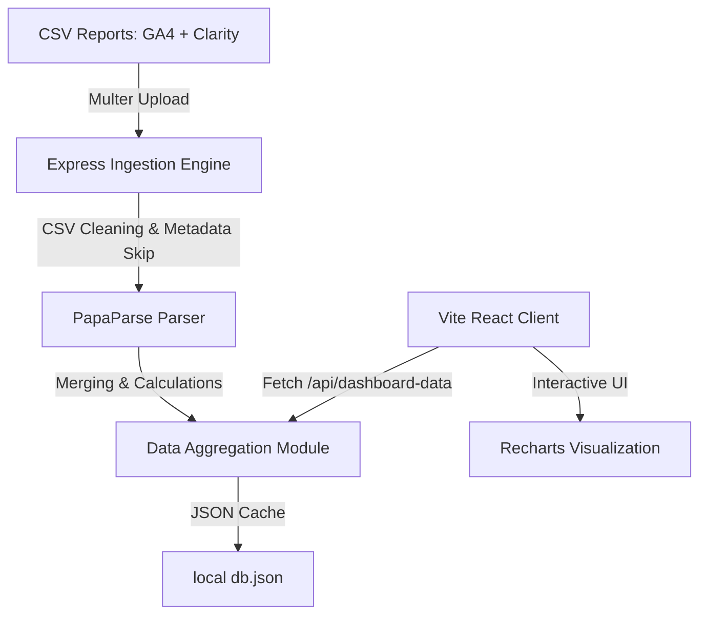

# Entitled Club Analytics Dashboard

A minimal, luxury, data-first analytics terminal that merges Google Analytics 4 (GA4) and Microsoft Clarity exports. It evaluates product visibility, checkout dropoffs, traffic channels, page paths, and delivers retail-focused product diagnostics.

---

## Brand Aesthetics & Colors

Following the **Entitled Club** styling standards, this dashboard resembles a premium financial terminal with obsidian dark surfaces, crimson accent borders, and champagne gold text styling:
- **Background**: `#0B0B0C`
- **Surface**: `#17181B`
- **Text**: `#F2ECE2`
- **Accent**: `#5B0A19`
- **Highlight**: `#C8B58A`

---

## System Architecture



---

## Automatic Data Fetching Setup (Phase 3)

The dashboard supports automatic live data fetching from Google Analytics 4 and Microsoft Clarity. To use live integration, configure the backend environment variables.

### Environment Variables

Create a `.env` file in the `backend/` directory based on the `backend/.env.example` file:

```env
GA4_PROPERTY_ID=your-ga4-property-id
GOOGLE_APPLICATION_CREDENTIALS=relative/or/absolute/path/to/google-credentials.json
CLARITY_API_TOKEN=your-clarity-api-token
CLARITY_PROJECT_ID=your-clarity-project-id
DATA_REFRESH_MINUTES=30
```

*Note: Frontend credentials are never exposed. All API calls execute exclusively on the backend and are synchronized to a local memory & file-based JSON cache.*

---

## Authentication Requirements

### 1. Google Analytics 4 Configuration
To configure GA4 integration with Google service account authentication:
1. Create a Google Cloud project in the [Google Cloud Console](https://console.cloud.google.com/).
2. Enable the **Google Analytics Data API** for your project.
3. Create a **Service Account** under *IAM & Admin > Service Accounts*.
4. Generate and download a new credential key in **JSON** format for that service account.
5. Grant access to your GA4 property by adding the service account email address under the GA4 property's *Property Access Management* settings with the role of **Viewer** or above.
6. Add the absolute path to your downloaded JSON key file to the `GOOGLE_APPLICATION_CREDENTIALS` environment variable.
7. Add your GA4 property ID (digits only, e.g., `328190380`) to the `GA4_PROPERTY_ID` environment variable.

### 2. Microsoft Clarity Configuration
To configure Microsoft Clarity API live integration:
1. Go to your Microsoft Clarity project dashboard.
2. Navigate to **Settings** > **Data Export**.
3. Generate a new API token.
4. Add the generated token to `CLARITY_API_TOKEN` and your Clarity project ID to `CLARITY_PROJECT_ID` in the backend `.env`.

---

## Setup & Local Execution

### Prerequisites
- Node.js (v18+ recommended)
- npm

### 1. Run the Backend Server
```bash
cd backend
npm install
npm start
```
The server will start on port `3001`.

### 2. Run the Frontend Client
```bash
cd frontend
npm install
npm run dev
```
The client will start on port `5173`. Open [http://localhost:5173](http://localhost:5173) in your browser.

---

## CSV Uploading Instructions

To refresh the dashboard with your own store data, navigate to the **Upload CSVs** tab. You can upload any of the following standard reports exported from Google Analytics 4 or Microsoft Clarity:

1. **GA4 Ecommerce Purchases**: Exported from *Reports > Monetization > Ecommerce purchases*.
2. **GA4 Pages and Screens**: Exported from *Reports > Engagement > Pages and screens*.
3. **GA4 Events**: Exported from *Reports > Engagement > Events*.
4. **Microsoft Clarity Dashboard**: Exported from your Clarity project dashboard.

*Note: You do not need to clean the CSV files manually before uploading. The ingestion engine automatically ignores top metadata rows, strips currency markers, normalizes column labels, and matches product handles.*

---

## Analytics Metric Calculations

### Core Indicators
- **Add To Cart (ATC) Rate**:
  $$\text{ATC Rate} = \frac{\text{Total Event Add-To-Carts}}{\text{Total Sessions}} \times 100$$
- **Checkout Start Rate**:
  $$\text{Checkout Rate} = \frac{\text{Total Event Checkouts}}{\text{Total Sessions}} \times 100$$
- **Store Conversion Rate**:
  $$\text{Conversion Rate} = \frac{\text{Total Event Purchases}}{\text{Total Sessions}} \times 100$$

### Product-Level Funnels
- **Product ATC Rate**:
  $$\text{Product ATC Rate} = \frac{\text{Product Add-To-Carts}}{\text{Product Page Views}} \times 100$$
- **Product Purchase Rate**:
  $$\text{Product Purchase Rate} = \frac{\text{Product Purchases}}{\text{Product Page Views}} \times 100$$

### Funnel Leaks
- **Funnel Drop Rate**:
  $$\text{Drop Rate} = \frac{\text{Previous Stage Count} - \text{Current Stage Count}}{\text{Previous Stage Count}} \times 100$$
- **Biggest Store Leak**: Evaluates the highest drop rate across the four major pipelines:
  1. `Sessions → Product Views`
  2. `Product Views → Add To Cart`
  3. `Add To Cart → Begin Checkout`
  4. `Begin Checkout → Purchases`

---

## Product Diagnosis Engine Rules

Each product is evaluated and grouped into one of five categories with direct merchandising actions:

| Classification | Rules / Criteria | Recommendation |
| :--- | :--- | :--- |
| **Winner** | Views $\ge 250$, ATC Rate $\ge 8\%$, Purchase Rate $\ge 2\%$ | *Feature in collection / Push with ads* |
| **Hidden Winner** | Views $< 100$, ATC Rate $\ge 10\%$ | *Increase visibility / Drive traffic* |
| **Checkout Leak** | Add-to-Carts $\ge 5$, Purchase Conversion from ATC $< 15\%$ | *Fix checkout / Check pricing or shipping cost* |
| **Weak Product Page** | Views $\ge 100$, ATC Rate $< 2\%$ | *Improve product page description / images* |
| **Low Visibility** | Views $< 100$ (with standard metrics) | *Increase visibility / Feature on home page* |
| **Normal** | Baseline average metrics | *Monitor performance* |
